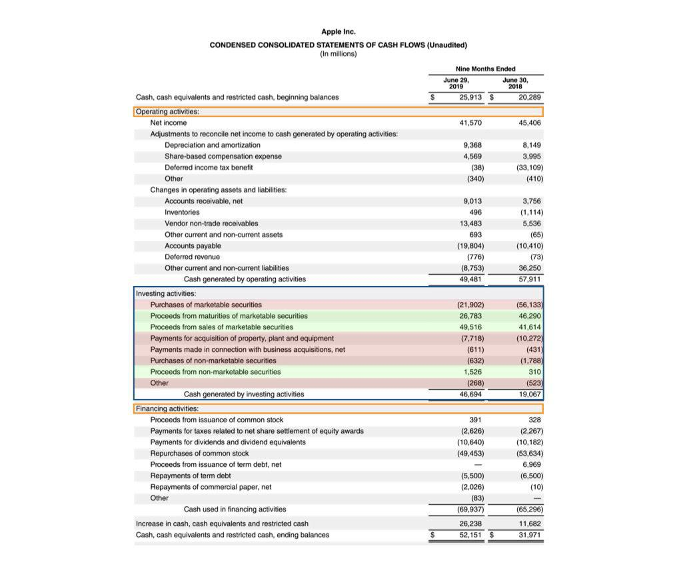

In the dynamic landscape of finance, understanding cash flow, financial analysis, and investing activities serves as a cornerstone for strategic decision-making. Cash flow analysis offers pivotal insights into the origins and applications of funds within an organization, allowing stakeholders to evaluate the effectiveness of an entity's financial strategy and operational efficiency. In this context, the intricate details of financial statements reveal critical data regarding a company's liquidity and long-term sustainability.

The advent of algorithmic trading marks a transformative shift in the way investments are analyzed and executed, allowing for precision and rapidity that were previously improbable. Algorithms process enormous datasets swiftly, optimizing trade execution by minimizing transaction costs and enhancing liquidity. This advancement underlines the significance of integrating technology with traditional financial practices to craft more resilient investment strategies.



This article will explore the interplay between cash flow analysis, investing activities, and algorithmic trading, highlighting their roles in augmenting financial strategies. By examining these components, this discussion aims to reveal how they contribute to informed investment decisions, unlocking opportunities for growth and operational efficiency. The synthesis of these financial concepts underpins successful algorithms and investment strategies, underscoring the need for continual adaptation in response to evolving market dynamics.

## Table of Contents

## Understanding Cash Flow from Investing Activities

Cash flow from investing activities is a vital part of a company's cash flow statement, offering insights into how funds are being utilized for investments. This category of cash flow includes cash spent on acquiring long-term assets such as property, plant, and equipment (PP&E) as well as purchases and sales of securities. These transactions reflect a firm's strategic choices about capital allocation and resource management.

Negative cash flow from investing activities often suggests that a company is investing significantly in its future growth. This might include spending on new facilities, upgrading existing infrastructure, or acquiring new technologies. Such expenditures are capital investments aimed at enhancing the company's productive capacity and competitive position in the long run. Conversely, positive cash flow indicates that a company might be liquidating assets or optimizing resource allocation. This scenario can occur when a firm sells part of its asset base, whether due to strategic divestments or the offloading of underperforming segments.

Analyzing trends in cash flow from investing activities provides an indication of a company's commitment to expansion versus its need to maintain liquidity. A company consistently showing negative cash flow from investing might be poised for significant growth and innovation, while recurring positive cash flow might indicate a strategy geared towards liquidity preservation or repositioning of assets.

Understanding these nuances is essential for evaluating a company's long-term strategy and financial health. Investors and analysts often scrutinize cash flow trends from investing activities to predict a firm’s future performance and strategic direction. A careful examination helps in assessing whether the company is likely to sustain current operations or is preparing for future growth through strategic allocations.

In summary, analyzing cash flow from investing activities reveals critical aspects of a company's strategic decisions, demonstrating either a commitment to future growth or a focus on optimizing current operations.

## Investment Examples Impacting Cash Flow

Strategic investments in long-term assets, such as property, plant, and equipment (PP&E), have a direct impact on a company's cash flow and its growth trajectory. These investments typically involve substantial capital expenditure, which results in an outflow of cash. However, they are crucial for enhancing the firm's production capacity, improving operational efficiency, and fostering long-term growth. For instance, a manufacturing company investing in advanced machinery might see a negative impact on cash flow initially, but over time, increased production capacity and lower operational costs can enhance profitability.

Conversely, the sale of assets boosts [liquidity](/wiki/liquidity-risk-premium) by providing firms with capital that can be reinvested or utilized to meet immediate financial commitments. This strategy is particularly useful when a company needs to free up cash for other strategic ventures or to shore up its working capital. For example, selling obsolete equipment not only generates cash but can also reduce maintenance costs and space requirements.

Examining case studies like Apple's strategic allocation to marketable securities highlights effective cash flow management. Apple often invests its vast cash reserves in marketable securities, which allows it to maintain liquidity while [earning](/wiki/earning-announcement) a reasonable return. This strategy enables Apple to balance liquidity needs with investor expectations for returns, thereby optimizing its capital structure and ensuring flexibility in financial planning.

Investors face the challenge of weighing the benefits of long-term investments against the necessity for short-term liquidity to sustain a balanced financial strategy. This balancing act is pivotal, as excessive long-term investments can lead to liquidity shortages, while an overly conservative approach may result in underutilization of available capital. Effective financial management requires a nuanced understanding of when to deploy capital in long-term assets and when to ensure liquidity for operational needs or unexpected opportunities.

The relationship between investment strategies and cash flow is integral to comprehending a company's financial priorities and potential. It provides insights into how a company manages its resources, the efficiency of its capital allocation, and its preparedness for future financial challenges or opportunities. Through comprehensive analysis, investors and managers can align investment strategies with cash flow management to achieve sustainable financial growth.

## Algorithmic Trading: Revolutionizing Investment Strategies

Algorithmic trading, a cutting-edge innovation in financial markets, leverages sophisticated algorithms to conduct high-speed and high-frequency trades. This technology not only accelerates transaction execution but also minimizes the influence of human emotions and biases, leading to more efficient market operations.

At its core, [algorithmic trading](/wiki/algorithmic-trading) involves the use of algorithms to process vast quantities of financial data. These algorithms analyze patterns and trends within this data to optimize trade execution. The ability to digest and analyze such large datasets enables algorithmic systems to make rapid, informed decisions that enhance market liquidity and reduce transaction costs.

One key advantage of algorithmic trading is its capacity to handle high-frequency trading ([HFT](/wiki/high-frequency-trading-strategies)). HFT allows for the execution of a large number of orders at extremely fast speeds, often within milliseconds. This can be achieved through the implementation of complex mathematical models and statistical techniques that identify profitable trading opportunities with greater accuracy than human traders. For instance, a Python snippet leveraging libraries like NumPy and pandas could be used to backtest trading strategies based on historical financial data:

```python
import numpy as np
import pandas as pd

# Simulated historical data
data = pd.DataFrame({
    'price': np.random.rand(1000) * 100
})

# Simple moving average strategy
window = 50
data['moving_avg'] = data['price'].rolling(window=window).mean()
data['signal'] = np.where(data['price'] > data['moving_avg'], 1, 0)

# Trading signals
buy_signals = data[data['signal'] == 1]
sell_signals = data[data['signal'] == 0]
```

However, algorithmic trading is not without its challenges. Technical risks, such as system failures, bugs, and data feed issues, can disrupt trading operations. Additionally, market [volatility](/wiki/volatility-trading-strategies) can pose significant challenges, potentially leading to substantial losses if not properly managed.

The integration of comprehensive financial data into algorithmic models is crucial for enhancing the precision and adaptability of trading strategies. For example, incorporating cash flow analysis into these models provides insights into a company's financial health, helping algorithms make strategic decisions that align with broader market conditions and company performance metrics.

As technology continues to advance, the impact of algorithmic trading on the financial industry is poised to grow. Developments in [artificial intelligence](/wiki/ai-artificial-intelligence) and [machine learning](/wiki/machine-learning) are expected to further improve the efficiency and intelligence of trading algorithms, making them even more integral to strategic investment decision-making. These advancements will enable traders and investment firms to navigate complex financial landscapes with greater confidence and precision, potentially reshaping the global financial ecosystem.

## Strategies and Examples of Algorithmic Trading

Algorithmic trading relies on a variety of strategic approaches to leverage computational power for optimal trading outcomes. Key strategies include trend-following, [arbitrage](/wiki/arbitrage), and index fund rebalancing. These methods use algorithms to systematically analyze market data, identifying patterns and executing trades with minimal human intervention.

Trend-following strategies aim to capitalize on market [momentum](/wiki/momentum) by identifying and trading in the direction of prevailing market trends. A common technique involves the use of moving averages to determine trend directions and generate signals for buying or selling. For example, a simple moving average (SMA) strategy might involve buying a security when its short-term SMA crosses above its long-term SMA, signaling an upward trend. The mathematical expression for an SMA is:

$$
\text{SMA}_n = \frac{1}{n} \sum_{i=0}^{n-1} P_i
$$

where $P_i$ represents the price at the $i$-th time period, and $n$ is the number of periods considered.

Arbitrage strategies exploit inefficiencies in market prices to make risk-free profits. These strategies involve simultaneously buying and selling equivalent assets in different markets to benefit from price discrepancies. For instance, [statistical arbitrage](/wiki/statistical-arbitrage) uses mathematical models to identify slight divergences between related securities expected to revert to the mean, allowing traders to profit when these prices converge.

Index fund rebalancing involves adjusting the composition of a portfolio of stocks to maintain alignment with a specific index. Algorithms can automatically execute trades to maintain the desired allocation, ensuring that the portfolio accurately reflects the index's performance. This strategy benefits from algorithmic efficiency, especially given the transaction cost savings through optimized trade execution.

The implementation of these strategies has been significantly enhanced by programming languages such as Python, which provides extensive libraries for data handling, analysis, and visualization. Python's popular libraries include NumPy for numerical operations, pandas for data manipulation, and scikit-learn for machine learning, all of which facilitate the development of complex trading strategies. The ability to process real-time data and perform quick analyses is critical for the success of algorithmic trading strategies, which must respond dynamically to market conditions.

Algorithmic trading reduces the error rate associated with manual trading and allows for the execution of complex, data-driven strategies with improved accuracy and speed. By minimizing human error and biases, these strategies enhance the overall efficiency of trading operations, offering investors a sophisticated toolset for navigating the financial markets.

## The Interplay Between Cash Flow and Trading Algorithms

Integrating cash flow analysis with trading algorithms is a powerful approach that enhances liquidity management and asset allocation. This synergy ensures that investment strategies are both robust and responsive to changing financial conditions. Algorithmic models leverage cash flow insights to swiftly adjust to variations, thereby maintaining operational efficiency and optimizing resource allocation.

Algorithmic trading systems are designed to process vast amounts of data at high speed. When integrated with cash flow analysis, these systems can identify patterns and trends that inform better asset allocation. For instance, during periods of negative cash flow from significant asset purchases, algorithmic strategies can optimize resource allocation by reallocating liquid assets to areas of higher anticipated return, thereby mitigating any temporary liquidity constraints.

The decision-making process benefits significantly from cash flow-based algorithms. These algorithms enable timely trades that align with an organization's financial objectives by incorporating real-time cash flow data into market assessment models. The ability to adjust trading decisions based on up-to-the-minute financial information allows traders to avoid costly mistakes and seize advantageous opportunities that arise from market fluctuations. For example, by employing predictive models to forecast cash flow variations, traders can use algorithms to preemptively adjust their investment strategies, ensuring that trades are made at optimal times and prices.

Harnessing cash flow insights allows algorithmic trading to achieve better synchronization between market conditions and strategic financial maneuvers. This integration reduces the risk of financial distress by maintaining a balance between available liquidity and the necessity for strategic investment positions. Enhanced synchronization ensures that investments are funded effectively, thereby reducing reliance on external funding sources and minimizing associated costs.

By continuously assessing and adjusting strategies in response to updated cash flow data, algorithmic models provide a dynamic framework for liquidity management and asset allocation. This adaptability positions firms to respond to market conditions efficiently, reinforcing both short-term stability and long-term growth potential.

In sum, the interplay between cash flow and trading algorithms enhances the strategic potential of investments, creating an efficient ecosystem for gaining competitive advantages in financial markets. The relationship between these elements is instrumental in crafting financial strategies that are informed, agile, and strategically aligned with organizational goals.

## Conclusion

Embracing cash flow analysis and algorithmic trading is essential for modern investors who prioritize strategic growth. These concepts provide a balanced approach to managing risk and reward, enabling investors to optimize their financial outcomes through precise investment execution. Algorithmic trading, by its very nature, removes emotional biases from trading decisions. This results in more consistent trade execution and a reduction in transaction costs, as decisions are based on data-driven insights rather than human emotions.

On the other hand, cash flow analysis offers valuable insights into a company's strategic growth capabilities and its approach to managing liquidity. By understanding how cash flows within a company, investors can assess its long-term viability and growth potential. Such analysis helps in identifying whether a company is investing in future growth or merely maintaining its current operations through asset liquidation.

As financial tools and technologies continue to evolve, the integration of cash flow data into algorithmic trading will remain a critical [factor](/wiki/factor-investing) for maintaining a competitive edge in the financial markets. Algorithms that incorporate cash flow insights are better equipped to adapt to market changes and align trades with financial objectives, ensuring that investment strategies are both informed and agile.

By leveraging these tools, investors can achieve a more synchronized approach to market conditions and strategic financial maneuvers, ultimately positioning themselves more favorably in the ever-shifting financial landscape.

## References & Further Reading

Bergstra, J., et al. 'Algorithms for Hyper-Parameter Optimization.' Advances in Neural Information Processing Systems 24. This paper is a comprehensive resource on hyper-parameter optimization algorithms, which are crucial for enhancing the predictive power of machine learning models in financial applications, including algorithmic trading.

Lopez de Prado, M., 'Advances in Financial Machine Learning.' This book is a fundamental resource exploring the intersection of financial markets and machine learning, providing practical techniques for implementing machine learning strategies in investment and trading.

Aronson, D., 'Evidence-Based Technical Analysis: Applying the Scientific Method and Statistical Inference to Trading Signals.' Aronson introduces rigorous methods for evaluating the validity of technical analysis signals, emphasizing the use of statistical inference to distinguish genuine trading opportunities from noise.

Jansen, S., 'Machine Learning for Algorithmic Trading.' Jansen's work is dedicated to leveraging machine learning algorithms for designing and executing algorithmic trading strategies, providing insights into using data-driven techniques for financial market analysis.

Chan, E.P., 'Quantitative Trading: How to Build Your Own Algorithmic Trading Business.' This book serves as a guide to establishing a [quantitative trading](/wiki/quantitative-trading) business, covering the essentials of developing algorithmic strategies, risk management, and integrating financial data into trading algorithms.

