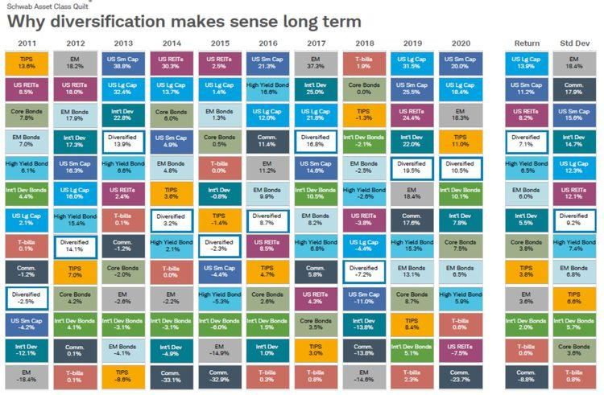

The financial landscape is constantly evolving, and 2024 is no exception. As we navigate this rapidly changing environment, staying informed about emerging trends and technologies is paramount for investors striving for optimal returns. One significant advancement has been algorithmic trading, which leverages cutting-edge technology to transform investment strategies across global markets. Charles Schwab, a prominent leader in financial services, exemplifies this innovation by integrating algorithmic trading into its offerings to provide dynamic investment opportunities.

Algorithmic trading, also known as algo trading, involves using computer programs and algorithms to execute trades based on predefined criteria. This approach enables trades to be executed at speeds and frequencies that far exceed human capabilities, thereby enhancing efficiency and accuracy. The adoption of algorithmic trading has become widespread, with sophisticated strategies now accessible to investors at various levels.

In 2024, Charles Schwab stands out in the investment analysis domain by offering a comprehensive algo trading platform. This platform provides investors with opportunities to optimize their portfolios by employing advanced trading strategies. Through the use of sophisticated algorithms, Schwab enhances investment strategies and aims to optimize returns, addressing the complexities of today's financial markets.

As investors prepare for another year in a complex financial ecosystem, Charles Schwab's algorithmic trading platform serves as a crucial tool. This article explores the range of features, benefits, and considerations associated with using Schwab's algorithmic trading platform to craft a resilient and lucrative investment portfolio.

## Table of Contents

## Understanding Algo Trading

Algorithmic trading, commonly referred to as algo trading, utilizes computer programs and algorithms to automate the process of trading based on predefined criteria. This advancement in trading technology enables the execution of orders at speeds and frequencies far beyond human capability, thereby increasing both efficiency and accuracy. By leveraging sophisticated algorithms, traders can capitalize on market movements more effectively, reducing the latency that typically accompanies manual trading processes.

In the year 2024, algorithmic trading has reached a level of maturity that offers a variety of sophisticated strategies and tools accessible to investors of all experience levels. These tools allow for highly customized trading strategies, enabling users to tailor their trading operations to specific market conditions or personal investment goals. The evolution of technical infrastructure and the availability of vast datasets have made algorithmic trading even more powerful.

The principal advantages of algo trading stem from its ability to decrease transaction costs by minimizing the impact of human error and facilitating superior trade execution. Precise algorithms can analyze multiple market variables, execute trades at optimal intervals, and monitor market changes in real time—a feat that would be daunting for a human trader.

Charles Schwab has integrated [algorithmic trading](/wiki/algorithmic-trading) functionalities into its platform, which provides strategic advantages to its clientele. By doing so, Schwab allows its clients to utilize cutting-edge trading technology, offering capabilities that range from basic automated strategies to complex, multifactor models that adapt to market signals.

The utilization of algorithmic trading can streamline trade orders, optimize trading times, and potentially improve investment returns, thanks to its efficient, data-driven approach. However, it is essential to note that the effectiveness of algorithmic trading is contingent upon the quality of the underlying algorithms and the data they process. As such, continuous enhancement and validation of these algorithms are crucial for sustaining their utility and competitive edge in dynamic market environments.

## Charles Schwab's Algo Trading Platform

Charles Schwab's algorithmic trading platform is designed to meet the needs of both novice and seasoned investors by providing access to a comprehensive suite of algorithmic trading tools. These tools are highly customizable, allowing investors to tailor their trading strategies to align with their unique investment goals. The platform's adaptability supports a wide range of trading strategies and preferences, enhancing the investment experience for users at all levels.

The platform is equipped with advanced analytics and real-time data feeds that give users a competitive advantage in the fast-paced world of trading. By harnessing the power of these analytics, investors can make informed decisions based on the latest market data and trends. This real-time insight is crucial for executing trades efficiently and effectively, often making the difference between profit and loss in volatile markets.

User-friendly interfaces are a key feature of Schwab's platform, prioritizing ease of use without compromising on functionality. The platform is designed to cater to the varying levels of technical expertise among users, ensuring that it is accessible to those new to algorithmic trading while still offering the in-depth tools and capabilities sought by more experienced traders. This balance makes the platform attractive to a broad spectrum of investors.

Schwab's robust infrastructure underpins a seamless and secure trading experience, providing investors with the confidence to rely on the platform for their trading activities. Security is a paramount concern, and Schwab employs state-of-the-art technology and protocols to protect user data and transactions. Moreover, ensuring system reliability and uptime is a priority, minimizing the risk of trading interruptions and enhancing overall user satisfaction.

Overall, Charles Schwab's algorithmic trading platform exemplifies a blend of innovation, functionality, and security, making it a valuable tool for investors navigating the complexities of today's financial markets.

## Investment Strategies with Algo Trading

Algorithmic trading strategies have become integral to the modern financial landscape, offering mechanisms to exploit market inefficiencies and optimize returns. Charles Schwab's platform supports several key strategies that clients can employ to enhance their investment portfolios.

One such strategy is [market making](/wiki/market-making), which involves providing [liquidity](/wiki/liquidity-risk-premium) to the market by simultaneously issuing buy and sell limit orders around the current market price. This strategy profits from the spread between the bid and ask prices. Schwab's algorithmic trading platform allows clients to automatically generate these orders using advanced algorithms, which can improve execution speed and price efficiency.

Another prevalent strategy is statistical [arbitrage](/wiki/arbitrage), which seeks to take advantage of pricing discrepancies between related financial instruments. This strategy uses statistical methods to identify pairs of securities whose price movements have historically been correlated but have temporarily diverged. Through Schwab’s platform, investors can leverage real-time analytics and robust data processing capabilities to identify and capitalize on these opportunities, often using z-score calculations to assess the extent of the deviation from the expected correlation.

Trend following is a strategy that capitalizes on the [momentum](/wiki/momentum) of asset prices. The algorithms on Schwab’s platform can analyze historical price data and use indicators such as moving averages to identify and follow prevailing market trends. This strategy aims to enter trades at the beginning of a trend and [exit](/wiki/exit-strategy) as it loses strength, thus benefiting from price movements over time.

Machine learning and [artificial intelligence](/wiki/ai-artificial-intelligence) further enhance these strategies by improving the predictive capabilities of trading algorithms. Machine learning models can analyze vast datasets to uncover hidden patterns and correlations, providing a more accurate forecast of future price movements. Schwab's AI-enabled tools are capable of processing market sentiment, trading volumes, and historical price data to refine trading decisions, offering a significant edge in anticipation of market shifts.

Clients of Charles Schwab have successfully applied these algorithmic trading strategies, as evidenced by case studies where investors optimized their portfolios through strategic algo trading. For example, [statistical arbitrage](/wiki/statistical-arbitrage) strategies implemented via Schwab's platform have allowed institutional clients to generate stable returns by exploiting short-term inefficiencies, while individual investors have employed trend-following algorithms to benefit from long-term market trends.

Overall, Charles Schwab’s algo trading platform empowers investors to employ sophisticated strategies effectively, utilizing both traditional and cutting-edge techniques to navigate complex and dynamic markets.

## Benefits and Risks

Charles Schwab's algorithmic trading platform presents several advantages, prominently including enhanced speed and accuracy in trade execution. Algorithmic trading employs sophisticated computer algorithms to conduct trades, which significantly reduces the time needed to execute buy or sell orders compared to manual trading. This improved speed can lead to better pricing for trades, as it allows investors to take advantage of price movements in real-time.

Moreover, algorithmic trading minimizes human intervention, thereby reducing the potential for human error and bias. The data-driven nature of these algorithms allows for evidence-based decision-making, leveraging large datasets to identify trading patterns and opportunities that would be challenging for a human to detect. Consequently, this can lead to more precise and potentially profitable trades.

However, despite these advantages, there are inherent risks associated with algorithmic trading. One potential risk is system failures, which could result in execution errors or missed opportunities if the trading platform experiences technical glitches. Market [volatility](/wiki/volatility-trading-strategies) also poses a risk, as rapid market changes can lead to significant losses if the algorithms are not correctly calibrated to handle such scenarios. Additionally, constant monitoring is crucial as algorithms might behave unexpectedly in unforeseen market conditions.

To mitigate these risks, it is vital for investors to balance the efficiency of algorithmic trading with traditional investment strategies, ensuring a diversified approach that does not rely solely on automated systems. Charles Schwab addresses these challenges by offering comprehensive customer support and educational resources to guide investors in using their algorithmic trading platform effectively.

Moreover, Schwab's platform incorporates robust risk management features to safeguard investments. These features may include stop-loss orders, which automatically sell a security when it reaches a certain price to limit potential losses, and other risk mitigation tools designed to respond to market volatility promptly. By employing these safeguards, investors can protect their portfolios against unforeseen market events and capitalize on the benefits of technology-enhanced trading.

## Customer Reviews and Feedback

Charles Schwab's algorithmic trading platform has garnered a variety of customer reviews in 2024, reflecting a range of user experiences and satisfaction levels. Many users have praised the platform for its ease of use, highlighting the intuitive interface and seamless navigation as key strengths. Both novice and seasoned investors appreciate the platform's straightforward design, which allows them to implement complex trading strategies with minimal effort.

Reliability is another theme frequently noted in customer feedback. Users have reported a high level of trust in Schwab's platform, citing stable performance and accurate data feeds as major advantages. Institutional clients, in particular, have commended Schwab for its robust infrastructure, which supports large-scale trading operations without significant downtime or technical glitches.

In terms of overall performance, clients have expressed satisfaction with the platform's ability to enhance investment outcomes. The integration of advanced analytics and real-time data feeds is often highlighted as a contributor to improved decision-making and increased return on investment. Many users have noted that Schwab's algorithmic trading tools have enabled them to respond more effectively to market movements, giving them a competitive edge.

Despite the positive feedback, areas for improvement have also been mentioned by the user community. Some investors have suggested enhancements in customer support, specifically the speed and availability of responses during peak trading hours. A small portion of users have reported occasional delays in technical support response times, indicating room for improvement in this area.

Testimonials from both individual and institutional clients provide a balanced perspective on the platform's strengths and weaknesses. Individual investors frequently comment on the educational resources available through Schwab, which aid in understanding and optimizing algo trading strategies. Institutional clients, on the other hand, appreciate the scalability and customization options offered by the platform, allowing for tailored solutions that align with specific investment objectives.

In evaluating Schwab's support services, the platform is generally praised for its commitment to customer satisfaction. The majority of reviews indicate that Schwab is responsive to user queries and technical issues, with many investors expressing appreciation for the dedicated personnel available to assist with troubleshooting and guidance. Feedback suggests that Schwab's comprehensive support resources play a significant role in addressing user concerns and facilitating a positive trading experience. 

Overall, Charles Schwab's algorithmic trading platform is well-regarded in 2024, with users valuing its user-friendly interface, reliability, and performance-enhancing capabilities. While there are opportunities for enhancements in customer support, the platform's strong infrastructure and user-centric design have positioned it as a leading choice for algorithmic trading among both individual investors and institutional clients.

## Conclusion

Charles Schwab's algorithmic trading platform stands out as a crucial development in the investment landscape of 2024. This platform allows investors to leverage sophisticated technology, improving both the precision and performance of their trading strategies. With its advanced analytics, real-time data feeds, and user-friendly interfaces, Schwab's algo trading system caters to a wide audience, from beginner investors to seasoned professionals. By automating complex processes and reducing human errors, algorithmic trading offers a significant advantage in achieving optimized returns.

Algorithmic trading is not just reshaping how trades are executed; it is fundamentally transforming investment strategies by providing a data-driven approach that enhances decision-making. Investors using Schwab's platform benefit from speed and accuracy that manual trading simply cannot match. As financial markets become increasingly complex and competitive, embracing such technology is essential for investors who wish to remain vigilant and responsive to market dynamics.

Looking forward, the trajectory of algorithmic trading suggests a continual rise in its global financial market impact. As [machine learning](/wiki/machine-learning) and artificial intelligence technologies advance, they are expected to further enhance the predictive capabilities of trading algorithms. This progress heralds a future where investment strategies can be increasingly tailored to individual goals and market conditions, fostering more personalized and effective trading experiences.

Charles Schwab remains at the forefront of this innovation, demonstrating an ongoing commitment to leading the investment technology field. By integrating cutting-edge tools and maintaining a robust infrastructure, Schwab provides a secure and efficient platform for its users, affirming its role as a leader in the ongoing evolution of trading technologies. Investors are encouraged to explore Schwab's offerings to ensure their strategies remain pertinent and competitive in the fast-paced, ever-changing financial environment.

## FAQs

### What is algorithmic trading and how does it work at Charles Schwab?

Algorithmic trading, known as algo trading, involves the use of computer programs and algorithms to automate trading decisions based on specified criteria, such as timing, price, quantity, or any mathematical model. At Charles Schwab, this method leverages sophisticated algorithms and cutting-edge technology to enable fast and efficient trade execution. The platform processes vast amounts of market data in real-time, automatically managing trades to optimize results while taking advantage of market conditions.

### Can beginner investors benefit from Schwab's algo trading platform?

Yes, beginner investors can indeed benefit from Schwab's algo trading platform. Schwab’s offerings include user-friendly interfaces and educational resources designed to accommodate investors with varying levels of experience. The platform allows users to access pre-set algorithmic trading strategies tailored to different investment goals. Additionally, Schwab provides comprehensive support to help beginners understand how to use the platform effectively.

### How does Charles Schwab ensure the security and reliability of its algorithmic trading services?

To ensure security and reliability, Charles Schwab implements advanced cybersecurity measures and robust technological infrastructure. This includes encrypted data transmission, multi-[factor](/wiki/factor-investing) authentication, and continuous system monitoring to detect and prevent unauthorized access or potential breaches. The platform's reliability is maintained through regular software updates and system performance checks, minimizing the risk of disruptions during trading operations.

### What specific tools and resources are available for investors using Schwab's platform?

Investors using Schwab's platform can access a range of tools and resources designed to enhance trading strategies and improve decision-making. These include advanced analytics, real-time data feeds, customizable algorithmic strategies, and market research reports. Additionally, Schwab offers educational webinars, tutorials, and personalized support to help investors understand and leverage these tools effectively for their investment strategies.

### Are there any fees associated with using Charles Schwab's algorithmic trading services?

Charles Schwab provides a cost-competitive fee structure for its algorithmic trading services. While specific fees may vary based on the type of trades executed and the services utilized, Schwab is known for transparent pricing and minimal trading commissions. Investors are encouraged to review Schwab’s fee schedule and consult with a Schwab representative for detailed information on potential costs associated with the platform.

## References & Further Reading

[1]: Bergstra, J., Bardenet, R., Bengio, Y., & Kégl, B. (2011). ["Algorithms for Hyper-Parameter Optimization."](https://dl.acm.org/doi/10.5555/2986459.2986743) Advances in Neural Information Processing Systems 24.

[2]: ["Advances in Financial Machine Learning"](https://www.amazon.com/Advances-Financial-Machine-Learning-Marcos/dp/1119482089) by Marcos Lopez de Prado

[3]: ["Evidence-Based Technical Analysis: Applying the Scientific Method and Statistical Inference to Trading Signals"](https://www.amazon.com/Evidence-Based-Technical-Analysis-Scientific-Statistical/dp/0470008741) by David Aronson

[4]: ["Machine Learning for Algorithmic Trading"](https://github.com/stefan-jansen/machine-learning-for-trading) by Stefan Jansen

[5]: ["Quantitative Trading: How to Build Your Own Algorithmic Trading Business"](https://books.google.com/books/about/Quantitative_Trading.html?id=j70yEAAAQBAJ) by Ernest P. Chan