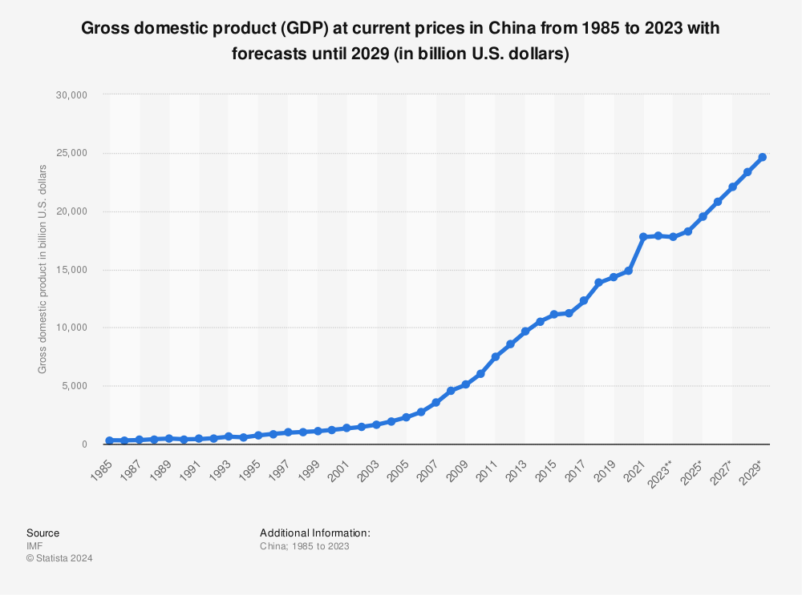

The global economy has undergone a significant transformation over the last few decades, shifting towards a service-oriented structure. China, as a leading economic powerhouse, has witnessed a pivotal transition with its service sector becoming a crucial component of its GDP. This shift not only highlights China's strategic economic reforms but also underscores the increasing importance of services over traditional industries like agriculture and manufacturing.

China's service sector has systematically expanded, underpinning the nation's broader economic development efforts. The Chinese government has implemented a series of policies and reforms aimed at enhancing the productivity and efficiency of its service industries. These initiatives have facilitated substantial investments in urban services and infrastructure, which have collectively contributed to a more robust economic framework. The service sector, now accounting for over half of China's GDP, reflects this strategic shift and exemplifies China's commitment to modernizing its economic landscape.



Additionally, the integration of algorithmic trading and economic analysis is gaining traction within China's service sector. This intersection is pivotal for investors seeking to capitalize on the nation's growth trends. Algorithmic trading, through its reliance on sophisticated data analytics and automated execution strategies, provides a unique advantage in navigating the complexities of financial markets. This technological advancement is particularly relevant in China, where the rapid evolution of the service sector presents numerous opportunities for strategic investment.

Understanding the ongoing changes in China's service sector is essential for investors and policymakers as they aim to maximize economic opportunities. By closely monitoring these developments, stakeholders can better position themselves to benefit from China's economic growth and its increasing role on the global stage. This exploration of China’s service sector growth highlights the broader economic implications and offers insights into strategic avenues for investment and policy formulation.

## Table of Contents

## Overview of China's Economic Growth

China's transformation from an agrarian and industrial-based economy to a more service-driven system is one of the most defining aspects of its recent economic history. Initially, agriculture and manufacturing were the cornerstones of China's economic expansion. However, in the past few decades, the service sector has emerged as a formidable force, contributing over 50% of the country's Gross Domestic Product (GDP) in recent years. This shift is indicative of broader structural changes within the Chinese economy.

The initial phase of China's economic ascent was driven by rapid industrialization and urbanization, supported by a plethora of reforms initiated in the late 20th century. This industrial boom laid the groundwork for a substantial manufacturing base, making China the "factory of the world." The focus on heavy industry not only bolstered economic growth but also facilitated enormous infrastructure development, including transportation, energy, and telecommunications networks.

As China navigated the 21st century, the economic landscape began to reshape, with the government increasingly prioritizing the service sector as a key driver of sustainable growth. Key reforms aimed at liberalizing markets, enhancing productivity, and promoting innovation have substantially bolstered the services industry. These efforts have included policies promoting urbanization, increased investments in education and technology, and incentives for domestic and foreign enterprises to engage in the service sector.

This structural transition has not only bolstered GDP but has also fostered economic resilience. The COVID-19 pandemic posed significant challenges worldwide; however, China demonstrated remarkable recovery capabilities. The service sector, with its robust digital economy components and health services, played a critical role in this recovery, supporting both domestic demand and employment.

China's economic strategy continues to emphasize the service sector as a central pillar for future growth. The ongoing development in financial services, legal sectors, healthcare, telecommunications, and information technology indicates a sustained shift with implications for economic stability and global competitiveness. This evolutionary path ensures China's adaptability amid global economic fluctuations, providing a buffer against industrial downturns and enhancing the overall economic composition.

## Key Growth Drivers in the Service Sector

The expansion of China's service sector is driven by multiple critical factors such as technological advancements, urbanization, and policy reforms. These elements have collectively shaped a dynamic environment conducive to significant growth within this pivotal sector.

Technological advancements have been a significant catalyst for the service sector's growth. With the proliferation of digital technology and the internet, various service industries have undergone transformation and modernization. Financial services, for instance, have embraced fintech innovations, enabling online banking and mobile payment systems to flourish. This integration of technology has facilitated easier and faster transactions, thereby enhancing customer experiences and increasing the sector's efficiency.

Urbanization is another significant [factor](/wiki/factor-investing) contributing to the service sector's expansion. As rural populations migrate to urban areas, there is a heightened demand for urban services such as housing, healthcare, education, and retail. Real estate, in particular, has witnessed substantial growth, as urban development projects cater to the increasing need for residential and commercial spaces. Additionally, the transportation sector has developed to support this urban influx, with improvements in public transit infrastructure and the rise of ride-hailing services meeting the logistical needs of densely populated areas.

Policy reforms have also played a crucial role in the sector's expansion. The Chinese government has implemented several initiatives to liberalize the service sector, encouraging more private and foreign investments. These reforms have included reducing barriers to entry, simplifying regulatory procedures, and providing tax incentives to attract investment. As a result, sectors like retail trade have expanded, benefitting from increased competition and diversity in service offerings. Furthermore, policies aimed at stimulating consumer demand and improving service delivery efficiency continue to propel growth. Measures such as subsidies for technology adoption and incentives for service innovation are enhancing the sector's robustness and competitiveness.

The synergy of these growth drivers has not only accelerated the expansion of China's service sector but also positioned it as a vital component of the nation's economic strategy, steering toward sustainable growth and development.

## Algorithmic Trading and Economic Analysis

Algorithmic trading has become a transformative force in global financial markets, including the rapidly growing exchanges in China. This sophisticated trading strategy uses algorithms to perform high-speed and high-frequency trading, which can analyze a considerable amount of data in the blink of an eye, making swift decisions that would be impossible for human traders. The integration of economic analysis into [algorithmic trading](/wiki/algorithmic-trading) provides a significant competitive advantage, leveraging insights drawn from vast datasets.

Economic analysis in this context involves assessing macroeconomic indicators, market trends, and sector-specific performances to inform trading decisions. By integrating these insights with algorithmic trading, investors can effectively anticipate and respond to fluctuations in China's service sector growth. For instance, macroeconomic policies, consumer behavior shifts, or regulatory changes within China can be quantitatively modeled to predict market movements. This approach not only enhances the accuracy of predictions but also allows for a proactive trading strategy.

Algorithmic trading's role in risk management and optimizing investment returns cannot be understated. Sophisticated algorithms are designed to not only capitalize on opportunities but also mitigate risks. These algorithms can process risk-related data, such as [volatility](/wiki/volatility-trading-strategies), [liquidity](/wiki/liquidity-risk-premium) constraints, and historical price movements, to execute trades that maintain a balanced risk-return profile. By continuously analyzing portfolio performance and adjusting strategies in real-time, these algorithms support sustained investment growth while safeguarding against potential losses.

For instance, a Python-based algorithm might be responsible for executing trades. Below is a simplified example of how an algorithm could be structured to perform market analysis and make trading decisions based on predetermined criteria:

```python
import pandas as pd
import numpy as np

# Function to calculate moving average
def moving_average(data, period=30):
    return data.rolling(window=period).mean()

# Function to generate trading signals
def generate_signals(data):
    signals = np.where(data['price'] > data['moving_avg'], 1, 0)
    return signals

# Sample data
price_data = {'price': [100, 102, 101, 105, 110, 108, 107, 112, 111, 115]}
df = pd.DataFrame(price_data)

# Calculate moving average
df['moving_avg'] = moving_average(df['price'])

# Generate signals: 1 for buy, 0 for sell/hold
df['signal'] = generate_signals(df)

print(df)
```

This simple script highlights how an algorithm can be set to analyze price data and react to moving averages as a basic signal for trading decisions. In practice, the algorithms employed in financial markets would be significantly more complex, incorporating [machine learning](/wiki/machine-learning) techniques and real-time data analysis to optimize performance.

The evolving landscape of China's service sector presents dynamic opportunities. Algorithmic trading, coupled with economic analysis, enables market participants to harness these opportunities effectively, contributing to smarter investment strategies and ultimately enhancing financial returns in a continuously evolving market environment.

## Impact and Implications on China’s GDP

The growth of China's service sector is inducing a paradigm shift in the nation's economic structure, as evidenced by its increasing contribution to GDP. This shift from traditional manufacturing and agriculture towards a service-oriented economy signals profound implications for various economic dynamics.

With an increased focus on services, employment patterns in China are changing significantly. Historically reliant on industrial and agricultural jobs, the labor market is witnessing a surge in demand for service-based roles, ranging from financial services and real estate to information technology and healthcare. This transition supports the creation of higher-value jobs, contributing to wage growth and, consequently, altering income distribution. The enhancement in service-sector employment, combined with higher earnings, enables increased consumer spending, thereby bolstering domestic consumption patterns.

As the service sector's contribution grows, it aligns with China's long-term economic ambition to achieve sustainable growth. A service-oriented economy is less energy-intensive compared to manufacturing, aligning well with sustainable development goals. By reducing dependence on heavy industries, China experiences a decrease in carbon emissions, contributing to global environmental objectives. This evolution positions China as a proactive participant in international climate change agreements and efforts.

Furthermore, the expansion of the service sector impacts consumption behavior, catering to the evolving preferences of the Chinese population. As income levels rise and urbanization progresses, the demand for high-end services, including education, healthcare, and tourism, grows, pushing the economy towards a consumption-driven model. This shift not only supports stable economic growth by reducing reliance on exports and investments but also offers resilience against global economic volatilities.

Overall, the burgeoning service sector in China is instrumental in reshaping the GDP composition, ensuring sustainable and diversified economic growth. The intricate relationship between service expansion and GDP underscores the sector's vital role in meeting China's economic ambitions, transforming the domestic and international economic landscape.

## Challenges and Future Prospects

China's service sector, despite its significant growth and contribution to the nation's economic development, continues to face several obstacles. These challenges include regulatory barriers that hinder efficient market operations, insufficient infrastructure that impedes service delivery, and suboptimal allocation of capital and labor resources. Regulatory frameworks often lack the transparency and predictability needed for fostering a competitive environment, presenting hurdles for both domestic and international service providers. The infrastructure deficit, particularly in transportation and logistics, limits the scalability and accessibility of various services, thereby constraining sectoral expansion.

Efforts to reform policies could substantially enhance market access and mitigate local protectionism. By streamlining regulatory processes and creating a level playing field, China can attract more investments into its service sector. Such reforms would also facilitate the entry of foreign service providers, fostering competition and innovation. Eliminating local protectionism is critical to breaking down regional barriers and promoting a unified national market where service providers can operate efficiently across different regions.

China's economic rebalancing strategies underscore the necessity for bolstering demand for services while simultaneously enhancing social safety nets. With an increasingly urbanized population and rising income levels, the potential demand for services is vast. However, to capitalize on this potential, consumer confidence and purchasing power must be supported by robust social safety nets, including healthcare, education, and pension systems. These measures are crucial for sustaining long-term growth in the service sector by ensuring a stable consumption base.

The future prospects of China's service sector appear promising, contingent upon persistent reforms and investments. Strengthening digital infrastructure is paramount for driving innovation and improving service delivery efficiencies. Investment in technology and digital platforms can lead to new service models and enhance existing ones. Moreover, focusing on talent development will ensure a skilled workforce capable of meeting the sector's evolving demands. By investing in education and training, China can equip its labor force with the necessary skills to thrive in a service-oriented economy.

Innovation remains a key driver of growth within the sector. Encouraging entrepreneurial activities and fostering an environment conducive to research and development are essential for sustaining competitive advantages. As China progresses with its market reforms, embracing technological advancements and nurturing creativity will be instrumental in maintaining [momentum](/wiki/momentum) within the service sector.

In conclusion, while challenges persist, the trajectory of China's service sector is poised for continued growth and transformation. Addressing regulatory, infrastructural, and resource allocation issues through targeted reforms will unlock further potential, ensuring that the service sector remains a vital component of China's economic landscape.

## Conclusion

China's service sector plays a crucial role in the country's economic framework, underscoring significant progress and opportunities for growth. This advancement in services is emblematic of China's broader economic transformation, where traditional sectors give way to more dynamic, innovation-driven fields. As the service sector continues to expand, it opens new avenues for economic prosperity and resilience, enhancing China's position on the global economic stage.

Economic analysis, coupled with algorithmic trading, provides strategic opportunities for investors seeking to leverage China's growth trajectory. Algorithmic trading, with its capability to process vast datasets swiftly, allows investors to identify and exploit market trends emanating from the service sector's expansion. By integrating comprehensive economic analysis into these algorithms, investors can achieve a deeper understanding of macroeconomic variables and service sector shifts, optimizing their investment strategies.

The sector's continued evolution will significantly impact the global economic order as China progresses with its market-oriented reforms. These reforms, aimed at improving efficiency and bolstering competitiveness, are anticipated to enhance China's service offerings, making them more attractive to global consumers and investors alike. The ripple effect of these developments is likely to extend beyond China's borders, influencing international trade patterns, investment flows, and economic partnerships.

For stakeholders, including policymakers and investors, attentiveness to the ongoing transformation within China's service economy is imperative. Adapting to these dynamic changes involves not only recognizing emerging opportunities but also understanding potential challenges. By remaining proactive and informed, stakeholders can optimize economic gains and align their strategies with China's evolving economic landscape. This adaptability is essential for maximizing the benefits of China's service sector growth, ensuring sustainable development and contributing to a balanced global economy.

## References & Further Reading

[1]: Chen, R., Lu, M., & Zhu, Y. (2017). ["China's Service Sector Development."](https://link.springer.com/article/10.1007/s11554-024-01601-x) Springer, Cham.

[2]: Nyborg, K. G. (2016). ["Collateral Frameworks: The Open Secret of Central Banks."](https://www.researchgate.net/publication/325793828_Collateral_frameworks_The_open_secret_of_central_banks) Oxford University Press.

[3]: Naughton, B. (2007). ["The Chinese Economy: Transitions and Growth."](https://archive.org/details/chineseeconomytr0000naug) MIT Press.

[4]: Wong, J., & Ng, E. W. (2020). ["Algorithmic Trading in China: Regulations, Risks, and Opportunities."](https://link.springer.com/article/10.1007/s13347-019-00355-w) IGI Global.

[5]: Guo, K., & N'Diaye, P. (2009). ["Is China’s Export-Oriented Growth Model Sustainable?"](https://www.imf.org/external/pubs/ft/wp/2009/wp09172.pdf) International Monetary Fund Working Paper No. 09/266.

[6]: Li, K.-W. (2011). ["China's Economic Powerhouse: The Role of the Service Sector."](https://www.sciencedirect.com/science/article/pii/S1385894724098358) Edward Elgar Publishing.

[7]: Huang, Y. (2002). ["Selling China: Foreign Direct Investment during the Reform Era."](https://www.amazon.com/Selling-China-Foreign-Investment-Cambridge/dp/0521814286) Cambridge University Press.