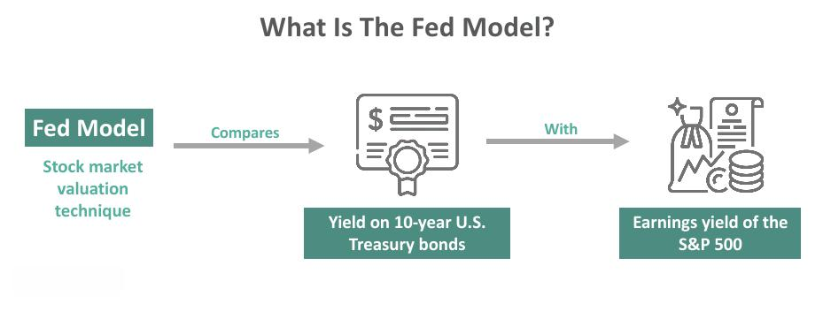

## Table of Contents

## What is the Fed Model?

The Fed Model is a way to compare the earnings yield of the stock market with the yield of long-term government bonds. It helps investors decide if stocks are a good buy compared to bonds. The earnings yield is the earnings per share of a company divided by its stock price. If the earnings yield of the stock market is higher than the yield of government bonds, the Fed Model suggests that stocks might be a better investment than bonds.

The model was created by the Federal Reserve, which is why it's called the Fed Model. It became popular in the 1990s. Some people like the model because it's simple and easy to use. However, others think it has problems. For example, it doesn't consider inflation or the different risks of stocks and bonds. Despite these issues, the Fed Model is still used by many investors to help make investment decisions.

## Who developed the Fed Model and when was it introduced?

The Fed Model was developed by economists at the Federal Reserve. The main person behind it was Edward Yardeni, who was working at the Federal Reserve at the time. He came up with the idea in the early 1990s.

The model was first introduced to the public in 1997 through a research paper by Yardeni. In this paper, he explained how the model works and how it can help investors decide between stocks and bonds. Since then, the Fed Model has become a popular tool for many investors, even though some people have pointed out its limitations.

## What is the basic premise of the Fed Model?

The Fed Model is a simple way to compare stocks and bonds to see which one might be a better investment. It looks at the earnings yield of the stock market and compares it to the yield of long-term government bonds. The earnings yield is found by dividing the earnings per share of a company by its stock price. If the earnings yield of the stock market is higher than the yield of government bonds, the Fed Model suggests that stocks might be a better buy than bonds.

The model was created by economists at the Federal Reserve, with Edward Yardeni being a key person behind it. He introduced the model to the public in 1997. Even though it's easy to use, some people think the Fed Model has problems. For example, it doesn't take into account things like inflation or the different risks that come with stocks and bonds. Still, many investors find it helpful when deciding where to put their money.

## How does the Fed Model compare stock market earnings yields to bond yields?

The Fed Model is a way to see if stocks or bonds are a better investment. It does this by comparing the earnings yield of the stock market to the yield of long-term government bonds. The earnings yield is calculated by dividing a company's earnings per share by its stock price. If the earnings yield of the stock market is higher than the yield of government bonds, the Fed Model says that stocks might be a better choice.

The model was created by people at the Federal Reserve, with Edward Yardeni being a main person behind it. He shared the model with everyone in 1997. While it's easy to use, some people think the Fed Model has problems. For example, it doesn't consider things like inflation or the different risks that come with stocks and bonds. Still, many investors find it helpful when deciding where to put their money.

## What are the key components used in the Fed Model calculation?

The Fed Model uses two main parts to help decide if stocks or bonds are a better investment. One part is the earnings yield of the stock market. This is found by dividing a company's earnings per share by its stock price. The other part is the yield of long-term government bonds. The model compares these two numbers to see which one is higher.

If the earnings yield of the stock market is higher than the yield of government bonds, the Fed Model suggests that stocks might be a better choice. This model was created by people at the Federal Reserve, and Edward Yardeni was a key person behind it. He introduced it to the public in 1997. While the model is easy to use, it doesn't consider things like inflation or the different risks that come with stocks and bonds. Still, many investors find it helpful when deciding where to put their money.

## How is the Fed Model used to assess whether stocks are overvalued or undervalued?

The Fed Model helps investors figure out if stocks are a good deal or too expensive by comparing the earnings yield of the stock market to the yield of long-term government bonds. The earnings yield is calculated by dividing a company's earnings per share by its stock price. If the earnings yield of the stock market is higher than the yield of government bonds, the Fed Model suggests that stocks might be undervalued, meaning they could be a good buy. On the other hand, if the earnings yield is lower than the bond yield, it suggests that stocks might be overvalued, and bonds could be a better investment.

The model was developed by people at the Federal Reserve, with Edward Yardeni playing a big role. He introduced it to everyone in 1997. While the Fed Model is easy to use, it has some limitations. It doesn't take into account things like inflation or the different risks that come with stocks and bonds. Despite these issues, many investors still find the Fed Model helpful when deciding where to put their money.

## What are the criticisms of the Fed Model?

Some people think the Fed Model has problems. One big issue is that it doesn't consider inflation. Inflation is when prices go up over time, and it can affect how much money you get from your investments. The Fed Model just looks at the earnings yield of stocks and the yield of government bonds, but it doesn't adjust for inflation. This can make the model less accurate because the real value of money changes with inflation.

Another criticism is that the Fed Model doesn't think about the different risks of stocks and bonds. Stocks can go up and down a lot more than bonds, which means they're riskier. The model treats stocks and bonds as if they have the same risk, which isn't true. This can lead to wrong decisions because it might make stocks look like a better deal than they really are, especially if you're worried about losing money.

Even though the Fed Model is easy to use, these problems make some investors cautious. They worry that the model might give a false sense of security or lead to bad investment choices. Despite these concerns, many investors still find the Fed Model useful for making quick comparisons between stocks and bonds.

## How has the Fed Model performed historically in predicting market trends?

The Fed Model has had mixed results in predicting market trends over time. In the late 1990s, when it was first introduced, the model seemed to work well. During this period, the earnings yield of the stock market was often higher than the yield of government bonds, suggesting that stocks were a good buy. Many investors followed the model's advice and saw good returns as the stock market, especially tech stocks, soared. However, the model failed to predict the dot-com bubble burst in the early 2000s, which led to a big drop in stock prices.

After the dot-com bubble, the Fed Model's performance became more controversial. Some studies showed that it did a poor job of predicting market trends during the 2000s and 2010s. For example, during the financial crisis of 2008, the model suggested that stocks were undervalued when they were actually falling sharply. Critics argue that the model's failure to account for inflation and risk makes it less reliable. Despite these issues, some investors still use the Fed Model as a quick way to compare stocks and bonds, but they often combine it with other tools to get a more complete picture of the market.

## Can the Fed Model be applied globally, or is it specific to the U.S. market?

The Fed Model was made for the U.S. market, but some people try to use it in other countries too. The model looks at the earnings yield of the stock market and compares it to the yield of government bonds. Since different countries have different economies and rules, using the Fed Model in other places can be tricky. For example, inflation rates and the risks of stocks and bonds can be very different from one country to another.

Even though the Fed Model was meant for the U.S., some investors think it can still help them understand other markets. They might change the model a bit to fit the local conditions. But it's important to remember that the model has problems even in the U.S., like not considering inflation or risk. So, if you use the Fed Model in other countries, you need to be careful and maybe use other tools to help make better investment choices.

## What are the limitations of the Fed Model in different economic environments?

The Fed Model can have problems in different economic situations. It doesn't think about inflation, which is when prices go up over time. This can make the model less useful because inflation changes how much money you really get from your investments. For example, if inflation is high, the real value of the earnings from stocks might be less than what the model shows. Also, the model doesn't work well when the economy is going through big changes, like a recession or a boom. During these times, the relationship between stock earnings and bond yields can be different from what the model expects.

Another big issue is that the Fed Model doesn't consider the different risks of stocks and bonds. Stocks can go up and down a lot more than bonds, which means they're riskier. The model treats them as if they have the same risk, which isn't true. This can lead to wrong decisions, especially in tough economic times when people might want to be more careful with their money. So, while the Fed Model can be a quick way to compare stocks and bonds, it's important to use other tools too, especially when the economy is changing a lot.

## How can the Fed Model be adjusted or improved to increase its accuracy?

The Fed Model can be made better by adding in things like inflation. Right now, it doesn't think about how inflation can change the real value of money from stocks and bonds. If we adjust the model to take inflation into account, it could give a more accurate picture of whether stocks are a good deal or not. For example, if inflation is high, the model could lower the earnings yield of stocks to show their real value after inflation.

Another way to improve the Fed Model is to consider the different risks of stocks and bonds. Stocks can go up and down a lot more than bonds, so they're riskier. The model could be changed to include a risk adjustment, maybe by using something called a risk premium. This would help the model show that stocks need to offer a higher return to make up for their higher risk. By making these changes, the Fed Model could be more useful for investors in different economic situations.

## What alternative models or indicators are used alongside or instead of the Fed Model for market analysis?

Some people use other models or indicators to understand the stock market better. One popular one is the Price-to-Earnings (P/E) ratio. This looks at a company's stock price compared to its earnings per share. If the P/E ratio is high, it might mean the stock is expensive, and if it's low, the stock might be a good deal. Another model is the Dividend Discount Model (DDM), which tries to figure out what a stock is worth by looking at the dividends it pays out over time. Both of these models can help investors see if stocks are overvalued or undervalued in different ways than the Fed Model.

Another useful indicator is the Cyclically Adjusted Price-to-Earnings (CAPE) ratio, also called the Shiller P/E ratio. This one looks at the stock market's P/E ratio but uses average earnings over the last 10 years to smooth out ups and downs in the economy. It can give a better idea of whether the market is too expensive or a good buy over the long term. Some investors also use technical indicators like the Relative Strength Index (RSI) to see if stocks are overbought or oversold based on recent price movements. By using these different models and indicators together, investors can get a fuller picture of the market and make better choices.

## What is the Fed Model?

The Fed Model is a financial valuation method that draws a parallel between the yield of equities and that of bonds. Specifically, the model juxtaposes the forward earnings yield of the S&P 500 Index with the yield on the 10-year U.S. Treasury bond. The forward earnings yield is calculated as the expected earnings divided by the current price of the S&P 500. Mathematically, it can be expressed as:

$$
\text{Earnings Yield} = \frac{\text{Expected Earnings}}{\text{Current Price of S&P 500}}
$$

This comparison essentially evaluates whether equities are overvalued or undervalued relative to bonds. If the earnings yield of the S&P 500 is higher than the 10-year Treasury yield, it suggests that stocks may be undervalued compared to bonds, potentially indicating a buying opportunity. Conversely, if the earnings yield is lower, it can suggest that stocks are overvalued relative to bonds.

Despite its descriptive moniker, the Fed Model is neither officially sanctioned nor connected with the Federal Reserve. The model gained traction in financial circles for its straightforward, empirical approach in determining the bullishness of the stock market. By evaluating the balance between stock and bond yields, it provides investors a frame of reference for assessing market sentiment. However, it's important to recognize that this methodology aims for relative, not absolute, valuation—it assesses stocks in comparison to bonds rather than determining their standalone value.

The Fed Model's underlying principle rests on the historical observation that equity and bond yields often move in tandem. However, care must be taken in environments of shifting interest rates and inflation, as these factors can influence the model's predictive power. Despite its simplicity and empirical backing, the Fed Model remains subject to scrutiny regarding its applicability across varying economic scenarios.

## How can the Fed Model be used for investment evaluation?

The Fed Model serves as a crucial tool for evaluating whether stock prices accurately reflect the balance of risk and reward compared to bonds. This model compares the forward earnings yield of the S&P 500 Index with the yield on the 10-year Treasury bond. By focusing on the differential between these two yields, investors can discern potential mispricing in the marketplace. The formula is as follows:

$$
\text{Earnings Yield} = \frac{\text{Projected Earnings}}{\text{Current Stock Price}}
$$

$$
\text{Fed Model Comparison} = \text{Earnings Yield (S&P 500)} - \text{10-Year Treasury Yield}
$$

A positive difference suggests that stocks may be undervalued relative to bonds, thereby presenting a buying opportunity. Conversely, a negative differential might indicate that stocks are overvalued compared to bonds, signaling a potential sell. 

This model provides insights that are particularly valuable for formulating dynamic trading strategies. It can guide investors in strategically planning market entry and [exit](/wiki/exit-strategy) points, thereby optimizing portfolio performance. Unlike absolute valuation methods that assess the intrinsic value of stocks, the Fed Model emphasizes relative valuation, making it primarily concerned with how stocks are priced in relation to bonds rather than their absolute worth.

By continually monitoring the changing landscape of stock and bond yields, investors can apply the Fed Model to navigate fluctuating market conditions and adjust their strategies accordingly. This comparative approach serves as a practical framework for making informed investment decisions, rooted in balancing the expected returns from equities against the perceived security of bonds.

## References & Further Reading

[1]: Yardeni, E. (1997). ["Fed's Stock Market Valuation Model"](https://sortedbyname.com/letter_h/howard/pamelaj_howard.html). Yardeni Research, Inc.

[2]: Asness, C. S. (2000). ["Stocks versus Bonds: Explaining the Equity Risk Premium"](https://www.aqr.com/-/media/AQR/Documents/Insights/Journal-Article/Stocks-Versus-Bonds-Explaining-the-Equity-Risk-Premium.pdf). Financial Analysts Journal, 56(2), 96-113.

[3]: Modigliani, F., & Cohn, R. A. (1979). ["Inflation, Rational Valuation and the Market"](https://www.jstor.org/stable/4478223). Financial Analysts Journal, 35(2), 24-44.

[4]: Campbell, J. Y., & Shiller, R. J. (1988). ["Stock Prices, Earnings, and Expected Dividends"](https://www.jstor.org/stable/2328190). Journal of Finance, 43(3), 661-676.

[5]: Lopez de Prado, M. (2018). ["Advances in Financial Machine Learning"](https://www.amazon.com/Advances-Financial-Machine-Learning-Marcos/dp/1119482089). Wiley.

[6]: Aronson, D. R. (2006). ["Evidence-Based Technical Analysis: Applying the Scientific Method and Statistical Inference to Trading Signals"](https://onlinelibrary.wiley.com/doi/book/10.1002/9781118268315). Wiley.

[7]: Jansen, S. (2018). ["Machine Learning for Algorithmic Trading"](https://github.com/stefan-jansen/machine-learning-for-trading). Packt Publishing.