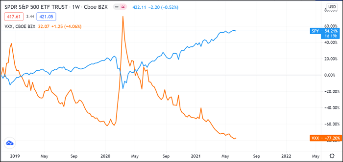

## Table of Contents

## What is the iPath S&P 500 VIX Futures ETF?

The iPath S&P 500 VIX Futures ETF is an exchange-traded fund that tracks the performance of the S&P 500 VIX Short-Term Futures Index. This index is based on futures contracts of the CBOE Volatility Index, commonly known as the VIX. The VIX is often referred to as the "fear gauge" because it measures the market's expectation of volatility over the next 30 days. By investing in the iPath S&P 500 VIX Futures ETF, investors are essentially betting on the future volatility of the S&P 500.

This ETF is designed for investors who want to gain exposure to market volatility without directly trading VIX futures. It's important to understand that this ETF does not track the VIX itself but rather the performance of VIX futures. As a result, the ETF's performance can differ significantly from the VIX, and it can be a complex and risky investment. It is often used by investors as a hedge against market downturns or as a speculative tool to profit from increases in market volatility.

## How does the iPath S&P 500 VIX Futures ETF track the VIX index?

The iPath S&P 500 VIX Futures ETF does not track the VIX index directly. Instead, it follows the S&P 500 VIX Short-Term Futures Index. This index is made up of futures contracts on the VIX. Futures are agreements to buy or sell something at a set price in the future. So, the ETF is betting on what the VIX will do in the future, not what it is doing right now.

Because the [ETF](/wiki/etf-trading-strategies) tracks futures and not the VIX itself, its performance can be very different from the VIX. The VIX might go up, but the ETF might go down if the futures prices don't move the same way. This can make the ETF a tricky investment. It's often used by people who want to protect their investments from big market drops or by those who think the market will get more volatile soon.

## What are the key features of the iPath S&P 500 VIX Futures ETF?

The iPath S&P 500 VIX Futures ETF is a special kind of investment that follows the S&P 500 VIX Short-Term Futures Index. This index is made up of futures contracts on the VIX, which is a measure of how much the stock market is expected to move in the next 30 days. The ETF does not track the VIX itself but the futures contracts, which means it's betting on what the VIX will do in the future, not right now. This can make the ETF's performance different from the VIX, and it can be a bit tricky to understand.

People use the iPath S&P 500 VIX Futures ETF in different ways. Some use it to protect their other investments from big drops in the market, because when the market gets more volatile, the VIX and its futures usually go up. Others use it to try to make money if they think the market will become more volatile soon. It's important to know that this ETF can be risky and it's not like regular investments that track stock prices directly. It's more about betting on how much the market might move in the future.

## What are the potential benefits of investing in the iPath S&P 500 VIX Futures ETF?

Investing in the iPath S&P 500 VIX Futures ETF can offer some benefits, especially if you're looking to protect your investments from big market drops. Since the ETF follows the S&P 500 VIX Short-Term Futures Index, it can go up when the market gets more volatile. This means if you think the market might get shaky, you can use this ETF as a way to hedge or protect your other investments. When the stock market goes down and becomes more unpredictable, the VIX and its futures usually go up, which can help balance out losses in your other investments.

Another potential benefit is that the iPath S&P 500 VIX Futures ETF can be a way to make money if you think the market will become more volatile soon. If you believe that the market is going to see big swings, buying into this ETF can be a way to profit from those changes. However, it's important to understand that this ETF is not like regular stock investments. It's more about betting on future market movements, which can be risky and complex. Always think carefully and maybe talk to a financial advisor before investing in something like this.

## What are the risks associated with the iPath S&P 500 VIX Futures ETF?

Investing in the iPath S&P 500 VIX Futures ETF can be risky because it tracks futures contracts on the VIX, not the VIX itself. This means the ETF's performance can be different from what you might expect if you're just looking at the VIX. Futures prices can move in ways that don't match the VIX, so even if the VIX goes up, the ETF might not. This can make it hard to predict how the ETF will do, and it might lose value even when you think it should go up.

Another risk is that the iPath S&P 500 VIX Futures ETF is meant for short-term trading, not for holding over a long time. Over time, the costs of rolling over futures contracts can add up, which can eat into your returns. This is called contango, where the futures you're buying are more expensive than the ones you're selling, leading to a gradual loss of value. So, if you're not actively trading and watching the market closely, you might end up losing money. It's important to understand these risks and maybe talk to a financial advisor before you decide to invest in this ETF.

## How does the performance of the iPath S&P 500 VIX Futures ETF compare to the S&P 500?

The iPath S&P 500 VIX Futures ETF and the S&P 500 are very different kinds of investments. The S&P 500 is an index made up of 500 big companies in the U.S., and it usually goes up over time as the economy grows. On the other hand, the iPath S&P 500 VIX Futures ETF tracks the S&P 500 VIX Short-Term Futures Index, which is about betting on how much the stock market might move in the future. When the stock market gets shaky and more unpredictable, the VIX and its futures usually go up, but the S&P 500 might go down.

Because of these differences, the performance of the iPath S&P 500 VIX Futures ETF can be the opposite of the S&P 500. When the S&P 500 is doing well and going up, the VIX Futures ETF might be going down because there's less fear in the market. And when the S&P 500 drops and the market gets more volatile, the VIX Futures ETF might go up. This makes the ETF a tricky investment that's often used to protect other investments or to bet on market swings, rather than as a long-term investment like the S&P 500.

## What are the costs and fees associated with the iPath S&P 500 VIX Futures ETF?

The iPath S&P 500 VIX Futures ETF has costs and fees that you need to know about before investing. One big cost is the expense ratio, which is like a yearly fee for managing the ETF. For the iPath S&P 500 VIX Futures ETF, the expense ratio is about 0.89%. This means if you have $1,000 invested, you'll pay around $8.90 each year just for the management of the fund.

Another cost comes from how the ETF works. It tracks futures contracts, and these have to be bought and sold regularly. This process is called rolling over the futures, and it can cost money. If the futures you're buying are more expensive than the ones you're selling, it's called contango, and it can slowly eat away at your investment over time. These costs can add up and make the ETF less profitable than you might expect.

## How can the iPath S&P 500 VIX Futures ETF be used in a diversified investment portfolio?

The iPath S&P 500 VIX Futures ETF can be a useful tool in a diversified investment portfolio because it acts as a hedge against market [volatility](/wiki/volatility-trading-strategies). When the stock market gets shaky and starts to drop, the VIX, which measures expected market swings, usually goes up. Since the ETF tracks futures on the VIX, it can help balance out losses in other parts of your portfolio, like stocks or mutual funds. By including this ETF, you're adding something that might go up when other investments go down, which can help protect your overall investment from big losses.

However, using the iPath S&P 500 VIX Futures ETF in your portfolio needs to be done carefully. It's not meant to be a long-term investment because the costs of rolling over futures contracts can add up over time, which might eat into your returns. Instead, it's best used for short-term strategies or as a way to manage risk during times when you think the market might get more volatile. Always think about how much of your portfolio you want to put into this ETF and maybe talk to a financial advisor to make sure it fits well with your overall investment goals.

## What is the historical volatility of the iPath S&P 500 VIX Futures ETF?

The iPath S&P 500 VIX Futures ETF can be pretty wild because it follows the VIX futures, which are all about how much the stock market might move in the future. The VIX itself is known as the "fear gauge" because it goes up when people think the market will get more unpredictable. So, the ETF can have big swings in value, especially during times when the market is shaky. Looking back, you might see the ETF going up a lot during big market drops, like in 2008 during the financial crisis, or in early 2020 when the COVID-19 pandemic hit.

But it's not just about going up. The ETF can also lose value quickly when the market is calm and the VIX goes down. Over time, the costs of rolling over the futures contracts can also make the ETF lose value, even if the VIX stays the same. So, if you look at the history, you'll see the iPath S&P 500 VIX Futures ETF can be really volatile, with big ups and downs, making it a tricky investment to handle.

## How do market conditions affect the iPath S&P 500 VIX Futures ETF's performance?

Market conditions have a big impact on how the iPath S&P 500 VIX Futures ETF performs. This ETF follows the S&P 500 VIX Short-Term Futures Index, which is all about betting on how much the stock market might move in the future. When the market gets shaky and people start to worry, the VIX, which measures expected market swings, usually goes up. This means the ETF can go up too, because it's tracking futures on the VIX. So, if there's a lot of fear and uncertainty in the market, like during a big drop or a crisis, the ETF might do well.

But when the market is calm and stable, the VIX usually goes down, and so can the ETF. If people aren't worried about big swings in the market, the futures on the VIX might lose value, and the ETF can go down too. Plus, there's another thing to keep in mind: the ETF has to keep buying and selling futures contracts, and if the new ones are more expensive than the old ones, it can slowly lose value over time, even if the VIX stays the same. So, the performance of the iPath S&P 500 VIX Futures ETF really depends on what's happening in the market and how much fear or calm there is.

## What are the tax implications of investing in the iPath S&P 500 VIX Futures ETF?

Investing in the iPath S&P 500 VIX Futures ETF can have different tax effects than regular stock investments. Because the ETF tracks futures contracts on the VIX, any profits you make from selling the ETF might be taxed as a 60/40 split. This means 60% of your gains are taxed as long-term capital gains, and 40% are taxed as short-term capital gains, no matter how long you held the ETF. This can be different from regular stocks, where how long you hold them decides if they're taxed as long-term or short-term gains.

Also, the ETF might have something called "mark-to-market" rules because it deals with futures. This means at the end of each year, you might have to pay taxes on any unrealized gains, even if you didn't sell the ETF. This can be tricky because it might mean you owe taxes even if you haven't actually made any money yet. It's a good idea to talk to a tax advisor to understand all the tax rules and how they might affect your investment in the iPath S&P 500 VIX Futures ETF.

## How do the roll costs impact the long-term performance of the iPath S&P 500 VIX Futures ETF?

The roll costs can have a big impact on the long-term performance of the iPath S&P 500 VIX Futures ETF. This ETF doesn't track the VIX directly but instead follows futures contracts on the VIX. These futures need to be bought and sold regularly, a process known as rolling over. When the futures you're buying are more expensive than the ones you're selling, it's called contango. Over time, these roll costs can add up and eat away at the ETF's value, making it hard for the ETF to perform well in the long run.

Because of these roll costs, the iPath S&P 500 VIX Futures ETF is not meant to be a long-term investment. If you hold onto it for a long time, the costs of rolling over the futures can slowly reduce your returns. This is why the ETF is better used for short-term strategies or as a way to protect your other investments during times when you think the market might get more volatile. Always think carefully about how these costs might affect your investment over time.

## References & Further Reading

[1]: Alexander, C. (2008). ["Market Risk Analysis, Volume IV: Value at Risk Models."](https://pdfs.semanticscholar.org/afba/364297b19e15f646f9964a7f319225984fe9.pdf) Wiley.

[2]: Black, F., & Scholes, M. (1973). ["The Pricing of Options and Corporate Liabilities."](https://www.cs.princeton.edu/courses/archive/fall09/cos323/papers/black_scholes73.pdf) Journal of Political Economy.

[3]: Dash, A., & Dubey, P. (2018). ["Algorithmic Trading: A Comprehensive Introduction with Examples."](https://www.researchgate.net/publication/378548435_Algorithmic_Trading_and_AI_A_Review_of_Strategies_and_Market_Impact) In Emerging Research in Computing, Information, Communication and Applications. Springer.

[4]: Hull, J. C. (2018). ["Options, Futures, and Other Derivatives."](https://www.semanticscholar.org/paper/Options%2C-Futures%2C-and-Other-Derivatives-Hull/89bdee500c8623864fc9eb7a471546aa713acc44) Pearson.

[5]: Murphy, J. J. (1999). ["Technical Analysis of the Financial Markets: A Comprehensive Guide to Trading Methods and Applications."](https://archive.org/details/technicalanalysi0000murp) New York Institute of Finance.