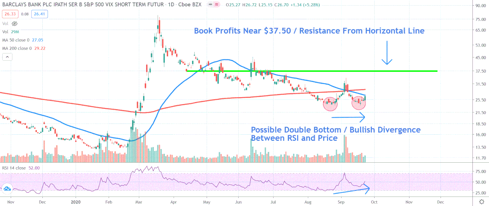

Volatility is a fundamental concept in financial markets, representing the degree of variation in trading prices over time. It is often associated with risk, as higher volatility signifies greater price fluctuations, which can either provide opportunities for profits or lead to significant losses. One of the popular instruments for gaining exposure to market volatility is the iPath S&P 500 VIX Futures ETF. This financial product is specifically designed to track the volatility in the U.S. stock market, providing investors a tool to hedge risks or speculate on future market movements.

The iPath S&P 500 VIX Futures ETF is often sought by traders and investors looking to benefit from or protect against market shifts. As a volatility-focused instrument, it acts as a strategic option during periods of uncertainty, when traditional investment vehicles might not suffice. This ETF offers a direct link to the Chicago Board Options Exchange (Cboe) Volatility Index (VIX), colloquially known as the market's "fear gauge," since it typically rises during times of market stress and unpredictability.



In recent years, algorithmic trading, commonly known as algo trading, has become an indispensable part of financial markets. This highly technical approach utilizes computer programs to execute trades at high speeds and volumes, based on a set of predefined instructions. The integration of algorithmic trading in the context of volatility ETFs like the iPath S&P 500 VIX Futures ETF presents opportunities for speed and efficiency that are unattainable through manual trading.

This article will explore how algo trading can be applied to the iPath S&P 500 VIX Futures ETF to potentially optimize trading strategies. By leveraging algorithmic systems, traders can automate the decision-making process, allowing them to swiftly react to market conditions, thereby minimizing human error and optimizing trading performance. However, the benefits come with their set of risks and challenges, which require thorough analysis and continuous adaptation to successfully harness the potential of algorithm-driven trading with volatility-based ETFs.

## Table of Contents

## Understanding the iPath S&P 500 VIX Futures ETF

The iPath S&P 500 VIX Futures ETF is structured to provide investors with exposure to the volatility of the U.S. stock market, primarily focusing on the behavior of the VIX, or the Cboe Volatility Index. The VIX is often dubbed the market's "fear gauge" as it quantifies market expectations of near-term volatility conveyed by S&P 500 index options. Its value typically rises during periods of market uncertainty and declines during stable market conditions.

Unlike traditional exchange-traded funds (ETFs), the iPath VIX Futures ETF is classified as an exchange-traded note (ETN). This distinction is crucial as ETNs are unsecured debt instruments that track the performance of an index but do not offer ownership in the underlying assets, which in this case is the VIX. Instead, an ETN is essentially a promise by the issuer to pay the return of the index minus fees upon maturity or sale.

The unique nature of ETNs like the iPath VIX brings certain benefits and risks. One advantage is their ability to provide direct exposure to hard-to-access markets or indices, such as the VIX. However, unlike ETFs, ETNs [carry](/wiki/carry-trading) credit risk, meaning that if the issuer faces financial difficulties or defaults, investors may not receive the expected returns.

Investors commonly use the iPath S&P 500 VIX Futures [ETF](/wiki/etf-trading-strategies) for two primary purposes: hedging and speculation. In operational terms, it serves as a hedging tool to offset potential losses in an investment portfolio resulting from sudden spikes in market [volatility](/wiki/volatility-trading-strategies). For speculative investors, the ETF offers the opportunity to profit from anticipated changes in market volatility, providing potential gains when volatility increases. However, the speculative use of this ETF also highlights inherent risks, such as the unpredictability of market shifts and potential financial losses.

Overall, while offering valuable opportunities for hedging and speculation, the iPath S&P 500 VIX Futures ETF requires investors to carefully assess their risk tolerance and understand the intricacies involved, particularly the distinction between traditional ETFs and ETNs.

## The Role of Algorithmic Trading

Algorithmic trading, commonly referred to as algo trading, is the process of utilizing computer programs to execute trading orders at exceptionally high speeds and large volumes. These algorithms are crafted to make decisions based on pre-defined rules regarding parameters such as timing, price, and quantity. This systematic approach allows for the automation of trading strategies, thereby reducing the emotional biases and potential errors that can arise through human intervention.

In the context of the iPath S&P 500 VIX Futures ETF, [algorithmic trading](/wiki/algorithmic-trading) strategies can be particularly advantageous. Given the ETF's link to the Cboe Volatility Index (VIX), it experiences rapid and significant market movements. Algos can be programmed to identify trends and movements within this volatility index, enabling traders to act quickly to capitalize on these changes. The speed at which algorithms operate allows for timely execution that might be unattainable through manual trading methods.

One of the primary benefits of algorithmic trading is the optimization of trading costs. By executing trades more efficiently, algorithms can reduce the costs associated with large-[volume](/wiki/volume-trading-strategy) trades. Moreover, by ensuring that trades are executed at optimal prices, algo trading can minimize the market impact costs, which can be substantial, especially in a volatile market environment.

Aside from cost advantages, algorithmic trading enhances market [liquidity](/wiki/liquidity-risk-premium). As algorithms become more prevalent, the volume of trades increases, contributing to a more liquid and stable market. This enhanced liquidity can lead to narrower spreads and provide a better trading environment for all market participants.

An essential feature of algorithmic trading is the ability to back-test strategies using historical data. By simulating trading strategies against past market conditions, traders can evaluate the potential effectiveness of their algorithms. This process allows for refining strategies and eliminating methods that do not perform well before real capital is at risk. Python, due to its extensive libraries and user-friendly nature, is often used in back-testing and strategy development. Here’s a simple example of back-testing a moving average crossover strategy in Python:

```python
import pandas as pd
import numpy as np

def moving_average_strategy(prices, short_window, long_window):
    signals = pd.DataFrame(index=prices.index)
    signals['signal'] = 0.0

    # Create short simple moving average
    signals['short_mavg'] = prices.rolling(window=short_window, min_periods=1, center=False).mean()

    # Create long simple moving average
    signals['long_mavg'] = prices.rolling(window=long_window, min_periods=1, center=False).mean()

    # Create signals
    signals['signal'][short_window:] = np.where(signals['short_mavg'][short_window:] > signals['long_mavg'][short_window:], 1.0, 0.0)   

    # Generate trading orders
    signals['positions'] = signals['signal'].diff()

    return signals

# Example usage:
prices = pd.Series([100, 102, 104, 103, 108, 110, 115])
signals = moving_average_strategy(prices, short_window=2, long_window=4)
print(signals)
```

Through back-testing, strategies can be continuously monitored and updated to align with evolving market conditions. The dynamic nature of financial markets necessitates ongoing adaptation of algorithms to sustain their efficacy.

In summary, algorithmic trading in the VIX Futures ETF category provides significant advantages by improving trade execution speed, minimizing costs, and leveraging historical data to fine-tune strategies, thus enabling traders to efficiently navigate the complexities of volatility-based instruments.

## Developing Algorithms for VIX Futures ETF Trading

Developing effective algorithms for VIX Futures ETF trading requires a comprehensive understanding of the VIX's behavior and its influencing factors. The VIX, also known as the Cboe Volatility Index, measures the market's expectation of volatility over the coming 30 days, often derived from options prices on the S&P 500. This prompts algorithm developers to focus on key volatility drivers, such as geopolitical events, macroeconomic indicators, and investor sentiment.

Algorithms can be designed to identify and exploit patterns by employing technical indicators. Commonly used indicators include moving averages, which smooth out price data to identify trends over a specified period, and relative strength indices (RSI), which measure the magnitude of recent price changes to evaluate overbought or oversold conditions. Such indicators help in determining opportune moments to execute trades. For instance, an algorithm might initiate a trade when a short-term moving average crosses above a long-term moving average, signaling a potential upward trend.

Risk management is crucial when trading the VIX Futures ETF due to the inherent volatility of the underlying index. Effective risk management strategies include setting stop-loss thresholds and employing position sizing to limit exposure. Algorithms may incorporate volatility-adjusted position sizing, where the size of a trade is inversely related to the volatility of the instrument. Additionally, implementing take-profit levels can help in securing gains during favorable market conditions.

Backtesting and simulation in a risk-free environment are indispensable for refining algorithmic strategies. Historical data allows traders to assess the performance of developed strategies under various market scenarios. This process involves simulating trades using past data to evaluate the algorithm's potential success and resilience. A common Python tool for this purpose is the [backtrader](/wiki/backtrader) library, which enables comprehensive strategy [backtesting](/wiki/backtesting) and visualization.

Here is a simple Python snippet demonstrating a backtesting setup using the backtrader library:

```python
import backtrader as bt

class VIXStrategy(bt.Strategy):
    def __init__(self):
        self.sma = bt.indicators.SimpleMovingAverage(self.data, period=20)
        self.rsi = bt.indicators.RelativeStrengthIndex(self.data)

    def next(self):
        if not self.position:  # not in the market
            if self.data.close > self.sma and self.rsi < 30:
                self.buy()
        else:  # in the market
            if self.data.close < self.sma or self.rsi > 70:
                self.sell()

data = bt.feeds.YahooFinanceData(dataname="VIX", fromdate=datetime(2020, 1, 1), todate=datetime(2021, 1, 1))
cerebro = bt.Cerebro()
cerebro.addstrategy(VIXStrategy)
cerebro.adddata(data)
cerebro.run()
cerebro.plot()
```

Continuous monitoring and updating of the algorithm are essential due to the dynamic nature of markets. Market conditions evolve, driven by new information and changing economic climates, necessitating ongoing adaptation of the algorithm. Regularly revisiting and recalibrating the strategy using updated data and algorithmic refinements ensure its continued relevance and effectiveness. This iterative process not only maintains a competitive edge but also aligns the strategy with the current market environment and its anticipated developments.

## Risks and Challenges

Trading the iPath S&P 500 VIX Futures ETF comes with a spectrum of risks and challenges, primarily due to its inherent nature linked to market volatility. A significant aspect is the impact of contango and backwardation on returns. Contango occurs when the futures prices are higher than the expected future spot prices, leading to a situation where rolling over contracts can result in a loss. Conversely, backwardation indicates futures prices are lower than the expected spot prices, potentially benefiting investors who roll over contracts. Both scenarios affect the performance of VIX Futures ETF investments and demand careful strategic planning.

Algorithmic trading offers tools for navigating such complexities but is not immune to the challenges presented by rapid shifts in market conditions. Algorithms, designed to capitalize on market movements, can face unexpected losses when market conditions change suddenly, highlighting the necessity for robust risk management strategies. Such strategies include setting stop-loss orders, developing adaptive algorithms that can react to changing conditions, and continuously testing models against new data to ensure reliability and accuracy.

The infrastructure required for algorithmic trading is both a necessity and a challenge. High-frequency trading, in particular, demands significant technological investments in terms of hardware, software, and data acquisition systems. These investments not only require capital but also expertise in maintaining systems and ensuring their resilience against technical failures. Furthermore, the integration of sophisticated algorithms with trading platforms necessitates adherence to robust cybersecurity protocols to protect sensitive financial data.

Regulatory considerations are paramount in algorithmic trading. Financial markets are highly regulated to maintain transparency, fairness, and stability, and algorithms must comply with existing laws and regulations. Traders must be aware of the regulatory framework governing algorithmic trading, which varies across different jurisdictions. Compliance with regulations requires continuous monitoring and possibly adapting algorithms to meet new regulatory standards.

Over-reliance on algorithms can pose systemic risks and lead to market manipulation concerns. Algorithmic errors or misjudgments can result in significant market disruptions, as evidenced by past events such as the 2010 Flash Crash. These events underscore the potential for algorithms to exacerbate market volatility, affecting not only individual traders but the market as a whole. Hence, human oversight remains crucial in algorithmic trading to intervene in cases where algorithms might behave unpredictably or inappropriately.

Overall, while algorithmic trading presents opportunities for enhanced trading strategies, it requires navigating a complex landscape of risks and challenges to mitigate adverse outcomes effectively.

## Conclusion

Algorithmic trading in the iPath S&P 500 VIX Futures ETF market offers significant potential for enhancing trading performance. By automating trading strategies, traders can take advantage of speed and efficiency, accessing opportunities that manual trading might miss. However, it is crucial for traders to maintain vigilance concerning the associated risks of algorithmic trading, such as market instability and unexpected technological failures.

As both technology and financial markets evolve, continuous learning and adaptation are essential for the success of algorithmic trading strategies. Traders need to keep abreast of technological advancements and be prepared to adjust their algorithms to reflect current market conditions. This adaptability ensures that strategies remain relevant and effective.

A well-crafted algorithmic strategy can serve as a powerful tool for those seeking to understand and leverage the complexities of volatility-based financial instruments. The dynamic nature of the VIX Futures ETF market presents opportunities for growth, alongside challenges that algorithms can help mitigate.

Looking ahead, future research into [artificial intelligence](/wiki/ai-artificial-intelligence) and [machine learning](/wiki/machine-learning) holds the promise of significantly enhancing algorithmic capabilities within this space. These technologies can provide more sophisticated models for predicting market movements and optimizing trading decisions. As models become more advanced, the potential for improved performance in trading volatility-focused instruments will likely expand, marking an exciting frontier for traders and developers alike.

## References & Further Reading

[1]: Alexander, C. (2008). ["Market Risk Analysis, Volume IV: Value at Risk Models."](https://pdfs.semanticscholar.org/afba/364297b19e15f646f9964a7f319225984fe9.pdf) Wiley.

[2]: Black, F., & Scholes, M. (1973). ["The Pricing of Options and Corporate Liabilities."](https://www.cs.princeton.edu/courses/archive/fall09/cos323/papers/black_scholes73.pdf) Journal of Political Economy.

[3]: Dash, A., & Dubey, P. (2018). ["Algorithmic Trading: A Comprehensive Introduction with Examples."](https://www.researchgate.net/publication/378548435_Algorithmic_Trading_and_AI_A_Review_of_Strategies_and_Market_Impact) In Emerging Research in Computing, Information, Communication and Applications. Springer.

[4]: Hull, J. C. (2018). ["Options, Futures, and Other Derivatives."](https://www.semanticscholar.org/paper/Options%2C-Futures%2C-and-Other-Derivatives-Hull/89bdee500c8623864fc9eb7a471546aa713acc44) Pearson.

[5]: Murphy, J. J. (1999). ["Technical Analysis of the Financial Markets: A Comprehensive Guide to Trading Methods and Applications."](https://archive.org/details/technicalanalysi0000murp) New York Institute of Finance.