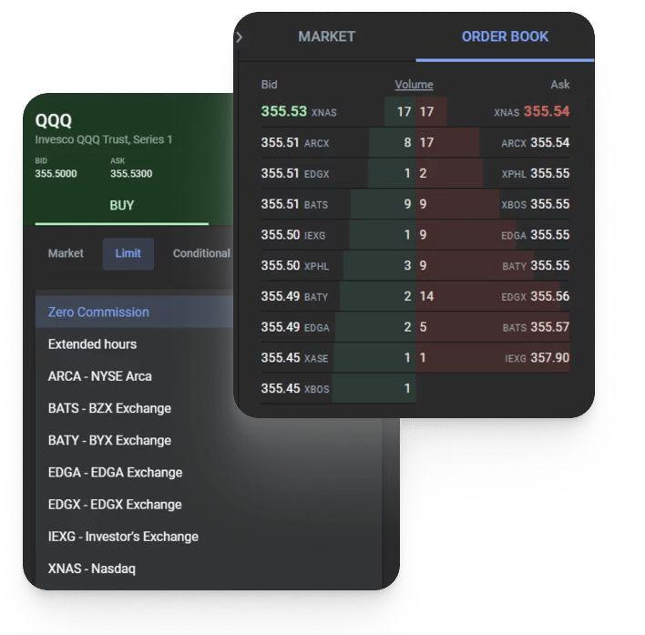

Lime Financial, established in 2000, has emerged as a significant entity in the financial trading sector, primarily recognized for its sophisticated algorithmic trading solutions. Initially designed to cater to the needs of competitive financial institutions, the firm has successfully broadened its outreach, integrating independent traders into its clientele. This capacity expansion underscores Lime Financial's adaptability and forward-thinking strategy in a rapidly evolving trading environment.

A critical component of Lime Financial's offerings is its algorithmic trading platform, a system engineered to enhance trading efficiency and profitability through automation. Algorithmic trading, commonly linked with high-frequency trading (HFT), revolutionizes the trade execution landscape by operating at speeds that vastly outpace traditional trading techniques. This technological advancement enables traders to optimize their strategies by leveraging real-time data, thus unlocking opportunities for substantial gains.



Within this article, we will provide a detailed analysis of Lime Financial's platform, highlighting its strengths and potential limitations. The platform's advanced nature positions it as a valuable tool for active traders seeking to boost their performance through technology. However, the platform's complexity may present challenges, especially for traders unfamiliar with algorithmic systems. By evaluating the pros and cons, we aim to present a balanced view of Lime Financial's offerings and explore the implications for traders operating in today's high-speed, data-driven markets.

## Table of Contents

## Understanding Algorithmic Trading

Algorithmic trading utilizes sophisticated algorithms for the automatic execution of trades, aiming to enhance speed and efficiency. These algorithms are crafted to perform a variety of trading operations, minimizing the time gap between decision-making and execution. At the core of this trading method is a reliance on extensive data analysis, leveraging market signals and historical data to make rapid trading decisions.

The design and functionality of algorithmic trading systems are centered on low latency, which is crucial for executing high-frequency trades. Latency, in this context, refers to the delay between the time an order is placed and its execution in the market. Lower latency ensures that trading systems can respond faster to market movements, a critical requirement for traders who aim to capitalize on minor price fluctuations.

Lime Financial is distinguished in the field by offering a robust algorithmic trading platform known for its low-latency technology. This platform enables traders to execute high-frequency trades swiftly, significantly enhancing their ability to take advantage of fleeting market opportunities. The integration of automated systems allows for orders to be executed almost instantaneously, thereby minimizing human intervention and emotional biases, which can negatively impact trading outcomes.

Implementing [algorithmic trading](/wiki/algorithmic-trading) involves quantitative analysis and the use of mathematical models to identify trading opportunities. Traders often employ strategies such as statistical [arbitrage](/wiki/arbitrage), [market making](/wiki/market-making), and [trend following](/wiki/trend-following). These strategies can be coded into scripts or trading algorithms that automatically execute trades based on predetermined criteria. For example, the following Python code snippet demonstrates a simple moving average crossover strategy:

```python
import pandas as pd
import numpy as np

def moving_average_strategy(data, short_window, long_window):
    data['Short_MA'] = data['Close'].rolling(window=short_window, min_periods=1).mean()
    data['Long_MA'] = data['Close'].rolling(window=long_window, min_periods=1).mean()

    data['Signal'] = 0
    data['Signal'][short_window:] = np.where(data['Short_MA'][short_window:] > data['Long_MA'][short_window:], 1, -1)
    data['Position'] = data['Signal'].diff()

    return data

# Example usage
# dataframe containing stock price data with a 'Close' column
df_with_signals = moving_average_strategy(stock_data, short_window=40, long_window=100)
```

This approach not only boosts the accuracy of trades but also tends to reduce transaction costs by minimizing the market impact of trades. Instead of manually executing orders, traders can set their algorithms to execute trades when specific criteria are met, allowing for a more systematic and disciplined trading approach.

By employing algorithmic trading techniques, traders can optimize their trading operations, achieving a competitive edge in terms of speed, precision, and cost efficiency. Lime Financial's platform, equipped with advanced technology and analytics tools, supports these trading methodologies, rendering it a valuable resource for professional traders aiming to maximize profitability through superior algorithmic strategies.

## Features of the Lime Financial Platform

Lime Financial offers a comprehensive range of advanced trading tools designed to accommodate the diverse requirements of traders. The platform is distinguished by its [hedge fund](/wiki/hedge-fund-trading-strategies)-level technology, which is optimally configured for low-latency trading environments. This technological framework supports traders in executing trades with minimal delay, an essential feature for those engaged in high-frequency and algorithmic trading.

The platform provides screen trading solutions through applications like Lime Trader, available on both web and mobile platforms, and CQG. These tools furnish traders with intuitive interfaces and robust functionalities for managing trades effectively. Lime Trader specifically offers customization options that allow traders to design their trading experience according to their preferences, ensuring a tailored fit for various trading strategies.

For traders seeking to harness automated trading capabilities, Lime Financial offers a comprehensive set of API trading options. This includes the Market Data Source API, Trading REST API, and Python SDK, among other integration tools. These APIs empower traders to efficiently automate their trading strategies, thereby increasing operational efficiency and agility. The Market Data Source offers real-time data essential for informed decision-making, while the Trading REST API facilitates seamless integration into existing trading workflows, ensuring that traders can execute their strategies programmatically with precision.

The platform's Python SDK is especially notable, providing a straightforward programming interface for developing custom trading applications. With well-documented functions and flexible integration possibilities, the Python SDK becomes an indispensable tool for traders focused on building sophisticated trading systems that capitalize on market opportunities with rapid execution.

Overall, Lime Financial's platform is engineered to serve the needs of advanced traders, offering tools that enhance strategic trading through technology-driven solutions and automation capabilities.

## User Experience and Usability

The trading dashboard provided by Lime Financial is crafted to offer a high degree of customization, catering to the diverse needs of active traders. It includes options such as screeners, customizable notifications, and real-time market news, all designed to enhance the trading experience. This level of personalization enables traders to streamline their workflow, ensuring they can manage their trading activities efficiently.

Ease of navigation is a cornerstone of Lime's platform, allowing users to seamlessly transition between account dashboards and trading screens. This feature is particularly beneficial for those who actively manage multiple trading accounts or require rapid access to various trading instruments. However, it is worth noting that while the desktop platform offers extensive functionality, the mobile version currently lacks some of these advanced features, which could limit the flexibility for traders who rely heavily on mobile devices.

Traders are empowered to tailor their experience by creating watchlists and setting alerts for specific securities. This capacity for customization is enhanced by the platform's integration of sophisticated screening tools, enabling traders to identify opportunities that align with their trading strategies. Despite these robust features, Lime Financial's platform falls short in providing extensive educational resources. As a result, it is primarily suited for experienced traders who already possess a solid understanding of market dynamics and trading techniques, rather than newcomers seeking to build foundational knowledge.

## Cost and Account Details

Lime Financial offers a competitive and transparent pricing structure that caters to the needs of high-frequency and professional traders. The platform eliminates commission fees on U.S.-listed stocks and ETFs, providing a cost-effective solution for active traders. Additionally, options trading comes with a minimal fee structure, further enhancing the platform's attractiveness for those engaged in frequent trading activities.

To accommodate diverse trading needs, Lime Financial mandates a minimum account balance of $1,000 for standard trading accounts. For traders seeking to leverage their positions through margin trading, a higher minimum balance requirement of $2,000 is imposed. This pricing framework is particularly advantageous for high-frequency traders who can fully benefit from the platform's robust technology and low-latency execution.

While these cost structures are well-suited for experienced traders and institutional participants, they might be less appealing to smaller retail investors. The capital requirements, although moderate for professional traders, could pose a barrier to entry for individuals with limited initial funds. Moreover, although fee waivers on stock and [ETF](/wiki/etf-trading-strategies) trades reduce overall costs, traders should still consider potential ancillary fees and the absence of extensive research tools when evaluating the overall value proposition of Lime Financial’s services.

## Pros and Cons of Lime Financial

Lime Financial's trading platform is designed to meet the needs of sophisticated traders who prioritize speed, efficiency, and technological prowess in their trading activities. The platform offers several advantages, particularly its excellent low-latency trading capabilities, which are crucial in executing trades at lightning-fast speeds, a significant benefit for high-frequency trading ([HFT](/wiki/high-frequency-trading-strategies)) strategies.

The integration of robust API options into Lime Financial's services allows traders to tailor and automate their trading strategies effectively. Professional traders utilizing algorithmic techniques can leverage these APIs to ensure seamless interaction with the market. This high level of customization and automation is particularly appealing to those employing complex, data-driven trading algorithms akin to those used by hedge funds.

However, Lime Financial is not without its drawbacks. The platform's high entry requirements may act as a barrier for smaller retail investors or those just beginning their trading journey. Another limitation is the lack of comprehensive research amenities. While the platform provides a suite of advanced tools for experienced traders, it does not offer extensive educational resources, which can be a significant hurdle for novice traders looking to deepen their understanding of market dynamics.

In summary, Lime Financial's trading environment is expertly tailored for seasoned traders who are well-acquainted with algorithmic trading. It provides the necessary infrastructure for implementing sophisticated trading strategies, but its complexity and resource requirements make it less suitable for beginners or low-[volume](/wiki/volume-trading-strategy) investors. The platform's focus on advanced trading technologies and direct market access sets it apart as a valuable tool for those who can fully utilize its capabilities.

## Conclusion

Lime Financial is highly optimized for professional traders who demand cutting-edge technology for automated trading systems. The platform distinguishes itself as a specialized solution tailored to high-volume traders who require direct market access. This unique positioning stems from its robust emphasis on speed and technological innovation—crucial attributes for algorithmic trading. Its low-latency capabilities allow traders to execute complex trading strategies swiftly, providing an edge in competitive markets.

Despite its technological superiority, Lime Financial may not be ideal for beginners. The platform's complexity and lack of comprehensive educational resources can pose significant challenges for those new to trading. For seasoned traders, however, Lime Financial offers a sophisticated trading environment that capitalizes on advanced algorithmic tools and direct market access.

Lime Financial sets itself apart from other trading platforms by dedicating its resources to cater to experienced traders and institutional clients. Its offerings are particularly advantageous for those who possess the requisite experience and capital to leverage its powerful tools effectively, maintaining its status as a leading choice for those involved in high-frequency and algorithmic trading.

## References & Further Reading

[1]: ["Quantitative Trading: How to Build Your Own Algorithmic Trading Business"](https://www.amazon.com/Quantitative-Trading-Build-Algorithmic-Business/dp/0470284889) by Ernest P. Chan

[2]: ["Advances in Financial Machine Learning"](https://www.amazon.com/Advances-Financial-Machine-Learning-Marcos/dp/1119482089) by Marcos Lopez de Prado

[3]: Bergstra, J., Bardenet, R., Bengio, Y., & Kégl, B. (2011). ["Algorithms for Hyper-Parameter Optimization."](https://dl.acm.org/doi/10.5555/2986459.2986743) Advances in Neural Information Processing Systems 24.

[4]: ["Evidence-Based Technical Analysis: Applying the Scientific Method and Statistical Inference to Trading Signals"](https://www.amazon.com/Evidence-Based-Technical-Analysis-Scientific-Statistical/dp/0470008741) by David Aronson

[5]: ["Machine Learning for Algorithmic Trading"](https://github.com/PacktPublishing/Machine-Learning-for-Algorithmic-Trading-Second-Edition) by Stefan Jansen