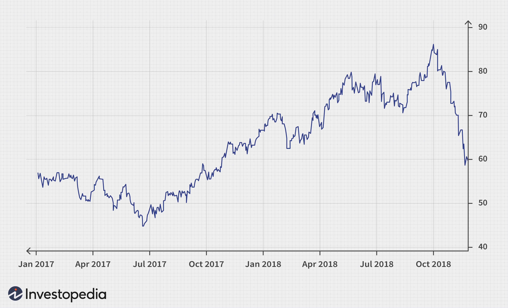

Liquidity is a fundamental aspect of commodity futures markets, which serve as a platform for trading contracts related to agricultural products, energy sources, and metals, among other commodities. Liquidity in this context refers to the ease with which assets can be bought or sold in the market without causing a significant change in their price. High liquidity ensures tighter bid/ask spreads, allowing for more efficient price discovery and execution of trades. This is crucial for traders and investors looking to enter and exit positions rapidly, minimizing the cost of these transactions.

In recent years, algorithmic trading has gained prominence in commodity futures markets, altering traditional trading dynamics. Algorithmic trading refers to the use of computer algorithms to execute trades at high speed and volume based on pre-set criteria. By employing advanced mathematical models and leveraging market data, these algorithms can make trading decisions much faster than human traders.

The increasing adoption of algorithmic trading has a profound impact on market liquidity. It enhances liquidity by narrowing bid/ask spreads and increasing market depth. Algorithms operating across multiple trading platforms and exchanges can exploit price discrepancies, providing opportunities for arbitrage and, thus, supplying more liquidity. Furthermore, algo trading helps to stabilize the market by maintaining liquidity even during high volatility periods.

Liquidity is paramount for commodity futures traders for several reasons. First, it reduces the cost of trading by ensuring lower transaction costs as tighter bid/ask spreads minimize the cost of crossing the spread. Secondly, a liquid market is less susceptible to manipulation, offering a fair trading environment. Finally, it allows for smoother and quicker execution of trades, which is particularly critical during periods of high market volatility or for participants with large trading volumes.

Algorithmic trading is transforming the landscape of commodity futures markets. It not only contributes to improved liquidity and market efficiency but also challenges existing trading paradigms by introducing new strategies and innovations. As technology continues to evolve, algorithmic trading is likely to further integrate with commodity futures trading, enhancing market dynamics and fostering a more robust trading environment.

## Table of Contents

## Understanding Commodity Futures and Liquidity

Commodity futures are standardized agreements to buy or sell a specific quantity and quality of a commodity at a predetermined price on a future date. These contracts are integral to financial markets, providing producers and consumers a mechanism for price risk management. By locking in prices, participants can hedge against adverse price movements, thus stabilizing revenues and costs. Futures markets also attract speculators who provide liquidity, assume price risks, and help in price discovery.

Market [liquidity](/wiki/liquidity-risk-premium) refers to the ability to buy or sell assets without causing significant price changes. In commodity futures trading, liquidity is illustrated through transaction [volume](/wiki/volume-trading-strategy) and the speed at which trades can be executed. High liquidity signals a robust market with many participants, leading to efficient price discovery and smaller price fluctuations.

Liquid markets are characterized by lower bid/ask spreads, the difference between the price a buyer is willing to pay (bid) and the price a seller is willing to accept (ask). Tight spreads indicate a competitive market with reduced transaction costs. For example, if the bid price for a futures contract is $100 and the ask price is $101, a trader enters or exits positions with minimal cost. Conversely, wider spreads occur in illiquid markets, translating to higher transaction costs.

Another aspect is slippage, the difference between the expected price of a trade and the actual price. In highly liquid markets, the swift execution of orders minimizes slippage risk, as the abundance of counterparties reduces the likelihood of price changes between order placement and execution. Conversely, illiquid markets face higher slippage risks due to fewer trades and participants.

Liquidity provides traders with the flexibility to adjust positions quickly in response to market news or changing strategies without incurring substantial costs. Thus, it enhances market efficiency and attracts broader participation. This characteristic makes such markets appealing for various trading strategies, including both short-term speculation and long-term hedging activities.

In summary, the liquidity of commodity futures markets is vital. It facilitates efficient trading and price formation, benefiting market participants through reduced transaction costs and enhanced ability to manage economic risks. Enhanced liquidity is directly correlated with lower transaction costs, better market efficiency, and improved attractiveness of the market to a wide range of traders, from hedgers to speculators.

## Top Liquid Commodity Futures Markets

Commodity futures markets play a pivotal role in global financial systems by providing a platform for price discovery and risk management across various agricultural and industrial sectors. Among these markets, several commodities stand out due to their extraordinary liquidity, making them significant for traders, investors, and stakeholders. This section explores the most liquid commodity futures: [crude oil](/wiki/crude-oil), corn, natural gas, soybeans, and gold, focusing on the factors contributing to their liquidity and an analysis of market volume and open interest.

### Crude Oil

Crude oil futures are among the most liquid commodity futures due to their indispensable role in the global economy. The widespread use of crude oil in energy production and its influence on virtually every industry contribute to its high trading volume. A consistently high demand and geopolitical factors create regular price fluctuations, which in turn attract traders seeking profit opportunities. The New York Mercantile Exchange (NYMEX) and the Intercontinental Exchange (ICE) are prominent platforms where crude oil futures are traded. Market volume and open interest in crude oil are consistently high, often exceeding several million contracts, reflecting sustained market interest and depth.

### Corn

Corn futures are significant in the agricultural commodities sector due to corn's extensive use, both as a staple food and an industrial input, particularly in ethanol production. The high consumption rates across the globe ensure a robust, ongoing demand for corn futures. The Chicago Board of Trade (CBOT) is a primary trading venue for these futures. Factors such as seasonal planting cycles, weather conditions, and government policies like subsidies impact market liquidity by affecting supply and demand dynamics. Corn futures often experience high daily trading volumes, correlating with the cyclical nature of agricultural outputs.

### Natural Gas

Natural gas futures are characterized by their high liquidity due to the commodity’s critical role in energy production. As a cleaner alternative to other fossil fuels, natural gas demand is rising with economic growth and environmental considerations. The Henry Hub is a key pricing point for natural gas futures, widely traded on NYMEX. Liquidity in this market is driven by consistent energy consumption patterns, infrastructure developments, and seasonal variations affecting supply and demand, such as winter heating needs. These futures exhibit high open interest, typically reaching hundreds of thousands of contracts, indicative of market depth and active trading.

### Soybeans

Soybean futures are traded extensively on commodity exchanges like CBOT due to their multifunctional use in food, animal feed, and biofuel production. Factors influencing the liquidity of soybean futures include global dietary trends, livestock production rates, biofuel demand, and the geopolitical landscape impacting trade policies. The futures market for soybeans maintains high liquidity levels due to the crop's economic importance, with trading volumes frequently reaching substantial numbers, making it one of the leading agricultural contracts in terms of market activity and open interest.

### Gold

Gold futures maintain substantial liquidity owing to gold's dual function as both a commodity and a monetary asset. The historical value of gold as a safe-haven asset during economic uncertainty drives continuous investment and trade. Gold futures are actively traded on platforms such as the COMEX, part of the CME Group. Price drivers include inflation rates, central bank policies, currency fluctuations, and hedging activities. The market for gold futures is one of the most liquid, with large volumes and high open interest levels, ensuring that traders can execute trades efficiently without significant price slippage.

### Conclusion

In summary, the liquidity of commodity futures such as crude oil, corn, natural gas, soybeans, and gold is driven by their critical economic roles, consistent demand, and dynamic market environments. High trading volumes and open interest levels serve as indicators of these markets’ liquidity, enabling efficient price discovery and risk management. These characteristics not only attract a diverse range of market participants but also contribute to the ongoing evolution of futures trading.

## Algorithmic Trading in Commodity Futures

Algorithmic trading has emerged as a dominant force in commodity futures, leveraging computational power to execute trades with speed and precision. This approach utilizes algorithms—complex mathematical models that analyze market data and execute orders—to optimize trading strategies, minimize human error, and capitalize on fleeting market opportunities. Its rise corresponds with significant improvements in technology, such as high-speed internet and distributed computing, which facilitate the rapid analysis and processing of vast amounts of market data.

One of the significant advantages of [algorithmic trading](/wiki/algorithmic-trading) is its contribution to liquidity and overall market efficiency. Liquidity refers to the ease with which an asset can be bought or sold in the market without affecting its price. Algorithmic trading enhances liquidity by increasing the volume of trades and tightening bid-ask spreads. As algorithms continuously monitor the market and execute trades at optimal prices, they naturally lead to higher turnover rates, which is a critical component of liquid markets. This increased liquidity benefits all market participants by reducing the cost of entering and exiting positions, as tighter spreads mean that traders receive more competitive pricing.

Moreover, algorithmic trading significantly boosts market efficiency. By enabling trades that are more reflective of real-time supply and demand dynamics, algo trading helps in price discovery— the process by which markets determine the price of a traded commodity. Efficient markets are characterized by prices that fully reflect all available information. Algorithms contribute to this by processing vast datasets at a speed impossible for human traders, thus ensuring that prices are adjusted nearly in real-time to new information.

Algorithmic trading is also reshaping traditional commodity trading strategies in profound ways. Historically, traders relied on [fundamental analysis](/wiki/fundamental-analysis)—evaluating economic indicators such as supply, demand, and geopolitical events affecting commodities. While these factors remain relevant, algorithmic trading introduces strategies based on quantitative analysis, such as [trend following](/wiki/trend-following) and statistical [arbitrage](/wiki/arbitrage).

Trend following strategies in algorithmic trading involve identifying and exploiting market [momentum](/wiki/momentum). Algorithms scan historical price data to detect trends and generate buy or sell signals based on statistical models. This method contrasts with traditional strategies that might require manual chart analysis. For example, a moving average crossover strategy can be automated to execute trades when short-term moving averages cross above long-term averages, signaling a potential upward trend.

Statistical arbitrage leverages mean reversion, where prices that deviate from their historical norms are expected to return to those norms over time. Algorithms identify and exploit these deviations by executing trades across correlated assets. In commodity markets, this could involve exploiting the price relationship between similar commodities, such as Brent and WTI crude oil, or between main and by-products like corn and ethanol.

In summary, algorithmic trading has revolutionized commodity futures markets, providing enhanced liquidity and market efficiency while reshaping traditional trading strategies with sophisticated, data-driven approaches. As this technology continues to evolve, it is likely to further transform the landscape of commodity trading.

## Case Study: Algo Trading Strategies in Top Commodity Markets

Algorithmic trading strategies have fundamentally transformed commodity markets by enhancing liquidity and tightening bid/ask spreads. In top liquid markets like crude oil and natural gas, specific strategies such as trend following and [statistical arbitrage](/wiki/statistical-arbitrage) have shown significant impacts on market dynamics and liquidity.

### Trend Following in Crude Oil Markets

Trend following is a popular algorithmic strategy applied to the crude oil markets. It operates on the principle of identifying and capitalizing on prevailing market trends. This strategy involves the use of technical indicators such as moving averages, momentum indicators, and price action analysis to make trading decisions. The simplicity and effectiveness of trend following lie in its ability to align with longer-term market movements while minimizing the impact of short-term [volatility](/wiki/volatility-trading-strategies).

For instance, a moving average crossover strategy might be implemented, where a short-term moving average crossing above a long-term moving average triggers a buy signal, and vice versa for a sell signal. The algorithm can automatically execute these buy and sell orders, thus maintaining constant market exposure aligned with the identified trend.

The impact of trend following on crude oil markets is profound. By consistently participating in the market, algorithms contribute to enhanced liquidity, particularly during trend periods. Additionally, the increased trading activity helps reduce bid/ask spreads, thereby minimizing the trading costs for other market participants.

### Statistical Arbitrage in Natural Gas Markets

Statistical arbitrage, employed extensively in natural gas markets, involves the use of statistical models to exploit price discrepancies between correlated instruments. This strategy is based on the principle that prices of similar or related assets tend to move together. When these assets deviate from their historical correlation, statistical arbitrageurs enter into trades that seek to profit from the expected convergence.

A typical implementation involves pairs trading, where algorithms identify pairs of securities with historical price relationships. For natural gas, the algorithm might monitor prices of physically linked assets or derivatives like futures contracts on different exchanges. When the price spread deviates beyond a certain threshold, the algorithm automatically enters into long and short positions to profit from the anticipated correction.

The impact of statistical arbitrage in natural gas markets is significant in terms of market efficiency and liquidity. By identifying and exploiting price inefficiencies, statistical arbitrage contributes to faster price discovery, reducing arbitrage opportunities and aligning prices more closely with their intrinsic values. This increased efficiency leads to thinner bid/ask spreads and generally higher liquidity.

### Overall Market Impact

The implementation of algorithmic strategies such as trend following and statistical arbitrage has notable implications for market dynamics. These strategies contribute to a more fluid market environment by increasing the frequency of trades and enabling rapid adjustments to new information. As a result, markets become more efficient, with prices reflecting current conditions quicker than they would in the absence of algorithmic participation.

Furthermore, the presence of algorithmic traders often acts as a stabilizing force in the market. During periods of excessive volatility, algorithms that employ liquidity-providing strategies can dampen price swings by absorbing demand or supply imbalances. However, it is crucial to consider that while algorithmic trading enhances liquidity overall, it can occasionally exacerbate volatility under stressed market conditions, necessitating careful regulation and oversight.

In summary, algorithms, through strategies like trend following and statistical arbitrage, play a crucial role in enhancing the liquidity and efficiency of top commodity futures markets such as crude oil and natural gas, transforming how these markets operate and respond to trading signals.

## Technological Advances Driving Algo Trading

Machine learning and [artificial intelligence](/wiki/ai-artificial-intelligence) (AI) have become pivotal elements in the enhancement of algorithmic trading within commodity futures markets. These technologies enable the analysis of vast datasets, identification of complex patterns, and prediction of future market behaviors, all of which contribute to more informed and effective trading strategies.

Machine learning techniques, such as supervised learning, unsupervised learning, and [reinforcement learning](/wiki/reinforcement-learning), are employed to model and predict price movements. Supervised learning algorithms are trained on historical data to identify patterns and make predictions about future price trends. For example, regression models and neural networks can be utilized to predict future price movements based on input features derived from historical prices and market conditions. Python libraries such as Scikit-learn and TensorFlow are often used for implementing these models.

Artificial intelligence extends the capabilities of algorithmic trading by allowing for the development of adaptive algorithms that can adjust to ever-changing market conditions. AI algorithms can simulate human-like decision-making processes and continuously refine their strategies based on new data. This adaptability is crucial in the fast-paced and volatile environment of commodity futures trading.

Big data analytics plays a significant role in enhancing trading decisions and outcomes. With the advent of high-frequency trading and the proliferation of market data, traders have access to a wealth of information. Big data technologies enable traders to process and analyze large volumes of data in real time, uncovering insights that may not be apparent through traditional analysis methods. Hadoop and Apache Spark are examples of tools that facilitate the processing of big data, allowing for quick analysis and decision-making.

Looking towards the future, advancements in technology are expected to further transform commodity futures trading. The integration of [deep learning](/wiki/deep-learning), a subset of [machine learning](/wiki/machine-learning), holds promise for more accurate models of market prediction. Quantum computing, although still in its nascent stages, has the potential to revolutionize algorithmic trading by significantly enhancing computational power and improving the efficiency of complex calculations.

Moreover, the continued development of natural language processing (NLP) could enable the analysis of unstructured data, such as news articles and social media, providing additional insights into market sentiment and potential price movements. This can be particularly beneficial in capturing qualitative data that might influence commodity prices.

In summary, technological advances in machine learning, AI, and big data analytics are significantly enhancing algorithmic trading strategies in commodity futures. As these technologies continue to evolve, they will likely lead to more sophisticated trading approaches, improving market efficiency and providing a competitive edge to market participants.

## Challenges and Risks of Algo Trading in Commodity Markets

Algorithmic trading in commodity markets has transformed how trades are executed, bringing both enhanced efficiencies and distinct challenges. Despite the clear advantages of speed and precision, several obstacles and risks must be addressed to ensure the stable and ethical development of these markets.

One of the primary challenges of deploying algorithmic trading strategies arises from market volatility. Commodity markets are inherently volatile due to the nature of their underlying assets. Factors such as geopolitical tensions, weather conditions, and economic shifts can cause significant price swings. Algorithms, especially high-frequency trading programs that rely on historical data patterns, may struggle to adapt quickly to sudden changes, risking substantial losses. Traders must design algorithms that are robust enough to withstand such volatility, often incorporating real-time data analysis and machine learning to dynamically adjust trading strategies.

Infrastructure limitations present another significant challenge. High-frequency trading systems demand stable, high-speed internet connections and sophisticated computer infrastructures. Latency—the delay before a transfer of data begins following an instruction—can hamper trading performance. Exchanges and trading firms continuously invest in technology to reduce latency, but disparities in infrastructure capabilities can lead to unequal opportunities among market participants.

Algo trading also faces potential risks such as flash crashes, which are abrupt, deep market declines followed by swift recoveries. A notable example is the 2010 flash crash where algorithms triggered a massive sell-off, wiping nearly $1 trillion from the U.S. stock market in minutes. Such incidents typically result from complex interactions between numerous algorithms operating simultaneously, leading to a feedback loop of rapid selling. Developing kill switches or trading halts can mitigate these risks, but they require careful calibration to avoid unnecessary interruptions.

Regulatory concerns are another significant risk associated with algorithmic trading. Regulators are increasingly scrutinizing automated trading to prevent market manipulation and ensure fair trading practices. Compliance with evolving regulations can be burdensome and requires continuous monitoring and modification of trading systems.

Balancing the technological benefits of algorithmic trading with market stability and ethical considerations is crucial. While algorithms offer significant improvements regarding execution speed and liquidity provision, they must be developed and deployed responsibly. Ethical considerations include ensuring that algorithms do not manipulate market prices or create artificial volatility. Firms should conduct rigorous testing and validation of their algorithms to ensure compliance with ethical standards and regulatory requirements.

In summary, while algorithmic trading has the potential to revolutionize commodity futures markets by enhancing liquidity and efficiency, it also introduces challenges and risks that necessitate careful management. Addressing these through robust technology infrastructure, regulatory compliance, and ethical trading practices is essential for the sustainable advancement of these markets.

## Conclusion

Liquidity in commodity futures markets, enhanced by algorithmic trading, plays a critical role in ensuring these financial instruments remain viable and efficient for traders globally. Commodity futures enable participants to hedge against price volatility, speculate on future price movements, and achieve portfolio diversification. The liquidity of these markets, characterized by high trading volumes and low bid/ask spreads, is essential in reducing transaction costs and minimizing market slippage. Algorithmic trading has significantly contributed to enhancing liquidity by facilitating faster order executions and providing continuous market participation.

As technological advancements progress, the landscape of futures trading continues to evolve. The integration of sophisticated algorithms and cutting-edge technologies such as machine learning and big data analytics is reshaping traditional trading paradigms. These innovations allow for complex trading strategies that can adapt to market conditions with greater precision and speed than ever before. For instance, the use of AI-driven models has shown promise in anticipating market trends and executing trades that leverage minimal price inefficiencies.

The future of algorithmic trading in commodity markets looks promising but is not without challenges. While these technologies offer substantial benefits in terms of efficiency and market liquidity, they also pose risks like increased volatility and the potential for market disruptions, exemplified by phenomena such as flash crashes. Regulators and market participants must work together to address these challenges, ensuring that the advantages of technological integration are balanced with the need for stable and fair markets.

In conclusion, the symbiosis of liquidity, algorithmic trading, and technological innovation is pivotal in shaping the future of commodity futures markets. As these elements continue to intertwine, they promise a trading environment that is both dynamic and resilient, capable of meeting the needs of an ever-evolving global marketplace. The road ahead will require ongoing collaboration between technologists, traders, and regulators to harness the full potential of these advancements while safeguarding market integrity.

## References & Further Reading

[1]: Bergstra, J., Bardenet, R., Bengio, Y., & Kégl, B. (2011). ["Algorithms for Hyper-Parameter Optimization."](https://papers.nips.cc/paper/4443-algorithms-for-hyper-parameter-optimization) Advances in Neural Information Processing Systems 24.

[2]: ["Advances in Financial Machine Learning"](https://www.amazon.com/Advances-Financial-Machine-Learning-Marcos/dp/1119482089) by Marcos Lopez de Prado

[3]: ["Evidence-Based Technical Analysis: Applying the Scientific Method and Statistical Inference to Trading Signals"](https://www.amazon.com/Evidence-Based-Technical-Analysis-Scientific-Statistical/dp/0470008741) by David Aronson

[4]: ["Machine Learning for Algorithmic Trading"](https://github.com/stefan-jansen/machine-learning-for-trading) by Stefan Jansen

[5]: ["Quantitative Trading: How to Build Your Own Algorithmic Trading Business"](https://www.amazon.com/Quantitative-Trading-Build-Algorithmic-Business/dp/1119800064) by Ernest P. Chan