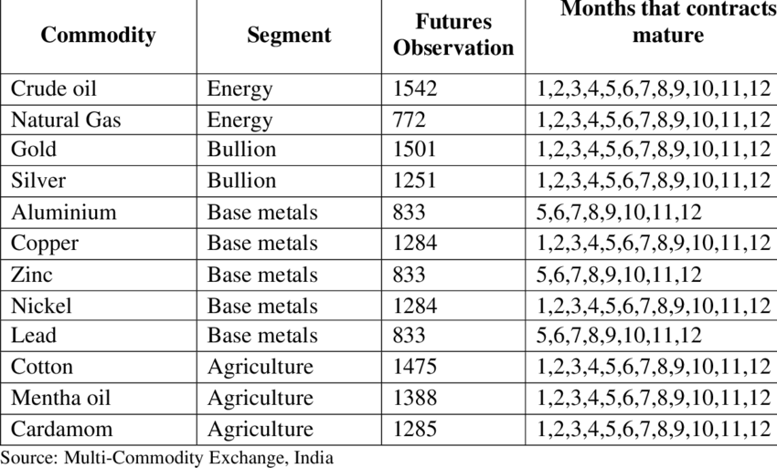

## Table of Contents

## What are commodity futures?

Commodity futures are contracts to buy or sell a specific amount of a commodity at a set price on a future date. These commodities can be things like oil, gold, wheat, or coffee. People use futures to protect themselves from price changes. For example, a farmer might sell wheat futures to lock in a price for their crop, even if the market price drops later.

Trading commodity futures happens on exchanges, like the Chicago Mercantile Exchange. Traders can buy and sell these contracts without ever touching the actual commodity. This makes it easier for them to speculate on price movements or hedge against risks. However, trading futures can be risky because prices can be very unpredictable, and it's possible to lose more money than you initially invested.

## Why is liquidity important in commodity futures?

Liquidity is important in commodity futures because it makes it easier to buy and sell contracts. When a market is liquid, there are lots of buyers and sellers, so you can quickly trade your futures without waiting too long. This means you can get in and out of positions easily, which is helpful if you need to act fast because of changing prices.

Also, [liquidity](/wiki/liquidity-risk-premium) helps keep trading costs low. When there are many people trading, the difference between the price someone is willing to buy at and the price someone is willing to sell at (called the bid-ask spread) is smaller. This means you pay less in fees and can make more money from your trades. Without enough liquidity, it can be hard to trade and more expensive, which can make commodity futures riskier and less attractive to traders.

## Which commodity futures are considered the most liquid?

The most liquid commodity futures are usually those that are traded a lot and have many buyers and sellers. Some of the most liquid ones are [crude oil](/wiki/crude-oil), gold, and natural gas. Crude oil futures are very popular because oil is used all over the world for many things like fuel and plastics. Gold futures are also very liquid because gold is seen as a safe investment, especially during uncertain times. Natural gas futures are important because natural gas is used for heating and electricity.

These commodities have high liquidity because they are important to the economy and many people want to trade them. For example, the WTI (West Texas Intermediate) crude oil futures contract on the New York Mercantile Exchange is one of the most traded in the world. The COMEX gold futures and the Henry Hub natural gas futures are also very liquid. Traders like these futures because they can buy and sell them easily and quickly, which helps them make decisions based on the latest market information.

## How is liquidity measured in commodity futures markets?

Liquidity in commodity futures markets is measured by looking at how easy it is to buy and sell contracts. One way to measure this is by checking the trading [volume](/wiki/volume-trading-strategy), which is the total number of contracts traded in a day. If a lot of contracts are traded, it means the market is liquid because many people are buying and selling. Another way is to look at the open interest, which is the total number of contracts that have not been closed or delivered yet. High open interest shows that many people are interested in trading that commodity, which adds to the market's liquidity.

Another important measure is the bid-ask spread, which is the difference between the highest price someone is willing to pay (bid) and the lowest price someone is willing to accept (ask). A smaller bid-ask spread means the market is more liquid because it's easier and cheaper to trade. Market depth is also used to measure liquidity. It shows how many buy and sell orders are waiting at different price levels. If there are lots of orders at many different prices, it's easier to trade without big price changes, making the market more liquid.

## What factors contribute to the liquidity of commodity futures?

Several things help make commodity futures markets more liquid. First, how much people want to buy and sell the commodity matters a lot. If a lot of people are interested in trading, like with crude oil or gold, the market will be more liquid. This is because there are more buyers and sellers, so it's easier to trade. Another thing that helps is how important the commodity is to the economy. Commodities that are used a lot, like natural gas for heating homes, tend to have more liquid markets because more people need to trade them.

Also, the rules of the exchange where the futures are traded can affect liquidity. Some exchanges have rules that make it easier to trade, like smaller contract sizes or lower fees, which can attract more traders and increase liquidity. Finally, how stable the market is can also play a role. If prices don't jump around too much, more people might be willing to trade, making the market more liquid. All these factors together decide how easy it is to buy and sell commodity futures.

## How does trading volume affect the liquidity of commodity futures?

Trading volume is a big deal when it comes to how liquid a commodity futures market is. It's all about how many contracts are being bought and sold every day. When a lot of people are trading, the market is more liquid. This means it's easier to buy or sell your futures because there are plenty of people on the other side of the trade. High trading volume means there's more action, and it's less likely you'll have to wait to make a trade.

High trading volume also helps keep costs down. When lots of people are trading, the difference between what someone is willing to pay and what someone is willing to sell for (the bid-ask spread) is smaller. This makes trading cheaper because you don't have to pay as much to get in and out of your trades. So, when more people are trading, it's not just easier to make a trade, but it's also more affordable, which can attract even more traders and keep the market liquid.

## What are the benefits of trading in highly liquid commodity futures?

Trading in highly liquid commodity futures has some big advantages. When a market is liquid, it's easy to buy and sell your futures contracts. There are lots of people trading, so you don't have to wait long to make a trade. This means you can quickly get in and out of positions, which is really helpful if prices are changing fast. You don't want to be stuck waiting to sell when prices are dropping, right?

Another benefit is that trading costs are lower in a liquid market. Because there are so many people buying and selling, the difference between the price someone is willing to pay and the price someone is willing to sell at (called the bid-ask spread) is smaller. This means you pay less in fees, and you can make more money from your trades. When trading is cheaper and easier, it makes the whole experience less stressful and more profitable.

## How do open interest and liquidity relate in commodity futures?

Open interest and liquidity are closely connected in commodity futures markets. Open interest is the total number of futures contracts that haven't been closed or delivered yet. When open interest is high, it means a lot of people are interested in trading that commodity. This usually makes the market more liquid because more people are buying and selling, so it's easier to find someone to trade with.

High open interest can attract even more traders to the market. When traders see that many contracts are still open, they might feel more confident about trading in that market. This can lead to more trading volume, which also helps increase liquidity. So, open interest and liquidity kind of feed into each other, making it easier and cheaper for everyone to trade commodity futures.

## What are the risks associated with trading in less liquid commodity futures?

Trading in less liquid commodity futures can be riskier because it's harder to buy and sell your contracts. When a market isn't very liquid, there aren't as many people trading, so you might have to wait a long time to make a trade. This can be a problem if prices are changing quickly and you need to get out of a position fast. You might end up selling for less or buying for more than you wanted because you can't find someone to trade with at the price you want.

Another risk is that trading costs can be higher in less liquid markets. When there aren't many people trading, the difference between what someone is willing to pay and what someone is willing to sell for (the bid-ask spread) can be bigger. This means you have to pay more in fees to make your trades, which can eat into your profits. If the market isn't very active, it can also be harder to predict how prices will move, making it even riskier to trade.

## How do market participants influence the liquidity of commodity futures?

Market participants play a big role in how liquid a commodity futures market is. When a lot of people want to buy and sell a certain commodity, like oil or gold, it makes the market more liquid. These people can be farmers, miners, or big companies that need the commodity for their business. They use futures to protect themselves from price changes, which means more trading and more liquidity. Traders who buy and sell futures to make money also help a lot. They add to the number of people trading, making it easier for everyone to find someone to trade with.

Sometimes, the actions of market participants can make a market less liquid too. If fewer people are interested in trading a certain commodity, like a less common metal, there won't be as many buyers and sellers. This can make it harder to trade and increase the costs. Also, if big market participants, like big companies or investment funds, pull out of the market, it can reduce liquidity because there are fewer people trading. So, the choices and actions of everyone involved in the market can really change how easy it is to buy and sell commodity futures.

## What advanced strategies can be employed in trading highly liquid commodity futures?

When trading highly liquid commodity futures, one advanced strategy is called spread trading. This means you buy one futures contract and sell another at the same time. The idea is to profit from the difference in prices between the two contracts. For example, you might buy oil futures for delivery in June and sell oil futures for delivery in December. If the price difference between these two contracts changes in your favor, you can make money even if the overall price of oil goes up or down. This strategy can be less risky because you're not betting on the direction of the market, but on how the prices of different contracts move relative to each other.

Another strategy is called [algorithmic trading](/wiki/algorithmic-trading), where you use computer programs to make trading decisions. These programs can analyze a lot of data very quickly and make trades based on that data. In highly liquid markets, this can be really helpful because the programs can take advantage of small price changes that happen all the time. For example, the program might buy a futures contract when it sees a small dip in price and sell it when the price goes up a little bit. This kind of trading needs a lot of technical know-how, but it can be very effective in markets where there's a lot of trading happening all the time.

## How have technological advancements impacted the liquidity of commodity futures markets?

Technology has made a big difference in how easy it is to trade commodity futures. One way it helps is by making it possible to trade online. Before, people had to go to a physical place to trade, like a trading floor. Now, anyone with a computer and internet can trade from anywhere. This means more people can join in, which makes the market more liquid. There are more buyers and sellers, so it's easier and faster to make trades.

Another way technology helps is through better information. Computers and the internet give traders a lot of data about prices and market trends very quickly. This means traders can make better decisions and trade more often. When traders have good information, they are more likely to trade, which also adds to the liquidity of the market. So, technology not only makes it easier to trade but also helps make the market more active and liquid.

## References & Further Reading

[1]: Bergstra, J., Bardenet, R., Bengio, Y., & Kégl, B. (2011). ["Algorithms for Hyper-Parameter Optimization."](https://papers.nips.cc/paper/4443-algorithms-for-hyper-parameter-optimization) Advances in Neural Information Processing Systems 24.

[2]: ["Advances in Financial Machine Learning"](https://www.amazon.com/Advances-Financial-Machine-Learning-Marcos/dp/1119482089) by Marcos Lopez de Prado

[3]: ["Evidence-Based Technical Analysis: Applying the Scientific Method and Statistical Inference to Trading Signals"](https://www.amazon.com/Evidence-Based-Technical-Analysis-Scientific-Statistical/dp/0470008741) by David Aronson

[4]: ["Machine Learning for Algorithmic Trading"](https://github.com/stefan-jansen/machine-learning-for-trading) by Stefan Jansen

[5]: ["Quantitative Trading: How to Build Your Own Algorithmic Trading Business"](https://www.amazon.com/Quantitative-Trading-Build-Algorithmic-Business/dp/1119800064) by Ernest P. Chan