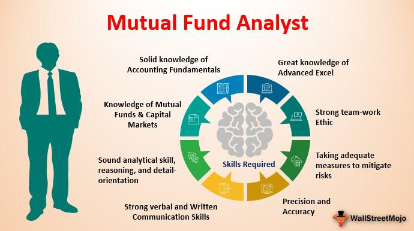

Mutual fund investment, performance measurement, and algorithmic trading represent key intersections in modern finance. Mutual funds, which pool resources from multiple investors to purchase a diversified portfolio of securities, play a significant role in many investment portfolios. They offer exposure to various assets, including stocks, bonds, and other securities, and are managed by professional investment managers who aim to achieve specific investment goals, such as capital appreciation or income generation.

The performance of mutual funds is frequently evaluated based on their returns. Understanding both annual and annualized returns is crucial for investors. Annual returns represent the percentage increase or decrease in the fund's net asset value over a single year and provide a snapshot of its performance over a specific period. However, annualized returns offer a long-term perspective by showing the equivalent annual return assuming the investment was held for a period longer than one year, hence providing a clearer picture of a fund’s performance over extended periods. 

In recent years, algorithmic trading has become a significant factor influencing mutual fund returns and shaping investment strategies. Algorithmic trading, the use of computer algorithms to automate trading decisions, has increased the efficiency and speed of financial markets. This method can impact mutual fund strategies in various ways, affecting interim trading profits and potentially altering fund performance outcomes. As a result, investors must consider the implications of algorithmic trading when assessing mutual fund investments. Understanding these dynamics helps in making informed decisions that align with individual financial goals, emphasizing the need for a strategic approach to mutual fund investments.

## Table of Contents

## Understanding Mutual Fund Investment

Mutual funds are investment vehicles that pool money from multiple investors to purchase a diversified portfolio of stocks, bonds, or other securities. Managed by professional fund managers, these funds offer investors a way to diversify their portfolio without needing the expertise or time to choose individual securities. The fundamental concept of mutual fund investment is to spread risk across various assets, thereby potentially reducing the impact of any single asset's poor performance on the overall portfolio.

### Definition and Types of Mutual Funds

Mutual funds can be categorized into several types based on investment objectives and asset allocation strategies. The primary types include:

1. **Equity Funds:** Invest primarily in stocks and aim for capital growth over the long term.
2. **Fixed-Income Funds (or Bond Funds):** Focus on generating income by investing in government or corporate bonds.
3. **Balanced Funds:** Combine stocks and bonds in a single portfolio to provide a mix of income, growth, and security.
4. **Index Funds:** Track a specific index (e.g., the S&P 500) and mirror its performance by holding the securities within that index.
5. **Money Market Funds:** Invest in short-term, high-quality instruments and aim for capital preservation with a modest income.
6. **Sector Funds:** Focus on specific industries or sectors of the economy, such as technology or healthcare.

### Key Concepts in Mutual Fund Investment

The two primary concepts that drive mutual fund investment are diversification and professional management:

- **Diversification:** By investing in a range of different assets, mutual funds reduce the risk associated with any single investment. The diversification principle helps to cushion the portfolio against market volatility.

- **Professional Management:** Mutual funds are managed by experienced investment professionals who conduct research, select securities, and make decisions that align with the fund's investment objectives. This professional oversight offers individual investors insights and expertise they might not have on their own.

### Differences between Mutual Funds and Other Investment Vehicles like ETFs

While mutual funds and exchange-traded funds (ETFs) both provide diversification and professional management, there are notable differences:

- **Trading:** Mutual funds are typically priced at the end of the trading day, and transactions are executed at that time. In contrast, ETFs are traded on stock exchanges like individual stocks, with prices fluctuating throughout the trading day.

- **Cost Structure:** ETFs often have lower expense ratios compared to mutual funds. Mutual funds may impose loads (sales charges) and redemption fees, whereas ETFs typically charge brokerage fees similar to stock trading.

- **Tax Efficiency:** ETFs generally offer greater tax efficiency due to their unique structure, which allows for in-kind redemption and thus minimizes capital gains distributions.

### Historical Performance Trends in Mutual Funds

Historically, mutual funds have been an attractive investment choice for many due to their professional management and diversified risk. Over time, they have provided returns that, while varying by type and market conditions, often exceed those of conservative investment vehicles like savings accounts or certificates of deposit. Performance trends have shown that:

- **Equity Funds** tend to yield higher returns over the long term compared to bond and money market funds, reflecting the inherent higher risk associated with equity markets.

- **Bond Funds** provide stable income and are less volatile than equity funds, supporting investors with a moderate risk appetite.

- **Index Funds** have gained significant popularity for delivering market-average returns with lower fees than actively managed mutual funds.

In conclusion, understanding the types and characteristics of mutual funds is critical for any investor. By considering diversification, professional management, and the specific differences with other investment instruments such as ETFs, investors can make informed decisions aligned with their financial goals and risk tolerance.

## Evaluating Mutual Fund Performance

Evaluating mutual fund performance is essential for investors to make informed decisions. One of the primary metrics used in this evaluation is the annual return. The annual return represents the percentage change in the value of an investment over a one-year period, accounting for capital appreciation, dividends, and any other income distributions. It provides a clear snapshot of how an investment has performed over the past year, allowing investors to compare different funds and gauge their success relative to market conditions.

Economic conditions significantly affect mutual fund performance. During periods of economic growth, mutual funds invested in equities may experience substantial returns, as companies usually perform better, driving stock prices up. Conversely, during economic downturns, funds may suffer from decreased returns due to declining corporate profits and falling stock prices. Inflation, interest rates, and geopolitical events are additional economic factors that can influence mutual fund returns. For example, rising interest rates can adversely affect bond prices, impacting the performance of bond-focused mutual funds.

Standard benchmarks are widely used to evaluate mutual fund performance. Benchmarks, such as the S&P 500 for equity funds or the Bloomberg Barclays U.S. Aggregate Bond Index for bond funds, provide investors with a point of comparison to assess a fund's relative performance. If a fund consistently outperforms its benchmark, it might indicate superior management or investment strategy. On the other hand, underperformance might suggest the need for a reassessment of the fund's approach or the investor's portfolio allocation.

Investors' risk tolerance and investment goals play a crucial role in assessing mutual fund performance. Risk tolerance refers to an investor's ability and willingness to endure market [volatility](/wiki/volatility-trading-strategies) and potential losses. Investors with a high-risk tolerance may lean towards equity funds with higher expected returns but also higher volatility. Conversely, risk-averse investors might prefer more stable investments, such as bond funds. Investment goals also determine performance evaluation criteria. For long-term goals like retirement, investors may prioritize funds with steady growth and compounding returns. Short-term goals may require funds with less volatility and more predictable returns.

Overall, evaluating mutual fund performance requires a holistic approach, considering annual returns, economic conditions, benchmarks, and individual risk tolerance and investment objectives. These factors collectively help investors make more informed decisions to align their portfolios with their financial goals.

## Annual Returns vs. Annualized Returns

Understanding the distinction between annual returns and annualized returns is crucial for evaluating investment performance, particularly in mutual funds. These metrics provide investors different perspectives on investment growth and help assess fund performance accurately over varying timeframes.

### Annual Return Calculation and Its Use

The annual return represents the percentage gain or loss of an investment over a one-year period. It is calculated by taking the net profit (or loss) during that period and dividing it by the initial investment amount. The formula for annual return is:

$$
\text{Annual Return} = \left( \frac{\text{Ending Value} - \text{Starting Value}}{\text{Starting Value}} \right) \times 100
$$

For example, if an investor put $1,000 into a mutual fund and the investment grew to $1,100 by the end of the year, the annual return would be:

$$
\text{Annual Return} = \left( \frac{1100 - 1000}{1000} \right) \times 100 = 10\%
$$

Annual returns are useful for assessing year-by-year performance and comparing it with other investments over the same period. However, they may not adequately capture the compounding effects over multiple years.

### Description of Annualized Returns

Annualized returns help investors understand the average yearly growth rate of an investment over a period longer than one year. This metric provides a more comprehensive view by factoring in the effects of compounding, offering a better sense of how investments grow over time. The formula for annualized return is:

$$
\text{Annualized Return} = \left( \left( \frac{\text{Ending Value}}{\text{Starting Value}} \right)^{\frac{1}{n}} - 1 \right) \times 100
$$

where $n$ is the number of years the investment is held.

For example, if a $1,000 investment grows to $1,331 over three years, the annualized return would be calculated as:

$$
\text{Annualized Return} = \left( \left( \frac{1331}{1000} \right)^{\frac{1}{3}} - 1 \right) \times 100 \approx 10\%
$$

Annualized returns provide a long-term perspective, smoothing out year-to-year volatility and allowing investors to compare investments of different durations effectively.

### Comparison and When to Use Each Metric

Annual returns are helpful for short-term assessments and when comparing similarly-timed investments. They're straightforward, showing the performance for a specific year, but they ignore compounding effects. On the other hand, annualized returns offer a long-term performance measure, crucial for evaluating investments held over multiple years when the compounding impact significantly affects growth.

Consider using annual returns when:
- Evaluating single-year performance.
- Comparing investments with identical time frames.

Opt for annualized returns when:
- Analysing investments over multiple years.
- Comparing investments with different time horizons.

### Examples of Calculation

**Annual Return Example:**
Suppose an investment grew from $2,000 to $2,400 in one year. The calculation would be:

$$
\text{Annual Return} = \left( \frac{2400 - 2000}{2000} \right) \times 100 = 20\%
$$

**Annualized Return Example:**
For the same investment growing to $3,000 over five years, the calculation is:

$$
\text{Annualized Return} = \left( \left( \frac{3000}{2000} \right)^{\frac{1}{5}} - 1 \right) \times 100 \approx 8.45\%
$$

These examples illustrate the significant difference between evaluating performance on a per annum basis versus understanding average growth when considering compounding over several periods.

## Algorithmic Trading and Mutual Fund Performance

Algorithmic trading has become a significant force in financial markets, characterized by the use of computer algorithms to automate trading decisions and execute orders at speeds and frequencies beyond human capability. This shift towards automation has not left mutual funds untouched; in fact, it has markedly influenced their performance and strategies.

Research indicates that [algorithmic trading](/wiki/algorithmic-trading) can enhance mutual fund performance by optimizing trade execution. Algorithms analyze large volumes of market data, identifying price discrepancies and executing trades more efficiently than traditional methods. This capability can lead to reduced transaction costs and improved execution precision, potentially boosting mutual fund returns.

Algorithmic trading influences trading strategies by allowing fund managers to implement complex strategies that incorporate real-time data analysis and decision-making. For instance, quantitative strategies that depend on intricate mathematical models can be executed seamlessly with algorithmic systems. Moreover, algorithms can swiftly adjust strategies in response to market conditions, which is particularly beneficial during volatile periods.

Interim trading profits—gains realized from the buying and selling of securities within shorter time frames—can also be affected by algorithmic trading. By reducing latency and capitalizing on transient market inefficiencies, algorithms can increase the frequency and success rate of these trades, contributing to overall fund profitability.

However, the integration of algorithmic trading within mutual fund strategies is not without its drawbacks. The primary concern is the potential for increased market volatility, as algorithms can amplify price movements through high-frequency trading. Furthermore, algorithms are only as effective as the data and models they rely on; inaccuracies or model overfitting can result in substantial losses. The reliance on technology also introduces operational risks, such as software bugs or cybersecurity threats.

For mutual fund investors, algorithmic trading presents both opportunities and challenges. While the technology can enhance fund performance through better execution and advanced strategy deployment, investors must remain wary of the associated risks. Fund managers must continuously monitor and update their algorithms to ensure they function optimally in changing market conditions.

In conclusion, algorithmic trading has become an integral part of mutual fund operations, redefining traditional trading and strategy implementation. Its impact on trading costs, strategy precision, and interim profits underscores its importance in contemporary asset management. Nonetheless, the potential for increased volatility and operational risks necessitates a cautious, informed approach by fund managers and investors alike.

## Factors Influencing Mutual Fund Returns

Mutual fund returns are influenced by several factors that investors must consider to make informed decisions. One of the primary determinants is market trends, which encompass the broader economic environment, including inflation rates, interest rates, and GDP growth. These macroeconomic factors can significantly affect the underlying securities within a mutual fund's portfolio. For instance, a rising [interest rate](/wiki/interest-rate-trading-strategies) environment might negatively impact bond fund returns but could benefit funds heavily invested in financial sectors.

The role of fund managers is pivotal in shaping a mutual fund’s returns. Fund managers employ various strategies, such as value investing or growth investing, to optimize returns based on their market outlook and investment philosophy. A successful fund manager skillfully navigates different market conditions, capitalizing on favorable trends and mitigating risks during downturns. The manager's ability to execute these strategies efficiently is crucial, as even the best strategies can falter if poorly implemented.

Fees, expenses, and taxes have a notable impact on net returns. Management fees, which compensate fund managers, along with administrative expenses, can erode the gross returns of a mutual fund. Investors must understand the expense ratio of a fund, which reflects these costs as a percentage of assets under management. Additionally, fees associated with buying and selling fund shares, known as front-end and back-end loads, can further diminish returns. Taxes also play a role; for taxable accounts, capital gains distributions and dividends may incur taxes, thereby reducing the effective return on investment.

In conclusion, successful mutual fund investment requires an understanding of market trends, managerial strategies, and the impact of costs on returns. By considering these factors, investors can better align their mutual fund choices with their financial goals, optimizing their portfolios for both current and future market environments.

## Conclusion

In evaluating mutual fund performance, it is crucial to consider a comprehensive approach that factors in both quantitative metrics and individual investment objectives. The performance evaluation of mutual funds necessitates an understanding of annual and annualized returns to provide a holistic view of growth over time. These metrics, while offering insights into past performance, should not overshadow the importance of aligning investments with the investor's financial goals, risk tolerance, and investment horizon. For instance, an investor with a long-term goal, such as retirement planning, may prioritize funds that exhibit consistent annualized returns over a decade, indicating sustained growth.

Furthermore, algorithmic trading has introduced a new dimension to mutual fund strategies and performance. Its role in enhancing market efficiency by executing complex trading strategies at high speed can lead to improved [liquidity](/wiki/liquidity-risk-premium) and potentially reduced transaction costs. However, it also poses challenges, such as increased market volatility and the risk of systemic issues due to algorithmic failures. Investors should be mindful of these implications when choosing mutual funds that leverage algorithmic trading techniques.

Ultimately, the decision to invest in specific mutual funds should be guided by how well the fund’s strategy and performance metrics align with the investor's personal financial plan. Regular assessment and a critical understanding of the evolving landscape, including advancements in algorithmic trading, are essential to optimizing mutual fund investments for meeting desired financial outcomes.

## References & Further Reading

[1]: Fabozzi, F. J., Gupta, F., & Markowitz, H. M. (2002). ["The Legacy of Modern Portfolio Theory."](https://www.semanticscholar.org/paper/The-Legacy-of-Modern-Portfolio-Theory-Fabozzi-Gupta/6619eebc6957d7c101112a041942c4df61783616) Financial Analysts Journal, 58(6), 4-9.

[2]: Carhart, M. M. (1997). ["On Persistence in Mutual Fund Performance."](https://onlinelibrary.wiley.com/doi/full/10.1111/j.1540-6261.1997.tb03808.x) The Journal of Finance, 52(1), 57-82.

[3]: Jegadeesh, N., & Titman, S. (1993). ["Returns to Buying Winners and Selling Losers: Implications for Stock Market Efficiency."](https://www.bauer.uh.edu/rsusmel/phd/jegadeesh-titman93.pdf) The Journal of Finance, 48(1), 65-91.

[4]: Lo, A. W., & MacKinlay, A. C. (1990). ["When Are Contrarian Profits Due to Stock Market Overreaction?"](https://www.jstor.org/stable/2962020) The Review of Financial Studies, 3(2), 175-205.

[5]: Pardo, R. (2011). ["The Evaluation and Optimization of Trading Strategies,"](https://onlinelibrary.wiley.com/doi/book/10.1002/9781119196969) 2nd Edition. Wiley Trading. 

[6]: Barber, B. M., & Odean, T. (2000). ["Trading Is Hazardous to Your Wealth: The Common Stock Investment Performance of Individual Investors."](https://faculty.haas.berkeley.edu/odean/Papers%20current%20versions/Individual_Investor_Performance_Final.pdf) The Journal of Finance, 55(2), 773-806.

[7]: Fama, E. F., & French, K. R. (1993). ["Common Risk Factors in the Returns on Stocks and Bonds."](https://www.sciencedirect.com/science/article/pii/0304405X93900235) Journal of Financial Economics, 33(1), 3-56.