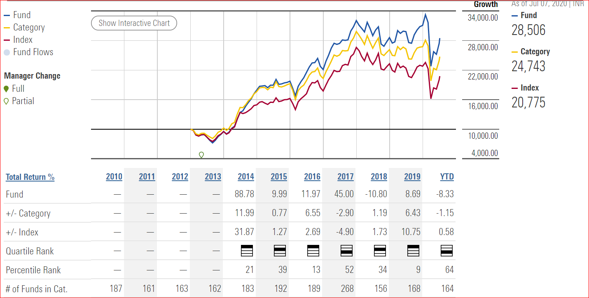

## Table of Contents

## What is a mutual fund and how does it work?

A mutual fund is a type of investment where many people put their money together to buy a variety of stocks, bonds, or other assets. It's like a big basket where everyone's money goes in, and a professional manager decides what to buy and sell. This way, even if you don't have a lot of money, you can still invest in many different things.

When you invest in a mutual fund, you buy shares of the fund. The value of your shares goes up or down based on how well the investments in the fund are doing. If the stocks or bonds in the fund do well, the value of your shares goes up. If they do poorly, the value goes down. You can usually sell your shares whenever you want, but some funds might have rules about when you can take your money out.

## How are annual returns calculated for mutual funds?

Annual returns for mutual funds are calculated by figuring out how much the fund's value has grown or shrunk over a year. You start with the value of the fund at the beginning of the year and compare it to the value at the end of the year. If you add any money to the fund during the year or take some out, you need to take that into account too. The basic idea is to see the percentage change in the fund's value over the year.

Sometimes, people also look at the total return, which includes any money the fund paid out during the year, like dividends or interest. To calculate this, you add the value of those payments to the end-of-year value of the fund before figuring out the percentage change. This gives a fuller picture of how well the fund did over the year, including both the growth in value and any income it generated.

## What is the significance of annual returns in evaluating mutual fund performance?

Annual returns are really important when you want to see how well a mutual fund is doing. They show you how much money the fund made or lost over a year. This helps you compare different funds to see which one might be a better choice for your money. If a fund has high annual returns, it means it did well and grew your money. But if the returns are low or negative, it means the fund didn't do so well and your money might have shrunk.

Looking at annual returns also helps you understand the risk of a fund. Funds with very high returns one year might be taking bigger risks, and those returns might not last. On the other hand, funds with steady but lower returns might be safer. By checking the annual returns over several years, you can get a better idea of how the fund performs over time and decide if it fits with your goals and how much risk you're okay with taking.

## Can you explain the difference between nominal and real returns in mutual funds?

Nominal returns are the basic numbers you see when you look at how much a mutual fund grew in a year. It's the percentage increase or decrease in the value of your investment without taking anything else into account. For example, if you put $100 into a fund and it grows to $110 by the end of the year, the nominal return is 10%. It's like the raw score before any adjustments.

Real returns, on the other hand, give you a more accurate picture by considering inflation. Inflation is when the cost of things goes up over time, which means your money can buy less. To find the real return, you take the nominal return and subtract the rate of inflation. If the nominal return was 10% and inflation was 3%, the real return would be 7%. This number tells you how much your investment really grew in terms of what you can actually buy with that money.

## What are the common benchmarks used to compare mutual fund annual returns?

When people want to see how well a mutual fund is doing, they often compare its annual returns to something called a benchmark. A common benchmark is a stock market index like the S&P 500. This index tracks the performance of 500 big companies in the U.S. If a mutual fund's returns are higher than the S&P 500, it means the fund did better than those big companies on average. Another popular benchmark is the Dow Jones Industrial Average, which looks at 30 big companies. These indexes help investors see if their mutual fund is doing better or worse than the overall market.

For funds that invest in bonds, people might use the Bloomberg Barclays Aggregate Bond Index as a benchmark. This index shows how a big group of U.S. bonds is doing. If a bond fund's returns are higher than this index, it means the fund did better than the average bond. Some funds also use custom benchmarks that are made to match the specific types of investments the fund holds. This helps give a more accurate comparison because it's tailored to what the fund is actually investing in.

## How does the choice of time period affect the analysis of mutual fund annual returns?

The choice of time period can really change how we see a mutual fund's performance. If you look at just one year, you might see a big jump or drop in returns, but that doesn't tell you if the fund is good or bad overall. One year can be a fluke because of something special happening in the market or the economy. That's why it's better to look at returns over several years, like three, five, or even ten years. This longer view helps you see if the fund has been steady or if it's been up and down a lot.

When you look at returns over a longer time, you can also see how the fund does in different kinds of markets. Some funds might do well when the economy is growing but not so well when things are tough. By checking returns over many years, you can see if the fund can handle different situations. This helps you decide if the fund is right for you based on how much risk you want to take and how long you plan to keep your money invested.

## What role do fees and expenses play in the net annual returns of mutual funds?

Fees and expenses are really important when you're looking at the net annual returns of mutual funds. These are costs that come out of your investment, like management fees, which pay the people who run the fund, and other expenses like marketing or administrative costs. When you see the annual return of a fund, that's before these fees are taken out. So, the more fees and expenses there are, the less money you actually get to keep from those returns.

For example, if a fund has a 10% annual return but charges a 1% fee, your net return would be 9%. That might not seem like a big difference, but over many years, those fees can add up and make a big dent in your savings. It's always a good idea to look at the expense ratio of a fund, which tells you how much of your investment goes to fees each year. Picking funds with lower fees can help you keep more of your returns, which means more money in your pocket in the long run.

## How can investors use risk-adjusted return metrics like Sharpe Ratio when analyzing mutual fund annual returns?

Investors can use the Sharpe Ratio to get a better idea of how well a mutual fund is doing by looking at the returns compared to the risk taken to get those returns. The Sharpe Ratio is a number that tells you how much extra return you're getting for each bit of extra risk. To find it, you take the fund's return and subtract a safe return, like what you'd get from a savings account, then divide that by how much the fund's returns jump around, which is called the standard deviation. A higher Sharpe Ratio means the fund is doing a good job of giving you more return without taking on too much extra risk.

Using the Sharpe Ratio helps investors compare different funds more fairly. If one fund has higher returns but also a lot more ups and downs, it might not be as good as a fund with slightly lower returns but much less risk. By looking at the Sharpe Ratio, you can see which fund gives you the best balance of return and risk. This is really helpful when you're trying to pick a fund that fits your own comfort with risk and your investment goals.

## What are the tax implications of mutual fund annual returns?

When you earn money from mutual funds, you have to think about taxes. If your fund pays out dividends or interest, you'll need to pay taxes on that money. Dividends are when the companies the fund owns pay out profits, and interest is what you get from bonds. These payouts are usually taxed as regular income, which means they could be taxed at a higher rate than other types of investment income. If you sell your mutual fund shares for more money than you paid for them, that's called a capital gain, and you'll owe taxes on that too. The tax rate on capital gains depends on how long you held the shares before selling. If you held them for more than a year, it's a long-term capital gain, which usually has a lower tax rate than short-term gains, which are for shares held a year or less.

Some mutual funds are set up to be more tax-friendly. For example, index funds and exchange-traded funds (ETFs) often have lower turnover, which means they buy and sell their holdings less often. This can lead to fewer capital gains distributions, which means less tax for you. Also, if you hold your mutual funds in a tax-advantaged account like an IRA or 401(k), you might not have to pay taxes on the earnings until you take the money out, or in some cases, not at all if it's a Roth account. It's a good idea to talk to a tax advisor to understand how your specific situation might affect your taxes from mutual fund returns.

## How do sector-specific mutual funds' annual returns compare to diversified funds?

Sector-specific mutual funds focus on one part of the economy, like technology or healthcare. Because they only invest in one area, their annual returns can be very different from diversified funds, which spread their money across many different areas. When the sector they focus on does well, sector-specific funds can have much higher returns than diversified funds. But if that sector does poorly, their returns can drop a lot more too. This means they can be riskier but also have the chance for bigger rewards.

Diversified funds, on the other hand, try to balance out the ups and downs by investing in many different sectors. This can lead to more steady annual returns because if one sector does badly, the others might do better and help keep the overall return from dropping too much. Because of this, diversified funds usually don't have the super high returns that sector-specific funds can have during good times, but they also don't fall as hard during bad times. So, if you want to play it safer, diversified funds might be a better choice, while sector-specific funds could be good if you're okay with more risk and want to try to catch big wins in a particular part of the market.

## What advanced statistical methods can be used to predict future mutual fund annual returns?

To predict future mutual fund annual returns, experts often use a method called time series analysis. This method looks at past returns of the fund to find patterns and trends. By understanding these patterns, they can make educated guesses about what might happen next. For example, they might use something called ARIMA models, which stand for AutoRegressive Integrated Moving Average. These models help figure out how past returns affect future ones and can even account for things like seasonality or sudden changes in the market.

Another advanced method is regression analysis, which looks at how different factors might affect a mutual fund's returns. These factors could be things like the overall stock market performance, interest rates, or even the economy's health. By seeing how these factors have influenced returns in the past, experts can build a model to predict how they might affect returns in the future. For instance, they might use multiple regression to see how several factors together impact the fund's performance. While these methods can be helpful, it's important to remember that predicting the future is tricky, and there's always some uncertainty involved.

## How do global economic factors influence the annual returns of international mutual funds?

Global economic factors play a big role in the annual returns of international mutual funds. These funds invest in companies from different countries, so what happens in those countries' economies can affect the fund's performance. For example, if a country's economy is growing fast, the companies there might do well, which could boost the returns of the mutual fund. On the other hand, if a country is going through a tough time, like a recession, the companies might struggle, and the fund's returns could go down. Things like interest rates, inflation, and currency exchange rates also matter. If a country raises its interest rates, it might slow down its economy, which could hurt the fund's returns. If the currency of a country where the fund invests gets weaker, it could mean less money for investors when they convert their earnings back to their home currency.

Another important [factor](/wiki/factor-investing) is how different countries' economies are connected. If one big economy, like the U.S., has problems, it can affect other countries too. This is called a global economic ripple effect. For example, if the U.S. economy slows down, it might buy fewer goods from other countries, which could hurt those countries' economies and the companies in them. This, in turn, could lower the returns of an international mutual fund that invests in those countries. Also, global events like trade wars or pandemics can shake up economies worldwide, making it harder to predict and manage the returns of international mutual funds. Keeping an eye on these global factors can help investors understand why their fund is doing well or poorly and make better decisions about where to put their money.

## What is the difference between Annual Returns and Annualized Returns?

Understanding the distinction between annual returns and annualized returns is crucial for evaluating investment performance, particularly in mutual funds. These metrics provide investors different perspectives on investment growth and help assess fund performance accurately over varying timeframes.

### Annual Return Calculation and Its Use

The annual return represents the percentage gain or loss of an investment over a one-year period. It is calculated by taking the net profit (or loss) during that period and dividing it by the initial investment amount. The formula for annual return is:

$$
\text{Annual Return} = \left( \frac{\text{Ending Value} - \text{Starting Value}}{\text{Starting Value}} \right) \times 100
$$

For example, if an investor put $1,000 into a mutual fund and the investment grew to $1,100 by the end of the year, the annual return would be:

$$
\text{Annual Return} = \left( \frac{1100 - 1000}{1000} \right) \times 100 = 10\%
$$

Annual returns are useful for assessing year-by-year performance and comparing it with other investments over the same period. However, they may not adequately capture the compounding effects over multiple years.

### Description of Annualized Returns

Annualized returns help investors understand the average yearly growth rate of an investment over a period longer than one year. This metric provides a more comprehensive view by factoring in the effects of compounding, offering a better sense of how investments grow over time. The formula for annualized return is:

$$
\text{Annualized Return} = \left( \left( \frac{\text{Ending Value}}{\text{Starting Value}} \right)^{\frac{1}{n}} - 1 \right) \times 100
$$

where $n$ is the number of years the investment is held.

For example, if a $1,000 investment grows to $1,331 over three years, the annualized return would be calculated as:

$$
\text{Annualized Return} = \left( \left( \frac{1331}{1000} \right)^{\frac{1}{3}} - 1 \right) \times 100 \approx 10\%
$$

Annualized returns provide a long-term perspective, smoothing out year-to-year [volatility](/wiki/volatility-trading-strategies) and allowing investors to compare investments of different durations effectively.

### Comparison and When to Use Each Metric

Annual returns are helpful for short-term assessments and when comparing similarly-timed investments. They're straightforward, showing the performance for a specific year, but they ignore compounding effects. On the other hand, annualized returns offer a long-term performance measure, crucial for evaluating investments held over multiple years when the compounding impact significantly affects growth.

Consider using annual returns when:
- Evaluating single-year performance.
- Comparing investments with identical time frames.

Opt for annualized returns when:
- Analysing investments over multiple years.
- Comparing investments with different time horizons.

### Examples of Calculation

**Annual Return Example:**
Suppose an investment grew from $2,000 to $2,400 in one year. The calculation would be:

$$
\text{Annual Return} = \left( \frac{2400 - 2000}{2000} \right) \times 100 = 20\%
$$

**Annualized Return Example:**
For the same investment growing to $3,000 over five years, the calculation is:

$$
\text{Annualized Return} = \left( \left( \frac{3000}{2000} \right)^{\frac{1}{5}} - 1 \right) \times 100 \approx 8.45\%
$$

These examples illustrate the significant difference between evaluating performance on a per annum basis versus understanding average growth when considering compounding over several periods.

## References & Further Reading

[1]: Fabozzi, F. J., Gupta, F., & Markowitz, H. M. (2002). ["The Legacy of Modern Portfolio Theory."](https://www.semanticscholar.org/paper/The-Legacy-of-Modern-Portfolio-Theory-Fabozzi-Gupta/6619eebc6957d7c101112a041942c4df61783616) Financial Analysts Journal, 58(6), 4-9.

[2]: Carhart, M. M. (1997). ["On Persistence in Mutual Fund Performance."](https://onlinelibrary.wiley.com/doi/full/10.1111/j.1540-6261.1997.tb03808.x) The Journal of Finance, 52(1), 57-82.

[3]: Jegadeesh, N., & Titman, S. (1993). ["Returns to Buying Winners and Selling Losers: Implications for Stock Market Efficiency."](https://www.bauer.uh.edu/rsusmel/phd/jegadeesh-titman93.pdf) The Journal of Finance, 48(1), 65-91.

[4]: Lo, A. W., & MacKinlay, A. C. (1990). ["When Are Contrarian Profits Due to Stock Market Overreaction?"](https://www.jstor.org/stable/2962020) The Review of Financial Studies, 3(2), 175-205.

[5]: Pardo, R. (2011). ["The Evaluation and Optimization of Trading Strategies,"](https://onlinelibrary.wiley.com/doi/book/10.1002/9781119196969) 2nd Edition. Wiley Trading. 

[6]: Barber, B. M., & Odean, T. (2000). ["Trading Is Hazardous to Your Wealth: The Common Stock Investment Performance of Individual Investors."](https://faculty.haas.berkeley.edu/odean/Papers%20current%20versions/Individual_Investor_Performance_Final.pdf) The Journal of Finance, 55(2), 773-806.

[7]: Fama, E. F., & French, K. R. (1993). ["Common Risk Factors in the Returns on Stocks and Bonds."](https://www.sciencedirect.com/science/article/pii/0304405X93900235) Journal of Financial Economics, 33(1), 3-56.