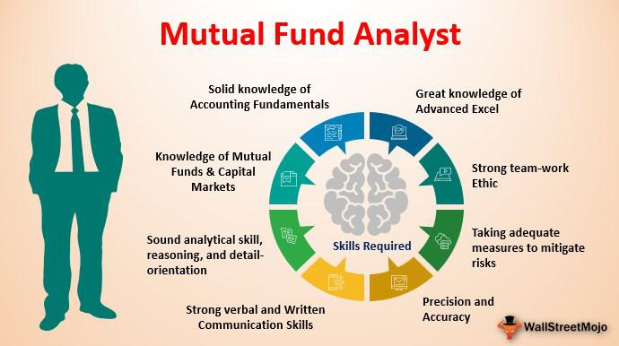

The financial landscape is undergoing significant transformation driven by technological advancements and the emergence of innovative investment strategies. Among the game-changing elements shaping this new era are mutual funds, diverse investment terminologies, and the application of algorithmic trading—all of which play pivotal roles in portfolio management.

Mutual funds have long been a staple of investment portfolios, providing a means for investors to achieve diversification and professional management of their assets. These funds aggregate capital from multiple investors to purchase a portfolio of various securities, aiming to minimize risk while potentially maximizing returns. As the range of mutual funds expands, each tailored to different risk appetites and investment objectives, they represent a crucial component of modern investment strategies.



At the same time, understanding investment terminology becomes increasingly vital as investors navigate the complex world of financial instruments. Terms such as equity income, growth funds, and market capitalization are not mere jargon; they are essential tools that help individuals make informed decisions aligned with their investment goals and risk tolerance. Mastery of this lexicon enables investors to evaluate options with a critical eye, optimizing their portfolios in accordance with personal financial aspirations.

Meanwhile, algorithmic trading represents a paradigm shift in how trades are executed within financial markets. By employing sophisticated algorithms and computer programs to carry out trades based on predetermined criteria, algorithmic trading increases the speed and efficiency of transactions while reducing human errors. Additionally, it enhances market liquidity and enables the strategic allocation of assets in response to dynamic market conditions.

This article explores the complex interplay of mutual funds, investment terminology, and algorithmic trading, highlighting how these elements converge to influence modern investing. By understanding their roles and intersections, investors can capitalize on the unique advantages they offer, ultimately refining their portfolio management strategies in a rapidly evolving financial ecosystem.

## Table of Contents

## Understanding Mutual Funds

Mutual funds are investment vehicles that pool money from numerous investors to purchase a diversified array of securities, which can include stocks, bonds, and other financial instruments. These funds are managed by professional portfolio managers who allocate the fund's assets to achieve specific investment objectives. The primary advantage of mutual funds lies in their ability to offer investors a level of diversification that would be difficult to achieve individually, thereby spreading risk across a wide range of assets.

Diversification is a fundamental concept in investing that involves spreading investments across various financial instruments to reduce exposure to any single asset or risk. By holding a mix of asset classes, mutual funds minimize the impact of individual asset [volatility](/wiki/volatility-trading-strategies) on the overall portfolio. This is particularly advantageous for investors seeking to balance potential returns with risk mitigation.

Different types of mutual funds are designed to suit varying risk tolerances and investment goals. Broadly, these are categorized into stock, bond, and balanced funds, each serving distinct investor needs:

1. **Stock Funds**: These funds primarily invest in stocks and are suitable for investors with a higher risk tolerance seeking potential capital appreciation. Stock funds are further classified into subcategories, such as growth funds, which focus on companies expected to grow at an above-average rate, and value funds, which aim to find undervalued stocks.

2. **Bond Funds**: Also known as fixed-income funds, bond funds invest in bonds and other debt securities. They are generally less volatile than stock funds and are preferred by investors looking for consistent income streams. Bond funds can be further segmented based on the credit quality of bonds, such as investment-grade or high-yield, and duration, such as short-term or long-term bonds.

3. **Balanced Funds**: These funds, also known as hybrid funds, combine investments in both stocks and bonds. They aim to provide investors with capital appreciation and income, while also maintaining a moderate risk level. Balanced funds are often recommended for investors with a moderate risk appetite or those seeking a single fund that offers both growth and income potential.

The formulation of an investment strategy within each type of mutual fund is guided by its specific objectives, which are usually outlined in the fund's prospectus. This document serves as a critical resource for investors to understand the fund's strategies, performance potential, and associated risks. Investing in mutual funds provides an accessible way for individual investors to participate in a professionally managed, diversified portfolio, aligned with their financial goals and risk preferences.

## Importance of Fund Names

Fund names play a critical role in providing investors with an initial understanding of the investment strategy and objectives of a particular fund. They often reflect key aspects of the fund's portfolio, such as the asset classes it invests in or geographical focus areas, thereby offering a glimpse into the fund's potential risk and return profile.

To safeguard investors, the U.S. Securities and Exchange Commission (SEC) mandates that funds must allocate at least 80% of their assets in accordance with the investment type suggested by their names. This regulation, commonly referred to as the "Names Rule," aims to ensure that fund names are not misleading and accurately reflect the fund's primary investment pursuits. For instance, a mutual fund named "Tech Growth Fund" must invest predominantly in growth-oriented technology stocks to comply with this rule.

Misleading fund names can have significant implications for investors' decision-making processes and the potential returns of their investments. If a fund's name doesn't accurately convey its investment focus, investors may form incorrect assumptions about its risk level, potential for return, and fit with their own investment strategies. For example, an investor seeking low-risk investments might mistakenly invest in a fund with "bond" in its name, only to realize later that the fund primarily contains high-yield, high-risk assets not aligned with traditional bond investments.

Accurate fund naming is essential not only for maintaining investor trust but also for ensuring efficient market operations, as clear and precise names reduce the likelihood of misallocation of capital. Consequently, investors are encouraged to look beyond the fund name and perform due diligence by reviewing the fund's prospectus and other related documents to obtain a comprehensive understanding of the fund's objectives, strategies, and asset allocations before making investment decisions.

## Investment Terminology in Mutual Funds

Understanding key investment terms in mutual funds is essential for making informed decisions that align with one's financial goals and risk tolerance. Several fundamental terms must be grasped to evaluate mutual funds properly.

**Equity Income** refers to funds that primarily invest in high-dividend-paying stocks. These funds aim to provide a steady income stream, appealing to conservative investors seeking regular income alongside potential capital appreciation. By focusing on companies with solid dividend histories, equity income funds help mitigate the volatility generally associated with equities.

**Growth Funds** focus on capital appreciation by investing in companies expected to experience significant earnings growth. These funds typically invest in younger companies poised for expansion or established firms reinvesting their earnings for growth. While growth funds can offer substantial returns, they inherently carry higher risk due to their focus on companies with more uncertain futures.

**Market Capitalization** is another critical term, referring to the total market value of a company's outstanding shares. It is calculated as:

$$
\text{Market Capitalization} = \text{Share Price} \times \text{Number of Outstanding Shares}
$$

Mutual funds may be categorized by the market capitalization of the stocks they hold, such as large-cap, mid-cap, or small-cap funds. Each category presents different risk-return profiles; large-cap funds are generally less volatile than small-cap funds, which offer higher growth potential but [carry](/wiki/carry-trading) more risk.

These investment terms serve as important indicators for investors analyzing mutual fund options. By understanding the distinctions between equity income, growth funds, and market capitalization, investors can better align their investments with personal financial objectives and risk appetites.

## Role of the Mutual Fund Prospectus

A mutual fund prospectus is a foundational document required for any mutual fund offering. Its primary purpose is to provide potential investors with comprehensive information necessary for making informed investment decisions. The prospectus outlines several critical elements, such as the investment objectives, strategies pursued by the fund, the management team overseeing the fund, and the risks associated with investing in it.

The investment objectives section of the prospectus articulates the primary goals the fund aims to achieve. This could range from capital appreciation, preservation of capital, to generating regular income, depending on the type of fund. By comprehending these objectives, investors can determine if a particular fund aligns with their financial goals.

Strategic information details the methods and approaches the fund manager employs to meet its objectives. This can include information about asset allocation, investment in particular sectors or regions, and the use of derivatives for hedging purposes. Understanding these strategies is crucial for investors to gauge how the fund intends to navigate market conditions.

An evaluation of the management team is another vital component included in the prospectus. This section provides insights into the experience, tenure, and track record of the individuals responsible for managing the fund's investments. The expertise and historical performance of the management team can significantly influence the success of an investment.

The prospectus also addresses the risks involved. It highlights market, credit, and [liquidity](/wiki/liquidity-risk-premium) risks, among others, giving investors a holistic view of what they may encounter. Proper assessment of these risks enables investors to align their risk tolerance with potential investments, ensuring that their financial portfolio can withstand market fluctuations.

For investors, reviewing the prospectus is an essential part of due diligence prior to investing in a mutual fund. It ensures transparency and aligns investor expectations with the fund's capabilities and objectives. Having a thorough understanding of the information presented in the prospectus can help mitigate the chances of unexpected outcomes during the investment period.

## Basics of Algorithmic Trading

Algorithmic trading utilizes computer programs to execute trades automatically, adhering to pre-established criteria. This approach capitalizes on the inherent speed and precision of computers to perform high-frequency trades and respond rapidly to market conditions, reducing the potential for human error. By automating the trading process, [algorithmic trading](/wiki/algorithmic-trading) can also enhance market liquidity and efficiency.

One of the key benefits of algorithmic trading is its ability to process vast amounts of data and execute orders at a pace unattainable by human traders. This speed allows for the exploitation of minor price discrepancies, often fundamental to strategies such as [arbitrage](/wiki/arbitrage). Arbitrage involves buying and selling the same asset in different markets to profit from price differentials, requiring swift execution to capitalize on fleeting opportunities.

Another prevalent strategy in algorithmic trading is trend-following, which involves algorithms identifying and acting upon trends in market prices. These algorithms apply technical analysis to detect patterns and make trading decisions based on historical data, aiming to capture gains from persistent market movements.

Index fund rebalancing is another area where algorithmic trading plays a significant role. Algorithms can automatically adjust the composition of a fund’s holdings to align with changes in the underlying index, maintaining the fund’s investment objective with minimal manual intervention. For example, a Python script might be developed to rebalance a portfolio, using libraries like numpy and pandas to process data and execute trades based on predefined rules:

```python
import numpy as np
import pandas as pd

def rebalance_portfolio(portfolio, target_weights, prices):
    # Calculate current value of each asset
    current_values = portfolio * prices
    total_value = current_values.sum()

    # Calculate target value of each asset
    target_values = total_value * target_weights

    # Determine the required trades
    trades = (target_values - current_values) / prices

    # Execute trades
    portfolio += trades
    return portfolio

# Example usage
portfolio = np.array([50, 100, 150])  # Number of shares for 3 assets
target_weights = np.array([0.3, 0.5, 0.2])
prices = np.array([10, 20, 30])   # Current prices for 3 assets

new_portfolio = rebalance_portfolio(portfolio, target_weights, prices)
```

Algorithmic trading's advantages make it an integral component of modern portfolio management, increasingly adopted by hedge funds, institutional trading desks, and individual traders seeking to enhance their market strategies.

## Integrating Mutual Funds with Algo Trading

Algorithmic trading offers significant enhancements to mutual fund management, chiefly by improving the efficiency and timing of trades. By employing algorithms, fund managers can execute trades with precision that surpasses human capabilities. Algorithms are designed to parse vast amounts of market data in real-time, enabling rapid decision-making aligned with predetermined investment criteria. This not only allows for more precise entry and [exit](/wiki/exit-strategy) points but also minimizes the market impact of large orders.

One of the key applications of algorithmic trading in mutual funds is optimizing portfolio allocation. Modern algorithms can analyze numerous financial indicators and adjust asset allocations dynamically. This adaptability is crucial, particularly in volatile markets, where timely reallocating assets can significantly affect a fund's performance. For instance, if a mutual fund is heavily invested in technology stocks and market indicators suggest a looming correction in the tech sector, an algorithm can quickly reduce exposure to these stocks and reallocate funds to more stable sectors like utilities or consumer staples.

Moreover, data-driven insights play a central role in informing fund managers' strategies. Algorithms can be designed to track and analyze patterns, such as moving averages and [momentum](/wiki/momentum) indicators, thus identifying profitable trading opportunities. This systematic approach helps in mitigating risks inherent in manual trading, which is often influenced by emotional and subjective biases.

To illustrate how algorithms enhance mutual fund management, consider the following simple example in Python that demonstrates a basic moving average crossover strategy, a popular technique in algorithmic trading:

```python
import pandas as pd
import numpy as np

# Sample data: stock prices
stock_data = pd.DataFrame({
    'Date': pd.date_range(start='2023-01-01', periods=100, freq='D'),
    'Price': np.random.normal(loc=100, scale=10, size=100) # generate some random prices
})

# Calculate moving averages
stock_data['Short_MA'] = stock_data['Price'].rolling(window=10).mean()
stock_data['Long_MA'] = stock_data['Price'].rolling(window=50).mean()

# Signal generation
stock_data['Signal'] = 0
stock_data.loc[stock_data['Short_MA'] > stock_data['Long_MA'], 'Signal'] = 1
stock_data.loc[stock_data['Short_MA'] < stock_data['Long_MA'], 'Signal'] = -1

# Print the signals
print(stock_data[['Date', 'Price', 'Short_MA', 'Long_MA', 'Signal']].tail())
```

In this example, a short-term moving average (Short_MA) crosses above a long-term moving average (Long_MA), generating a buy signal, and vice versa for a sell signal. By implementing such strategies, mutual funds can remain agile.

While algorithmic trading introduces powerful tools for enhancing mutual fund management, it demands careful consideration of various factors such as system reliability and market regulations. Algorithms must be robust enough to handle volatility without succumbing to errant trades that can occur due to rapid changes in market conditions. Despite these challenges, the integration of algorithms offers immense potential by allowing for more dynamic and informed portfolio management.

## Challenges and Considerations

Algorithmic trading, while offering advantages such as speed and precision, comes with its own set of challenges that investors and fund managers must address to ensure optimal performance. System failures can occur due to software bugs, hardware malfunctions, or network disruptions, potentially leading to substantial financial losses. To mitigate these risks, implementing a robust technological infrastructure is essential. This involves regular system maintenance, employing reliable hardware, and ensuring efficient data transmission channels.

Latency, or the delay between order initiation and execution, is another critical concern in algorithmic trading. High-frequency trading strategies, which depend on executing a large number of trades within milliseconds, are particularly susceptible to latency issues. To minimize latency, traders often position their servers close to the exchange servers, a practice known as co-location, and utilize high-speed connections to reduce transmission time.

Regulatory compliance is a significant consideration in algorithmic trading, as the financial industry is subject to strict regulations designed to ensure market integrity and protect investors. Regulatory bodies such as the U.S. Securities and Exchange Commission (SEC) and the Financial Industry Regulatory Authority (FINRA) require traders to adhere to specific guidelines concerning trading transparency, reporting, and risk management. Non-compliance can result in hefty fines and legal consequences, making it imperative for traders to stay informed about relevant regulations and ensure their trading practices are in line with legal standards.

Continuous monitoring and [backtesting](/wiki/backtesting) are vital processes in adapting to ever-changing market conditions and maintaining the effectiveness of trading algorithms. Monitoring involves real-time observation of algorithm performance to detect anomalies or irregularities, while backtesting allows traders to evaluate their strategies against historical market data to assess potential risks and returns. This process helps in refining algorithms, enhancing their predictive accuracy, and ensuring they remain aligned with investment goals.

In conclusion, while algorithmic trading provides numerous benefits, it requires careful management of technological infrastructure, latency issues, and regulatory compliance. By maintaining vigilant oversight and continually refining trading strategies, investors can better navigate the challenges associated with this advanced form of trading.

## Conclusion

The fusion of mutual funds and algorithmic trading presents strategic benefits for portfolio management. This synergy allows investors to harness the diversification and professional management offered by mutual funds while capitalizing on the speed and efficiency of algorithmic trading.

By integrating these two approaches, investors can enhance their portfolio's performance. Algorithmic trading enables precise execution of trades, optimizing entry and exit points and thus potentially improving returns. Mutual funds provide a structured investment vehicle that amalgamates resources from multiple investors, allowing for a diversified investment strategy across various asset classes.

Nonetheless, leveraging these tools requires cognizance of inherent challenges. Algorithmic trading, although advantageous, poses risks such as system failures and the need for regulatory compliance. As algorithms become more complex, they require robust technological infrastructure to prevent latency and ensure accurate execution. Moreover, regulatory environments continue to evolve, necessitating vigilance to remain compliant. 

Investors must continuously monitor and adapt their strategies to maintain alignment with market conditions and regulatory requirements. Regular backtesting of algorithms helps in calibrating models to reflect real-time market dynamics, ensuring the algorithms remain effective. 

Being informed and adaptable is crucial in managing risks while maximizing returns in this rapidly evolving financial landscape. As technological advancements continue to shape investment strategies, the successful investor will be one who can adeptly navigate these changes and make informed decisions grounded in both data-driven insights and sound investment principles.

## References & Further Reading

[1]: ["Advances in Financial Machine Learning"](https://www.amazon.com/Advances-Financial-Machine-Learning-Marcos/dp/1119482089) by Marcos Lopez de Prado

[2]: ["Quantitative Trading: How to Build Your Own Algorithmic Trading Business"](https://github.com/LucindaYa/quant-resources/blob/master/Quantitative%20Trading%20How%20to%20Build%20Your%20Own%20Algorithmic%20Trading%20Business.pdf) by Ernest P. Chan

[3]: ["Evidence-Based Technical Analysis: Applying the Scientific Method and Statistical Inference to Trading Signals"](https://www.amazon.com/Evidence-Based-Technical-Analysis-Scientific-Statistical/dp/0470008741) by David Aronson

[4]: ["Machine Learning for Algorithmic Trading"](https://github.com/stefan-jansen/machine-learning-for-trading) by Stefan Jansen

[5]: U.S. Securities and Exchange Commission. ["Invest Wisely: An Introduction to Mutual Funds"](https://www.sec.gov/about/reports-publications/investorpubsbeginmutualhtm)