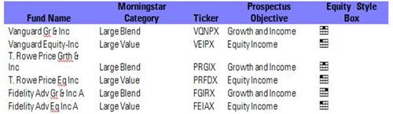

## Table of Contents

## What is a mutual fund?

A mutual fund is a type of investment where many people pool their money together to buy a variety of stocks, bonds, or other assets. This is managed by a professional who makes decisions about what to buy and sell. By investing in a mutual fund, you own a small piece of each investment in the fund, which helps spread out the risk.

Mutual funds are popular because they allow people to invest in a diversified portfolio without needing a lot of money or knowledge about the stock market. Instead of buying individual stocks or bonds, you can invest in a fund that holds many different investments. This can make investing easier and less risky for people who don't want to manage their investments themselves.

## Why are naming conventions important in mutual funds?

Naming conventions are important in mutual funds because they help investors quickly understand what the fund is about. When a mutual fund has a clear and descriptive name, it tells investors what kind of investments the fund holds, like stocks, bonds, or a mix of both. For example, a fund named "Global Equity Fund" suggests it invests in stocks from around the world. This makes it easier for investors to choose funds that match their investment goals without having to read through long descriptions.

Additionally, consistent naming helps investors compare different funds more easily. If all funds that focus on technology stocks use similar names, like "Tech Growth Fund" or "Technology Equity Fund," investors can quickly identify and compare these funds. This can save time and help investors make better choices. Without clear naming conventions, it would be harder to understand what each fund does, making the investment process more confusing and time-consuming.

## What are the common elements found in mutual fund names?

Mutual fund names often include words that tell you what kind of investments the fund holds. You might see words like "Equity" if the fund invests in stocks, "Bond" or "Fixed Income" if it invests in bonds, and "Balanced" or "Hybrid" if it has a mix of stocks and bonds. Sometimes, the name will also mention the part of the world where the investments come from, like "Global," "International," or "Emerging Markets." This helps investors know if the fund focuses on one country or many countries.

Another common element in mutual fund names is the investment strategy or focus. For example, a fund might be called "Growth" if it aims to invest in companies that are expected to grow quickly, or "Value" if it looks for companies that are thought to be underpriced. Some funds might also use words like "Index" if they try to match the performance of a specific market index, or "Sector" if they focus on a particular industry, like technology or healthcare. These parts of the name give investors a quick idea of what the fund is trying to achieve.

Lastly, mutual fund names can include the name of the company that manages the fund, like "Fidelity" or "Vanguard." This helps investors know who is in charge of making the investment decisions. Sometimes, the name might also mention the level of risk or the target audience, such as "Aggressive" for high-risk funds or "Retirement" for funds aimed at people saving for their future. All these elements together make it easier for investors to understand what a mutual fund does and whether it fits their investment goals.

## How do mutual fund names reflect their investment strategy?

Mutual fund names often tell you about their investment strategy by using specific words. For example, if a fund is called "Growth Fund," it means the fund aims to invest in companies that are expected to grow quickly. If you see "Value Fund" in the name, it means the fund looks for companies that are thought to be underpriced and a good deal. Words like "Index" in a fund's name mean it tries to match the performance of a specific market index, like the S&P 500. This helps investors pick funds that match what they want to achieve with their money.

Some mutual fund names also show if they focus on a particular part of the world or a specific industry. A fund named "Global Equity Fund" tells you it invests in stocks from around the world, while "Emerging Markets Fund" focuses on countries that are still developing their economies. If the name includes "Sector" and a specific industry, like "Technology Sector Fund," it means the fund invests mainly in tech companies. By using these words in their names, mutual funds make it easier for people to understand where their money will be invested and what kind of strategy the fund will use.

## What role do asset classes play in mutual fund naming?

Asset classes are important in mutual fund names because they tell you what kind of investments the fund has. When you see words like "Equity" in a fund's name, it means the fund invests in stocks. If a fund is called a "Bond Fund," it means it invests in bonds. Sometimes, a fund might be called a "Balanced Fund" or "Hybrid Fund," which means it has a mix of stocks and bonds. This helps people know right away if the fund is focused on one type of investment or a mix.

Knowing the asset class from the fund's name helps people choose funds that match what they want to do with their money. If someone wants to invest in the stock market, they would look for funds with "Equity" in the name. If they want something safer, they might pick a "Bond Fund." By using these words in their names, mutual funds make it easier for people to understand what they are investing in and pick the right fund for their goals.

## How can geographic focus be identified in a mutual fund's name?

You can tell where a mutual fund invests by looking at the words in its name. If you see "Global" or "World" in the name, it means the fund invests in companies all around the world. If the name has "International," it usually means the fund invests in countries outside of the one where the fund is based, like the U.S. for American funds.

Sometimes, a fund's name will be more specific about the region or country it focuses on. For example, "Emerging Markets Fund" means the fund invests in countries that are still growing their economies, like Brazil or India. If you see "Europe Fund" or "Asia Fund," it tells you the fund invests in companies in those specific parts of the world. This helps people pick funds that match where they want to invest their money.

## What do terms like 'growth', 'value', and 'blend' signify in mutual fund names?

When you see 'growth' in a mutual fund's name, it means the fund is looking to invest in companies that are expected to grow quickly. These companies might not pay big dividends, but their stock prices could go up a lot over time. A 'growth' fund is for people who want to take a bit more risk for the chance of bigger returns.

'Value' in a fund's name means it's looking for companies that are thought to be a good deal. These companies might be underpriced because people aren't paying attention to them, but the fund thinks they're worth more than their current price. A 'value' fund is for people who want to find bargains in the stock market and are willing to wait for the price to go up.

Sometimes, a fund's name will have 'blend' in it. This means the fund mixes both growth and value strategies. It invests in some companies that are expected to grow and others that are seen as good deals. A 'blend' fund is for people who want a bit of both worlds and don't want to focus on just one strategy.

## How do mutual fund names indicate risk levels?

Mutual fund names can give you hints about how risky they are. If you see words like "Aggressive" or "High Growth" in the name, it means the fund is willing to take bigger risks to try and get bigger returns. These funds might invest in new or smaller companies that could grow a lot, but they could also lose money. On the other hand, if the name has "Conservative" or "Income" in it, the fund is trying to be safer. These funds might invest in bigger, more stable companies or in bonds, which usually don't go up or down as much as stocks.

Some mutual fund names also use words like "Balanced" or "Moderate" to show they're trying to find a middle ground. These funds mix riskier investments with safer ones to try and keep things steady. By looking at these words in the fund's name, you can get a quick idea of how much risk you might be taking with your money. This helps you pick a fund that matches how much risk you're comfortable with.

## What are the regulatory requirements for naming mutual funds?

There are rules that mutual funds have to follow when they pick their names. These rules come from places like the U.S. Securities and Exchange Commission (SEC). The main rule is that a mutual fund's name has to be honest and not trick people. For example, if a fund says it's a "Global Equity Fund," it has to really invest in stocks from around the world. If it doesn't, it could be breaking the rules.

Another rule is that if a fund uses certain words in its name, like "growth" or "value," it has to mostly stick to that kind of investment strategy. This helps people understand what they're investing in. The SEC also makes sure that fund names don't make it sound like the fund is safer or will make more money than it really will. This way, people can trust that the fund's name tells them the truth about what the fund does.

## How do fund managers use naming conventions to attract investors?

Fund managers use naming conventions to make their mutual funds sound appealing and easy to understand for investors. They pick names that clearly show what the fund invests in, like "Global Equity Fund" for a fund that invests in stocks from around the world. This helps people quickly see if the fund matches what they want to invest in. For example, if someone is looking to invest in tech companies, a fund named "Technology Sector Fund" would catch their eye. By using simple and descriptive words, fund managers make it easier for people to choose the right fund for their goals.

Sometimes, fund managers use words that suggest the fund might be a good choice for certain kinds of investors. For example, a fund named "Retirement Income Fund" would attract people who are saving for their future. Words like "Growth" or "Value" can also draw in investors who have specific investment strategies in mind. By choosing names that sound appealing and match what investors are looking for, fund managers can make their funds more attractive and stand out in a crowded market.

## What are the potential pitfalls of relying solely on a mutual fund's name for investment decisions?

Relying only on a mutual fund's name to make investment decisions can be risky. The name might not tell you everything about the fund. For example, a fund called "Global Equity Fund" might sound like it invests in stocks from all over the world, but it might focus more on just a few countries. Also, the name might not show you important details like how much the fund charges in fees or how well it has done in the past. These things can really affect how good an investment the fund is.

Another problem is that the name might make the fund sound better or safer than it really is. Words like "Growth" or "Income" can sound good, but they don't tell you if the fund will actually grow or give you income. You need to look at more than just the name to understand if the fund fits your goals and how much risk you're okay with. So, while the name can give you a quick idea, it's important to do more research before deciding to invest.

## How have mutual fund naming conventions evolved over time, and what trends can we observe?

Over time, mutual fund naming conventions have changed to be clearer and more helpful for investors. In the past, fund names were often simple and didn't give much information. They might just say something like "Fund A" or "Fund B." But as more people started investing, fund companies realized they needed to use names that told people more about what the fund did. So, they started adding words like "Equity," "Bond," "Growth," and "Value" to show what kind of investments the fund held and what its strategy was. This made it easier for people to pick funds that matched what they wanted.

Today, we see a few big trends in how mutual funds are named. One trend is using more specific words to show where the fund invests, like "Emerging Markets" or "Europe." This helps people who want to invest in certain parts of the world. Another trend is using words that show how risky the fund is, like "Aggressive" or "Conservative." This helps people pick funds that fit how much risk they're okay with. Overall, mutual fund names have become more detailed and helpful, making it easier for people to understand what they're investing in.

## What is the terminology used in mutual funds investments?

Understanding key investment terms in mutual funds is essential for making informed decisions that align with one's financial goals and risk tolerance. Several fundamental terms must be grasped to evaluate mutual funds properly.

**Equity Income** refers to funds that primarily invest in high-dividend-paying stocks. These funds aim to provide a steady income stream, appealing to conservative investors seeking regular income alongside potential capital appreciation. By focusing on companies with solid dividend histories, equity income funds help mitigate the volatility generally associated with equities.

**Growth Funds** focus on capital appreciation by investing in companies expected to experience significant earnings growth. These funds typically invest in younger companies poised for expansion or established firms reinvesting their earnings for growth. While growth funds can offer substantial returns, they inherently carry higher risk due to their focus on companies with more uncertain futures.

**Market Capitalization** is another critical term, referring to the total market value of a company's outstanding shares. It is calculated as:

$$
\text{Market Capitalization} = \text{Share Price} \times \text{Number of Outstanding Shares}
$$

Mutual funds may be categorized by the market capitalization of the stocks they hold, such as large-cap, mid-cap, or small-cap funds. Each category presents different risk-return profiles; large-cap funds are generally less volatile than small-cap funds, which offer higher growth potential but [carry](/wiki/carry-trading) more risk.

These investment terms serve as important indicators for investors analyzing mutual fund options. By understanding the distinctions between equity income, growth funds, and market capitalization, investors can better align their investments with personal financial objectives and risk appetites.

## References & Further Reading

[1]: ["Advances in Financial Machine Learning"](https://www.amazon.com/Advances-Financial-Machine-Learning-Marcos/dp/1119482089) by Marcos Lopez de Prado

[2]: ["Quantitative Trading: How to Build Your Own Algorithmic Trading Business"](https://github.com/LucindaYa/quant-resources/blob/master/Quantitative%20Trading%20How%20to%20Build%20Your%20Own%20Algorithmic%20Trading%20Business.pdf) by Ernest P. Chan

[3]: ["Evidence-Based Technical Analysis: Applying the Scientific Method and Statistical Inference to Trading Signals"](https://www.amazon.com/Evidence-Based-Technical-Analysis-Scientific-Statistical/dp/0470008741) by David Aronson

[4]: ["Machine Learning for Algorithmic Trading"](https://github.com/stefan-jansen/machine-learning-for-trading) by Stefan Jansen

[5]: U.S. Securities and Exchange Commission. ["Invest Wisely: An Introduction to Mutual Funds"](https://www.sec.gov/about/reports-publications/investorpubsbeginmutualhtm)