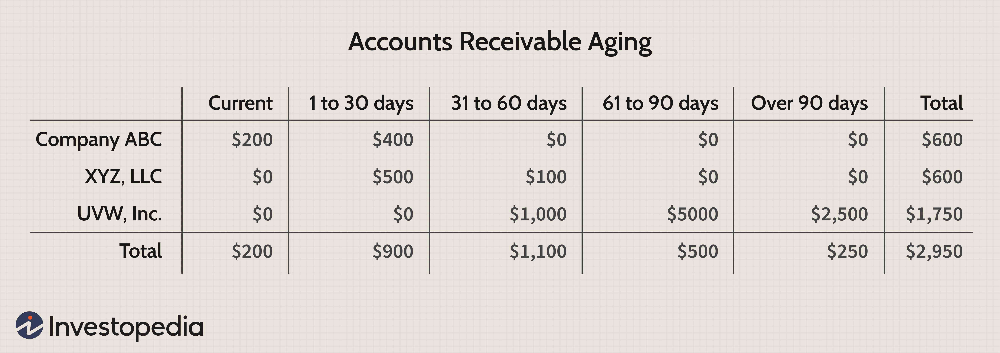

Accounts Receivable (AR) is a crucial element of a company's financial architecture, serving as a critical indicator of a firm's financial health. It comprises unpaid invoices that a company expects to collect from clients who've purchased goods or services on credit. The management of AR directly influences a company's liquidity levels and operational efficiency, as it encompasses crucial tasks such as timely issuance of invoices, diligent follow-up on outstanding debts, and the implementation of stringent credit controls to mitigate financial risk. 

With the progression of technology, there has been a significant shift in how businesses manage their financial strategies. Specifically, algorithmic trading and financial analysis have emerged as transformative tools in optimizing these strategies, extending their utility to include the management of accounts receivable. Algorithmic trading employs computer algorithms that execute trades, analyze vast data sets, and predict market trends at high speeds—capabilities that transcend human capacity. The integration of algorithmic trading and financial analysis within business finance strategies enhances decision-making processes and cash flow management, providing a real-time analytical framework that supports strategic foresight.



This article examines the interplay between accounts receivable management, financial analysis, and algorithmic trading, highlighting how their integration fosters strengthened financial operations. By leveraging these sophisticated technologies, businesses can achieve a competitive edge in financial strategy optimization, ensuring their financial health remains robust in an increasingly complex economic environment.

## Table of Contents

## Understanding Accounts Receivable

Accounts Receivable (AR) represents the outstanding money a business is owed by its customers for goods or services that have already been provided but not yet paid for. This component is a crucial aspect of a company's balance sheet and is classified as a current asset. The classification signifies its expected conversion into cash within a standard business cycle, thereby directly impacting a company's liquidity and operational efficiency. 

Maintaining efficient AR management is vital as it affects cash flow and working capital. An efficient AR system ensures timely collection of receivables, minimizing the cash conversion cycle and enhancing the company's ability to meet short-term obligations. Key elements of effective AR management include prompt invoicing, systematic follow-up on outstanding accounts, and implementing robust credit controls.

Prompt invoicing involves generating and sending invoices immediately after the delivery of goods or services. Timely billing is crucial as it initiates the payment process and sets the expectation for payment terms. Following up on outstanding debts involves regular communication and reminders to customers about their balances, ensuring that receivables are collected promptly. This practice helps in identifying potential payment issues early and allows for corrective measures.

Implementing credit controls involves assessing the creditworthiness of customers before extending credit and setting appropriate credit limits and terms. Using tools such as credit screenings and historical payment behavior analysis can reduce the risk of payment defaults. Establishing clear credit policies and regularly reviewing credit terms can help in protecting the company’s cash flow and reducing bad debt.

In summary, accounts receivable is a critical aspect of financial health, influencing both [liquidity](/wiki/liquidity-risk-premium) and the ability to sustain operations smoothly. Proper management techniques, including timely invoicing, diligent follow-up, and strict credit controls, are essential strategies to maximize the efficiency and effectiveness of AR operations.

## The Role of Financial Analysis in AR

Analyzing accounts receivable is crucial for understanding a company's financial health and liquidity. Accounts receivable (AR) analysis leverages various metrics, with the accounts receivable-to-sales ratio being a key indicator. This ratio, calculated as:

$$
\text{Accounts Receivable-to-Sales Ratio} = \frac{\text{Accounts Receivable}}{\text{Total Sales}}
$$

provides a measure of the percentage of sales revenue tied up in receivables. A higher ratio might indicate slow collections, impacting cash flow and liquidity, while a lower ratio suggests efficient collection processes.

Another vital component of AR analysis is the evaluation of changes in the allowance for doubtful accounts. This allowance represents estimates of receivables that may not be collected, thus influencing the financial health assessment. Changes in this account provide insights into a company’s collection efficiency and credit risk management. A significant increase might signal potential collection issues or deteriorating customer creditworthiness, whereas a decrease may reflect improved collections or stricter credit policies.

Financial analysis also sheds light on customer payment patterns, which can inform credit policy adjustments and forecasting. By examining trends such as average days sales outstanding (DSO), businesses can gauge the timeliness of payments and adjust their strategies accordingly. The DSO is calculated as:

$$
\text{DSO} = \frac{\text{Accounts Receivable}}{\text{Total Credit Sales}} \times \text{Number of Days}
$$

where a lower DSO indicates faster collections, benefiting cash flow management.

Industry-specific trends are another focus of AR analysis. By benchmarking AR metrics against industry standards, companies can identify potential areas for improvement or competitive advantages. Such insights can drive strategic decisions, including credit term adjustments and targeted collection efforts.

Overall, comprehensive AR analysis equips businesses with detailed information about their cash flow, customer interactions, and financial stability, supporting robust and agile financial strategies.

## Algorithmic Trading in Business Finance

Algorithmic trading, a cornerstone of modern financial markets, involves the use of computer algorithms to execute trades with maximal speed and efficiency. These algorithms analyze vast datasets and predict market trends with precision surpassing human capabilities. They operate based on predefined criteria such as timing, price, quantity, or any mathematical model, thereby eliminating human emotional biases.

In business finance, [algorithmic trading](/wiki/algorithmic-trading) offers transformative benefits by enhancing cash flow management and automating credit decisions. With accounts receivable (AR) data being integral to a company’s cash flow, algorithms can significantly optimize predictions. For instance, these algorithms analyze patterns within AR datasets, allowing companies to forecast cash inflows accurately and manage liquidity effectively. This capability is crucial for businesses to maintain the necessary liquidity for operations without relying heavily on external financing.

Moreover, algorithmic systems can automate the credit decision-making process. By integrating real-time AR data with predictive analytics, these algorithms assess customer creditworthiness and adjust credit limits dynamically. This automation reduces the risk of bad debts and improves credit exposure management. For instance, [machine learning](/wiki/machine-learning) models can be employed to predict the likelihood of a customer default based on historical payment behaviors and market conditions.

Here's a simple Python example of how an algorithm might assess credit risk using machine learning:

```python
from sklearn.model_selection import train_test_split
from sklearn.ensemble import RandomForestClassifier

# Sample dataset: features include 'payment_history', 'outstanding_balance', and 'AR_turnover'
data = ...  # Assume data is a DataFrame with relevant features and 'default_risk' as the target variable

# Splitting the dataset into training and testing sets
X = data.drop('default_risk', axis=1)
y = data['default_risk']
X_train, X_test, y_train, y_test = train_test_split(X, y, test_size=0.2, random_state=42)

# Train a Random Forest model for credit risk evaluation
model = RandomForestClassifier(n_estimators=100, random_state=42)
model.fit(X_train, y_train)

# Evaluate model accuracy
accuracy = model.score(X_test, y_test)
print(f'Model Accuracy: {accuracy:.2f}')
```

This integration of algorithmic trading systems into financial management brings real-time analytics to the forefront, providing companies with the strategic insights necessary for making informed decisions quickly. The ability to respond to market changes without delay allows businesses to leverage opportunities and mitigate risks efficiently. Consequently, organizations adopting these technologies often experience streamlined financial operations, better risk management, and improved competitive positioning. 

By harnessing the power of algorithmic trading and financial analytics, companies are not only optimizing their current operations but also building resilient frameworks poised to adapt to evolving market dynamics. This proactive approach to financial management underscores the importance of algorithms in guiding strategic business decisions.

## Integrating AR with Algo Trading Systems

Combining accounts receivable (AR) management with algorithmic trading represents a powerful synergy that enhances both operational efficiency and strategic financial planning. The integration leverages automation and data-driven insights to optimize the dynamic aspects of credit management and liquidity forecasting.

Automation plays a crucial role by allowing businesses to dynamically recalibrate credit terms and manage receivables based on real-time market data. By utilizing trading algorithms, companies can automatically adjust credit limits and payment terms in response to fluctuations in market conditions. This ensures that credit decisions align closely with current economic environments, reducing the risk of bad debts and optimizing cash flow.

Additionally, predictive analytics are instrumental in enhancing cash flow forecasting. By processing large sets of AR data through machine learning models, businesses can predict payment behaviors and identify potential delays or defaults. This foresight enables more accurate cash flow management, allowing companies to maintain optimal liquidity levels and reduce financial risks.

For example, a simple Python model could be used to predict the probability of an account becoming overdue based on historical payment data and market indicators. A logistic regression model might serve this purpose:

```python
from sklearn.model_selection import train_test_split
from sklearn.linear_model import LogisticRegression
from sklearn.metrics import accuracy_score
import pandas as pd

# Sample data: 'AR_data.csv' with features like 'payment_history', 'credit_score', etc.
data = pd.read_csv('AR_data.csv')
X = data.drop('will_be_overdue', axis=1)  # Feature columns
y = data['will_be_overdue']  # Target variable

# Splitting the data
X_train, X_test, y_train, y_test = train_test_split(X, y, test_size=0.3, random_state=42)

# Build and train a logistic regression model
model = LogisticRegression()
model.fit(X_train, y_train)

# Predictions
predictions = model.predict(X_test)

# Model accuracy
accuracy = accuracy_score(y_test, predictions)
print(f"Accuracy: {accuracy:.2f}")
```

This approach not only improves operational efficiency but also strengthens strategic decision-making capabilities. Ensuring that financial strategies are informed by predictive insights and real-time data leads to more resilient financial management.

Overall, integrating AR management with algorithmic trading supports businesses in maintaining a competitive advantage through enhanced credit management and liquidity optimization, driving sustainable financial health.

## Benefits and Challenges of Integration

The integration of accounts receivable (AR) management with algorithmic trading systems offers significant benefits and presents specific challenges that organizations must navigate to optimize their financial strategies. 

On the benefits side, this integration enhances decision-making capabilities by providing access to real-time data analytics, allowing businesses to make informed decisions swiftly. With algorithmic systems, companies can process large volumes of AR data to identify trends, anomalies, and customer payment behaviors that contribute to more nuanced financial forecasting and planning. This capability is critical in improving liquidity management, as it enables businesses to predict cash flows more accurately and adjust their financial strategies to maintain optimal liquidity levels. Additionally, by leveraging the power of algorithms, firms can gain a competitive edge in financial strategy optimization. Sophisticated models can dynamically adjust credit terms and conditions based on real-time market data and customer behavior, aligning operational strategies with changing market conditions.

Despite these advantages, integrating AR with algorithmic trading systems involves several challenges. Ensuring data security is paramount, as the increased reliance on digital systems heightens the risk of cyber threats. Robust cybersecurity measures are essential to protect sensitive financial information and maintain trust with customers and stakeholders. Maintaining the accuracy of algorithms is another critical challenge, as models must be regularly updated and validated to ensure they remain relevant and effective in changing market environments. This task requires a commitment to ongoing model development and validation to avoid erroneous financial predictions and decisions.

Moreover, organizations must strike a balance between automation and human oversight. While algorithms can process data and execute transactions at unparalleled speeds, the strategic interpretation and oversight provided by human experts remain indispensable. This balance is necessary to ensure that automated systems operate within the strategic framework set by human decision-makers, mitigating risks associated with fully automated choices.

To address these challenges, companies focus on cybersecurity protocols to protect against breaches and data theft. Regular model validation is conducted to refine algorithms and enhance their predictive accuracy. Collaboration between data scientists, financial experts, and IT professionals ensures that algorithmic systems align with business goals and regulatory requirements. By prioritizing these areas, businesses can effectively manage the complexities of integrating AR with algorithmic trading systems, reaping the benefits while minimizing potential risks.

## Real-world Applications and Case Studies

Accounts receivable (AR) management is critical for maintaining a company's liquidity and financial health. With the integration of machine learning and algorithmic trading technologies, businesses can achieve significant advancements in AR forecasting and management. One notable example is a tech company adopting machine learning models to enhance its AR processes. By employing predictive algorithms, the company managed to improve its cash flow management, reducing its days sales outstanding (DSO). The DSO is a key metric in AR management, signifying the average number of days it takes a company to collect payment after a sale. Through machine learning-driven insights, the company could identify payment patterns and initiate timely interventions, thereby increasing collection efficiency.

Financial institutions have also benefited from integrating algorithmic solutions for dynamic credit adjustments. Algorithms can analyze a multitude of variables and data points to adjust credit terms in real-time, optimizing credit exposure while minimizing risk. By automating this process, institutions can react swiftly to market changes or emerging risks, maintaining a robust credit management strategy and ensuring financial stability.

These real-world examples underscore the effectiveness of combining AR management with advanced financial technologies. The application of sophisticated models offers practical benefits such as enhanced cash flow forecasting, risk mitigation, and operational efficiency. This integration not only provides a competitive edge but also ensures that businesses remain agile in an ever-evolving financial environment. As these technologies continue to advance, organizations that embrace such innovations will likely maintain a strong foothold in their industry.

## Conclusion

Integrating Accounts Receivable (AR) with algorithmic trading in financial management presents an innovative approach to refining business financial processes. This integration leverages the analytical power of algorithms to optimize aspects such as cash flow prediction, credit management, and liquidity planning. By incorporating algorithmic solutions into AR management, companies can achieve a heightened level of financial stability. This stability arises from precise modeling and forecasting, enabling businesses to anticipate cash flows with greater accuracy and adjust financial strategies accordingly.

Moreover, this technological fusion provides enhanced strategic foresight. Algorithms, which can process and analyze vast sets of data in real-time, offer financial managers valuable insights into market trends and customer behaviors. Such insights empower businesses to make informed decisions and adapt swiftly to changing market conditions, thereby gaining a significant competitive edge.

Operational efficiency is another key benefit of integrating these technologies. Automated processes reduce the manual workload involved in managing accounts receivable, resulting in quicker decision-making, minimized human error, and improved compliance with internal credit policies. The capabilities for real-time tracking and adjustment foster an adaptive environment that optimizes resource allocation and business operations.

As financial landscapes continue to evolve due to rapid technological advancements, the intersection of AR and algorithmic trading is expected to drive further innovation in financial management practices. Companies that invest in and embrace these advancements position themselves at the forefront of financial management, laying the groundwork for sustainable growth and a robust competitive position in the marketplace.

## References & Further Reading

Bergstra, J., Bardenet, R., Bengio, Y., & Kégl, B. (2011). "Algorithms for Hyper-Parameter Optimization." This paper discusses methods to optimize algorithms by tuning hyper-parameters, which is essential for achieving effective algorithmic trading and financial analytics.

Lopez de Prado, M. Advances in Financial Machine Learning. This book provides valuable insights into applying machine learning methodologies to financial markets, offering techniques that can enhance the integration of algorithmic trading with accounts receivable management.

Aronson, D. Evidence-Based Technical Analysis: Applying the Scientific Method to Trading Signals. Aronson's work introduces scientific approaches for validating technical trading signals, essential for ensuring the precision and reliability of trading algorithms used in financial operations.

Jansen, S. Machine Learning for Algorithmic Trading. This resource is fundamental for understanding how machine learning can be applied to develop algorithms that execute trades efficiently and predict market movements, which is beneficial when analyzing accounts receivable data for cash flow optimization.

Chan, E.P. Quantitative Trading: How to Build Your Own Algorithmic Trading Business. In this book, Chan provides practical guidance on building algorithmic trading systems, which can be harnessed to integrate AR management practices, enabling businesses to streamline financial strategies and enhance operational efficiency.

These references provide a comprehensive foundation for exploring the intersection of accounts receivable management, financial analysis, and algorithmic trading. They offer theoretical insights and practical guidance necessary for implementing cutting-edge solutions in contemporary financial management.