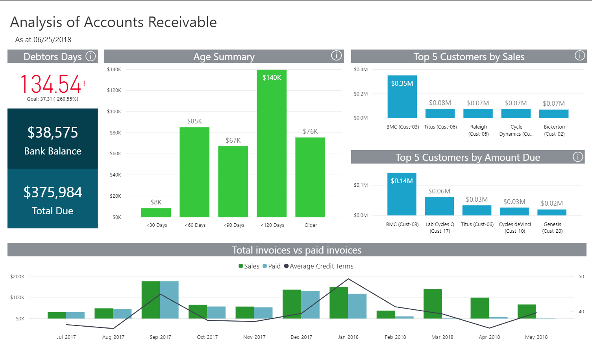

## Table of Contents

## What is accounts receivable?

Accounts receivable is the money that a business is owed by its customers for goods or services that have been sold but not yet paid for. When a company sells something on credit, it records this amount as accounts receivable on its balance sheet. This means the business expects to receive this money in the future, usually within a short period like 30 or 60 days.

Managing accounts receivable is important for a business because it affects cash flow. If customers pay late or don't pay at all, the business might struggle to pay its own bills. Companies often have systems in place to keep track of these amounts and to remind customers when payments are due. Good management of accounts receivable helps a business maintain a healthy financial state.

## Why is it important to analyze accounts receivable?

Analyzing accounts receivable is important because it helps a business understand how much money it will get in the future. This is key for planning and making sure the business has enough cash to keep running smoothly. If a company knows when and how much money will come in, it can better manage its own bills and expenses. Without this information, a business might run into money problems, even if it is making sales.

Another reason to analyze accounts receivable is to spot any issues with customers not paying on time. By looking at the data, a business can see if some customers are always late or if there are patterns in late payments. This can help the company take action, like changing payment terms or chasing late payments more aggressively. Keeping an eye on accounts receivable helps keep the business financially healthy and can prevent bigger problems down the road.

## How does accounts receivable impact a company's cash flow?

Accounts receivable directly affects a company's cash flow because it represents money that the company is expecting to receive but hasn't yet. When a business sells something on credit, it doesn't get the money right away. Instead, it has to wait until the customer pays. This means the company might have less cash on hand to use for things like paying bills, buying supplies, or paying employees. If a lot of money is tied up in accounts receivable, the business could struggle to keep up with its day-to-day expenses.

To manage this, companies need to keep a close eye on their accounts receivable. If customers are slow to pay or if there are a lot of late payments, it can cause cash flow problems. Businesses often set up systems to remind customers when payments are due and to follow up if payments are late. Good management of accounts receivable helps make sure that the money comes in on time, which keeps the business's cash flow healthy and allows it to operate smoothly.

## What are the common methods used to analyze accounts receivable?

One common method to analyze accounts receivable is by using the accounts receivable aging report. This report groups the money owed to the company by how long it has been outstanding. It shows how much is due in 30 days, 60 days, 90 days, and so on. By looking at this report, a business can see if there are any customers who are always late with their payments. This helps the company decide if it needs to change its credit terms or chase late payments more quickly.

Another method is to calculate the accounts receivable turnover ratio. This ratio tells a business how many times it collects its average accounts receivable in a year. To find this, you divide the total credit sales by the average accounts receivable. A higher turnover ratio means the company is collecting its receivables more quickly, which is good for cash flow. A lower ratio might mean the company needs to look at its credit policies or collection methods to speed up payments.

Lastly, businesses often use the days sales outstanding (DSO) metric. DSO shows the average number of days it takes for a company to collect payment after a sale. You calculate it by dividing the total accounts receivable by the total credit sales, then multiplying by the number of days in the period. A lower DSO means the company is getting paid faster, which is better for cash flow. By keeping an eye on DSO, a business can see if its collection efforts are working well or if changes are needed.

## How do you calculate the accounts receivable turnover ratio?

The accounts receivable turnover ratio shows how many times a company collects its average accounts receivable in a year. To calculate it, you take the total credit sales for the year and divide it by the average accounts receivable. The average accounts receivable is usually found by adding the accounts receivable at the start of the year to the accounts receivable at the end of the year, then dividing by two.

A higher turnover ratio means the company is collecting its receivables more quickly, which is good for cash flow. For example, if a company has total credit sales of $500,000 and an average accounts receivable of $50,000, the turnover ratio would be 10 ($500,000 / $50,000). This means the company collects its receivables 10 times a year. A lower ratio might mean the company needs to look at its credit policies or collection methods to speed up payments.

## What does the average collection period tell us about accounts receivable?

The average collection period tells us how many days it takes for a company to get paid after making a sale on credit. It's a way to see how fast or slow the company is at collecting money from its customers. To find the average collection period, you take the number of days in a year and divide it by the accounts receivable turnover ratio. If the turnover ratio is 10, then the average collection period would be 36.5 days (365 days / 10).

A shorter average collection period means the company is getting its money back quickly, which is good for its cash flow. It shows that the company's credit and collection policies are working well. On the other hand, a longer average collection period might mean the company is having trouble getting paid on time. This could be a sign that the company needs to change how it handles credit or chase late payments more aggressively. Keeping the average collection period as short as possible helps the business stay financially healthy.

## How can aging reports help in managing accounts receivable?

Aging reports are useful tools for managing accounts receivable because they show how long money has been owed to the company. The report groups the money into different time periods, like 30 days, 60 days, 90 days, and so on. By looking at this report, a business can see which customers are paying late and how much money is at risk of not being collected. This helps the company focus on the accounts that need attention the most, like chasing payments from customers who are very late.

Using aging reports can also help a business make better decisions about credit policies. If the report shows that many customers are paying late, the company might decide to change its credit terms to encourage faster payments. For example, it might offer discounts for early payment or start charging late fees. By keeping a close eye on the aging report, a business can improve its cash flow and make sure it has enough money to keep running smoothly.

## What are the implications of a high level of accounts receivable?

A high level of accounts receivable means a company has a lot of money that customers owe but haven't paid yet. This can be a problem because it ties up money that the company could use for other things, like paying bills or buying supplies. If too much money is stuck in accounts receivable, the business might not have enough cash to keep running smoothly. This can lead to cash flow problems, making it hard for the company to pay its own bills on time.

To manage a high level of accounts receivable, a business needs to look at why customers are not paying quickly. It might need to change its credit policies, like offering discounts for early payments or charging fees for late payments. The company should also keep a close eye on its aging reports to see which customers are paying late and focus on collecting from them first. By managing accounts receivable well, the business can improve its cash flow and avoid bigger financial problems down the road.

## How can businesses improve their accounts receivable management?

To improve their accounts receivable management, businesses need to keep a close eye on when money is coming in. They can use tools like aging reports to see which customers are paying late. By looking at these reports, a company can figure out if some customers are always slow to pay. If this happens, the business might need to change its credit terms. For example, they could offer discounts for early payments or start charging late fees. This encourages customers to pay on time and helps the business get its money faster.

Another way to improve accounts receivable management is by setting up clear payment terms from the start. When a business makes a sale on credit, it should tell the customer exactly when the payment is due. It's also important to follow up quickly if payments are late. Sending reminders or making phone calls can help get the money in faster. By managing accounts receivable well, a business can keep its cash flow healthy and avoid money problems.

## What role does credit policy play in accounts receivable analysis?

Credit policy is really important when it comes to looking at accounts receivable. It sets the rules for how a company gives credit to its customers. This includes things like how long customers have to pay, what happens if they pay late, and whether the company offers discounts for paying early. A good credit policy helps make sure that customers pay on time, which is good for the company's cash flow. If the policy is too loose, customers might take longer to pay, and the business might have trouble getting its money.

On the other hand, if the credit policy is too strict, it might scare customers away. They might not want to buy on credit if the terms are too hard. So, finding the right balance is key. By looking at how well the credit policy is working, a business can see if it needs to make changes. For example, if a lot of customers are paying late, the company might need to tighten up its policy. This helps the business manage its accounts receivable better and keep its cash flow healthy.

## How do you assess the quality of accounts receivable?

To assess the quality of accounts receivable, you look at how likely it is that you will actually get the money that customers owe you. One way to do this is by using an aging report. This report shows how long the money has been owed. If a lot of the money is owed for a long time, it might mean that some customers are not paying on time or might not pay at all. This can be a sign of bad quality accounts receivable. You can also look at how often customers are paying late. If many customers are always late, it might mean you need to change your credit terms or be stricter about collecting payments.

Another way to assess the quality is by looking at the accounts receivable turnover ratio. This tells you how many times a year you collect the money that's owed to you. A high turnover ratio means you're getting your money back quickly, which is good. A low ratio might mean you need to look at your credit policy and see if you can get customers to pay faster. Also, the days sales outstanding (DSO) can help. DSO shows how many days it takes to collect payment after a sale. A lower DSO means you're getting paid faster, which is a sign of good quality accounts receivable. By keeping an eye on these things, you can see if your accounts receivable are in good shape or if you need to make changes to improve them.

## What advanced analytics can be applied to optimize accounts receivable processes?

To optimize accounts receivable processes, businesses can use advanced analytics like predictive modeling. This means using data to guess which customers might pay late or not pay at all. By looking at past data, a company can see patterns and use those to make better decisions about who to give credit to and how to chase payments. For example, if the data shows that customers from a certain area often pay late, the company might decide to be stricter with credit terms for those customers. This helps the business collect money faster and reduce the risk of not getting paid.

Another way to use advanced analytics is through machine learning. This can help automate the process of deciding when to send reminders or when to take stronger action to collect payments. Machine learning can look at lots of data quickly and find the best times to contact customers for payment. It can also help find the best ways to talk to customers to get them to pay on time. By using these tools, a business can make its accounts receivable process smoother and more efficient, which helps keep its cash flow healthy.

## What is the Role of Financial Analysis in AR?

Analyzing accounts receivable is crucial for understanding a company's financial health and liquidity. Accounts receivable (AR) analysis leverages various metrics, with the accounts receivable-to-sales ratio being a key indicator. This ratio, calculated as:

$$
\text{Accounts Receivable-to-Sales Ratio} = \frac{\text{Accounts Receivable}}{\text{Total Sales}}
$$

provides a measure of the percentage of sales revenue tied up in receivables. A higher ratio might indicate slow collections, impacting cash flow and liquidity, while a lower ratio suggests efficient collection processes.

Another vital component of AR analysis is the evaluation of changes in the allowance for doubtful accounts. This allowance represents estimates of receivables that may not be collected, thus influencing the financial health assessment. Changes in this account provide insights into a company’s collection efficiency and credit risk management. A significant increase might signal potential collection issues or deteriorating customer creditworthiness, whereas a decrease may reflect improved collections or stricter credit policies.

Financial analysis also sheds light on customer payment patterns, which can inform credit policy adjustments and forecasting. By examining trends such as average days sales outstanding (DSO), businesses can gauge the timeliness of payments and adjust their strategies accordingly. The DSO is calculated as:

$$
\text{DSO} = \frac{\text{Accounts Receivable}}{\text{Total Credit Sales}} \times \text{Number of Days}
$$

where a lower DSO indicates faster collections, benefiting cash flow management.

Industry-specific trends are another focus of AR analysis. By benchmarking AR metrics against industry standards, companies can identify potential areas for improvement or competitive advantages. Such insights can drive strategic decisions, including credit term adjustments and targeted collection efforts.

Overall, comprehensive AR analysis equips businesses with detailed information about their cash flow, customer interactions, and financial stability, supporting robust and agile financial strategies.

## References & Further Reading

Bergstra, J., Bardenet, R., Bengio, Y., & Kégl, B. (2011). "Algorithms for Hyper-Parameter Optimization." This paper discusses methods to optimize algorithms by tuning hyper-parameters, which is essential for achieving effective algorithmic trading and financial analytics.

Lopez de Prado, M. Advances in Financial Machine Learning. This book provides valuable insights into applying machine learning methodologies to financial markets, offering techniques that can enhance the integration of algorithmic trading with accounts receivable management.

Aronson, D. Evidence-Based Technical Analysis: Applying the Scientific Method to Trading Signals. Aronson's work introduces scientific approaches for validating technical trading signals, essential for ensuring the precision and reliability of trading algorithms used in financial operations.

Jansen, S. Machine Learning for Algorithmic Trading. This resource is fundamental for understanding how machine learning can be applied to develop algorithms that execute trades efficiently and predict market movements, which is beneficial when analyzing accounts receivable data for cash flow optimization.

Chan, E.P. Quantitative Trading: How to Build Your Own Algorithmic Trading Business. In this book, Chan provides practical guidance on building algorithmic trading systems, which can be harnessed to integrate AR management practices, enabling businesses to streamline financial strategies and enhance operational efficiency.

These references provide a comprehensive foundation for exploring the intersection of accounts receivable management, financial analysis, and algorithmic trading. They offer theoretical insights and practical guidance necessary for implementing cutting-edge solutions in contemporary financial management.

