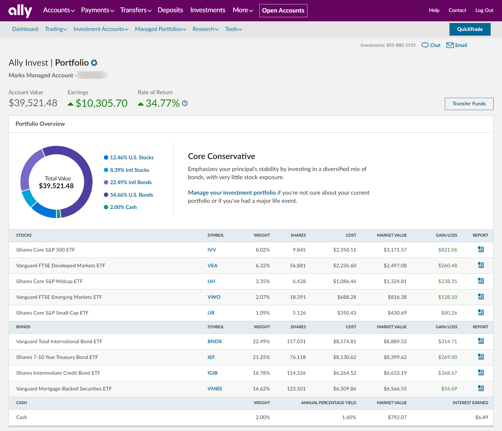

The world of online investing offers a variety of platforms each competing for the attention of savvy traders and investors. Among these, Ally Invest stands out with its compelling mix of low costs and robust features. Designed to attract both novice and seasoned investors, Ally Invest provides an integrated suite of tools aimed at facilitating a streamlined trading experience. This brokerage service is part of Ally Financial, a company well-known for its comprehensive array of financial products. Ally Invest differentiates itself from many conventional brokerage platforms by emphasizing affordability with zero commissions on eligible U.S. securities and the absence of account minimums.

While the platform boasts an accessible user interface and extensive banking integration, an important consideration for many tech-savvy traders is its capacity for algorithmic trading, a strategy that uses computer programs to execute trades at speeds and frequencies that humans cannot match. The current landscape of financial markets increasingly leans towards algorithmic trading, given its ability to handle multiple data feeds and execute complex mathematical models with precision. Therefore, understanding Ally Invest's suitability for such sophisticated trading strategies is critical for prospective users.



This article aims to provide a comprehensive review of the Ally Invest trading platform, specifically focusing on its algorithmic trading capabilities. Furthermore, it will detail the platform's features, examining the trade-offs between costs, user experience, and support. By closely analyzing these factors, potential users can better decide whether Ally Invest aligns with their investment goals and preferences.

## Table of Contents

## Overview of Ally Invest

Ally Invest, a subsidiary of Ally Financial, offers a platform that integrates investing with banking services to provide a seamless experience for its users. The platform is designed with no account minimum, making it accessible to a broad range of investors. One of the most attractive features of Ally Invest is its zero commission policy on eligible U.S. securities, including stocks and ETFs. This cost-effective structure positions Ally Invest as an attractive option for cost-conscious investors who want to minimize the impact of fees on their investment returns.

The platform is designed to accommodate traders across the spectrum, from beginners who are just starting to navigate the complexities of investing to experienced investors looking for robust self-directed options. Ally Invest offers self-directed trading accounts that enable users to execute trades independently, benefiting from the low-cost structure, as well as managed portfolios for those who prefer a more hands-off approach. These managed portfolios are automatically rebalanced and are constructed using a variety of asset classes to align with the investor's risk tolerance and investment goals.

Additionally, the integration with Ally Bank enhances the overall user experience by allowing easy management of cash balances and transfers between banking and investing accounts. This seamless interaction between banking and investing not only optimizes convenience but also allows users to take advantage of high-interest savings options provided by Ally Bank, further maximizing their financial strategy. 

Overall, Ally Invest delivers a platform that not only prioritizes cost-efficiency but also provides flexibility in investment approaches, making it a noteworthy choice for a wide array of investors.

## Algo Trading Capabilities

Ally Invest's platform, while not specifically designed for [algorithmic trading](/wiki/algorithmic-trading), provides a user-friendly environment that can support the integration of third-party algorithmic trading software. It offers basic order types that are essential for traders looking to implement straightforward strategies. These include market orders, which are executed at the current market price; limit orders, set to execute at a specified price or better; stop orders, aimed at minimizing losses by triggering a sale when a set price is reached; and stop-limit orders, which combine the features of stop orders and limit orders. 

However, the absence of more sophisticated order types, such as trailing stops and contingent orders, can limit the implementation of more advanced, automated trading strategies typically employed by algorithmic traders. Trailing stops automatically adjust to favorable market movements, protecting profits without requiring market timing, while contingent orders trigger transactions based on specific criteria or the execution of another order. 

For traders seeking to employ algorithms, the ability to integrate with external software solutions is crucial. Ally Invest's web-based platform supports such integrations, allowing traders to employ complex strategies externally developed. These capabilities can be enhanced through programming languages like Python, often used for developing trading algorithms due to its extensive libraries, such as NumPy and pandas, which facilitate complex computations and data analysis.

Here's a basic example of how a limit order might be structured with Python, showcasing the type of logic that can be integrated with a trading platform:

```python
def place_limit_order(current_price, target_price, quantity):
    if current_price <= target_price:
        # Code to place a buy limit order
        print(f"Executing limit order for {quantity} shares at or below {target_price}")
    else:
        print("Price not favorable. Order not placed.")

# Example usage:
current_market_price = 150.00
desired_price = 145.00
shares_to_buy = 10

place_limit_order(current_market_price, desired_price, shares_to_buy)
```

In summary, while Ally Invest's platform lacks some advanced order capabilities required by dedicated algorithmic traders, it remains a viable option for those who can leverage its integration capabilities with third-party software to run sophisticated trading algorithms.

## Pros of Ally Invest

Ally Invest stands out in the brokerage market primarily due to its cost-effective structure, allowing investors to engage in trading without the burden of hefty fees. The platform offers commission-free trading on a variety of assets, including stocks, exchange-traded funds (ETFs), and options, thereby reducing the financial barriers often associated with frequent trading. When trading options, each contract is priced at just $0.50, making it an attractive choice for options traders looking to manage costs effectively.

Another significant advantage of Ally Invest is its seamless integration with Ally Bank. This integration facilitates effortless management of cash balances and transfers, providing a streamlined experience for users who hold accounts with both Ally Invest and Ally Bank. This synergy enables investors to efficiently manage their finances, invest surplus cash, and access funds when needed—all within a cohesive financial ecosystem.

The user experience on Ally Invest is enhanced by its intuitive interface, which simplifies navigation across various investment products and banking services. This streamlined design is beneficial for both novice and experienced investors, enabling them to execute trades, review portfolios, and manage financial transactions with relative ease. The accessibility of these features ensures that users can focus on their investment strategies without being hindered by complicated interfaces or navigation issues. 

Overall, the combination of low costs, integration with banking services, and user-friendly interface positions Ally Invest as a compelling choice for investors aiming to minimize expenses and manage their investments within a cohesive digital environment.

## Cons of Ally Invest

Ally Invest has certain limitations that potential users should consider before committing to the platform. One significant drawback is the lack of direct access to [cryptocurrency](/wiki/cryptocurrency), futures, or [forex](/wiki/forex-system) trading. This absence restricts traders seeking diversification across a broader spectrum of financial instruments, as they cannot directly trade these assets through Ally Invest. While alternative ways to invest in these markets might exist, such as through exchange-traded funds (ETFs) that include cryptocurrencies or futures, direct trading is not supported.

Furthermore, although Ally Invest provides a mobile app that facilitates trading and management of investments on the go, there are limitations regarding the features and products supported compared to the desktop version. For users who primarily trade through mobile devices, this discrepancy can lead to a less comprehensive trading experience. Certain tools, analytics, or advanced trading options available on the desktop platform may not be accessible via the app, which could hinder traders accustomed to a highly interactive and feature-rich trading environment.

These constraints might impact traders who prioritize diversification and flexibility in trading platforms, potentially making Ally Invest less appealing for those who require a full suite of trading options across various asset classes.

## User Experience and Support

Ally Invest is distinguished by its user-friendly platform, which caters to both managed and self-directed investment accounts. For managed accounts, the platform offers automated investment strategies tailored to individual risk tolerance and financial goals. Users benefit from a seamless experience with features that simplify decision-making and enhance portfolio management. Self-directed investors have access to a wide array of asset classes and tools, providing flexibility to execute trades according to their strategies. The user interface is designed to be intuitive, enabling easy navigation between account management, market analysis, and trading execution. 

In terms of customer support, Ally Invest is committed to delivering reliable assistance through multiple channels. Support is available 24/7, ensuring clients can obtain help whenever needed. The communication options include phone support, which connects users directly with knowledgeable representatives who can address complex inquiries efficiently. Additionally, the platform offers live chat, providing quick solutions to more straightforward questions directly within the website or mobile app. These support services aim to ensure a smooth user experience and foster customer satisfaction. Overall, Ally Invest's combination of intuitive design and comprehensive customer support services contribute significantly to its appeal among both novice and experienced investors.

## Comparisons with Other Brokers

When comparing Ally Invest to other brokerage platforms, several advantages and disadvantages stand out that may influence a trader's choice based on their specific needs and priorities. 

Ally Invest is particularly attractive to new and cost-conscious traders primarily due to its low fees and the absence of an account minimum. These features allow individuals to start investing without requiring a substantial initial capital outlay, making the platform accessible to a broader audience. The absence of commissions on eligible U.S. securities further enhances its appeal as a cost-effective option for investors looking to minimize trading expenses.

However, for traders who prioritize advanced analytical tools and require a broader range of investment options, platforms such as Charles Schwab and TD Ameritrade might be more appealing. Charles Schwab offers a comprehensive suite of research and analytic tools, along with a wide range of investment products, including mutual funds, futures, and options. Similarly, TD Ameritrade is well-regarded for its Thinkorswim platform, which provides sophisticated trading features and analytical capabilities, catering to the needs of more advanced traders who seek detailed market analysis and trading strategy development tools.

In summary, while Ally Invest is advantageous for starting traders or those seeking to manage costs, experienced traders or those requiring more extensive analytical resources might find Charles Schwab or TD Ameritrade to better suit their trading strategies and investment needs.

## Conclusion

Ally Invest provides a versatile online trading platform that caters to a broad spectrum of investors, with particular advantages for those prioritizing cost efficiency. The platform's competitive pricing structures, such as commission-free trading on stocks and low options contract fees, make it an attractive choice for cost-conscious traders. Despite its accessible pricing, Ally Invest has some limitations regarding algorithmic trading features. The absence of advanced order types and dedicated algo trading tools may deter traders focused on automated strategies. However, the user-friendly interface compensates for these drawbacks, offering intuitive navigation and straightforward management of investment and banking needs.

Enhancements in trading capabilities, like incorporating advanced trading tools, could significantly increase the platform's attractiveness to algorithmic and diversified traders. Expanding its asset range to include more complex instruments, such as direct cryptocurrency and futures trading, could further enhance its appeal. Nevertheless, Ally Invest remains an appealing option for many by combining a strong investing platform with high-yield banking integrations. This blend addresses the needs of traders seeking a comprehensive solution with low costs and integrated financial services, making it a reliable choice for managing diverse investment portfolios efficiently.

## References & Further Reading

[1]: Bergstra, J., Bardenet, R., Bengio, Y., & Kégl, B. (2011). ["Algorithms for Hyper-Parameter Optimization."](https://dl.acm.org/doi/10.5555/2986459.2986743) Advances in Neural Information Processing Systems 24.

[2]: ["Advances in Financial Machine Learning"](https://www.amazon.com/Advances-Financial-Machine-Learning-Marcos/dp/1119482089) by Marcos Lopez de Prado

[3]: ["Evidence-Based Technical Analysis: Applying the Scientific Method and Statistical Inference to Trading Signals"](https://www.amazon.com/Evidence-Based-Technical-Analysis-Scientific-Statistical/dp/0470008741) by David Aronson

[4]: ["Machine Learning for Algorithmic Trading"](https://github.com/PacktPublishing/Machine-Learning-for-Algorithmic-Trading-Second-Edition) by Stefan Jansen

[5]: ["Quantitative Trading: How to Build Your Own Algorithmic Trading Business"](https://books.google.com/books/about/Quantitative_Trading.html?id=j70yEAAAQBAJ) by Ernest P. Chan