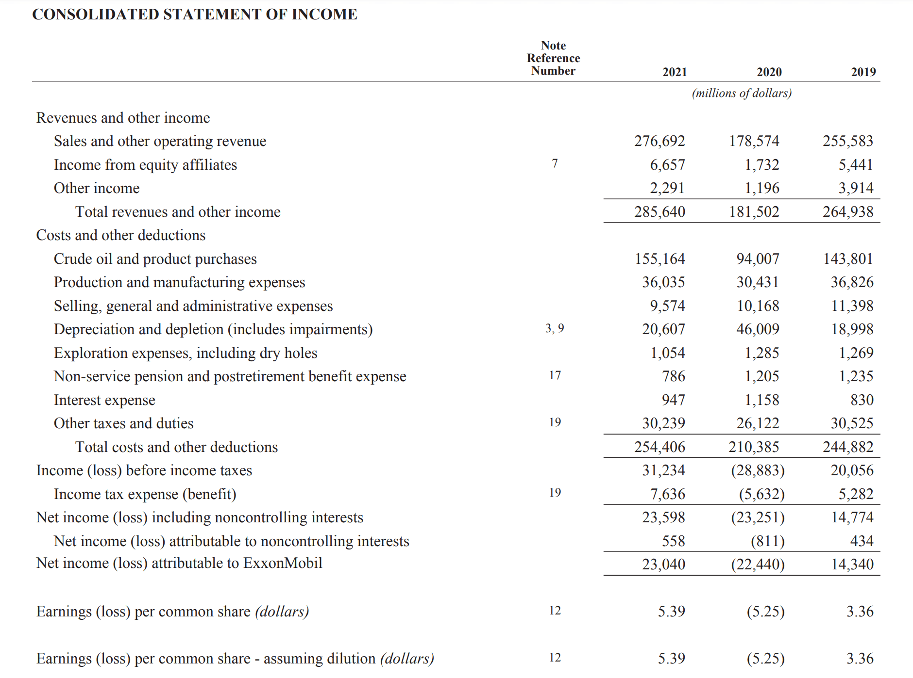

## Table of Contents

## What are the basic components of a bank's financial statement?

A bank's financial statement includes several key components that help show how well the bank is doing financially. The main parts are the balance sheet, the income statement, and the cash flow statement. The balance sheet shows what the bank owns (assets), what it owes (liabilities), and the difference between the two, which is called shareholders' equity. Assets can include things like loans given to customers and cash reserves, while liabilities might include customer deposits and money borrowed by the bank.

The income statement, also known as the profit and loss statement, shows how much money the bank has made or lost over a certain period. It includes the bank's revenues, like interest earned from loans and fees from services, and its expenses, such as interest paid on deposits and operating costs. The difference between revenues and expenses is the bank's net income, which tells if the bank is making a profit or a loss.

The cash flow statement tracks the flow of cash in and out of the bank. It's divided into three parts: operating activities, investing activities, and financing activities. Operating activities show the cash generated from the bank's main business, like lending and taking deposits. Investing activities show cash used for buying or selling assets, like securities or property. Financing activities show cash related to borrowing, repaying loans, or paying dividends. Together, these statements give a clear picture of the bank's financial health.

## How do you read a bank's income statement?

Reading a bank's income statement is like looking at a report card for how much money the bank made or lost over a period of time, usually a year or a quarter. The top part of the income statement shows the bank's total revenue. This includes money from interest on loans that customers have to pay back, fees for services like account maintenance or ATM usage, and any other income the bank might have. It's important to see if the revenue is going up or down compared to last time, because that tells you if the bank is doing better or worse at making money.

The bottom part of the income statement shows the bank's expenses, which are all the costs the bank has to pay. This includes interest the bank has to pay on money it borrowed or on customer deposits, as well as costs for running the bank, like salaries for employees, rent for bank branches, and other operating costs. Subtracting the total expenses from the total revenue gives you the bank's net income, which is the profit or loss. If the net income is positive, the bank made a profit; if it's negative, the bank had a loss. Checking the net income helps you understand if the bank is financially healthy or if it's struggling.

## What is the significance of the balance sheet in bank financial analysis?

The balance sheet is really important when you want to understand how a bank is doing financially. It shows a snapshot of what the bank owns and what it owes at a specific time. On one side, you see the bank's assets, which are things like the money it has in cash, loans it has given out to people and businesses, and investments it has made. On the other side, you see the bank's liabilities, which are things like the money people have put into their accounts at the bank and any loans the bank has taken from others. The difference between what the bank owns and what it owes is called shareholders' equity, which is basically the net worth of the bank. By looking at the balance sheet, you can see if the bank has enough money to cover what it owes and if it's using its money wisely.

Another reason the balance sheet is important is that it helps you see if the bank is taking too many risks. For example, if a bank has a lot of loans that might not get paid back, this can be risky. The balance sheet can show you how much of the bank's money is tied up in these risky loans compared to safer investments like government bonds. It also shows how much money the bank has in reserve, which is important because banks need to have enough cash to give to customers who want to take their money out. By analyzing the balance sheet, you can get a good idea of the bank's financial health and whether it's managing its money well or if it might be in trouble.

## How can one assess a bank's liquidity using financial statements?

To assess a bank's [liquidity](/wiki/liquidity-risk-premium) using financial statements, you mainly look at the balance sheet. Liquidity means how easily a bank can turn its assets into cash to meet its short-term obligations. On the balance sheet, you'll see the bank's assets listed, like cash, securities that can be sold quickly, and loans. The most liquid assets are cash and those securities because they can be used right away to pay bills or give money back to customers who want to take their money out. By comparing these liquid assets to the bank's liabilities, like customer deposits and short-term debts, you can see if the bank has enough quick cash to handle its immediate needs.

Another way to check a bank's liquidity is by looking at specific ratios that you can calculate from the balance sheet. One common ratio is the liquidity coverage ratio (LCR), which measures if the bank has enough high-quality liquid assets to survive a 30-day stressed funding scenario. You calculate this by dividing the bank's high-quality liquid assets by its total net cash outflows over 30 days. If the LCR is high, it means the bank is in a good position to handle a sudden need for cash. Another ratio is the loan-to-deposit ratio, which you find by dividing the bank's total loans by its total deposits. A lower ratio means the bank is not lending out all its deposits, so it has more cash on hand, which is good for liquidity. By using these ratios and looking at the balance sheet, you can get a clear picture of how liquid a bank is.

## What are key profitability ratios to look at in a bank's financial statement?

When you want to see how profitable a bank is, there are a few important ratios you should check out. The first one is the Return on Assets (ROA), which tells you how much profit the bank is making from its assets. You find this by dividing the bank's net income by its total assets. A higher ROA means the bank is using its assets well to make money. Another key ratio is the Return on Equity (ROE), which shows how much profit the bank is making from the money shareholders have put in. You calculate this by dividing the net income by the shareholders' equity. A higher ROE means the bank is doing a good job of turning shareholder money into profit.

Another important ratio is the Net Interest Margin (NIM), which shows how much the bank is [earning](/wiki/earning-announcement) from its lending activities after paying interest on deposits. You find this by subtracting the interest expense from the interest income and then dividing by the bank's earning assets. A higher NIM means the bank is making more money from the difference between what it charges for loans and what it pays for deposits. Lastly, the Efficiency Ratio measures how well the bank is managing its costs. You calculate this by dividing the bank's non-interest expenses by its revenue. A lower efficiency ratio means the bank is running its operations more efficiently, which can lead to higher profits. By looking at these ratios, you can get a good idea of how profitable the bank is and how well it's managing its money.

## How does the statement of cash flows help in analyzing a bank's financial health?

The statement of cash flows is really helpful for understanding how a bank is doing financially. It shows how money moves in and out of the bank over a period of time, usually a year or a quarter. The statement is split into three parts: operating activities, investing activities, and financing activities. Operating activities show the cash the bank makes from its main business, like lending money and taking in deposits. If this part shows a lot of positive cash flow, it means the bank is doing well at its core business. Investing activities show how the bank is using its money to buy or sell things like securities or property. If this part shows a lot of cash going out, it could mean the bank is investing in its future growth. Financing activities show how the bank is managing its borrowing and paying back loans, or paying dividends to shareholders. If this part shows a lot of cash coming in, it might mean the bank is taking on more debt, which could be risky.

By looking at the statement of cash flows, you can see if the bank has enough cash to keep running smoothly. If the bank has a lot of positive cash flow from operating activities, it's a good sign that the bank is making money from its day-to-day business. But if the bank is always using cash from financing activities to cover its operating needs, that could be a warning sign that the bank might be in trouble. The statement also helps you see if the bank is investing wisely or if it's taking on too much risk. Overall, the statement of cash flows gives you a clear picture of how the bank is managing its money and whether it's on a solid financial footing.

## What are non-performing loans and how are they reported in financial statements?

Non-performing loans are loans that a bank has given out, but the people or businesses who borrowed the money are not paying it back on time. Usually, a loan is considered non-performing if the borrower hasn't made payments for 90 days or more. These loans are a big deal for banks because they can lose money if too many loans become non-performing. It's like lending money to a friend who never pays you back - it can make things tough for the bank.

In a bank's financial statements, non-performing loans are shown on the balance sheet under loans. Banks have to set aside money, called loan loss provisions, to cover the losses they might have from these loans. This is shown as an expense on the income statement. By looking at these parts of the financial statements, you can see how many non-performing loans the bank has and how much money it's setting aside to deal with them. This helps you understand if the bank is at risk of losing a lot of money because of these loans.

## How do regulatory capital requirements impact a bank's financial statements?

Regulatory capital requirements are rules that tell banks how much money they need to keep on hand to make sure they are safe and can handle any financial trouble. This money is called capital, and it acts like a safety net for the bank. When banks have to follow these rules, it shows up on their balance sheet. They have to list their capital, which includes things like shareholders' equity and some types of debt. If a bank doesn't meet these requirements, it might have to raise more money or cut back on lending, which can change the numbers on the balance sheet.

These requirements also affect the income statement because banks might have to set aside more money for loan loss provisions to make sure they have enough capital. This can lower their profits. For example, if a bank has a lot of loans that people aren't paying back, it will need to set aside more money, which shows up as an expense on the income statement. So, regulatory capital requirements can make the bank's financial statements look different by changing how much capital they report and how much money they set aside for potential losses.

## What advanced metrics should be used to evaluate a bank's risk management?

To evaluate a bank's risk management, you can look at the risk-weighted assets (RWA) metric. This shows how risky the bank's loans and investments are. Banks give different weights to different types of assets based on how likely they are to cause losses. For example, a loan to a stable government might get a low weight, while a loan to a risky business might get a high weight. By looking at the total RWA, you can see if the bank is taking on too much risk. A higher RWA means the bank is holding more risky assets, which could be a red flag if it's not balanced with enough capital.

Another useful metric is the tier 1 capital ratio, which measures the bank's core capital against its RWA. Core capital includes things like common stock and retained earnings, which are the most reliable forms of capital. A higher tier 1 capital ratio means the bank has a strong safety net to cover potential losses from its risky assets. Regulators often set minimum requirements for this ratio, so it's important to check if the bank is meeting or exceeding these standards. This helps you understand if the bank is managing its risks well and has enough cushion to handle tough times.

The net stable funding ratio (NSFR) is another advanced metric to consider. It looks at how well the bank can match its long-term assets with stable sources of funding. This helps prevent the bank from running into liquidity problems if people suddenly want their money back. A higher NSFR means the bank has a good balance between its long-term investments and the money it can rely on over time. By looking at these metrics together, you get a clearer picture of how well the bank is managing its risks and whether it's prepared for different financial challenges.

## How can stress testing be integrated into the analysis of bank financial statements?

Stress testing is a way to check how well a bank can handle tough financial situations. It involves creating different bad scenarios, like a big economic downturn or a sudden drop in the value of investments, and seeing how the bank's financial statements would look under those conditions. By looking at the bank's balance sheet, income statement, and cash flow statement after running these stress tests, you can see if the bank has enough money to cover its losses and keep running smoothly. This helps you understand if the bank is strong enough to survive hard times or if it might be at risk of failing.

To integrate stress testing into the analysis of bank financial statements, you first need to run the stress tests and see how they change the numbers on the statements. For example, if the stress test shows a big drop in loan payments, you would see this reflected in the income statement as lower interest income and higher loan loss provisions. On the balance sheet, you might see a decrease in the value of the bank's assets and possibly a need for more capital to meet regulatory requirements. By comparing the stressed financial statements to the normal ones, you can get a better idea of the bank's risk management and financial health. This way, you can tell if the bank is prepared for tough times and if it's managing its risks well.

## What are the implications of off-balance sheet items for bank financial analysis?

Off-balance sheet items are things a bank is involved with but doesn't show on its main financial statement, the balance sheet. These can include guarantees, commitments, and certain types of derivatives. Even though they're not listed on the balance sheet, they can still affect the bank's financial health. For example, if a bank has promised to lend money in the future (a commitment), and the economy turns bad, people might want to borrow more, which could strain the bank's resources. Or, if the bank has guaranteed a loan for someone else and that person can't pay it back, the bank might have to cover the loss.

These off-balance sheet items are important to consider when analyzing a bank's financial statements because they can hide risks that aren't immediately obvious. For instance, if a bank has a lot of off-balance sheet items, it might look financially healthier on paper than it really is. To get a full picture, you need to look at the notes to the financial statements, where these items are usually disclosed. By understanding these off-balance sheet items, you can better assess the bank's true level of risk and its ability to handle potential problems.

## How do international accounting standards affect the comparability of bank financial statements globally?

International accounting standards, like the ones set by the International Financial Reporting Standards (IFRS), help make bank financial statements more comparable around the world. When banks in different countries follow the same rules for reporting their finances, it's easier to compare their performance and financial health. For example, if two banks in different countries both use IFRS, their balance sheets, income statements, and cash flow statements will be structured similarly. This means that investors and analysts can look at these statements and understand them in the same way, no matter where the bank is located.

However, even with these standards, there can still be differences in how banks report their numbers. Some countries might have their own rules that add to or change the international standards a bit. Also, banks might have different ways of valuing their assets or setting aside money for potential losses, which can affect the comparability of their financial statements. So while international accounting standards do a lot to help, it's important to look closely at the notes and details in the financial statements to fully understand any differences and make fair comparisons.

## References & Further Reading

[1]: Bergstra, J., Bardenet, R., Bengio, Y., & Kégl, B. (2011). ["Algorithms for Hyper-Parameter Optimization."](https://dl.acm.org/doi/10.5555/2986459.2986743) Advances in Neural Information Processing Systems 24.

[2]: ["Advances in Financial Machine Learning"](https://www.amazon.com/Advances-Financial-Machine-Learning-Marcos/dp/1119482089) by Marcos Lopez de Prado

[3]: ["Evidence-Based Technical Analysis: Applying the Scientific Method and Statistical Inference to Trading Signals"](https://www.amazon.com/Evidence-Based-Technical-Analysis-Scientific-Statistical/dp/0470008741) by David Aronson

[4]: ["Machine Learning for Algorithmic Trading"](https://github.com/stefan-jansen/machine-learning-for-trading) by Stefan Jansen

[5]: ["Quantitative Trading: How to Build Your Own Algorithmic Trading Business"](https://www.amazon.com/Quantitative-Trading-Build-Algorithmic-Business/dp/1119800064) by Ernest P. Chan