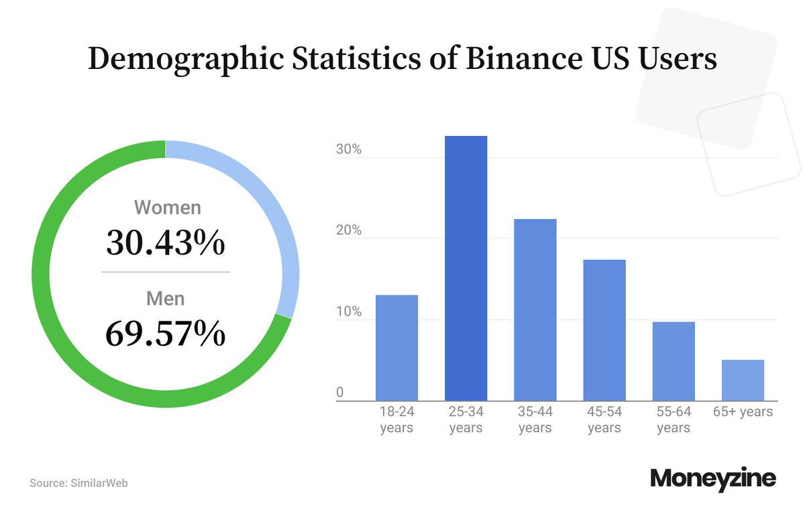

## Table of Contents

## What is Binance.US and how does it differ from the global Binance platform?

Binance.US is a cryptocurrency exchange specifically designed for users in the United States. It was created because the global Binance platform, which operates worldwide, had to limit its services in the U.S. due to strict regulations. Binance.US allows Americans to buy, sell, and trade cryptocurrencies in a way that follows U.S. laws and rules.

The main difference between Binance.US and the global Binance platform is the range of services and cryptocurrencies available. Binance.US has a smaller selection of cryptocurrencies and trading options compared to the global platform. This is because Binance.US must comply with U.S. regulations, which can be more restrictive. However, both platforms share the same goal of providing a secure and user-friendly way to trade digital assets.

## How can someone start trading on Binance.US?

To start trading on Binance.US, first, you need to visit their website and sign up for an account. You'll need to provide some personal information like your name, email address, and phone number. After signing up, you'll need to verify your identity. This usually involves uploading a photo of your ID, like a driver's license or passport, and sometimes a selfie. Once your identity is verified, you can set up two-factor authentication (2FA) for added security. This step is important to keep your account safe.

After your account is set up and verified, you can add money to your Binance.US account. You can do this by linking your bank account or using a debit card to deposit USD. Once you have funds in your account, you can start trading. You can buy and sell different cryptocurrencies like Bitcoin or Ethereum. To make a trade, you'll choose the [cryptocurrency](/wiki/cryptocurrency) you want, decide how much you want to buy or sell, and then confirm the trade. It's a good idea to start with small amounts if you're new to trading, so you can learn how it works without risking too much money.

## What are the fees associated with trading on Binance.US?

When you trade on Binance.US, you have to pay fees. There are two types of fees: trading fees and withdrawal fees. Trading fees are what you pay when you buy or sell cryptocurrencies. These fees depend on how much you trade in a month. If you trade a lot, you can get a lower fee. For most people, the trading fee is about 0.1% of the total amount you trade. So, if you trade $100, you pay $0.10 in fees.

Withdrawal fees are what you pay when you move your cryptocurrencies out of Binance.US to another wallet or exchange. The fee for this depends on which cryptocurrency you are moving. For example, if you want to withdraw Bitcoin, the fee might be around 0.0005 BTC. These fees can change, so it's good to check the current fees on the Binance.US website before you make a withdrawal.

## What types of cryptocurrencies can be traded on Binance.US?

Binance.US offers a variety of cryptocurrencies that you can trade. Some of the most popular ones include Bitcoin (BTC), Ethereum (ETH), and Litecoin (LTC). These are well-known and widely used cryptocurrencies. You can also trade other coins like Bitcoin Cash (BCH), Cardano (ADA), and Stellar Lumens (XLM). Binance.US adds new cryptocurrencies from time to time, so the list can grow.

The selection on Binance.US is smaller compared to the global Binance platform because of U.S. regulations. This means that while you can trade many different cryptocurrencies, there are still some that are not available on Binance.US. If you're looking for a specific cryptocurrency, it's a good idea to check the Binance.US website to see if it's listed.

## How does Binance.US ensure the security of user funds and personal information?

Binance.US takes several steps to keep your money and personal information safe. They use strong encryption to protect your data when you sign up and log in. They also have two-[factor](/wiki/factor-investing) authentication (2FA), which means you need a code from your phone to log in, making it harder for someone else to get into your account. Binance.US keeps most of the money in cold storage, which means it's not connected to the internet, so it's safer from hackers. They also have insurance to cover losses if something goes wrong.

They also watch for anything strange happening on the platform. If they see something that doesn't look right, like someone trying to log in from a new place, they might ask you to confirm it's really you. Binance.US follows strict rules to make sure they're doing everything they can to keep your information and money safe. They work with security experts and use the latest technology to stay ahead of any threats.

## What are the deposit and withdrawal options available on Binance.US?

To add money to your Binance.US account, you can use a bank account or a debit card. If you use a bank account, you can link it to your Binance.US account and transfer USD. This usually takes a few days to show up in your account. Using a debit card is faster, but it might cost a bit more. Once the money is in your Binance.US account, you can use it to buy cryptocurrencies.

To take money out of Binance.US, you can move your cryptocurrencies to another wallet or exchange. Each cryptocurrency has a different fee for this. If you want to take out USD, you can do a bank transfer. This also takes a few days and might have a fee. It's good to check the current fees on the Binance.US website before you make a deposit or withdrawal.

## How does Binance.US comply with U.S. regulations and what licenses does it hold?

Binance.US works hard to follow all the rules set by the United States government. They do this by making sure they have the right licenses and follow the laws about money and trading. Binance.US is run by BAM Trading Services, which has a license from the Financial Crimes Enforcement Network (FinCEN). This license means they can work as a money services business in the U.S. They also follow rules from the Office of Foreign Assets Control (OFAC) to make sure they don't work with people or countries that are not allowed.

To keep everything safe and legal, Binance.US uses strong security measures and keeps a close eye on all the trades that happen on their platform. They report any strange activity to the right authorities. This helps them stay in line with the Bank Secrecy Act and other laws that fight against money laundering and fraud. By doing all these things, Binance.US makes sure they are following U.S. rules and keeping their users' money and information safe.

## What advanced trading features does Binance.US offer to experienced traders?

Binance.US offers some special tools for people who know a lot about trading and want to do more than just buy and sell cryptocurrencies. One of these tools is called "Advanced Trading View." This lets you see more details about the market and use different charts to help you make better choices. You can also set up different types of orders, like "stop-limit orders" and "take-profit orders." These orders can help you manage your trades better by automatically selling or buying at certain prices.

Another useful feature is "Trading Bots." These are programs that can trade for you based on rules you set up. This can save you time and help you trade even when you're not watching the market. Binance.US also has a tool called "Margin Trading," which lets you borrow money to trade with. This can make your trades bigger, but it's also riskier because you could lose more money if the market goes the wrong way. So, it's important to understand these tools well before using them.

## How does Binance.US's liquidity compare to other U.S.-based cryptocurrency exchanges?

Binance.US has good [liquidity](/wiki/liquidity-risk-premium), which means it's easy to buy and sell cryptocurrencies on the platform without big price changes. Compared to other U.S.-based exchanges like Coinbase and Kraken, Binance.US usually has a lot of trading happening. This high trading [volume](/wiki/volume-trading-strategy) helps keep the prices stable and makes it easier for users to trade large amounts of cryptocurrencies quickly.

However, the liquidity can vary depending on which cryptocurrency you're trading. For popular ones like Bitcoin and Ethereum, Binance.US has very good liquidity, often better than smaller exchanges. But for less common cryptocurrencies, the liquidity might not be as strong as on some other platforms. Overall, Binance.US is a solid choice for liquidity among U.S.-based exchanges, especially for the most traded cryptocurrencies.

## What are the customer support options available on Binance.US?

Binance.US has different ways to help you if you have questions or problems. You can use their help center, which has lots of articles and guides to answer common questions. If you can't find what you need there, you can send them an email. They try to answer emails quickly, but it might take a little time. They also have a live chat feature, but it's only for certain problems and might not be available all the time.

For more urgent issues, you can use their social media accounts like Twitter and Facebook to reach out. They often reply to messages there, but it's not as fast as live chat or phone support. Binance.US doesn't have phone support right now, so if you need help, you'll have to use one of the other ways to get in touch.

## How has Binance.US performed in terms of trading volume and market share in the U.S.?

Binance.US has done well in terms of trading volume and market share in the U.S. It's one of the biggest cryptocurrency exchanges in the country. Many people use it to buy and sell cryptocurrencies like Bitcoin and Ethereum. The trading volume on Binance.US is often very high, which means a lot of money is being traded on the platform every day. This high volume helps keep the prices stable and makes it easier for people to trade without big price changes.

Compared to other U.S.-based exchanges like Coinbase and Kraken, Binance.US has a good share of the market. It's not the biggest, but it's still a strong player. The amount of trading and the number of users on Binance.US show that it's a popular choice for people in the U.S. who want to trade cryptocurrencies. As the market grows, Binance.US keeps working to stay competitive and meet the needs of its users.

## What are the future plans and potential developments for Binance.US?

Binance.US is always looking to grow and get better. They want to add more cryptocurrencies to their platform so people can trade more options. They also plan to make their website and app easier to use, so even if you're new to trading, you can figure things out quickly. They might also add new tools for people who trade a lot, like more advanced charts and ways to trade automatically. These changes will help Binance.US stay a top choice for people in the U.S. who want to trade cryptocurrencies.

Another big plan for Binance.US is to work better with the rules in the U.S. They want to make sure they follow all the laws and keep their users' money and information safe. They might also try to get more licenses so they can offer more services. By doing this, they hope to build trust with their users and keep growing in the U.S. market. As the world of cryptocurrencies changes, Binance.US will keep updating and improving to meet the needs of their users.

## Can you perform algorithmic trading on Binance.US?

Algorithmic trading, often referred to as algo trading, is a method of executing trades using pre-programmed instructions, accounting for variables such as timing, price, and volume. It is designed to automate the trading process, potentially resulting in improved execution speed and efficiency. Binance.US supports algo trading by providing essential tools and resources that cater to both novice and experienced traders.

Traders on Binance.US employ various strategies to optimize their trading activities. Some popular strategies include:

1. **Volume Weighted Average Price (VWAP):** This strategy divides the total dollar amount traded by the total volume traded over a specified time period. It aims to execute trades in a way that minimizes market impact by trading gradually throughout a period, thus achieving an average price close to the VWAP.
$$
   \text{VWAP} = \frac{\sum (Price_i \times Volume_i)}{\sum Volume_i}

$$

2. **Time Weighted Average Price (TWAP):** In this strategy, a large order is broken down into smaller trades of equal size spread out over a predefined time period. The goal is to systematically execute the order, minimizing the impact on the market and potentially achieving a price close to the average over that period.
$$
   \text{TWAP} = \frac{\sum Price_i}{n}

$$

Binance.US facilitates these strategies by offering Application Programming Interfaces (APIs), which allow traders to integrate their own software and algorithms with the platform. Through APIs, users can access market data, execute trades, and manage their portfolios in real-time, providing a high degree of flexibility. This functionality is crucial for traders who rely on custom strategies and require a tailored trading solution.

A basic example of connecting to Binance.US via their Python API might involve:

```python
from binance.client import Client

api_key = 'your_api_key'
api_secret = 'your_api_secret'

client = Client(api_key, api_secret)

# Retrieve account information
account_info = client.get_account()
print(account_info)

# Execute a sample market order
order = client.order_market_buy(
    symbol='BTCUSD',
    quantity=0.001
)
print(order)
```

In this example, a trader can easily access account information and execute market orders through Python, demonstrating how APIs streamline the trading process.

By leveraging APIs and custom programming, traders on Binance.US can execute sophisticated strategies more efficiently, enhancing their ability to respond to market conditions and optimize their trading performance. These tools are invaluable for those seeking a more controlled and strategic trading experience.

## References & Further Reading

[1]: Rosic, A. (2021). ["How Algorithmic Trading Works"](https://www.wallstreetzen.com/blog/what-is-algorithmic-trading/) Blockgeeks.

[2]: Dourado, E., & Brito, J. (2015). ["Cryptocurrency Security: Evolving Threats & Defensive Mechanisms"](https://scholar.google.com/citations?user=PB7UCecAAAAJ) Mercatus Center at George Mason University.

[3]: Cartea, Á., Jaimungal, S., & Penalva, J. (2015). ["Algorithmic and High-Frequency Trading."](https://assets.cambridge.org/97811070/91146/frontmatter/9781107091146_frontmatter.pdf) Cambridge University Press.

[4]: Financial Crimes Enforcement Network (FinCEN). (2019). ["Guidance on the Application of FinCEN's Regulations to Certain Business Models Involving Convertible Virtual Currencies."](https://www.fincen.gov/resources/statutes-regulations/guidance/application-fincens-regulations-certain-business-models)

[5]: Securrency, Inc. (2021). ["US Regulation of Digital Assets: A 2021 Update."](https://www.businesswire.com/news/home/20231019120812/en/DTCC-Signs-Definitive-Agreement-to-Acquire-Blockchain-Based-Financial-Technology-Firm-Securrency-Inc.-to-Drive-Development-of-the-Digital-Post-Trade-Infrastructure-for-the-Global-Financial-Markets)