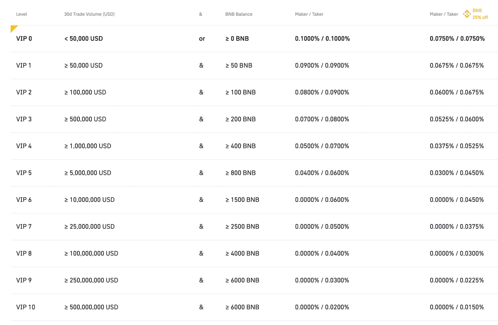

The cryptocurrency exchange landscape is constantly evolving, driven by technological advancements and regulatory changes. In this dynamic environment, Binance.US has emerged as a critical player, particularly for traders within the United States. As an extension of the globally renowned Binance platform, Binance.US offers a tailored experience that aligns with U.S. regulatory standards, making it a noteworthy option for domestic crypto enthusiasts.

This article endeavors to provide an in-depth review of Binance.US, assessing its advantages, limitations, and the features that distinguish it, especially in the context of algorithmic trading. Algorithmic trading, often abbreviated as algo trading, is a method of executing orders using automated and pre-programmed trading instructions to account for variables such as time, price, and volume. The integration of these functionalities within Binance.US is of particular interest, offering traders efficient and advanced trading options that are compliant with the stringent regulatory environment of the United States.



In addition to evaluating the platform's functionality, this article will highlight how Binance.US stands in comparison to its international counterpart, Binance. The original Binance platform is known for its extensive range of services and global reach. However, due to regulatory pressures, Binance.US was developed to cater specifically to the U.S. market, resulting in notable differences in user experience and asset availability. By comparing the two, insights will be gleaned into how regulatory compliance influences platform offerings and trader experiences.

As we explore Binance.US, expect a comprehensive overview of its pros and cons, user interface, trading tools, security measures, and algorithmic trading capabilities. This will equip both novice and experienced traders with the necessary information to navigate the exchange and leverage its offerings effectively. The goal is to offer readers a clear understanding of what Binance.US entails and how it fits into the broader cryptocurrency trading ecosystem.

## Table of Contents

## Overview of Binance.US

Binance.US is a cryptocurrency exchange tailored specifically for users in the United States, established to comply with the country’s strict regulatory landscape. Launched in September 2019, Binance.US was created to offer a secure and reliable trading platform for U.S. residents. The exchange is a distinct entity from its global counterpart, Binance, and operates under its regulatory framework to ensure compliance with U.S. financial laws.

The inception of Binance.US emerged from the necessity to provide a trading environment that adheres to the standards imposed by U.S. regulators, particularly following the global Binance platform's decision to stop serving U.S. customers due to regulatory challenges. Binance.US is operated by BAM Trading Services, a company registered with the Financial Crimes Enforcement Network (FinCEN) as a Money Services Business (MSB). This affiliation indicates a commitment to meeting regulatory requirements and adopting measures to prevent financial crimes.

Despite its affiliation with the global Binance brand, Binance.US operates independently and features its own management team. It leverages Binance’s technological infrastructure and matching engine to offer a robust trading experience similar to the international platform. However, the exchange faces limitations in asset availability compared to Binance's global operations. This is largely due to regulatory constraints that necessitate careful evaluation of cryptocurrencies for compliance before they can be listed on the platform.

At its launch, Binance.US initially offered a smaller selection of digital assets but has since expanded its offerings. Despite this growth, the platform still lags behind Binance in terms of the diversity of cryptocurrencies available for trade. The need to comply with U.S. regulatory standards significantly impacts this aspect, as each asset must undergo rigorous scrutiny to ensure it meets legal requirements.

Overall, Binance.US represents a strategic adaptation of Binance’s global model to the intricacies of the U.S. market, ensuring that users in the United States have access to a platform that combines advanced trading functionalities with stringent regulatory compliance.

## Pros and Cons of Binance.US

Binance.US, established as a response to regulatory pressures in the United States, presents a mix of benefits and drawbacks for [cryptocurrency](/wiki/cryptocurrency) traders. One of its primary advantages is the low trading fees it offers, which are quite competitive compared to other U.S.-based exchanges. This cost-efficiency is further enhanced by discounts available through the use of Binance Coin (BNB), the platform’s native token. These incentives can significantly reduce trading expenses, making it attractive for frequent traders and those managing large volumes.

Additionally, Binance.US offers a robust suite of educational resources aimed at both novice and experienced traders. These resources include tutorials, guides, and market analysis tools that can help users make more informed trading decisions. Such educational efforts are crucial in empowering traders with the necessary skills and knowledge to navigate the often volatile cryptocurrency markets.

Despite these advantages, Binance.US has some notable limitations. A significant drawback is the lengthy identity verification process that users must undergo before trading. This procedure, although important for regulatory compliance and security, can be cumbersome and time-consuming, potentially deterring potential users who prefer quicker onboarding.

Moreover, the selection of digital assets on Binance.US is notably limited compared to its global counterpart, Binance. This restricted asset availability may frustrate users looking for a diverse range of trading options. Additionally, Binance.US is not accessible in certain U.S. states due to specific state-level regulations, further limiting its reach and usability.

In summary, Binance.US offers attractive features such as low trading fees and valuable educational resources but also faces challenges, notably in terms of asset diversity and regulatory restrictions that limit its user base.

## Trading Experience on Binance.US

Binance.US provides a diverse trading experience tailored to accommodate both novice and seasoned cryptocurrency traders. The platform's design prioritizes user accessibility through an intuitive interface that simplifies the trading process.

### User Interface and Trading Tools:

The Binance.US user interface is streamlined, making it an excellent choice for beginners. The dashboard efficiently organizes key functionalities such as spot trading, deposits, and withdrawals. An intuitive design reduces potential errors, allowing new users to navigate the platform confidently.

For more advanced traders, Binance.US offers a range of sophisticated tools. Charting capabilities provided through integrated TradingView features enable technical analysis with a variety of indicators and timeframes. These tools assist traders in making informed decisions by analyzing market trends and historical data.

### Mobile Application:

The Binance.US mobile app extends the functionality of the web platform, facilitating trading on-the-go. Users can perform essential functions such as executing trades, monitoring market movements, and managing their portfolios from anywhere. The app maintains a user-friendly interface consistent with the desktop experience. Real-time notifications on price alerts and market developments enhance the ability to respond swiftly to market changes.

### Advanced Trading Portal and OTC Options:

For professional traders, the advanced trading portal on Binance.US supports enhanced order types and high-frequency trading strategies. This portal includes features such as stop-limit orders, which allow traders to specify a condition under which a trade will be executed. Such features are essential for implementing complex trading strategies that seek to optimize returns or mitigate risks.

In addition to standard trading, Binance.US provides Over The Counter (OTC) trading options. These services cater to individuals or institutions interested in executing large-[volume](/wiki/volume-trading-strategy) trades without causing significant market impact. OTC trading on Binance.US offers competitive pricing, personalized service, and confidentiality for large transactions, ensuring that market [liquidity](/wiki/liquidity-risk-premium) is maintained while meeting the trader's objectives.

In sum, Binance.US's trading experience is designed to offer a balance of accessibility and sophistication, supporting a wide array of trading needs and preferences across its user base.

## Algorithmic Trading on Binance.US

Algorithmic trading, often referred to as algo trading, is a method of executing trades using pre-programmed instructions, accounting for variables such as timing, price, and volume. It is designed to automate the trading process, potentially resulting in improved execution speed and efficiency. Binance.US supports algo trading by providing essential tools and resources that cater to both novice and experienced traders.

Traders on Binance.US employ various strategies to optimize their trading activities. Some popular strategies include:

1. **Volume Weighted Average Price (VWAP):** This strategy divides the total dollar amount traded by the total volume traded over a specified time period. It aims to execute trades in a way that minimizes market impact by trading gradually throughout a period, thus achieving an average price close to the VWAP.
$$
   \text{VWAP} = \frac{\sum (Price_i \times Volume_i)}{\sum Volume_i}

$$

2. **Time Weighted Average Price (TWAP):** In this strategy, a large order is broken down into smaller trades of equal size spread out over a predefined time period. The goal is to systematically execute the order, minimizing the impact on the market and potentially achieving a price close to the average over that period.
$$
   \text{TWAP} = \frac{\sum Price_i}{n}

$$

Binance.US facilitates these strategies by offering Application Programming Interfaces (APIs), which allow traders to integrate their own software and algorithms with the platform. Through APIs, users can access market data, execute trades, and manage their portfolios in real-time, providing a high degree of flexibility. This functionality is crucial for traders who rely on custom strategies and require a tailored trading solution.

A basic example of connecting to Binance.US via their Python API might involve:

```python
from binance.client import Client

api_key = 'your_api_key'
api_secret = 'your_api_secret'

client = Client(api_key, api_secret)

# Retrieve account information
account_info = client.get_account()
print(account_info)

# Execute a sample market order
order = client.order_market_buy(
    symbol='BTCUSD',
    quantity=0.001
)
print(order)
```

In this example, a trader can easily access account information and execute market orders through Python, demonstrating how APIs streamline the trading process.

By leveraging APIs and custom programming, traders on Binance.US can execute sophisticated strategies more efficiently, enhancing their ability to respond to market conditions and optimize their trading performance. These tools are invaluable for those seeking a more controlled and strategic trading experience.

## Security and User Verification

Binance.US, a U.S.-focused cryptocurrency exchange, places substantial emphasis on security measures to protect user accounts and funds. Understanding the multi-layered approach to security adopted by Binance.US is critical for users who prioritize safeguarding their digital assets.

### Security Measures

Binance.US implements several security protocols designed to provide a robust defense against potential threats. These measures include:

1. **Two-Factor Authentication (2FA)**: Binance.US requires users to enable two-factor authentication, which adds an additional layer of security by requiring not just a password but also a second form of verification, typically a code generated by an app like Google Authenticator, to access accounts.

2. **Cold Storage**: A significant portion of Binance.US funds are held in cold storage. This offline method of storing cryptocurrencies protects them from online threats and hacking attempts. 

3. **Advanced Encryption Protocols**: User data, including personal and financial information, is protected through encryption technologies that ensure the data remains secure and private.

4. **Regular Audits and Penetration Testing**: Binance.US conducts regular audits and security assessments to identify and address potential vulnerabilities. These assessments often include penetration testing, which involves simulating cyberattacks to evaluate the resilience of their systems.

5. **Security Education**: The platform also provides educational resources to help users understand best practices for securing their accounts, such as recognizing phishing attempts and maintaining strong, unique passwords.

### Identity Verification Process

The identity verification process at Binance.US is not only a critical component of its security protocol but also a compliance measure required by U.S. regulations. This process involves:

1. **Know Your Customer (KYC) Procedures**: Binance.US requires all users to complete KYC verification before they can trade on the platform. This involves submitting personal identification information, such as a government-issued ID and proof of address, to confirm the user’s identity.

2. **Challenges in Verification**: The identity verification process can be time-consuming and requires multiple steps, which some users may find cumbersome. However, this process is essential for enhancing security and ensuring compliance with federal regulations, such as the Bank Secrecy Act (BSA).

3. **Regulatory Compliance**: Compliance with U.S. regulations is critical for Binance.US to operate legally within the country. Adhering to these regulations requires strict identity verification to prevent illegal activities such as money laundering and fraud.

The security measures and verification processes employed by Binance.US demonstrate its commitment to providing a secure trading environment. While the stringent verification process might pose challenges for some users, these steps are necessary to maintain compliance and protect the exchange’s user base from security threats.

## Comparison with Other Exchanges

Binance.US is a prominent player in the U.S. cryptocurrency exchange market, but it faces stiff competition from other established platforms like Kraken. An analysis of these platforms considers critical factors such as trading fees, asset availability, and user base to provide insights for potential traders on which platform may be more suitable.

**Trading Fees**

One of the significant considerations for traders is the cost of trading, which primarily includes fees. Binance.US is known for its competitive fee structure. It typically offers lower fees compared to many U.S.-based exchanges, with spot trading fees often starting at 0.1% for both makers and takers. Moreover, users can benefit from fee reductions by utilizing Binance Coin (BNB) for transaction fee payments. In contrast, Kraken employs a tiered fee system based on the user's 30-[day trading](/wiki/day-trading-spy) volume. While it starts at 0.16% makers and 0.26% takers, high-volume traders on Kraken might enjoy lower fees than on Binance.US. 

**Asset Availability**

A crucial difference between Binance.US and Kraken is the range of cryptocurrencies available for trading. Binance.US offers a more limited selection compared to its international counterpart due to regulatory constraints, providing access to around 60 digital assets. Kraken, established earlier in the market, boasts over 100 available cryptocurrencies, giving traders a wider array of options for portfolio diversification. The more extensive asset offerings may attract traders interested in less common altcoins not listed on Binance.US.

**User Base**

The user base of a platform can significantly impact user experience, especially in terms of liquidity and trading volume. Binance.US, being a spin-off of the globally recognized Binance, benefits from a strong brand presence and draws numerous U.S.-based users. Nevertheless, Kraken has cultivated a substantial and loyal user base over the years, known for its commitment to security and regulatory compliance, traits that resonate with traders valuing these aspects. 

**Regional Competition**

Regional competition also plays a role in determining the popularity and usability of these exchanges. Binance.US caters specifically to U.S. residents, complying with local regulations that exclude certain states like New York. This limitation could drive users towards Kraken or other exchanges that might offer broader accessibility. Additionally, users might favor platforms like Coinbase, which has an established presence and regulatory compliance across a more extensive range of U.S. states.

**Benefits and Drawbacks**

Choosing between Binance.US and Kraken involves weighing their respective benefits and drawbacks. Binance.US is particularly attractive for users looking for lower fees and a straightforward trading experience, especially beginners who can benefit from its educational resources. However, its limited asset pool and state-specific restrictions can be potential downsides.

Kraken, on the other hand, offers a more comprehensive selection of cryptocurrencies and advanced trading features, appealing to seasoned traders. Its adherence to regulatory standards and strong security measures further enhance its credibility. Nonetheless, its higher initial trading fees might be a deterrent for users predominantly interested in cost-effective trading.

In conclusion, selecting an exchange between Binance.US and Kraken depends on individual trading priorities, such as asset variety, fee preference, and geographical considerations. Both platforms offer unique advantages, aligning differently with trader expectations and requirements.

## Final Verdict and Recommendations

Binance.US has emerged as a noteworthy platform within the U.S. cryptocurrency landscape, offering several advantages that appeal to a diverse range of traders. Its competitive trading fees stand out as one of the primary strengths. The platform offers low transaction costs, which are further reduced when using the Binance Coin (BNB) for trade fee discounts. This financial efficiency is complemented by a robust suite of educational resources designed to support both novice and experienced traders, enhancing their understanding of crypto markets and trading strategies.

However, traders considering Binance.US should also be aware of its limitations. One significant drawback is its limited selection of digital assets compared to its international counterpart, Binance. This restriction may pose a challenge for investors seeking a wide variety of coins and tokens. Additionally, the platform's lengthy identity verification process, while necessary for compliance with U.S. regulations, can be cumbersome and time-consuming.

For beginners entering the cryptocurrency space, Binance.US offers a straightforward, user-friendly platform that is both secure and informative. The educational resources available can be particularly beneficial for newcomers seeking to build a foundational understanding of crypto trading. The platform's regulated nature ensures compliance with U.S. financial laws, making it a trustworthy choice for those prioritizing security and legal assurance.

Experienced traders, particularly those interested in [algorithmic trading](/wiki/algorithmic-trading), will find Binance.US accommodating due to its support for API integration and the use of complex trading strategies. Despite its limited asset range, the platform provides efficient trading tools and competitive fees that seasoned traders can exploit for optimized trading operations.

In conclusion, Binance.US is a commendable choice for U.S.-based traders looking for a reliable, compliant platform. While its offerings may not be as extensive as some international exchanges, its strengths lie in affordability, security, and educational support. Novice traders seeking a simpler entry into cryptocurrency trading will find Binance.US to be an ideal starting point, while experienced traders can capitalize on its algorithmic trading capabilities and cost-effective fee structure.

## References & Further Reading

[1]: Rosic, A. (2021). ["How Algorithmic Trading Works"](https://www.wallstreetzen.com/blog/what-is-algorithmic-trading/) Blockgeeks.

[2]: Dourado, E., & Brito, J. (2015). ["Cryptocurrency Security: Evolving Threats & Defensive Mechanisms"](https://scholar.google.com/citations?user=PB7UCecAAAAJ) Mercatus Center at George Mason University.

[3]: Cartea, Á., Jaimungal, S., & Penalva, J. (2015). ["Algorithmic and High-Frequency Trading."](https://assets.cambridge.org/97811070/91146/frontmatter/9781107091146_frontmatter.pdf) Cambridge University Press.

[4]: Financial Crimes Enforcement Network (FinCEN). (2019). ["Guidance on the Application of FinCEN's Regulations to Certain Business Models Involving Convertible Virtual Currencies."](https://www.fincen.gov/resources/statutes-regulations/guidance/application-fincens-regulations-certain-business-models)

[5]: Securrency, Inc. (2021). ["US Regulation of Digital Assets: A 2021 Update."](https://www.businesswire.com/news/home/20231019120812/en/DTCC-Signs-Definitive-Agreement-to-Acquire-Blockchain-Based-Financial-Technology-Firm-Securrency-Inc.-to-Drive-Development-of-the-Digital-Post-Trade-Infrastructure-for-the-Global-Financial-Markets)