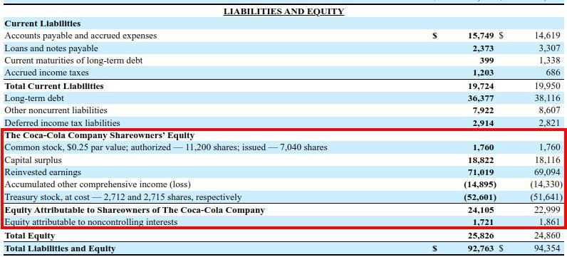

## Table of Contents

## What is book value and how is it calculated?

Book value is the total value of a company's assets minus its liabilities, as shown on its balance sheet. It represents what shareholders would theoretically receive if a company were to liquidate all its assets and pay off all its debts. This figure is important for investors because it gives them an idea of the company's net worth and can be used to compare the market value of the company's stock to its actual worth.

To calculate book value, you start by adding up all the company's assets, which can include things like cash, inventory, property, and equipment. Then, you subtract all the company's liabilities, which are the debts and obligations the company owes. The result is the book value, which can also be called "net asset value" or "shareholders' equity." For example, if a company has $1 million in assets and $300,000 in liabilities, its book value would be $700,000.

## Why is book value important for investors?

Book value is important for investors because it tells them how much a company is really worth. It's like looking at the price tag of a company if everything was sold off and all debts were paid. This helps investors see if a company's stock is a good deal. If the stock price is lower than the book value, it might be a bargain. But if the stock price is higher than the book value, the stock might be too expensive.

Investors also use book value to compare different companies. By looking at the book values, they can see which company has more real value behind it. This can help them decide where to put their money. But, book value isn't perfect. It doesn't tell the whole story because it doesn't include things like the company's brand or how good its management is. Still, it's a useful tool for investors to understand a company's basic worth.

## How does book value differ from market value?

Book value and market value are two different ways to measure how much a company is worth. Book value is what you get when you take all the company's stuff, like cash and buildings, and subtract all the money it owes, like loans. It's like looking at the price tag of the company if it sold everything and paid off all its debts. Book value is found on the company's balance sheet and gives investors a snapshot of what the company is worth on paper.

Market value, on the other hand, is how much the company is worth according to people who want to buy and sell its stock. It's the total value of all the company's stock if you added up the price of every share. Market value can change every day because it depends on what people think the company is worth. Sometimes, the market value can be much higher or lower than the book value because it includes things like the company's reputation and future growth potential, which aren't part of the book value.

Understanding the difference between book value and market value helps investors make better decisions. If the market value is much higher than the book value, it might mean people think the company will do really well in the future. But if the market value is lower than the book value, it could be a sign that the company is undervalued and might be a good investment. Both values are important, but they tell different parts of the company's story.

## Can you explain the concept of price-to-book ratio?

The price-to-book ratio is a way to compare what a company's stock is worth in the market to its book value. It's calculated by taking the stock's current market price and dividing it by the book value per share. If a stock's price is $50 and its book value per share is $25, the price-to-book ratio would be 2. This ratio helps investors see if a stock is priced fairly. A lower ratio might mean the stock is a good deal, while a higher ratio could mean the stock is expensive.

Investors use the price-to-book ratio to make decisions about buying or selling stocks. If the ratio is low, it might mean the market doesn't think the company is worth much, even if its book value is high. This could be a sign that the stock is undervalued and might be a good investment. On the other hand, a high price-to-book ratio might mean the market has high hopes for the company's future, even if its current book value isn't that high. But, like any tool, the price-to-book ratio should be used with other information to get a full picture of a company's value.

## What are the limitations of using book value in investment analysis?

Book value is useful, but it has some limits when used for investment analysis. One big limit is that book value only looks at a company's stuff, like cash and buildings, minus what it owes. It doesn't think about things that can't be touched, like the company's brand or how good its workers are. These things can be really important for a company's success but don't show up on the balance sheet. So, if you just look at book value, you might miss out on understanding the full value of a company.

Another limit is that book value doesn't change much day to day, but a company's real worth can. For example, if a company has a new invention that could make a lot of money, the book value won't show that right away. Also, book value can be old news because it's based on what the company paid for its stuff, not what it's worth now. If the value of buildings or machines goes down over time, book value might not show that. So, while book value is a helpful number, it's just one piece of the puzzle when figuring out if a company is a good investment.

## How can book value be used to assess a company's financial health?

Book value can help you see how healthy a company's finances are by showing what the company would be worth if it sold everything and paid off all its debts. If the book value is high, it means the company has a lot of stuff left over after paying what it owes. This can be a good sign that the company is in good shape financially. Investors like to see a high book value because it means the company has a strong base to stand on.

But, book value isn't the whole story. It doesn't tell you about things like the company's reputation or how well it's run, which can be just as important. Also, if a company's book value is low, it might mean it has a lot of debt or not much stuff to sell. This could be a warning sign that the company might be struggling. So, while book value is a useful tool to check a company's financial health, it's best to use it along with other information to get the full picture.

## What impact do accounting methods have on book value?

Accounting methods can change the book value of a company a lot. Different ways of keeping track of money can make a company's stuff, like buildings or machines, look worth more or less. For example, if a company uses the "straight-line" method to figure out how much its machines are worth over time, it might show a different book value than if it used the "accelerated" method. These methods can make the book value higher or lower depending on how fast they say the stuff loses value.

Also, how a company counts its inventory can affect book value. If a company uses "FIFO" (First In, First Out), it might have a different book value than if it used "LIFO" (Last In, First Out), especially when prices are going up or down. These choices in accounting methods can make it hard to compare the book values of different companies because they might be using different ways to figure out their numbers. So, it's important to know what accounting methods a company is using when you look at its book value.

## How do intangible assets affect the calculation of book value?

Intangible assets, like a company's brand name, patents, or goodwill, can make a big difference in the book value of a company. These are things you can't touch but still have value. When a company buys another company, it might pay more than the book value of the stuff it's buying. The extra money is called goodwill, and it's an intangible asset. If these intangible assets are on the balance sheet, they add to the book value. But, not all intangible assets are included in the book value because some, like a company's reputation, are hard to put a number on.

Sometimes, companies don't include intangible assets in their book value at all. This can make the book value look lower than it really is. For example, if a company has a famous brand that helps it make a lot of money, but that brand isn't on the balance sheet, the book value won't show how valuable the company really is. So, when you look at a company's book value, it's good to think about what intangible assets it might have that aren't included in the numbers. This can give you a better idea of the company's true worth.

## Can you discuss the relevance of book value in different industries?

Book value can be more or less useful depending on the industry. In industries like banking and insurance, book value is really important. These businesses have a lot of stuff that's easy to put a number on, like cash and loans. Investors in these industries often look at book value to see if the company is strong and has enough money to cover what it owes. If the book value is high, it's a good sign that the bank or insurance company is in good shape.

In other industries, like tech or entertainment, book value might not tell you as much. These businesses often have a lot of value in things you can't touch, like software or movie rights. These intangible assets might not be on the balance sheet, so the book value can look low even if the company is doing well. Investors in these industries need to think about more than just book value. They should also look at things like the company's growth and how much money it's making to get a better idea of its worth.

## How does book value analysis differ for companies with significant debt?

When a company has a lot of debt, book value analysis becomes more important but also more tricky. Book value is what you get when you take all the company's stuff and subtract all the money it owes. If a company has a lot of debt, this subtraction can make the book value a lot lower. Investors need to look at the book value to see if the company can still be worth something after paying off its debts. A low book value because of high debt might mean the company is in trouble and might have a hard time paying back what it owes.

But, book value alone might not tell the whole story for companies with a lot of debt. Sometimes, a company might use debt to buy things that will help it make more money in the future, like new factories or businesses. If these investments pay off, the company's value could go up even if its book value looks low because of the debt. So, investors need to think about not just the book value, but also how the company is using its debt and what its plans are for the future.

## What advanced metrics can be derived from book value for deeper analysis?

One advanced metric that can be derived from book value is the price-to-book ratio. This is found by dividing the stock's market price by its book value per share. It helps investors see if a stock is priced right. A low price-to-book ratio might mean the stock is a good deal, while a high ratio could mean the stock is too expensive. This metric is useful for comparing companies in the same industry to see which ones might be undervalued or overvalued.

Another useful metric is the return on equity (ROE), which shows how well a company is using the money that shareholders have put into it. ROE is calculated by dividing the company's net income by its book value (or shareholders' equity). A high ROE means the company is good at turning the money it has into more money, which is a good sign for investors. But, it's important to compare ROE with other companies in the same industry because what's considered a good ROE can be different from one industry to another.

Tangible book value per share is another metric that can give a deeper look into a company's worth. This is found by taking the book value and subtracting any intangible assets, then dividing by the number of shares. It shows what the company would be worth if it only had stuff you can touch, like buildings and machines. This can be helpful for industries where intangible assets, like patents or brand names, are a big part of the company's value. By looking at tangible book value, investors can get a clearer picture of the company's solid, physical worth.

## How can historical trends in book value inform future investment decisions?

Looking at how a company's book value has changed over time can help you make better guesses about where it might be going in the future. If you see the book value going up year after year, it might mean the company is getting stronger and building up more stuff than it owes. This could be a good sign for investors because it shows the company is growing and might be a good place to put money. On the other hand, if the book value keeps going down, it might mean the company is losing value or taking on too much debt. This could be a warning sign that the company might not be a safe investment.

But, it's not just about looking at the numbers going up or down. You also need to think about why the book value is changing. For example, if a company is buying new things to help it grow, like new factories or businesses, the book value might go down at first because of the debt, but it could go up later if those investments pay off. So, by looking at the history of a company's book value and understanding the reasons behind the changes, investors can make smarter choices about whether to buy, hold, or sell the company's stock.

## What is Book Value and How Do We Understand It?

Book value is a fundamental financial metric utilized to gauge a company's net asset value, calculated by subtracting the total liabilities from the total assets on a company's balance sheet. Mathematically, it is expressed as:

$$
\text{Book Value} = \text{Total Assets} - \text{Total Liabilities}
$$

This straightforward calculation provides a snapshot of the intrinsic value of a company, offering insights into its worth independent of market conditions. Book value serves as a cornerstone for investors seeking to determine whether a stock is undervalued or overvalued. By comparing the book value to the market value, investors gain a more unperturbed understanding of a company's actual financial standing. This is particularly useful because market values often fluctuate due to investor sentiment and other external factors, which may not accurately reflect a company's underlying assets and liabilities.

A pivotal tool in this evaluation is the price-to-book (P/B) ratio, calculated by dividing the market price per share by the book value per share:

$$
\text{P/B Ratio} = \frac{\text{Market Price per Share}}{\text{Book Value per Share}}
$$

This ratio serves as a measure of relative value, allowing investors to contrast the market's perception of a company's value with its book value. A P/B ratio less than one can indicate that a stock is undervalued, suggesting the market price is lower than the company's net assets. Conversely, a ratio greater than one may suggest that a stock is overvalued, potentially reflecting market over-enthusiasm or expected future growth.

By focusing on book value, investors can obtain a clear and unbiased understanding of a company's tangible net assets, making it an essential metric for those interested in value investing. This metric is particularly significant in industries with substantial tangible assets, such as manufacturing and utilities, where the physical assets play a crucial role in the business's operational capacity and value representation.

## What is the Role of Book Value in Financial Analysis?

Book value serves as a critical metric in financial analysis by providing insight into a company's financial health and growth potential. It is calculated as the difference between total assets and total liabilities: 

$$
\text{Book Value} = \text{Total Assets} - \text{Total Liabilities}
$$

This metric is instrumental in helping investors identify undervalued stocks. By comparing the book value to the market value, investors can determine if a stock is being traded below its intrinsic worth. This comparison is often expressed through the price-to-book (P/B) ratio, which is calculated as:

$$
\text{P/B Ratio} = \frac{\text{Market Price per Share}}{\text{Book Value per Share}}
$$

A P/B ratio of less than one may indicate that a stock is undervalued, signaling a potential investment opportunity. 

Book value holds particular importance in industries with substantial tangible assets, such as manufacturing, utilities, and real estate. These industries rely heavily on physical assets, making the book value a more reliable reflection of asset utilization and debt management. By evaluating the book value, investors gain insights into how effectively a company is using its assets to generate earnings and whether it manages its liabilities responsibly.

While book value is foundational in assessing a company's valuation, relying solely on it can be limiting. Financial analysis should be more comprehensive, integrating additional metrics such as earnings, cash flow, and return on equity. These provide a fuller picture of a company's operational efficiency and future growth prospects.

Incorporating other financial ratios, such as the debt-to-equity ratio or the current ratio, alongside book value can elucidate a company's solvency and [liquidity](/wiki/liquidity-risk-premium) positions. This multi-faceted approach ensures a more informed investment decision, leveraging book value as a cornerstone of a broader analytical framework.

## How can book value be incorporated into algorithmic trading?

Algorithmic trading has significantly transformed financial markets by allowing traders to execute strategies rapidly and efficiently using automated systems based on predefined rules and vast amounts of data. The inclusion of fundamental metrics such as book value into these algorithmic strategies enhances decision-making by adding a layer of [fundamental analysis](/wiki/fundamental-analysis). 

Book value, a reflection of a company’s net asset value, serves as a critical parameter to gauge whether stocks might be overvalued or undervalued. By incorporating book value into [algorithmic trading](/wiki/algorithmic-trading), traders can better assess mispricing through the evaluation of price-to-book (P/B) ratios. An algorithm can be programmed to calculate the P/B ratio, defined as:

$$
\text{P/B Ratio} = \frac{\text{Market Price per Share}}{\text{Book Value per Share}}
$$

Using this ratio, algorithms assess discrepancies between the market valuation and intrinsic value provided by the book value. This process helps identify potential investment opportunities or risks associated with overvalued stocks. 

Furthermore, the integration of book value with technical indicators can significantly enhance trading decisions. Technical indicators provide insights into market trends and trader psychology, while book value offers a basis of fundamental financial health. Combining both elements allows for a comprehensive trading strategy. For instance, algorithms can be designed to buy stocks when the P/B ratio is low—indicating potential undervaluation—and simultaneously when moving averages suggest an upward [momentum](/wiki/momentum).

A basic Python implementation for combining book value with a simple moving average might look like this:

```python
import pandas as pd
import numpy as np

# Sample DataFrame, df, contains 'market_price', 'book_value', and 'close_price' 

df['book_value_per_share'] = df['book_value'] / df['shares_outstanding']
df['pb_ratio'] = df['market_price'] / df['book_value_per_share']
df['moving_average'] = df['close_price'].rolling(window=5).mean()

# Example condition for a simple strategy
df['buy_signal'] = np.where((df['pb_ratio'] < 1) & (df['close_price'] > df['moving_average']), 1, 0)

buy_signals = df[df['buy_signal'] == 1]
```

In this example, the algorithm identifies buy signals where the P/B ratio is less than one and the current closing price exceeds the moving average, aiming to spot undervalued stocks with bullish price trends. 

By integrating book value into algorithmic trading systems, investors can take advantage of both data-driven quantitative strategies and fundamental insights, bridging the gap between these traditionally disparate areas of financial analysis. This holistic approach can lead to more informed and potentially lucrative trading decisions.

## References & Further Reading

Graham, B. (2003). *The Intelligent Investor: The Definitive Book on Value Investing.* Harper Business. This seminal work by Benjamin Graham lays the foundation for understanding intrinsic value, emphasizing the importance of evaluating company fundamentals through metrics such as book value before making investment decisions.

Damodaran, A. (2002). *Investment Valuation: Tools and Techniques for Determining the Value of Any Asset.* Wiley Finance. Aswath Damodaran’s book is a crucial guide for investors and analysts seeking to accurately assess the intrinsic value of various assets, offering comprehensive methodologies for valuation including detailed discussions on book value and its applications.

Chan, E. (2009). *Quantitative Trading: How to Build Your Own Algorithmic Trading Business.* Wiley Trading. Ernie Chan’s publication serves as an essential resource for developing algorithmic trading systems, highlighting the integration of fundamental analysis, such as book value, with quantitative techniques to enhance trading strategies.

De Prado, M. L. (2018). *Advances in Financial Machine Learning.* Wiley. Marcos López de Prado explores the intersection of finance and [machine learning](/wiki/machine-learning), providing insights into how advanced algorithms can incorporate fundamental metrics, such as book value, to identify trading opportunities and improve decision-making processes.

Aronson, D. R. (2007). *Evidence-Based Technical Analysis: Applying the Scientific Method and Statistical Inference to Trading Signals.* Wiley. David Aronson offers a critical examination of technical analysis, emphasizing the use of scientific methods to confirm trading signals. Although primarily technical, this work underscores the importance of integrating foundational financial metrics like book value to validate and enhance trading strategies.

