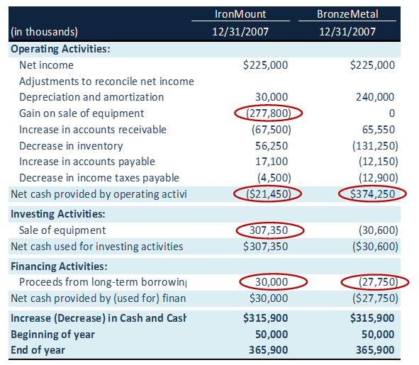

## Table of Contents

## What is a cash flow statement?

A cash flow statement is a financial document that shows how money moves in and out of a business over a specific period, usually a month or a year. It helps business owners and investors understand where the company's money comes from and where it goes. This statement is divided into three main parts: cash from operating activities, cash from investing activities, and cash from financing activities.

The first part, cash from operating activities, shows the money earned from the company's main business activities, like selling products or services. It also includes money spent on things like salaries and rent. The second part, cash from investing activities, shows money spent on or received from investments, like buying or selling equipment or property. The third part, cash from financing activities, shows money coming in or going out from loans, issuing stocks, or paying dividends. Together, these sections give a clear picture of the company's financial health and help in making informed decisions.

## Why is the cash flow statement important for financial analysis?

The cash flow statement is important for financial analysis because it shows how a business handles its money. It tells you if the company is making enough cash to pay its bills, invest in new projects, and return money to shareholders. By looking at the cash flow statement, you can see if the company is healthy or if it might run into money problems soon. This is different from the income statement, which can show profit but not necessarily cash.

Another reason the cash flow statement is useful is that it helps you understand the quality of a company's earnings. Sometimes, a company might show a profit on the income statement, but if it's not getting enough cash, it might be using tricks or selling assets to look good. The cash flow statement helps you see the real story behind the numbers. It also shows how a company is spending its money, whether it's on growing the business, paying down debt, or buying back shares, which can tell you a lot about the company's strategy and future plans.

## What are the three main sections of a cash flow statement?

The first section of a cash flow statement is called cash from operating activities. This part shows the money the company makes from its main business, like selling things or services. It also shows the money the company spends on things like salaries and rent. This section is important because it tells you if the company is making enough money from its main work to keep going.

The second section is called cash from investing activities. This part shows the money the company spends on or gets from investments, like buying or selling equipment or property. If a company is spending a lot of money here, it might be trying to grow or improve its business.

The third section is called cash from financing activities. This part shows the money the company gets from or pays to investors and lenders. This can include taking out loans, paying back loans, or giving money back to shareholders. This section helps you understand how the company is managing its money with others.

## How do you calculate cash flow from operating activities?

To calculate cash flow from operating activities, you start with the company's net income, which is the profit after all expenses are taken out. Then, you need to make some changes to this number to see the real cash flow. You add back any expenses that didn't use cash, like depreciation, because these are just accounting entries and not actual cash going out. You also subtract any income that didn't bring in cash, like gains from selling assets, because these didn't increase the company's cash.

Next, you adjust for changes in working capital. This means looking at things like accounts receivable, inventory, and accounts payable. If accounts receivable go up, it means customers owe the company more money, so you subtract this increase because it's money the company hasn't received yet. If inventory goes down, it means the company sold more products, so you add this decrease because it's like getting cash. If accounts payable go up, it means the company owes more to its suppliers, so you add this increase because it's money the company hasn't paid yet. By making all these adjustments, you get the cash flow from operating activities, which shows how much cash the company made from its main business activities.

## What is the difference between direct and indirect methods of preparing a cash flow statement?

The direct method of preparing a cash flow statement shows the actual cash received and paid out by the company. It lists all the cash inflows from customers and all the cash outflows for things like salaries, rent, and other operating expenses. This method gives a clear picture of how cash moves through the business day to day. It's easier to understand but can be harder to prepare because it requires detailed records of all cash transactions.

The indirect method starts with the company's net income and then makes adjustments to convert this accrual-based income into cash flow. It adds back non-cash expenses like depreciation and makes changes for increases or decreases in working capital items, such as accounts receivable and inventory. This method is more commonly used because it's easier to prepare, especially if the company already has an income statement. However, it doesn't show the actual cash transactions as clearly as the direct method.

Both methods will give you the same total cash flow from operating activities, but they show it in different ways. The direct method is more straightforward for understanding cash movements, while the indirect method is often preferred for its simplicity in using existing financial statements.

## How can changes in working capital affect the cash flow statement?

Changes in working capital can have a big impact on the cash flow statement. Working capital includes things like accounts receivable, inventory, and accounts payable. If accounts receivable go up, it means customers owe the company more money. This is bad for cash flow because the company hasn't received that money yet. So, on the cash flow statement, you subtract the increase in accounts receivable. If inventory goes down, it's good for cash flow because the company sold more products. So, you add the decrease in inventory to the cash flow statement. If accounts payable go up, it means the company owes more to its suppliers, which is good for cash flow because the company hasn't paid that money yet. So, you add the increase in accounts payable.

These changes in working capital show how the company is managing its day-to-day operations. If a company is growing fast, it might have more accounts receivable and inventory, which can hurt cash flow. But if it's managing its suppliers well, it might have higher accounts payable, which can help cash flow. By looking at these changes, you can see if the company is using its working capital well or if it might run into cash problems. This helps investors and managers understand the company's financial health and make better decisions.

## What are common non-cash transactions and how are they reported?

Non-cash transactions are things that affect a company's financial statements but don't involve actual cash moving in or out. Common examples include depreciation, which is the cost of using up an asset over time, and stock-based compensation, where employees get paid in company stock instead of cash. Another example is the exchange of assets, like when a company trades one piece of equipment for another without any cash changing hands. These transactions are important because they can show how a company is managing its resources and planning for the future.

In the cash flow statement, non-cash transactions are not shown in the main sections because they don't affect cash. Instead, they are usually reported in a separate section or in the notes to the financial statements. For example, depreciation is added back to net income in the operating activities section because it was subtracted when calculating net income, but it didn't use any cash. This way, the cash flow statement still shows the true cash flow of the business, while the non-cash transactions are explained separately so everyone can understand the full picture of the company's finances.

## How do you analyze cash flow trends over multiple periods?

To analyze cash flow trends over multiple periods, you look at the cash flow statements from different years or quarters. You compare the numbers to see if the cash flow from operating activities is going up or down. If it's going up, it means the company is making more cash from its main business, which is good. If it's going down, it might mean the company is having trouble making money or is spending more on things like salaries or rent. You also look at the cash flow from investing and financing activities to see if the company is spending more on investments or taking out more loans.

By looking at these trends, you can understand if the company is getting healthier or if it might run into money problems. For example, if the cash flow from operating activities is growing steadily, it's a sign that the company is doing well. But if the company is always taking out new loans to keep going, it might be in trouble. You can also see if the company is making smart decisions with its money, like investing in new projects that will help it grow. This kind of analysis helps investors and managers make better decisions about the company's future.

## What are the key ratios used in cash flow analysis?

Key ratios used in cash flow analysis help you understand how well a company is managing its cash. One important ratio is the operating cash flow ratio, which you get by dividing the cash flow from operating activities by the company's current liabilities. This ratio tells you if the company can pay its short-term bills with the cash it makes from its main business. A higher ratio means the company is in a good position to pay its debts. Another useful ratio is the free cash flow, which is the cash left after the company pays for things it needs to keep running, like new equipment or buildings. Free cash flow shows how much money the company has to grow, pay dividends, or buy back shares.

Another ratio to look at is the cash flow margin, which you find by dividing the cash flow from operating activities by the company's net sales. This ratio tells you how much cash the company makes for every dollar of sales. A higher cash flow margin means the company is good at turning sales into cash. The cash flow to debt ratio is also important, and you get it by dividing the cash flow from operating activities by the company's total debt. This ratio shows if the company can pay off its debt with the cash it makes. A higher ratio means the company is in a better position to handle its debt. By looking at these ratios, you can see if the company is healthy and making smart decisions with its money.

## How can cash flow analysis help in assessing a company's liquidity and solvency?

Cash flow analysis is a great way to figure out how well a company can pay its bills and stay in business. Liquidity is about having enough cash to pay short-term debts, like bills that are due soon. By looking at the cash flow from operating activities, you can see if the company is making enough money from its main business to cover these costs. If the cash flow is positive and growing, it's a good sign that the company is liquid and can handle its short-term needs. Ratios like the operating cash flow ratio help too, because they show if the company can pay its current liabilities with the cash it makes.

Solvency is about the company's ability to pay all its debts, both short-term and long-term, over time. Cash flow analysis helps here by showing if the company has enough cash to keep going and pay off its loans. The cash flow to debt ratio is useful because it tells you if the company can pay its total debt with the cash it makes from its main business. If this ratio is high, it means the company is in a good position to stay solvent. Free cash flow is also important because it shows how much money the company has left after paying for what it needs to keep running, which can be used to pay down debt or invest in the future. By looking at these things, you can tell if the company is strong enough to keep going and pay all its debts.

## What are the limitations of cash flow statements in financial analysis?

Cash flow statements are really helpful, but they don't tell the whole story about a company's finances. One big problem is that they don't show the company's profits or losses. A company might have a lot of cash coming in, but if it's spending more than it's making, it's not really doing well. Also, cash flow statements don't show the value of the company's assets or how much it owes in the long run. So, you need to look at other financial statements, like the income statement and balance sheet, to get a full picture.

Another limitation is that cash flow statements can be affected by things that don't happen every day. For example, if a company sells a big piece of equipment, it might look like it's doing great because it got a lot of cash. But that's not something that happens all the time, so it can make the cash flow look better than it really is. Also, cash flow statements don't show if the company is making smart decisions with its money. Just because a company has a lot of cash doesn't mean it's using it well. So, while cash flow statements are important, they need to be used with other information to really understand a company's financial health.

## How can advanced techniques like free cash flow to equity (FCFE) and free cash flow to the firm (FCFF) enhance cash flow analysis?

Free cash flow to equity (FCFE) and free cash flow to the firm (FCFF) are advanced techniques that can make cash flow analysis even better. FCFE shows how much cash is left for shareholders after the company pays for everything it needs to keep running and pays off its debts. This helps investors see if the company can pay dividends or buy back shares. FCFF, on the other hand, shows how much cash the whole company has before it pays interest to lenders or dividends to shareholders. This is useful for understanding the company's total value and how it's doing overall.

Using FCFE and FCFF can give you a deeper look into a company's financial health. FCFE is great for figuring out what the company can give back to its owners, which is important for investors who want to know if they'll get paid. FCFF is helpful for anyone trying to see the big picture of the company's cash flow, like managers or potential buyers. Both methods help you see beyond the basic cash flow statement and understand how the company is managing its money and planning for the future.

## What is the key to understanding financial statements?

Financial statements serve as crucial instruments for assessing the financial condition of a company, offering insights into its economic resources, financial obligations, and overall performance. The primary components of financial statements include the balance sheet, income statement, and cash flow statement, each serving distinct but complementary functions in financial analysis.

The balance sheet provides a snapshot of a company's financial standing at a particular point in time. It is structured around three primary sections: assets, liabilities, and equity. Assets represent resources owned by the company that hold economic value, such as cash, inventory, and property. Liabilities, on the other hand, comprise obligations that the company must settle, including loans and accounts payable. Equity represents the residual interest in the assets of the company after deducting liabilities and is commonly referred to as shareholders' equity. The balance sheet adheres to the fundamental accounting equation:

$$
\text{Assets} = \text{Liabilities} + \text{Equity}
$$

This equation ensures that the balance sheet remains balanced, providing a clear view of what a company owns and owes, as well as the invested amount by shareholders.

The income statement, often known as the profit and loss statement, is designed to reveal a company's profitability over a specific reporting period. It details revenue earned from sales and other sources alongside expenses incurred, which include the cost of goods sold, operating expenses, and taxes. The bottom line, or net income, is the result of subtracting total expenses from total revenues, offering a measure of the company's financial performance and profitability during the period. It can be expressed as:

$$
\text{Net Income} = \text{Total Revenue} - \text{Total Expenses}
$$

Through the income statement, stakeholders can evaluate how effectively a company generates profit from its operations and controls its expenses.

The cash flow statement is focused on detailing the inflows and outflows of cash within a company over a given timeframe, highlighting its [liquidity](/wiki/liquidity-risk-premium) and cash management strategy. It is divided into three main activities: operating, investing, and financing. Operating activities relate to the core business operations and include cash received from customers and cash paid to suppliers and employees. Investing activities cover the acquisition and disposal of long-term assets such as property and equipment. Financing activities involve transactions with creditors and investors, such as issuing debt or equity and paying dividends. The cash flow statement helps in understanding how well a company can generate cash to fund its operating expenses, pay debts, and make capital investments. 

Evaluating each of these financial statements collectively enables investors, analysts, and other stakeholders to gain a comprehensive understanding of a company's financial health, operational effectiveness, and long-term viability. Understanding these documents is essential for making informed investment decisions and developing robust financial strategies.

## How do you read a cash flow statement?

Understanding cash flow statements requires a comprehensive grasp of reporting methodologies, primarily the direct and indirect methods. These approaches offer distinct advantages and insights, significantly enhancing financial analysis, particularly in trading contexts.

The direct method presents cash flow in a clear and straightforward manner by detailing all cash receipts and payments during a given period. This method directly lists items such as cash received from customers and cash paid to suppliers and employees. The direct method elucidates the net cash provided by operating activities, making it easier to comprehend day-to-day cash transactions. For instance, in Python, one might represent cash flow from operations using a simple dictionary:

```python
cash_receipts_payments = {
    'cash_received_from_customers': 100000,
    'cash_paid_to_suppliers': 60000,
    'cash_paid_to_employees': 20000
}
net_cash_flow_from_operations = cash_receipts_payments['cash_received_from_customers'] - \
                                 (cash_receipts_payments['cash_paid_to_suppliers'] + \
                                  cash_receipts_payments['cash_paid_to_employees'])
```

The indirect method begins with net income, adjusting for non-cash transactions such as depreciation and changes in working capital items like accounts receivable and payable. This method provides an indirect view by reconciling accrual accounting with cash accounting. The formula for adjusting net income (NI) under the indirect method can be expressed as:

$$
\text{Net Cash Flow from Operating Activities} = \text{NI} + \text{Non-Cash Expenses} - \text{Non-Cash Revenues} + \Delta \text{Working Capital}
$$

Where non-cash expenses could include depreciation or amortization, and changes in working capital are accounts such as inventories or receivables/payables that impact cash flow without affecting net income.

Both methods have their utility. The direct method offers transparency in actual cash transactions, which can be particularly beneficial for understanding liquidity flow. However, it may not always mirror the company's net income, thus requiring supplementary information for a complete financial perspective. The indirect method, while less intuitive for cash flows, aligns closely with net income and is more widely used due to its simplicity in preparation from existing financial statements.

Familiarity with these reporting methods not only aids in accurate financial analysis but also enhances the efficacy of trading algorithms. By embedding these insights into trading strategies, traders can refine their decision-making processes, utilizing precise cash flow metrics as predictive indicators of market performance and company health.

## What is financial analysis and why is it important?

Financial analysis is critical for assessing a company's financial health, particularly in evaluating its stability and operational efficiency. Cash flow analysis is a significant component of this process, examining cash movements across operating, investing, and financing activities. Each category provides insights into various aspects of a company's financial operations. Operating activities reveal the net cash generated from core business functions, offering a window into the company's ability to maintain and grow its operations. Investing activities highlight expenditures related to asset acquisition or divestitures, reflecting strategic investment decisions. Financing activities detail cash transactions with equity holders and creditors, indicating how the company manages its capital structure.

Beyond cash flow analysis, comprehensive financial analysis incorporates several key financial ratios. The current ratio, calculated as current assets divided by current liabilities, measures a company's ability to cover short-term obligations with its short-term assets. 

$$
\text{Current Ratio} = \frac{\text{Current Assets}}{\text{Current Liabilities}}
$$

Another important metric is the quick ratio, also known as the acid-test ratio, which assesses the company's immediate liquidity by stripping away inventory from current assets before dividing by current liabilities.

$$
\text{Quick Ratio} = \frac{\text{Current Assets} - \text{Inventory}}{\text{Current Liabilities}}
$$

The debt-to-equity ratio, defined as total liabilities divided by shareholders' equity, provides insight into the company's financial leverage and risk profile.

$$
\text{Debt-to-Equity Ratio} = \frac{\text{Total Liabilities}}{\text{Shareholders' Equity}}
$$

For algorithmic traders, integrating financial analysis with trading algorithms is vital for effective decision-making. Trading algorithms rely on precise financial data to model strategies that predict market movements. By harnessing financial metrics like cash flows and ratios, algorithms can enhance their predictive capability and respond more adeptly to market changes. This integration allows for more informed trading strategies, leveraging historical and real-time data to maximize profit potential while managing risk efficiently. In essence, a robust financial analysis enriches algorithmic models, equipping them with the necessary tools to navigate the complexities of financial markets.

## References & Further Reading

[1]: ["Cash Flow Analysis and Forecasting: The Definitive Guide to Understanding and Using Published Cash Flow Data"](https://onlinelibrary.wiley.com/doi/book/10.1002/9781118467268) by Timothy Jury

[2]: Burns, William J., & Collins, Lisa D. (2012). ["Integrating Cash Flow Analysis and Trading Systems: An In-Depth Approach"](https://onlinelibrary.wiley.com/doi/10.1111/j.1539-6924.2012.01791.x) CFA Institute Conference Proceedings Quarterly.

[3]: Koller, Tim, Goedhart, Marc, & Wessels, David. (2020). ["Valuation: Measuring and Managing the Value of Companies"](https://www.mckinsey.com/capabilities/strategy-and-corporate-finance/our-insights/valuation-measuring-and-managing-the-value-of-companies) Wiley Finance.

[4]: ["Algorithmic Trading: Winning Strategies and Their Rationale"](https://www.amazon.com/Algorithmic-Trading-Winning-Strategies-Rationale-ebook/dp/B00CY5HC0U) by Ernie Chan

[5]: ["Python for Finance: Mastering Data-Driven Finance"](https://www.amazon.com/Python-Finance-Mastering-Data-Driven/dp/1492024333) by Yves Hilpisch