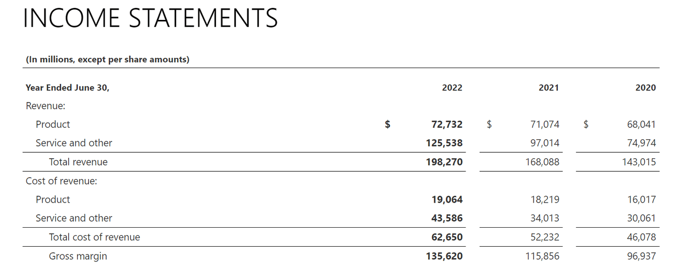

Understanding the fundamentals of corporate profit margins and business profitability is essential in today's competitive market landscape. Companies must continuously evaluate their financial health to maintain a competitive edge and ensure sustainable growth. Central to this evaluation is profit analysis, which examines various facets of a company's earnings and cost structures.

Profit margins serve as vital indicators, offering insights into the efficiency and effectiveness of a business's operations. These margins, such as gross, operating, and net profit margins, provide key metrics that businesses employ to maximize earnings. Different industries may have varying benchmarks, underscoring the importance of context-specific analysis.

In parallel, technological advancements have significantly influenced business strategies, particularly through the emergence and adoption of algorithmic trading. This innovation has enabled companies to make data-driven decisions, optimizing their financial outcomes. Algorithmic trading utilizes complex algorithms and high-speed data processing to identify market opportunities, thereby enhancing profitability.

As we examine corporate profitability and algorithmic trading strategies, it becomes evident that these elements are interconnected, shaping the financial success of modern businesses. With algorithms increasingly managing trading processes, the integration of technology with traditional financial metrics could result in more informed, strategic decisions. This blend of analytics and automation is paving the way for more efficient profit maximization in today’s dynamic economic environment.

## Table of Contents

## Understanding Corporate Profit Margins

Corporate profit margins are critical indicators of a company's financial health, providing insights into its efficiency in converting revenue into actual profit. Different types of profit margins, such as gross margin, operating margin, and net margin, offer varied perspectives on profitability.

The **gross profit margin** reflects the efficiency of production and is calculated as:

$$
\text{Gross Profit Margin} = \left( \frac{\text{Revenue} - \text{Cost of Goods Sold}}{\text{Revenue}} \right) \times 100
$$

This metric is particularly useful in assessing how well a company manages its production costs and pricing strategy. Industries with high raw material costs, like manufacturing, may exhibit lower gross margins compared to service-based industries.

The **operating profit margin** measures a company's operational efficiency and is calculated as:

$$
\text{Operating Profit Margin} = \left( \frac{\text{Operating Income}}{\text{Revenue}} \right) \times 100
$$

Operating margin takes into account not just the cost of goods sold, but all operating expenses, excluding interest and taxes. This is a key metric for investors as it reveals how profitable a company is after covering its operational costs. Companies in industries with high operational expenses, such as technology, might show varied operating margins compared to low-expense sectors like retail.

The **net profit margin** is a comprehensive indicator, calculated as:

$$
\text{Net Profit Margin} = \left( \frac{\text{Net Income}}{\text{Revenue}} \right) \times 100
$$

This ratio provides a clear picture of the overall financial performance, factoring in all expenses, taxes, and revenues. It is the most commonly used metric to compare profitability across companies and industries, as it includes the total financial picture.

When analyzing profit margins, it is essential to consider industry benchmarks. Different sectors have varied standard margins due to inherent differences in business models and cost structures. For instance, the average net margin in the food industry is typically lower than that in the software industry due to the cost-intensive nature of food production compared to software development.

Analyzing corporate profit margins over time helps identify growth patterns or potential issues. A declining margin could signify increased costs or reduced revenue efficiency, prompting deeper investigation into business operations. Conversely, a consistently high margin might indicate robust management and strong competitive positioning.

Real-world examples offer tangible insights into profit margin analysis. For instance, Apple Inc.'s consistently high profit margins reflect its premium pricing strategy and efficient supply chain management, enabling it to maintain strong profitability despite high production costs. In contrast, a company like Amazon operates on thinner margins due to aggressive pricing strategies aimed at securing market share, highlighting different approaches in leveraging profit margins for business decision-making.

In summary, understanding corporate profit margins is essential for assessing a company's financial health. They provide crucial insights that inform strategic decisions, helping businesses optimize operations and enhance profitability.

## Key Profit Margin Ratios for Business Profitability

Profit margin ratios are essential tools for investors, analysts, and business owners to assess a company's financial health and operational efficiency. These ratios not only provide insights into how well a company is generating profit from its revenues but also help in identifying areas for improvement and guiding strategic decisions. The three primary types of profit margin ratios are the Gross Profit Margin, Operating Profit Margin, and Net Profit Margin.

### Gross Profit Margin

The Gross Profit Margin measures the efficiency of a company in managing its production processes. It is calculated by subtracting the cost of goods sold (COGS) from the total sales revenue and then dividing the result by the total sales revenue. Mathematically, it is represented as:

$$
\text{Gross Profit Margin} = \left( \frac{\text{Sales} - \text{COGS}}{\text{Sales}} \right) \times 100
$$

This percentage indicates how well a company is converting sales into gross profit while managing costs directly associated with production or service delivery. A higher gross profit margin suggests effective cost control and a robust production process. Companies in manufacturing, for example, often closely monitor this metric to optimize their supply chain and production efficiency.

### Operating Profit Margin

The Operating Profit Margin extends beyond production efficiency, illustrating a company's effectiveness in managing its overall operations. It accounts for not only the COGS but also other operating expenses such as marketing, administrative costs, and research and development. The formula is:

$$
\text{Operating Profit Margin} = \left( \frac{\text{Operating Income}}{\text{Sales}} \right) \times 100
$$

Operating income is derived by subtracting operating expenses from gross profit. This ratio is crucial as it reflects the company's ability to generate profit from its core business functions before accounting for taxes and interest expenses. A higher operating margin indicates successful management strategies and operational proficiency.

### Net Profit Margin

The Net Profit Margin provides a comprehensive insight into the overall financial performance and profitability of a business. It considers all expenses incurred by the company, including operating expenses, taxes, and interest. The formula is:

$$
\text{Net Profit Margin} = \left( \frac{\text{Net Income}}{\text{Sales}} \right) \times 100
$$

Net income, the numerator, is the profit retained by the company after all expenses. This margin gives the clearest picture of the company's profit-generating capability and is often used for evaluating overall financial success. A robust net profit margin indicates that the company is well-positioned to weather economic fluctuations and invests effectively in growth opportunities.

### Strategic Business Decisions

Each profit margin ratio offers a distinct perspective on the company's financial stature and operational tactics. Investors and managers often use these ratios collectively to identify strengths and weaknesses within the organization. While the gross profit margin focuses on production efficiencies, the operating profit margin evaluates broader management efficiencies, and the net profit margin encompasses the company’s comprehensive ability to remain profitable in the face of all expenses.

Analyzing these ratios facilitates strategic decision-making, aiding businesses in optimizing processes, reducing unnecessary costs, and focusing on core competencies. In industries where profit margins vary significantly, benchmarks can provide context, highlighting areas where a business may deviate from industry norms. By leveraging these insights, businesses can formulate strategies to enhance profitability and maintain a competitive edge in the market.

## Conducting a Profit Analysis

Profit analysis is a vital aspect of business management, going beyond the simplistic measure of net earnings. It provides a comprehensive evaluation of resource efficiency and income generation, offering valuable insights that drive strategic decision-making. Businesses utilize profit analysis to assess their financial health and identify areas for improvement, ultimately enhancing their profitability.

To conduct a thorough profit analysis, companies employ various techniques and metrics. One key approach involves the calculation of profit-margin ratios, which offer in-depth perspectives on business performance. Commonly used ratios include the gross profit margin, operating profit margin, and net profit margin. These ratios are calculated as follows:

1. **Gross Profit Margin**:  
$$
   \text{Gross Profit Margin} = \left( \frac{\text{Revenue} - \text{Cost of Goods Sold (COGS)}}{\text{Revenue}} \right) \times 100

$$
   This metric assesses the efficiency of production management by revealing the percentage of revenue that exceeds the cost of goods sold.

2. **Operating Profit Margin**:  
$$
   \text{Operating Profit Margin} = \left( \frac{\text{Operating Income}}{\text{Revenue}} \right) \times 100

$$
   It highlights how effectively a company manages its operating expenses to generate earnings.

3. **Net Profit Margin**:  
$$
   \text{Net Profit Margin} = \left( \frac{\text{Net Income}}{\text{Revenue}} \right) \times 100

$$
   This ratio provides a holistic view of overall financial performance, indicating the proportion of revenue that becomes profit after all expenses.

By calculating these ratios, businesses can benchmark their performance against industry standards. This comparison helps companies evaluate their competitive positioning and identify areas where they may have a competitive advantage or need improvement. For instance, a company with a higher gross profit margin than the industry average may have more efficient production processes or cost controls.

Effective profit analysis can also uncover hidden opportunities for profitability enhancement. For example, it might reveal inefficiencies in the supply chain or highlight the need for strategic investments in technology or human resources. Businesses can then make informed decisions to optimize operations, reduce costs, or capitalize on market opportunities.

By integrating comprehensive profit analysis practices, businesses not only measure their current performance but also strategically plan for future growth. These analyses reveal the nuances of financial data, enabling companies to refine their strategies and improve their approach to resource management. Ultimately, profit analysis is a powerful tool for driving sustainable and strategic growth within a competitive market landscape.

## Algorithmic Trading and Its Impact on Profitability

Algorithmic trading has emerged as a significant force in the financial sector, transforming traditional trading practices through the use of automated systems. By harnessing complex algorithms, these systems make split-second trading decisions based on vast amounts of market data, thereby enhancing trade efficiency and execution speed. Algorithmic trading systems analyze historical data, current market conditions, and statistical models to identify trading opportunities that align with predefined strategies. This automation reduces human error and increases the potential for profit optimization by operating continuously without fatigue.

Central to evaluating the effectiveness of [algorithmic trading](/wiki/algorithmic-trading) strategies are key performance metrics such as the Sharpe Ratio, Maximum Drawdown, and Profit Factor. The Sharpe Ratio measures the risk-adjusted return of an investment, effectively balancing potential returns with [volatility](/wiki/volatility-trading-strategies). It is calculated using the formula: 

$$
\text{Sharpe Ratio} = \frac{E[R] - R_f}{\sigma}
$$

where $E[R]$ is the expected portfolio return, $R_f$ is the risk-free rate, and $\sigma$ is the standard deviation of the portfolio's return. A higher Sharpe Ratio indicates a more favorable risk-reward balance. Meanwhile, Maximum Drawdown assesses the largest peak-to-trough decline in a portfolio’s value before a new peak is achieved, providing insights into potential vulnerabilities during adverse market conditions. The Profit Factor measures the ratio of total profitable trades to total losing trades, which indicates the overall profitability of a strategy.

The incorporation of [machine learning](/wiki/machine-learning) and big data analytics is further revolutionizing algorithmic trading. Machine learning algorithms have the capability to dynamically adapt to changing market conditions by learning patterns from historical price movements and making predictions based on these insights. Big data provides the necessary infrastructure to process large volumes of diverse datasets, enabling more accurate and timely trading decisions. For instance, natural language processing can analyze news articles or social media sentiments to predict market trends.

Despite the advantages, several challenges arise when integrating algorithmic trading into business operations. One primary consideration is model risk, which involves the potential for algorithms to malfunction under unforeseen market conditions. Ensuring the accuracy of the input data and maintaining the adaptability of trading models are crucial to mitigating this risk. Moreover, regulatory compliance is essential as algorithmic trading systems must adhere to financial market rules and regulations, which can vary significantly across jurisdictions. The complexity of these systems also demands significant initial investments in technology and skilled personnel, which may not be feasible for all organizations.

In conclusion, algorithmic trading offers substantial benefits in terms of speed and efficiency. However, companies must carefully address the inherent challenges, such as model risk and compliance, to fully capitalize on its potential to enhance profitability.

## Case Studies and Industry Examples

Examining various case studies provides valuable insights into how businesses have successfully leveraged profit margin analysis to enhance profitability and how algorithmic trading strategies have been implemented across different industries.

One notable example is a retail company that improved its profitability by focusing on profit margin analysis. By carefully dissecting its gross, operating, and net profit margins, the company identified areas of inefficiency within its supply chain. For instance, they found that logistics costs were disproportionately high compared to others in the industry. By renegotiating supplier contracts and optimizing their logistics operations, the firm significantly reduced costs, resulting in a substantial improvement in its overall profit margins.

In the financial sector, algorithmic trading has been increasingly adopted to improve trading outcomes. A prominent [hedge fund](/wiki/hedge-fund-trading-strategies) utilized algorithmic trading to execute trades based on complex mathematical models incorporating historical data and real-time market conditions. By employing strategies such as statistical [arbitrage](/wiki/arbitrage) and high-frequency trading, the hedge fund achieved a competitive edge with faster transaction speeds and reduced human-induced errors, resulting in higher profitability compared to traditional trading methods that rely heavily on human intuition and slower execution processes.

Comparing algorithmic trading with traditional investment methods reveals that algorithms can outperform humans under specific conditions. Traditional methods often involve extensive research and a considerable amount of time spent analyzing market trends. Conversely, algorithmic trading uses predefined rules and executes trades at a much faster pace, improving opportunity capture. However, it is also essential to note the risks associated with algorithmic trading, such as technology failures and unintended market consequences.

Industry leaders and experts have provided several insights on best practices for balancing risk and profitability when integrating algorithmic trading. Diversification in strategy implementation, continuous performance monitoring, and the use of robust risk management systems are critical. They emphasize the need for a well-rounded approach that combines quantitative models with qualitative insights to foresee potential market anomalies.

These case studies underscore the tangible benefits that can be realized through focused profit margin analysis and the strategic implementation of algorithmic trading. However, they also highlight the challenges, such as technological dependency and market volatility, that companies must navigate to maintain profitability in an increasingly data-driven business environment.

## Conclusion

Profit margins and algorithmic trading hold significant influence over the long-term success of modern businesses. To thrive in competitive markets, companies must thoroughly understand profit analysis metrics, which form the basis for informed financial and strategic decisions. Key ratios such as the gross profit margin, operating profit margin, and net profit margin offer crucial insights into different aspects of financial performance, guiding businesses towards enhancing earnings and operational efficiency.

Algorithmic trading, with its data-driven and automated approach, presents substantial advantages by improving efficiency and decision-making processes in financial transactions. Algorithms process vast data sets to identify trading opportunities quickly and execute strategies that maximize profit potential. However, the inherent complexities and rapid advancements in technology mean that algorithmic trading requires meticulous risk management. Factors like the Sharpe Ratio, Maximum Drawdown, and Profit Factor are essential for evaluating the effectiveness of these strategies, ensuring that potential gains do not come at the expense of excessive risk.

The dynamic nature of financial markets necessitates continuous adaptation to maintain a competitive edge. Companies must integrate new technologies and market analytics to remain relevant in shifting economic landscapes. Businesses that successfully blend financial analysis with automation stand to benefit from increased profitability. Such integration not only streamlines operations but also enhances the accuracy and speed of financial decision-making, providing a strategic advantage.

In conclusion, understanding and applying profit margin analysis and algorithmic trading are not mere options but essential elements for businesses aiming for sustainable growth in today's financial environment. Adaptability and strategic integration of these components will be key to maintaining and increasing profitability.

## References & Further Reading

[1]: Bergstra, J., Bardenet, R., Bengio, Y., & Kégl, B. (2011). ["Algorithms for Hyper-Parameter Optimization."](https://proceedings.neurips.cc/paper/2011/file/86e8f7ab32cfd12577bc2619bc635690-Paper.pdf) Advances in Neural Information Processing Systems 24.

[2]: ["Advances in Financial Machine Learning"](https://www.amazon.com/Advances-Financial-Machine-Learning-Marcos/dp/1119482089) by Marcos Lopez de Prado

[3]: ["Evidence-Based Technical Analysis: Applying the Scientific Method and Statistical Inference to Trading Signals"](https://www.amazon.com/Evidence-Based-Technical-Analysis-Scientific-Statistical/dp/0470008741) by David Aronson

[4]: ["Machine Learning for Algorithmic Trading"](https://github.com/PacktPublishing/Machine-Learning-for-Algorithmic-Trading-Second-Edition) by Stefan Jansen

[5]: ["Quantitative Trading: How to Build Your Own Algorithmic Trading Business"](https://www.amazon.com/Quantitative-Trading-Build-Algorithmic-Business/dp/1119800064) by Ernest P. Chan