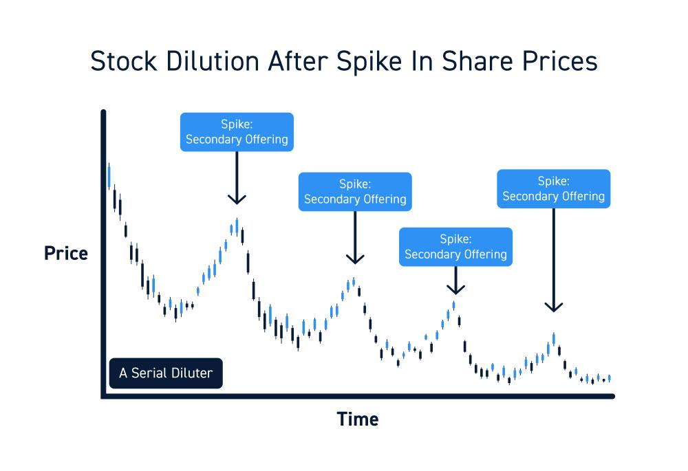

Understanding financial metrics is crucial for investors looking to assess the potential of stock investments. These metrics provide insights into a company's financial health and future prospects, greatly influencing investment decisions. Among these metrics, the diluted share price holds significant importance in stock analysis. The diluted share price accounts for the potential decrease in earnings per share resulting from convertible securities such as stock options, convertible bonds, and warrants. This metric provides a more comprehensive view of a company's earnings and financial stability, helping investors make informed decisions.

In recent years, algorithmic trading has gained prominence, revolutionizing the way investors engage with the stock market. Algorithmic trading involves using computer programs and predefined strategies to execute trades at high speeds and frequencies unimaginable by human traders. In this era of fast-paced trading, accurately interpreting financial metrics like the diluted share price can lead to improved trading outcomes. By incorporating thorough financial analysis into these algorithms, traders can develop strategies that respond to market changes more effectively and efficiently.



This article explores the intricate relationships between financial metrics, diluted share price, stock analysis, and algorithmic trading. By understanding how these elements interact, investors and traders can enhance their investment analysis and trading strategies. We aim to equip investors and algorithmic traders with the knowledge and tools required to interpret these metrics accurately, paving the way for more informed and strategic investment decisions.

## Table of Contents

## What is the Diluted Share Price?

Diluted share price is an important financial metric that reflects the potential dilution of a company's earnings per share (EPS) when considering convertible securities such as stock options, convertible bonds, and other financial instruments. Convertible securities give holders the right to convert their holdings into common shares, potentially increasing the total number of shares outstanding. This increase can lead to a reduction in earnings per share, as earnings are divided among a larger pool of shares.

Understanding diluted earnings per share (EPS) is essential for investors, as it provides a more accurate assessment of a company's financial health and profitability. It accounts for the potential dilution effect of securities that could be converted into additional shares. This metric helps investors gauge whether the company's earnings are sustainable if all convertible securities are executed.

Diluted share price considers several elements, including stock options granted to employees, convertible preference shares, warrants, and convertible bonds. Each of these instruments has the potential to increase the number of shares in circulation, thus diluting the value of existing shares.

1. **Stock Options:** Companies often grant stock options to employees as part of their compensation packages. These options allow employees to purchase company stock at a predetermined price, potentially increasing the number of shares outstanding if exercised.

2. **Convertible Bonds:** These are bonds that can be converted into a set number of shares at the bondholder's discretion. When holders convert their bonds, the company must issue additional shares, leading to dilution.

3. **Warrants:** Similar to options, warrants are financial instruments that give the holder the right to purchase shares at a specified price. Exercising warrants also results in additional shares being issued.

Analyzing a firm on a fully diluted basis, which considers all potential conversions, provides a clearer and more comprehensive picture of its financial metrics. The formula for calculating diluted EPS is as follows:

$$
\text{Diluted EPS} = \frac{\text{Net Income} - \text{Preferred Dividends}}{\text{Weighted Average Shares} + \text{Convertibles + Options + Warrants}}
$$

By evaluating companies on a fully diluted basis, investors and analysts can make more informed decisions, understanding the true potential impact of dilution on earnings. This comprehensive analysis is vital in assessing a firm's long-term profitability and investment viability.

## Calculating Diluted Earnings Per Share (EPS)

Basic Earnings Per Share (EPS) and Diluted Earnings Per Share (EPS) are essential financial metrics used to evaluate a company's profitability. Basic EPS is a straightforward calculation that divides a company's net income by its outstanding shares. However, Diluted EPS provides a more comprehensive view by considering the potential impact of convertible securities that can be converted into additional shares, potentially diluting the value of existing shares.

**Basic EPS vs. Diluted EPS: Understanding the Difference**

Basic EPS is calculated using the formula:
$$
\text{Basic EPS} = \frac{\text{Net Income} - \text{Preferred Dividends}}{\text{Weighted Average Number of Common Shares Outstanding}}
$$

Diluted EPS, on the other hand, accounts for all potential dilution by incorporating additional securities that could be converted into common stock, such as stock options, convertible bonds, and warrants. The formula for Diluted EPS is:
$$
\text{Diluted EPS} = \frac{\text{Net Income} - \text{Preferred Dividends}}{\text{Weighted Average Number of Common Shares Outstanding} + \text{Dilutive Potential Common Shares}}
$$

**Formula and Steps to Calculate Diluted EPS**

1. **Identify the Net Income and Preferred Dividends**: Calculate the net income after taxes and subtract any preferred dividends.

2. **Determine the Weighted Average Shares Outstanding**: Calculate the average number of shares outstanding during the period under consideration.

3. **Identify Potentially Dilutive Securities**: These may include employee stock options, convertible bonds, and warrants. Each of these instruments has the potential to increase the number of shares outstanding upon conversion or exercise.

4. **Calculate Additional Dilutive Shares**: For each class of potentially dilutive securities, calculate the number of additional shares they would convert into if exercised.

5. **Adjust the Denominator**: Add the dilutive shares to the weighted average shares outstanding to arrive at the denominator for Diluted EPS.

6. **Compute Diluted EPS**: Use the adjusted denominator in the Diluted EPS formula.

**Impact of Convertible Bonds, Stock Options, and Warrants**

Each type of convertible security has a unique impact on Diluted EPS:

- **Convertible Bonds**: When bondholders convert their bonds to stock, it increases the number of shares outstanding. The interest saved on these bonds is added back to net income before calculating EPS.

- **Stock Options and Warrants**: These are rights given to purchase company stock at a predetermined price. The difference between the exercise price and the market price affects how many additional shares would be issued upon exercise. The treasury stock method is typically used to calculate this impact, where the proceeds from exercising the options are assumed to be used to repurchase shares at the current market price.

**Example Calculation**

Consider a company with the following data:

- Net Income: \$1,000,000
- Preferred Dividends: \$100,000
- Weighted Average Shares Outstanding: 500,000 shares
- Convertible Bonds that could convert into 50,000 additional shares
- Stock Options that could convert into 30,000 additional shares

Calculating Basic EPS:
$$
\text{Basic EPS} = \frac{\$1,000,000 - \$100,000}{500,000} = \$1.80
$$

Calculating Diluted EPS:

- **Additional Shares from Convertible Bonds**: 50,000 shares
- **Additional Shares from Stock Options**: 30,000 shares

Total Dilutive Shares = 50,000 + 30,000 = 80,000
Adjusted Weighted Average Shares = 500,000 + 80,000 = 580,000

$$
\text{Diluted EPS} = \frac{\$1,000,000 - \$100,000}{580,000} = \$1.55
$$

This calculation shows how potential share dilution from convertible bonds and options decreases the EPS figure, providing a more conservative measure of earnings per share. By understanding and calculating Diluted EPS, investors can recognize the implications of convertible securities on a company's earnings, leading to more informed investment decisions.

## Importance of Financial Metrics in Stock Analysis

Financial metrics are crucial for assessing the value and potential growth of stock investments. Among these metrics, the diluted share price significantly influences stock valuations. It reflects the potential decrease in earnings per share (EPS) that occurs when convertible securities, such as stock options, convertible bonds, and warrants, are exercised. This metric provides investors with a more comprehensive view of a company's financial health by considering potential dilution effects, enabling them to make informed investment decisions.

In [fundamental analysis](/wiki/fundamental-analysis), financial metrics serve as essential tools to evaluate the intrinsic value of a company. The diluted share price plays a critical role as it acknowledges the impact of additional shares being issued. When analysts assess a company's earnings, they prefer using diluted EPS over basic EPS, as it offers a conservative estimate, accounting for all possible dilutive securities. This comprehensive approach ensures that investors are aware of the maximum potential impact on their earnings per share, safeguarding against overvaluation.

Evaluating a company's performance using diluted financial metrics allows for a more precise comparison with industry peers. By incorporating potential dilution into their assessments, analysts can better understand the company's financial strategies, such as stock-based compensation plans and financing through convertible securities. For instance, when a company heavily relies on issuing stock options as a form of employee compensation, its diluted EPS will present a more accurate picture of the company's profitability. This transparency allows investors to gauge the company's operational efficiency and its ability to generate shareholder value in a more realistic light.

Moreover, the influence of the diluted share price extends beyond individual company analysis. It also affects broader market dynamics and stock valuations. For instance, in periods of strong market performance, companies may issue more convertible securities to capitalize on high valuations, which in turn leads to increased potential dilution. Investors aware of these dynamics can anticipate changes in stock prices caused by dilution events and adjust their portfolios accordingly.

In conclusion, the diluted share price and other financial metrics are indispensable to stock analysis. They provide an accurate reflection of a company’s financial health and help investors make well-informed decisions by considering the potential effects of dilution on earnings. Understanding these metrics enables investors to evaluate companies with precision and contributes to more efficient stock market valuations.

## Utilizing Diluted Share Price in Algorithmic Trading

Incorporating diluted financial metrics into trading algorithms can significantly enhance the decision-making process in [algorithmic trading](/wiki/algorithmic-trading). Diluted share price, an extension of earnings per share (EPS), accounts for the potential conversion of all convertible securities, illustrating a more comprehensive view of a company's financial performance. This adjustment allows for a realistic reflection of a company's equity valuation, which is crucial for constructing robust trading models.

One of the primary benefits of using diluted financial metrics, such as diluted EPS, is the improved accuracy in automated trading decisions. Trading algorithms that integrate detailed financial metrics can make more informed predictions about stock price movements. This integration ensures that algorithms account for potential changes in share count and earnings projections, which may otherwise be overlooked if relying solely on basic EPS.

To implement these metrics, algorithms must first adjust the EPS to account for potential dilution. The Diluted EPS formula is:

$$

\text{Diluted EPS} = \frac{\text{Net Income} - \text{Preferred Dividends}}{\text{Weighted Average Shares Outstanding} + \text{Convertible Securities}}
$$

In this formula, "Convertible Securities" represents the number of shares that could be issued from convertible bonds, stock options, or warrants if they are exercised. By implementing this calculation in a trading algorithm, market participants can derive a realistic and conservative estimate of a company’s earnings, factoring in all possible dilutive effects.

Algorithmic trading strategies utilizing diluted EPS can vary in complexity. A simple example might involve algorithms that use diluted EPS alongside price-to-earnings (P/E) ratios to identify undervalued stocks. Here’s a basic Python snippet that demonstrates how one might incorporate diluted EPS into a simple evaluation strategy:

```python
def calculate_diluted_eps(net_income, preferred_dividends, weighted_shares, convertible_securities):
    return (net_income - preferred_dividends) / (weighted_shares + convertible_securities)

def is_undervalued(stock_price, diluted_eps, pe_ratio_threshold):
    actual_pe_ratio = stock_price / diluted_eps
    return actual_pe_ratio < pe_ratio_threshold

# Example usage
stock_price = 100
net_income = 5000000
preferred_dividends = 50000
weighted_shares = 100000
convertible_securities = 20000
pe_ratio_threshold = 15

diluted_eps = calculate_diluted_eps(net_income, preferred_dividends, weighted_shares, convertible_securities)
if is_undervalued(stock_price, diluted_eps, pe_ratio_threshold):
    print("The stock is considered undervalued.")
else:
    print("The stock price reflects its value.")
```

More sophisticated trading strategies might integrate [machine learning](/wiki/machine-learning) models that train on historical data, evaluating how diluted EPS correlates with stock price movements across different market conditions. These models can predict future price movements and make trading decisions accordingly, achieving potentially higher accuracy and profitability.

Overall, incorporating diluted share price and other detailed financial metrics into algorithmic trading strategies offers a comprehensive approach to stock valuation. This incorporation ensures that trading decisions are based on a thorough analysis of potential future equity structures, thereby improving the robustness of algorithmic trading models.

## Case Studies: Impact of Dilution on Stock Prices

### Case Studies: Impact of Dilution on Stock Prices

Share dilution can significantly affect stock prices by altering supply dynamics and influencing investor perceptions. This section examines real-world instances of companies that have undergone share dilution, analyzing market reactions and drawing valuable lessons from how these events have been managed.

#### Real-world Examples of Share Dilution

1. **Tesla, Inc.**
   Tesla has periodically issued new shares to raise capital for its ambitious expansion plans. In 2020, the company announced a $5 billion share sale to capitalize on its high stock price. This move slightly diluted existing shareholders' stakes but was well-received by the market, with Tesla's share price continuing to rise. Investors perceived the capital raise as a positive step towards funding future growth.

2. **Snap Inc.**
   When Snap Inc., the parent company of Snapchat, went public in 2017, it faced criticism for issuing non-voting shares, leading to concerns about shareholder influence. The subsequent dilution from employee stock options and restricted stock units (RSUs) also raised red flags. Despite these concerns, Snap's stock rebounded over time as the company improved its product offerings and revenue model.

3. **Netflix, Inc.**
   Netflix has frequently turned to the equity markets to raise funds, issuing new shares to finance its content production and international expansion. Between 2015 and 2018, the company raised over $6 billion this way. However, Netflix's strong growth narrative helped mitigate any adverse effects of dilution, with share prices appreciating as new content attracted more subscribers.

#### Analysis of Market Reactions and Long-term Impacts

Market reactions to share dilution are influenced by various factors, including the company's growth prospects, use of proceeds from new share issuance, and overall market conditions. For companies like Tesla and Netflix, the narrative of strong future growth and strategic use of funds helped offset potential negative impacts of dilution.

In contrast, companies with less clear growth trajectories or those issuing shares under financial distress may face harsher market reactions. Dilution in such cases can exacerbate downward pressure on stock prices, as seen in many biotech firms with frequent equity issuances to fund research without corresponding revenue growth.

#### Lessons Learned from Managing Dilution Events

1. **Communication is Crucial:**
   Transparent communication about the reasons for share dilution and how the proceeds will be utilized can help manage investor expectations and maintain confidence. Companies like Tesla have effectively communicated their capital-raising strategies aligned with growth objectives.

2. **Strategic Use of Proceeds:**
   Successfully navigating dilution events often hinges on the efficient use of the raised capital to drive growth. Demonstrating a clear plan for revenue generation and expansion can help mitigate the adverse effects of dilution.

3. **Balancing Growth and Equity Preservation:**
   Companies need to strike a balance between issuing new shares for growth and minimizing shareholder dilution. Innovative financing strategies, such as issuing convertible bonds or exploring partnership opportunities, can provide alternatives to straight share issuance.

By examining how companies have managed share dilution, investors gain insights into the importance of strategic planning and communication in maintaining market confidence. Understanding these dynamics aids investors in making informed decisions when evaluating companies undergoing similar events.

## Conclusion

Understanding the diluted share price alongside other financial metrics is vital for investors and algorithmic traders aiming to make informed investment decisions. The diluted share price provides a more comprehensive view of a company’s potential earnings by accounting for all convertible securities, such as stock options and convertible bonds, that could potentially dilute the outstanding shares. This metric allows investors to better gauge the financial health and future profitability of a company.

Incorporating a thorough analysis of these financial indicators in investment evaluation enables investors to make more accurate assessments of a company’s worth. By comparing basic earnings per share (EPS) with diluted EPS, investors can understand how financial circumstances and potential dilution events might impact shareholder value. The ability to predict such changes can significantly influence investment strategies and outcomes.

Furthermore, in algorithmic trading, utilizing diluted share price and related metrics facilitates the development of more robust trading algorithms. These metrics can be integrated into quantitative models, enhancing automated trading systems' ability to forecast stock price movements and make data-driven trading decisions. Such integration not only improves the precision of trading strategies but also maximizes potential returns by anticipating market reactions to dilution and other financial events.

In conclusion, appreciating the nuances and implications of diluted share price and various financial metrics is essential in today’s dynamic financial environment. A comprehensive analysis empowers investors and traders alike to navigate complex market conditions, leveraging these insights to refine their stock analysis and enhance algorithmic trading strategies. This multifaceted approach to investing can contribute significantly to achieving successful financial outcomes.

## References & Further Reading

### References & Further Reading

#### Articles and Books

1. **"Financial Statement Analysis" by Martin S. Fridson and Fernando Alvarez**  
   This book provides an insightful guide into the interpretation of financial statements, including an understanding of diluted share price and other metrics crucial for financial analysis.

2. **"Valuation: Measuring and Managing the Value of Companies" by McKinsey & Company Inc.**  
   A comprehensive reference that discusses enterprise valuation, incorporating crucial aspects like diluted earnings per share into company valuations.

3. **"Algorithmic Trading: Winning Strategies and Their Rationale" by Ernest P. Chan**  
   This book explores the development of algorithmic trading strategies, including the integration of financial metrics such as diluted EPS in trading models.

4. **"Applied Corporate Finance" by Aswath Damodaran**  
   This text provides a practical view on corporate finance, offering insights into how dilution impacts corporate valuations and investor assessments.

#### Online Resources

1. **Investopedia**  
   The online financial encyclopedia offers detailed articles explaining various financial metrics, including a comprehensive guide on diluted EPS and its significance in stock analysis. [Investopedia on Diluted EPS](https://www.investopedia.com/terms/d/dilutedearnings.asp)

2. **Corporate Finance Institute (CFI)**  
   CFI offers various free resources, including online courses and articles on financial metrics, which can help deepen your understanding of the diluted share price and its influence on stock evaluation.

3. **Wiley Online Library**  
   A diverse collection of academic journals and articles that publish research findings on financial metrics, stock analysis, and algorithmic trading.

#### Tools and Software

1. **Bloomberg Terminal**  
   A leading software application for financial professionals, Bloomberg provides comprehensive data and analytics, including tools for analyzing diluted share price impacts.

2. **Python with Pandas and NumPy Libraries**  
   Python is a versatile programming language useful for financial analysis. Combining Pandas for data manipulation and NumPy for numerical calculations can help compute diluted EPS and simulate algorithmic trading strategies.

   ```python
   import numpy as np
   import pandas as pd

   # Example DataFrame with hypothetical data
   data = pd.DataFrame({
       'Net_Income': [1000000, 1200000],
       'Shares_Outstanding': [100000, 105000],
       'Convertible_Securities': [10000, 12000],
       'Convertible_Rate': [10, 15]
   })

   # Calculate Diluted EPS
   data['Diluted_Shares'] = data['Shares_Outstanding'] + (data['Convertible_Securities'] / data['Convertible_Rate'])
   data['Diluted_EPS'] = data['Net_Income'] / data['Diluted_Shares']
   print(data[['Diluted_EPS']])
   ```

3. **Excel Financial Modeling**  
   Excel remains a powerful tool for building financial models, allowing for the calculation of diluted metrics and the simulation of various scenarios involving potential share dilution.

By exploring these resources, investors and algorithmic traders can gain a comprehensive understanding of financial metrics, including diluted share price, to enhance their decision-making processes.

