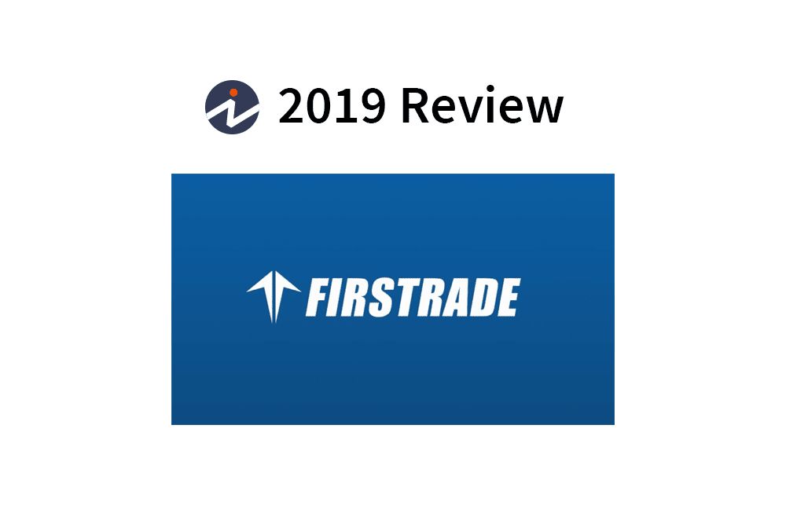

In the evolving landscape of online brokerage services, Firstrade stands out as a compelling option for both new and experienced investors. Established firms continually adapt to market demands, and Firstrade has managed to maintain relevance by offering competitive brokerage solutions. This article aims to provide an in-depth review of Firstrade's investments and brokerage services, with a special focus on their algorithmic trading solutions.

Investors today face a plethora of choices, making it crucial to understand the unique offerings and limitations of each brokerage firm. Firstrade is known for its cost-effective trading services and commitment to user-friendliness, aspects that this article will explore in detail. Notably, the lack of robust algorithmic trading tools is a significant consideration for those interested in automating their trading strategies.

Understanding Firstrade's position in the market can help investors make informed decisions regarding their trading options. For those interested in low-cost trades or pursuing active trading strategies, Firstrade offers several attractive features. This review will cover the essential aspects of Firstrade’s services, helping readers assess whether this platform aligns with their trading goals and needs.

## Table of Contents

## Company Overview

Founded in 1985, Firstrade Securities initially operated under the name First Flushing Securities, establishing its roots in New York. The brokerage firm was initially designed to serve the unique financial needs of Chinese immigrants, providing a vital link to the American financial markets. By offering culturally and linguistically tailored services, Firstrade quickly gained a loyal customer base within these communities, positioning itself as a trusted partner in financial growth and education. 

Over the years, Firstrade has significantly evolved, expanding its service offerings to become a comprehensive brokerage firm accessible to a diverse clientele. Today, Firstrade is recognized for its dedication to delivering user-friendly, low-cost brokerage solutions that appeal to a broad spectrum of investors, from novices to seasoned market participants. A key aspect of Firstrade’s service is its multilingual support, which includes both traditional and simplified Chinese. This aspect of their service underscores Firstrade’s commitment to accessibility and customer service excellence, aiming to break down language barriers within the financial industry.

Through strategic innovation and a steadfast focus on cost-efficiency, Firstrade continues to provide value-driven services, ensuring that investors can access essential trading platforms and investment products without incurring prohibitive costs. Despite its humble beginnings, Firstrade has maintained its core principle of supporting individual investors by simplifying the trading process and promoting financial literacy across diverse communities.

## Trading Experience and Usability

Firstrade's trading platforms are meticulously designed to prioritize simplicity, offering an intuitive interface that caters to both novice investors and seasoned traders. The platform’s user-centric design ensures that even those without extensive trading experience can navigate the system with ease. This accessibility is a standout feature, making Firstrade an appealing choice for individuals who value straightforward trading capabilities without the complexity that often accompanies advanced trading systems. 

One of the core strengths of Firstrade's platforms is their seamless integration across web and mobile applications, which allows users to access their accounts and execute trades using various devices. This synchronization ensures that portfolios can be monitored and managed efficiently, whether on a desktop at home or on the move via a smartphone. 

However, despite the user-friendly approach, Firstrade's platforms do fall short in terms of offering advanced trading tools which are increasingly in demand by sophisticated traders. Features such as enhanced charting tools, which allow for technical analysis directly from graphs, and more comprehensive analytical tools, are not as developed compared to some competing platforms. This limitation can be significant for traders who rely extensively on detailed market analysis to inform their trading strategies. 

The emphasis on simplicity extends to Firstrade’s interface, which avoids unnecessary complexity, allowing users to focus on the essentials of trading without distractions. While this approach benefits those who prioritize straightforward transactions and quick access to essential information, it may not satisfy users looking for more elaborate functionalities. 

Overall, Firstrade's trading experience is highly tailored for users who prioritize ease of use and accessibility over advanced trading features. While advanced traders may find the platform lacks certain tools for more complex analysis and strategy implementation, the platform remains an excellent choice for many investors, particularly those who value a straightforward and integrated trading experience.

## Trading Technology and Algo Trading

The introduction of Firstrade Navigator marked a notable advancement for active traders by offering streaming quotes and real-time data, significantly enhancing the trading experience. This feature allows users to make informed decisions swiftly by providing updated information on market movements. The real-time data capability can be particularly beneficial for traders engaging in high-frequency trading or those needing instantaneous access to market insights.

However, despite these technological advancements, Firstrade's platform does not include specific [algorithmic trading](/wiki/algorithmic-trading) tools, which can be a significant limitation for traders seeking automated trading solutions. Algorithmic trading, or algo trading, uses computer programs to execute trades based on predefined criteria, taking advantage of speed and precision that human traders cannot achieve manually. While Firstrade Navigator provides essential data for informed trading, the absence of algo trading capabilities means traders must look elsewhere if they wish to employ more sophisticated trading strategies that rely on automation.

For traders dedicated to algorithmic strategies, alternative platforms might offer integrated algo trading functionalities that enable the creation and [backtesting](/wiki/backtesting) of automated trading strategies. Such features typically include APIs (Application Programming Interfaces) facilitating the design of trading algorithms that can automatically execute trades based on specific conditions set by the trader.

In summary, while Firstrade Navigator significantly enhances the trading experience with streaming quotes and real-time data, the lack of native algorithmic trading tools means that traders looking to capitalize on automated strategies might need to consider other brokerage platforms that support these advanced functionalities.

## Mobile and Emerging Tech

Firstrade's mobile application mirrors the user-friendly design of its web platform, offering accessibility and convenience for trading on the go. The mobile app is structured to provide a seamless trading experience, accommodating both novice and experienced traders with an intuitive interface. Despite its strengths, the app lacks some advanced functionalities, such as trading directly from charts, which could be a limitation for traders who rely heavily on technical analysis and instant execution based on charting tools.

Users benefit from the app's ability to deliver real-time updates, which ensures that they remain informed of market changes as they occur. This feature is essential for traders who need to make timely decisions, and it helps in maintaining the pace of trading akin to that on the desktop platform. The integration of push notifications and alert systems provides an added layer of interaction, allowing users to set personalized alerts for price changes or significant market events.

The mobile platform's commitment to accessibility also extends to its multilingual support, reflecting Firstrade's dedication to serving a diverse user base. While proficient in providing essential trading services, the app could further enhance its offering by integrating emerging technologies such as AI-driven insights or automated trading features, which are increasingly becoming popular in contemporary trading environments. These advancements could position Firstrade's mobile services to better meet the evolving demands of the global trading community.

## Range of Offerings

Firstrade offers a comprehensive selection of investment products that appeal to budget-conscious traders, particularly due to its commission-free trading structure. This structure applies to a variety of financial instruments, including stocks, exchange-traded funds (ETFs), and options. By eliminating commissions on these products, Firstrade positions itself as an economical choice for traders who prioritize low transaction costs. This offering aligns with a broader industry trend towards zero-commission trading, making investment more accessible to retail investors who may have been previously deterred by high fees.

Despite the extensive range of commission-free options, Firstrade does not currently offer trading in [forex](/wiki/forex-system) or futures. This limitation could be a significant consideration for traders who require a comprehensive brokerage solution that accommodates more sophisticated trading strategies. Forex trading, which involves the exchange of currencies on the foreign exchange market, and futures trading, which involves contracts to buy or sell assets at a future date, are complex instruments often utilized by advanced traders for hedging and speculating purposes.

The absence of these products could potentially steer experienced traders towards platforms that provide a more extensive variety of trading instruments. It is important for traders to evaluate their specific needs and preferences, considering whether the absence of forex and futures trading impacts their overall trading strategy and objectives. While Firstrade's offerings are well-suited for those who focus primarily on equities and options, traders with broader investment portfolios might seek alternative platforms that deliver more diverse market access.

## Customer Service and Support

While Firstrade provides multilingual customer support during market hours, it does not offer 24/7 assistance, which might pose challenges for international traders needing immediate help outside standard trading times. This limitation can affect users operating across different time zones who requie timely responses.

To address high-demand periods, Firstrade offers a callback service, allowing customers to receive assistance without enduring extended wait times on the phone. This service ensures that client inquiries are managed efficiently, particularly during peak trading times when market activities and customer requests are heightened.

The brokerage's approach to multilingual support reflects its origins and continued dedication to serving a diverse clientele. Support is available in languages including traditional and simplified Chinese, aligning with its historical focus on providing services to Chinese-speaking communities and expanding its accessibility to a broader audience.

Overall, Firstrade's customer service strategy is designed to cater to a wide array of clients, focusing on accessibility and efficiency within market hours, with the callback feature providing an additional layer of convenience. However, the absence of round-the-clock support is a notable limitation for users requiring immediate assistance outside these hours.

## Costs and Fees

Firstrade distinguishes itself in the competitive brokerage industry with its cost-effective trading solutions, particularly through its $0 commissions on stock, [ETF](/wiki/etf-trading-strategies), and options trades. This pricing model is especially beneficial for investors looking to minimize transaction costs and maximize profit margins on their trades.

While Firstrade's zero-commission structure is appealing, it's important to consider other potential costs associated with brokerage services. For instance, margin trading is available for those interested in leveraging their investments, though this service involves additional fees. Firstrade's margin rates align with standard industry practices, maintaining competitiveness among brokers. The exact cost of margin trading can vary based on the amount borrowed and the prevailing interest rates, factors that investors should evaluate when considering leveraging their trades.

Besides margin trading fees, Firstrade may charge fees for specific services or account features. For example, there might be charges related to wire transfers, paper statements, or certain account transfers. However, these fees are typically competitive with other brokerage firms, ensuring that Firstrade remains a viable option for cost-conscious traders.

In summary, Firstrade's zero-commission policy on stocks, ETFs, and options enhances its appeal as a cost-efficient trading platform. While some services incur standard fees, these remain in line with, if not better than, those of other brokerage firms, reinforcing Firstrade's standing in the market as a cost-effective solution for investors focusing on traditional securities trading.

## Conclusion

Firstrade presents itself as a strong option for investors looking to minimize trading costs, with particular appeal to those focusing on stock and options trading. The absence of commissions on such trades is a significant advantage for cost-conscious traders, enabling them to maximize their investment returns without the added burden of transaction fees.

However, Firstrade's trading technology, while user-friendly and accessible, may not meet the needs of traders who require sophisticated tools for algorithmic trading. The platform's simplicity, which is an asset for beginner and intermediate investors, might be seen as a disadvantage for those seeking advanced analytical features and algorithmic capabilities. This limitation could necessitate the exploration of alternative platforms that cater specifically to automated trading solutions.

Prospective investors need to evaluate their trading goals and technological requirements when considering Firstrade as their brokerage service. For individuals prioritizing ease of use and cost efficiency over advanced trading technology, Firstrade provides a compelling solution. Conversely, those with a primary focus on algorithmic trading should carefully assess whether Firstrade's offerings align with their strategic objectives.

## References & Further Reading

[1]: ["Advances in Financial Machine Learning"](https://www.amazon.com/Advances-Financial-Machine-Learning-Marcos/dp/1119482089) by Marcos Lopez de Prado

[2]: ["Machine Learning for Algorithmic Trading: Second Edition"](https://github.com/PacktPublishing/Machine-Learning-for-Algorithmic-Trading-Second-Edition) by Stefan Jansen

[3]: ["Quantitative Trading: How to Build Your Own Algorithmic Trading Business"](https://www.amazon.com/Quantitative-Trading-Build-Algorithmic-Business/dp/1119800064) by Ernest P. Chan

[4]: Friedman, J. H. (2001). ["Greedy Function Approximation: A Gradient Boosting Machine."](https://www.jstor.org/stable/2699986) The Annals of Statistics.

[5]: ["Technical Analysis and Algorithmic Trading"](https://onlinelibrary.wiley.com/doi/pdf/10.1002/9781119201823.ch6) by Samipendra Bhotika