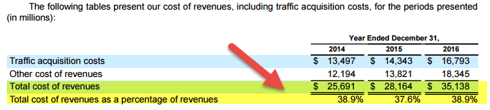

## Table of Contents

## What is a financial statement?

A financial statement is a document that shows the financial health of a business or organization. It tells you how much money the business has, how much it owes, and how it is making or losing money. There are three main types of financial statements: the balance sheet, the income statement, and the cash flow statement. These statements help business owners, investors, and others understand the financial situation of the company.

The balance sheet shows what the company owns (assets) and what it owes (liabilities) at a specific point in time. It also shows the owner's equity, which is the difference between assets and liabilities. The income statement, on the other hand, shows how much money the company made (revenue) and spent (expenses) over a period of time, like a month or a year. It tells you if the company made a profit or a loss. The cash flow statement tracks the actual cash coming in and going out of the business, which is important for understanding the company's liquidity and ability to pay its bills.

## What are the main components of Google's financial statements?

Google's financial statements are important documents that show how the company is doing financially. They include three main parts: the balance sheet, the income statement, and the cash flow statement. The balance sheet tells you what Google owns, like buildings and equipment, and what it owes, like loans and bills. It also shows the difference between what Google owns and owes, which is called shareholders' equity. This part helps people see if Google is financially strong or not.

The income statement shows how much money Google makes from things like advertising and how much it spends on things like salaries and research. It tells you if Google is making a profit or a loss. This is important for understanding if the company is doing well in its business. The cash flow statement tracks the actual money coming in and going out of Google. It shows how much cash Google has on hand, which is important for paying bills and making investments. Together, these statements give a clear picture of Google's financial health.

## How does Google generate its revenue?

Google makes most of its money from advertising. When you see ads on Google's search results or on YouTube, companies pay Google to show those ads to people. These ads are called "pay-per-click" because companies only pay when someone clicks on their ad. This is a big part of Google's business and brings in a lot of money every year. Google also has a program called Google Ads, where businesses can create and manage their own ads, and this helps Google earn even more money.

Besides advertising, Google also makes money from other services. For example, Google sells apps and games on the Google Play Store, and it takes a cut from each sale. Google also offers cloud computing services through Google Cloud, where businesses pay to use Google's powerful computers and storage. These services add to Google's revenue but not as much as advertising does. Overall, Google's main way of making money is by showing ads to people who use its services.

## What are the key financial ratios used to analyze Google's performance?

When people want to understand how well Google is doing financially, they look at some important numbers called financial ratios. One key ratio is the Price-to-Earnings (P/E) ratio, which shows how much investors are willing to pay for each dollar of Google's earnings. A high P/E ratio might mean people think Google will do well in the future. Another important ratio is the Return on Equity (ROE), which tells you how good Google is at making money from the money shareholders have put into the company. A higher ROE means Google is using that money well to grow its profits.

Another ratio people look at is the Debt-to-Equity (D/E) ratio, which shows how much Google relies on borrowed money compared to money from shareholders. A lower D/E ratio means Google isn't using a lot of debt, which can be a good sign. The Gross Margin ratio is also important because it shows how much money Google keeps after paying for the costs of its services. A higher gross margin means Google is good at keeping costs low and making more money from what it sells. These ratios help people see if Google is a good investment and if it's managing its money well.

## How has Google's revenue growth trended over the past five years?

Over the past five years, Google's revenue has generally grown a lot. From 2019 to 2023, Google made more and more money each year. In 2019, Google's revenue was about $162 billion, and by 2023, it had grown to around $283 billion. This means that over these five years, Google's revenue grew by about 75%. The biggest part of this growth came from Google's advertising business, which includes ads on search and YouTube. Even though the world faced challenges like the COVID-19 pandemic, Google was still able to increase its revenue.

The growth in Google's revenue wasn't always the same every year. For example, in 2020, when the pandemic started, Google's revenue growth slowed down a bit because many businesses cut back on their advertising budgets. But by 2021 and 2022, Google's revenue picked up again as more people used the internet and businesses started spending more on ads. In 2023, Google continued to see strong growth, helped by its other services like Google Cloud and the Google Play Store. Overall, Google's ability to keep growing its revenue shows that it is doing well in its business, even when things are tough.

## What are the major expenses reported in Google's income statement?

Google's income statement shows that it spends a lot of money on different things. The biggest expense for Google is what it pays to its employees, like salaries and benefits. This is called "cost of revenues" and includes the money Google pays to people who work on things like ads and cloud services. Another big expense is research and development (R&D). Google spends a lot on R&D to come up with new ideas and improve its products. This helps Google stay ahead of other companies.

Google also has to pay for things like marketing and sales to tell people about its services and convince them to use them. This includes the cost of running ads and paying people who sell Google's services to businesses. Another important expense is general and administrative costs, which cover things like office rent, utilities, and other everyday expenses needed to run the company. All these expenses together help Google keep its business running and growing, but they also take a big chunk out of the money Google makes.

## How does Google's profitability compare to its competitors?

Google, which is part of Alphabet Inc., makes a lot of money compared to other companies in the same business. In 2023, Google's profit margin was around 21%, which means for every dollar it made, it kept about 21 cents as profit. This is higher than many of its competitors. For example, Meta (the company that owns Facebook) had a profit margin of about 19% in the same year. This shows that Google is good at making money and keeping costs low, which makes it more profitable than some of its rivals.

However, when you look at other tech giants like Microsoft and Apple, the comparison changes a bit. Microsoft had a profit margin of around 34% in 2023, which is much higher than Google's. Apple did even better with a profit margin of about 25%. These companies have different ways of making money, with Microsoft focusing more on software and cloud services, and Apple selling lots of high-priced products like iPhones. Even though Google's profit margin is lower than Microsoft's and Apple's, it's still very strong in the tech industry and shows that Google is doing well financially compared to many other companies.

## What insights can be drawn from Google's cash flow statement?

Google's cash flow statement gives us a good look at how money moves in and out of the company. It shows that Google makes a lot of money from its main business, which is mostly from advertising. This money comes in as cash from operations, and it's a big number because Google is good at getting people to click on ads. The cash flow statement also tells us that Google spends a lot of money on new things like buildings and computers, which is called investing activities. Even though they spend a lot, Google still has a lot of cash left over because their main business brings in so much money.

Another thing we can see from Google's cash flow statement is how they handle their money when it comes to paying shareholders and buying back their own stock. This is called financing activities. Google often uses some of its extra cash to buy back its own shares, which can make the value of the remaining shares go up. They also pay dividends, but not as much as some other companies. Overall, Google's cash flow statement shows that they are good at making money, spending it wisely on growth, and giving some back to shareholders, which means they are in a strong financial position.

## How does Google manage its debt and equity?

Google, which is part of Alphabet Inc., uses a mix of debt and equity to run its business. They don't rely too much on debt, which is good because it means they don't have to pay back a lot of money with interest. Google's debt-to-equity ratio is pretty low compared to other big companies. This means they use more of their own money (equity) than borrowed money (debt) to grow their business. This makes Google financially strong and less risky for investors.

Google also uses its equity well. They make a lot of money, and some of it goes back to shareholders through buying back their own stock. This can make the value of the remaining shares go up. Google doesn't pay big dividends like some other companies, but they do give some money back to shareholders this way. By managing debt and equity carefully, Google keeps a good balance and stays in a strong financial position.

## What are the significant non-operating items affecting Google's net income?

Google's net income can be affected by things that are not part of its main business, like advertising and cloud services. One big non-operating item is the money Google makes or loses from investing in other companies or financial markets. For example, if Google invests in a startup and that startup does well, Google can make extra money. But if the investment doesn't do well, it can lose money, which affects the net income.

Another important non-operating item is the interest Google pays or earns. If Google borrows money, it has to pay interest on that debt, which reduces its net income. On the other hand, if Google has extra cash and puts it in a bank or buys bonds, it can earn interest, which adds to its net income. These non-operating items can make a big difference in how much profit Google reports at the end of the year.

## How do foreign exchange rates impact Google's financials?

Foreign exchange rates can affect Google's financials because Google does business all over the world. When Google makes money in different countries, it has to change that money into US dollars to report its earnings. If the US dollar gets stronger compared to other currencies, the money Google makes in those other countries will be worth less in US dollars. This can make Google's total earnings look smaller even if it made the same amount of money in those countries. On the other hand, if the US dollar gets weaker, the money Google makes in other countries will be worth more in US dollars, which can make its earnings look bigger.

Google also has to deal with foreign exchange rates when it spends money in different countries. If Google has to pay for things like offices or services in other countries, and the US dollar gets weaker, those costs will be higher when changed back to US dollars. This can make Google's expenses look bigger and affect its profits. To manage these risks, Google uses different financial tools to protect itself from big changes in foreign exchange rates, but these rates can still have a big impact on its financial statements.

## What are the future financial risks and opportunities for Google based on current financial data?

Looking at Google's current financial data, there are some risks that could affect its future. One big risk is how much Google depends on advertising for its money. If there's a big change in how people use the internet or if a new technology comes along that changes how ads work, Google could make less money. Another risk is the cost of running its business. Google spends a lot on research and development to stay ahead, but if these costs keep going up faster than its earnings, it could hurt its profits. Also, changes in laws about privacy or how companies can use data could make it harder for Google to show ads, which would be bad for its business.

On the other hand, there are also many opportunities for Google to grow its business. One big opportunity is in cloud computing. Google Cloud is getting more popular, and if it keeps growing, it could bring in a lot more money. Google is also working on new technologies like artificial intelligence, which could help it make new products and services that people will want to use. Another opportunity is in new markets around the world. As more people in different countries start using the internet, Google can make more money from ads and other services in those places. If Google can keep finding new ways to grow and manage its risks well, it could have a bright financial future.

## What is the Importance of Google’s Balance Sheet?

A balance sheet is a fundamental financial statement that offers a snapshot of Google’s financial health at a given time, detailing its assets, liabilities, and shareholder equity. This document is crucial for assessing liquidity, asset performance, and financial stability, making it an indispensable tool for investors and automated trading systems alike.

To evaluate liquidity, liquidity ratios such as the current ratio and the quick ratio are of significant importance. The current ratio is calculated as:

$$
\text{Current Ratio} = \frac{\text{Current Assets}}{\text{Current Liabilities}}
$$

This ratio measures Google's ability to cover its short-term obligations with its short-term assets, indicating its immediate financial health. A higher current ratio signifies a stronger [liquidity](/wiki/liquidity-risk-premium) position, suggesting that Google is well-equipped to meet its short-term debts.

Additionally, the quick ratio further refines this assessment by excluding inventory from current assets, considering only the most liquid assets:

$$
\text{Quick Ratio} = \frac{\text{Current Assets} - \text{Inventories}}{\text{Current Liabilities}}
$$

This measurement is particularly useful in understanding Google's capacity to handle unexpected financial demands without relying on the sale of inventory, which may not be as liquid.

Analyzing changes in these financial ratios over time provides valuable insights into Google's operational efficiency and management strength. For instance, improving liquidity ratios over several quarters may indicate enhanced cash management and prudent financial practices, while declining ratios could signal potential challenges in meeting financial obligations.

Therefore, Google's balance sheet not only offers a snapshot of its current financial stance but also serves as a potent diagnostic tool for monitoring its financial trajectory over time. Automated trading systems can leverage these insights to inform predictive models, aiding in the development of strategies that can capitalize on Google's financial strengths or hedge against potential weaknesses. By continually analyzing these key financial metrics, investors and traders can enhance their decision-making processes in an increasingly dynamic market environment.

## What are the balance sheet considerations in algorithm development?

In algorithm development, analyzing a company's balance sheet is integral to predicting financial stability. Key components such as intangibles and accruals play a significant role in this analysis. Intangible assets, including brand reputation and intellectual property, although non-physical, can heavily influence a company’s valuation and future [earning](/wiki/earning-announcement) potential. Accruals, on the other hand, reflect earned revenues and incurred expenses not yet realized in cash form, providing insights into future cash flow and profitability. Calculating an accurate net working capital (NWC), given by:

$$
\text{NWC} = \text{Current Assets} - \text{Current Liabilities}
$$

is essential, as it affects liquidity analysis.

The accuracy of financial reports is paramount. Errors or inconsistencies can lead investors to make misguided decisions, subsequently affecting algorithmic trading strategies. Therefore, algorithms should incorporate real-time data validation techniques to identify discrepancies. Developing algorithms that automatically detect and respond to irregularities is critical. Such algorithms can apply statistical methods to detect anomalies, thereby adjusting trading strategies in response to potential manipulations or reporting errors. An example in Python might involve using libraries like Scikit-learn to identify anomalous data points:

```python
from sklearn.ensemble import IsolationForest

def detect_anomalies(data):
    # Fit the model
    model = IsolationForest(contamination=0.05)
    model.fit(data)

    # Predict anomalies
    anomalies = model.predict(data)
    return anomalies

``` 

Risk management is another pivotal consideration. Integrating features like stop-loss orders, which are activated based on specific financial metric thresholds, can mitigate losses due to unexpected market volatility. These orders can automatically sell securities when their price falls below a predetermined point, thus limiting potential losses. For instance:

```python
def execute_stop_loss(current_price, stop_loss_threshold):
    if current_price < stop_loss_threshold:
        # Code for executing sell order
        sell_order()
```

This capability ensures that algorithms not only aim for profitability but also incorporate robust mechanisms to protect investments. Consequently, including comprehensive balance sheet analysis within algorithmic trading mitigates risks, enables adaptive response to market anomalies, and ultimately supports the development of reliable and proficient trading strategies.

## References & Further Reading

[1]: ["Machine Learning for Algorithmic Trading"](https://github.com/stefan-jansen/machine-learning-for-trading) by Stefan Jansen

[2]: ["Quantitative Trading: How to Build Your Own Algorithmic Trading Business"](https://www.amazon.com/Quantitative-Trading-Build-Algorithmic-Business/dp/1119800064) by Ernest P. Chan

[3]: ["Advances in Financial Machine Learning"](https://www.amazon.com/Advances-Financial-Machine-Learning-Marcos/dp/1119482089) by Marcos Lopez de Prado

[4]: ["Financial Statement Analysis & Valuation"](https://courses.business.columbia.edu/B8009) by Peter D. Easton, Mary Lea McAnally, Gregory A. Sommers, and Xiao-Jun Zhang

[5]: ["Evidence-Based Technical Analysis: Applying the Scientific Method and Statistical Inference to Trading Signals"](https://www.amazon.com/Evidence-Based-Technical-Analysis-Scientific-Statistical/dp/0470008741) by David Aronson