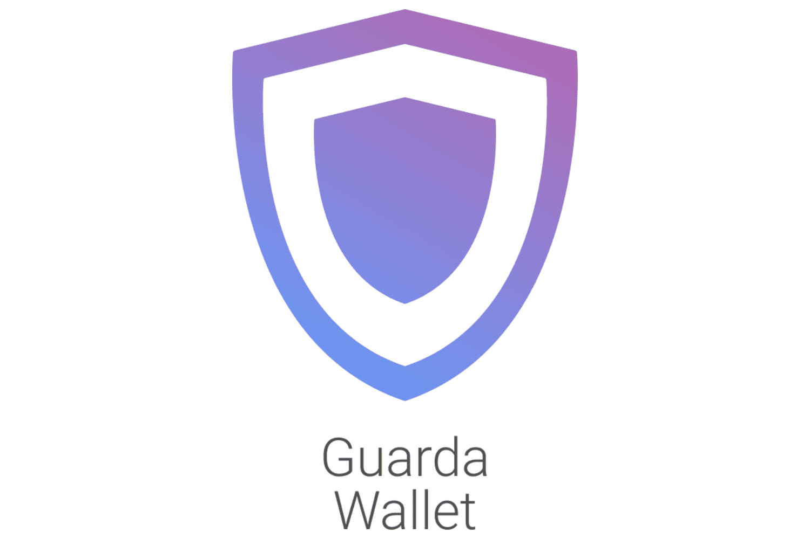

The digital currency landscape has seen exponential growth in recent years, creating a pressing need for effective and secure management solutions. As cryptocurrencies continue to gain popularity, ensuring their safekeeping while maximizing investment returns has become increasingly important. This article investigates the essential aspects of cryptocurrency storage, emphasizing the crucial role of cryptocurrency wallets like Guarda Wallet in safeguarding digital assets. It explores how these wallets can provide users with the necessary tools to protect their investments from potential security threats. 

Moreover, the exploration of algorithmic trading highlights its significance as a strategy for optimizing cryptocurrency investments. Algorithmic trading employs software to automate and execute complex trading strategies at speeds that surpass human capabilities. This makes it an indispensable tool for exploiting market inefficiencies and potentially enhancing profitability. 

Thus, the combination of advanced crypto storage solutions, such as Guarda Wallet, with sophisticated trading techniques represents an exciting opportunity for cryptocurrency enthusiasts and investors. This convergence promises to offer a secure and efficient means of managing crypto assets and trading them strategically, highlighting a new frontier in digital finance that can significantly enhance a portfolio's performance while ensuring its security.

## Table of Contents

## Understanding Cryptocurrency Storage

Cryptocurrency storage involves the diverse methods and technologies designed to maintain the security of digital assets. The secure management of cryptocurrencies is predominantly dependent on the utilization of wallets, which are essential for safeguarding these digital currencies against unauthorized access and cyber threats.

Two primary categories of storage solutions exist: hot and cold storage, each offering distinct levels of security tailored for different user needs. Hot storage refers to wallets connected to the internet, enabling ease of access and convenience for frequent transactions. These types of wallets, including software and web-based wallets, are conducive for traders who require quick accessibility and simplified trading processes. However, their constant internet connectivity makes them susceptible to cyber threats and hacking attempts, necessitating robust security measures to mitigate potential risks.

Conversely, cold storage solutions are designed to provide a higher level of security by being completely offline and disconnected from the internet. This category includes hardware wallets and paper wallets. Hardware wallets are physical devices that store the user's private keys offline, offering enhanced protection against online breaches. Paper wallets involve the physical printout of private keys, safeguarding digital assets from digital attacks. Despite their security benefits, cold storage solutions may lack the immediacy and convenience inherent to hot storage, making them more suitable for long-term storage rather than regular trading activities.

Choosing the appropriate storage solution is critical for the protection of digital assets from hacking and loss. Factors such as frequency of transactions, value of assets, and individual risk tolerance should guide the selection process. Employing a combination of both hot and cold storage solutions could be an effective strategy for balancing security with accessibility, affording users the flexibility to engage in regular trading while simultaneously safeguarding significant holdings. This diversified approach aids in mitigating risks and enhances the overall security and management of [cryptocurrency](/wiki/cryptocurrency) portfolios.

## Exploring Cryptocurrency Wallets

Cryptocurrency wallets are integral to accessing and managing digital assets stored on the blockchain. They facilitate the secure storage and transfer of cryptocurrencies by leveraging cryptographic keys. Wallets can be broadly categorized into four main types: software, hardware, paper, and web-based wallets. Each type offers distinct advantages and security features, making the choice of wallet critical for users.

**Software Wallets**: These are applications or programs installed on a device, such as a computer or smartphone, allowing users to securely access their cryptocurrencies. Software wallets can be further divided into desktop, mobile, and online (web-based) wallets. Desktop wallets provide control over private keys and are more secure when compared to online wallets, as they are not continuously connected to the internet. However, they are susceptible to malware attacks if the device is compromised. Mobile wallets offer on-the-go access to digital assets and often include QR code functionality for easy transactions. Online wallets, hosted on cloud servers, are convenient for frequent transactions but pose higher security risks due to potential server breaches.

**Hardware Wallets**: These are physical devices designed to securely store private keys offline. Popular examples include devices like Ledger Nano S and Trezor. Hardware wallets offer a high level of security against online threats as they remain disconnected from the internet. They are considered one of the safest options for long-term storage. The key vulnerability lies in the physical loss or destruction of the device itself, making backups a necessary precaution.

**Paper Wallets**: These are essentially printed sheets containing one's public and private keys. A paper wallet is generated using a secure, offline method and often includes a QR code for easy scanning. The primary advantage is the complete immunity to online hacking, as it is entirely offline. However, the paper must be kept safe from physical damage or loss. An additional risk involves the potential exposure of private keys during the wallet's creation or printing process.

**Web-based Wallets**: Web-based wallets operate online and can be accessed from any internet-enabled device. They allow users to manage their cryptocurrencies via a browser interface. While highly convenient, especially for beginners, they present security risks since the control over private keys often lies with the service provider, increasing vulnerability to online attacks.

Central to all cryptocurrency wallets is the functionality of cryptographic keys, which comprise private and public keys. A public key is akin to a bank account number, sharing it allows others to send funds to the wallet. Conversely, a private key is the secret code that enables the owner to access and manage their funds. Maintaining the confidentiality of private keys is crucial to ensure the security of the cryptocurrency assets. Wallets often provide a seed phrase, such as a series of 12 to 24 words, to recover private keys in case of loss, underscoring the importance of keeping this information secure as well.

In summary, choosing the appropriate type of wallet depends on the user’s needs and their risk tolerance. An understanding of how wallets operate, particularly the management of cryptographic keys, is vital for any cryptocurrency user seeking security and efficiency in handling digital assets.

## Guarda Wallet: A Comprehensive Solution

Guarda Wallet is a highly versatile, non-custodial wallet designed to meet the diverse needs of cryptocurrency users. It supports a wide array of digital assets, allowing users to store, manage, and transfer multiple cryptocurrencies in a single, unified platform. This flexibility is critical in an evolving digital currency market where users often hold a diversified portfolio of assets.

One of the standout features of Guarda Wallet is its multi-platform accessibility. Users can choose from desktop, mobile, and web applications, ensuring that they can access and manage their assets no matter where they are. This is particularly important in a fast-paced environment where market conditions can change rapidly, requiring users to make timely decisions regarding their investments. The desktop application offers robust functionalities tailored for comprehensive management, while the mobile application provides on-the-go convenience. The web application ensures accessibility from any internet-enabled device, offering convenience without compromising on features.

Guarda Wallet facilitates seamless cryptocurrency management. It allows users to exchange cryptocurrencies directly within the wallet, bypassing the need for external exchanges. This integration simplifies the trading process and enhances security by minimizing the exposure of digital assets to third-party services. Guarda's exchange feature not only supports trading between different cryptocurrencies but also enables users to perform swaps quickly and efficiently.

Furthermore, Guarda Wallet supports staking for various cryptocurrencies, enabling users to earn passive income by participating in network consensus mechanics. Staking is an attractive option for users looking to generate returns on assets that would otherwise remain idle. By providing staking options within the wallet, Guarda enhances its utility and value proposition, thus attracting users seeking additional functionalities beyond basic storage.

Security is a paramount consideration for Guarda Wallet. Its non-custodial nature means that users retain full control over their private keys, aligning with the core decentralized principles of cryptocurrency. Guarda employs advanced encryption protocols to ensure that user data and assets remain secure. A critical aspect of its security features is the wallet's approach to privacy, ensuring that personal information remains confidential.

The user-friendly interface of Guarda Wallet further contributes to its popularity among crypto enthusiasts. It is designed with intuitive navigation and clear instructions, making it accessible to both seasoned traders and newcomers. The wallet seamlessly integrates complex functionalities into an easy-to-use platform, reducing the learning curve associated with cryptocurrency management.

In summary, Guarda Wallet's comprehensive solution provides a robust, secure, and versatile environment for cryptocurrency management. Its multi-platform approach, combined with features like exchange and staking, sets it apart as a leading option for those looking to manage their digital assets efficiently and securely. As the cryptocurrency landscape continues to evolve, tools like Guarda Wallet will remain indispensable for users seeking a reliable and user-centric management solution.

## Algorithmic Trading in Cryptocurrency

Algorithmic trading, often abbreviated as 'algo trading', is a method that utilizes computer programs to execute a set of predefined trading instructions to generate profits at speeds and frequencies impossible for human traders. This approach encompasses a diverse array of trading strategies, including [market making](/wiki/market-making), [trend following](/wiki/trend-following), and statistical [arbitrage](/wiki/arbitrage), all of which are executed in real-time and with minimal human intervention. 

The fundamental principle behind [algorithmic trading](/wiki/algorithmic-trading) involves the automation of trading processes to capitalize on market conditions and inefficiencies. Algorithms can analyze large volumes of market data, identify trends, and perform trades based on this analysis, all within milliseconds. This capacity to process information and execute trades at lightning speed gives algorithmic trading a significant advantage over manual trading methods.

One of the key benefits of algorithmic trading in the cryptocurrency market is its ability to exploit market inefficiencies—situations where asset prices deviate from their fair value. These inefficiencies might arise due to mismatches between supply and demand, sudden news events, or various market anomalies. By using algorithms to detect and act on these opportunities, traders can potentially achieve higher profitability compared to traditional methods.

For instance, the arbitrage strategy, which involves the simultaneous purchase and sale of an asset to profit from price differences across markets, is effectively implemented in crypto trading through algorithmic systems. An algorithm might be designed to monitor price disparities between different cryptocurrency exchanges and automatically execute buy or sell orders to exploit these differences.

Furthermore, the integration of secure cryptocurrency storage solutions with algorithmic trading is becoming increasingly relevant. As high-frequency trading systems engage in automated trading activities, the need for secure handling and storage of digital assets grows. This ensures not only the protection of funds but also facilitates smooth and efficient trading operations. The synergy between these secure storage solutions and trading technologies contributes to an advanced, reliable ecosystem, enabling traders to optimize their strategies while keeping their assets safeguarded.

The continuous development in algorithmic trading and its integration with secure crypto storage presents new possibilities in the cryptocurrency space, reflecting a pivotal advancement in digital finance strategies and infrastructure.

## Integrating Guarda Wallet with Algo Trading

Integrating Guarda Wallet with algorithmic trading offers a streamlined experience for cryptocurrency investors seeking to optimize their strategies securely. Guarda Wallet, a versatile non-custodial wallet, can be effectively paired with algorithmic trading platforms to manage and store crypto assets. This integration is particularly beneficial for high-frequency trading, where rapid asset exchanges require a secure and reliable wallet platform.

The core attribute of Guarda Wallet that enhances its compatibility with algo trading is its non-custodial nature. Unlike custodial wallets, non-custodial wallets do not hold users' private keys, empowering traders with full control over their resources. This feature harmonizes with the decentralized ethos that underpins algorithmic trading, promoting privacy and reducing reliance on third parties.

Guarda's multi-platform availability further enhances its integration with trading algorithms, as users can access their wallets via desktop, mobile, or web applications. This flexibility ensures that traders can monitor and manage their assets across various devices and synchronize trading data efficiently. The wallet also supports a wide range of cryptocurrencies, enabling diverse trading strategies while protecting investments through advanced security measures.

In the context of maximizing returns, the integration of Guarda Wallet with algo trading strategies is significant. The non-custodial nature safeguards assets against unauthorized access while sophisticated trading algorithms can exploit market inefficiencies for higher profitability. This combination allows investors to execute complex strategies securely and efficiently, minimizing risks associated with digital asset management.

Overall, the integration of Guarda Wallet with algorithmic trading platforms represents a synergy between secure crypto management and advanced trading paradigms, setting the stage for sustained growth and innovation in digital asset investments.

## Conclusion

The intersection of secure cryptocurrency storage solutions and advanced trading techniques signifies a considerable advancement in digital finance. This fusion not only enhances the security and management of digital assets but also optimizes investment strategies, creating new potential for profitability.

Guarda Wallet exemplifies this advancement by offering a robust platform to manage a wide array of cryptocurrency activities securely. Its non-custodial nature ensures that users retain control over their private keys, minimizing the risks associated with centralized storage solutions. The wallet's user-friendly interface and multi-platform availability—encompassing desktop, mobile, and web applications—make it accessible for both novice and experienced crypto users alike, supporting diverse needs through features like crypto exchange and staking.

As the digital currency landscape continues to evolve, the combination of wallets like Guarda with algorithmic trading strategies presents promising opportunities. Algorithmic trading allows for the automation of complex trading strategies, exploiting market inefficiencies and executing trades at speeds beyond human capability. By integrating these strategies with a secure storage solution like Guarda Wallet, users can efficiently manage and protect their assets while engaging in high-frequency trading.

To maintain a competitive edge, investors and cryptocurrency enthusiasts must continually adapt, leveraging new tools and technologies. As the industry advances, understanding and utilizing secure wallets in conjunction with algorithmic trading will be essential for optimizing cryptocurrency portfolios and achieving substantial returns. Embracing these innovations can lead to significant improvements in security, efficiency, and profitability within the dynamic world of digital finance.

## References & Further Reading

[1]: ["Mastering Bitcoin: Unlocking Digital Cryptocurrencies"](https://www.amazon.com/Mastering-Bitcoin-Unlocking-Digital-Cryptocurrencies/dp/1449374042) by Andreas M. Antonopoulos

[2]: Bonneau, J., Miller, A., Clark, J., Narayanan, A., Kroll, J. A., & Felten, E.W. (2015). ["SoK: Research Perspectives and Challenges for Bitcoin and Cryptocurrencies."](https://ieeexplore.ieee.org/document/7163021) IEEE Symposium on Security and Privacy.

[3]: Narayanan, A., Bonneau, J., Felten, E., Miller, A., & Goldfeder, S. (2016). ["Bitcoin and Cryptocurrency Technologies."](https://press.princeton.edu/books/hardcover/9780691171692/bitcoin-and-cryptocurrency-technologies) Princeton University Press.

[4]: Gandal, N., & Halaburda, H. (2014). ["Competition in the Cryptocurrency Market."](https://papers.ssrn.com/sol3/papers.cfm?abstract_id=2501640) SSRN Electronic Journal.

[5]: ["Cryptocurrency Trading & Investing: Beginners Guide To Trading & Investing In Bitcoin, Alt Coins & ICOs"](https://www.amazon.com/Cryptocurrency-Trading-Investing-Beginners-Bitcoin/dp/1977924530) by Aimee Vo

[6]: Pardo, R. (2008). ["The Evaluation and Optimization of Trading Strategies"](https://onlinelibrary.wiley.com/doi/book/10.1002/9781119196969) by Robert Pardo

[7]: ["The Book of Satoshi: The Collected Writings of Bitcoin Creator Satoshi Nakamoto"](https://www.amazon.com/Book-Satoshi-Collected-Writings-Nakamoto/dp/0996061312) by Phil Champagne