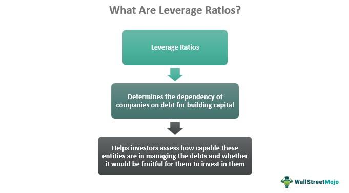

In today's fast-paced financial markets, investors continually seek new strategies to enhance their returns. Central to these efforts are leveraged investments, financial analysis, innovative investment strategies, and algorithmic trading. These components are crucial for understanding market dynamics and making informed investment decisions.

Leveraged investments allow investors to magnify their market exposure and potential returns by using borrowed capital. However, this strategy is accompanied by increased risk, making sound financial analysis indispensable. Financial analysis, which involves evaluating an investment's viability, stability, and profitability, provides insights necessary for making informed investment decisions. Key metrics, such as the debt-to-equity ratio and interest coverage, are essential in assessing the potential success of leveraged investments.



Investment strategies are designed to achieve specific financial objectives through a structured approach. Effective strategies encompass a range of traditional and alternative investments, focusing on maximizing returns while carefully managing risk. Techniques like market timing, hedging, and value investing cater to different investor preferences and market conditions, empowering investors to navigate market volatility efficiently.

Algorithmic trading, which uses computer programs to execute trades based on predetermined criteria, revolutionizes trade execution by providing speed and efficiency. This approach reduces transaction costs and eliminates emotional responses, allowing for systematic and data-driven trading strategies. With the integration of data analysis and machine learning, algorithmic trading continues to evolve, offering sophisticated tools for optimizing trading performance.

By exploring these elements—leveraged investments, financial analysis, investment strategies, and algorithmic trading—investors and traders can equip themselves with powerful techniques to navigate complex markets. Understanding the benefits and risks associated with each aspect can provide a competitive advantage, fostering informed decision-making in a dynamic financial environment.

## Table of Contents

## Leveraged Investment

Leveraged investing involves using borrowed capital to increase the potential return on an investment. This strategy is based on the principle that the investment's return will exceed the cost of borrowing, thereby generating a net positive yield. However, while leveraged investing can amplify gains, it also significantly increases risk, making thorough financial analysis essential.

### Types of Leveraged Financial Instruments

Several financial instruments can be used for leveraged investment, each with its unique benefits and risks:

1. **Margin Loans**: These are loans where securities in a brokerage account are used as collateral. Margin trading allows investors to purchase more securities than they could with their available cash. The primary benefit is the potential for greater returns; however, the risk includes the possibility of a margin call, where the broker demands additional funds if the account's equity falls below the required level.

2. **Futures Contracts**: Futures involve agreements to buy or sell an asset at a predetermined price at a specific time in the future. They are used extensively in commodities, indices, and currency markets. The leverage arises because investors can control a large position with a relatively small amount of capital. Benefits include hedging against price movements and potential profits from price fluctuations. However, the risks include significant losses if the market moves unfavorably.

3. **Options**: Options grant the right, but not the obligation, to buy or sell an asset at a set price before a certain date. They are versatile instruments that can be used for hedging or speculative purposes. Options offer leverage by allowing investors to gain significant exposure to the underlying asset with a limited initial investment. Nonetheless, options carry risks, such as the potential loss of the premium paid if the options expire worthless.

### Evaluating the Cost of Borrowing

Investors must closely evaluate the cost of borrowing against potential returns when engaging in leveraged investments. The [interest rate](/wiki/interest-rate-trading-strategies) on borrowed funds is a critical [factor](/wiki/factor-investing) in determining the net gain from leverage. If the borrowing costs exceed the investment returns, the strategy can lead to losses. It is essential to calculate the expected return on investment (ROI) and compare it to interest expenses. The ROI can be expressed as:

$$
\text{ROI} = \frac{\text{Net Profit}}{\text{Cost of Investment}} \times 100
$$

Where net profit should account for interest costs and potential changes in capital value.

### Examples and Case Studies

Effective leveraged investment can significantly enhance portfolios. For instance, a case study of an investor using margin in a bull market scenario might show substantial gains due to the enhanced purchasing power provided by borrowing. Conversely, another scenario could involve an investor who faces a margin call during a market downturn, highlighting the potential for severe capital erosion.

Similarly, a futures trading case might examine a commodities trader leveraging positions to hedge against price [volatility](/wiki/volatility-trading-strategies), demonstrating both potential profits and risks. Meanwhile, an options trader might be showcased employing strategic positioning to maximize exposure while minimizing upfront costs, reflecting the balance of risk and reward inherent in leveraged investing.

In conclusion, leveraged investments offer significant opportunities for enhancing investment returns but come with heightened risk. Investors must engage in careful financial analysis and consider borrowing costs, while also being prepared for the increased volatility associated with such strategies.

## Financial Analysis in Leveraged Investing

Financial analysis involves assessing the financial health of an investment opportunity, focusing on its viability, stability, and profitability. This analysis is particularly vital in leveraged investing, where borrowed capital is used to potentially enhance returns, but with increased risk. Key financial metrics are critical in evaluating whether an investment is worthwhile and in managing the risks associated with leverage.

Debt-to-equity ratio is a pivotal metric, providing insight into the proportion of debt and equity financing a company uses. A higher ratio indicates more debt, which can amplify returns in favorable conditions but also heighten financial risk during downturns. It is calculated as:

$$
\text{Debt-to-Equity Ratio} = \frac{\text{Total Debt}}{\text{Total Equity}}
$$

Another important metric is the interest coverage ratio, which assesses a company's ability to pay its interest obligations. It is calculated by dividing earnings before interest and taxes (EBIT) by the interest expenses. A higher ratio suggests that the company can easily meet its interest obligations, reducing the risk of default. The formula is:

$$
\text{Interest Coverage Ratio} = \frac{\text{EBIT}}{\text{Interest Expense}}
$$

Cash flow analysis is also crucial, as it reveals the actual [liquidity](/wiki/liquidity-risk-premium) generated by operations, allowing investors to understand whether a company can support leveraged investments. Positive cash flow indicates that a company generates more income than it spends, essential in maintaining financial flexibility.

In leveraging investments, analyzing market trends and company fundamentals is indispensable. Investors must assess macroeconomic indicators, industry trends, and company-specific factors such as management quality, competitive positioning, and growth prospects. Financial tools like discounted cash flow (DCF) analysis and comparative company analysis (CCA) are commonly used to evaluate investment opportunities. DCF involves estimating the present value of expected future cash flows, aiding in determining if an asset is undervalued or overvalued.

For instance, consider an investor analyzing a tech company with significant growth potential but high debt levels. Using the debt-to-equity ratio, the investor can gauge the risk level. Supplementing this with interest coverage ratio and cash flow analysis provides a holistic view of the company's financial health. Additionally, market trend analysis might reveal an increasing demand for the company's products, supporting the decision to leverage investment in the company.

Practical examples highlight that successful leveraged investment strategies rely on thorough financial analysis. An investor utilizing detailed market analysis, solid financial metrics, and relevant financial tools can identify promising leveraged investment opportunities while managing risks effectively. This balanced approach helps maximize potential returns without exposing investors to undue risks.

## Investment Strategies

Investment strategies serve as structured plans to achieve specific financial objectives, whether they are focused on growth, income, or capital preservation. Diversifying investment strategies, both with traditional and alternative options, can create a balanced and resilient portfolio that can withstand market fluctuations. This section examines diversified strategies, such as market timing, hedging, and value investing, emphasizing their applicability to leveraged investments.

### Diversified Strategies

1. **Traditional Investment Options**:
   Traditional investments include stocks, bonds, and mutual funds. A strategy relying on these instruments may involve asset allocation and diversification across various sectors and geographies to mitigate risk.

2. **Alternative Investment Options**:
   Alternative investments encompass assets like real estate, commodities, hedge funds, private equity, and derivatives like futures and options. These are often utilized for their potential to provide higher returns and their capability to hedge against market volatility.

### Market Timing

Market timing involves making buy or sell investment decisions based on predicting future market price movements. Investors engage in market timing to exploit market inefficiencies, aiming to buy low and sell high. Although market timing can offer substantial returns if executed accurately, it often requires sophisticated analysis and the ability to anticipate market trends, which is inherently risky.

#### Example:
An investor might use technical analysis indicators like Moving Averages or the Relative Strength Index (RSI) to determine entry and [exit](/wiki/exit-strategy) points. Python libraries such as `pandas` and `numpy` can be employed for data manipulation and calculating these indicators.

```python
import pandas as pd

# Example of calculating a simple moving average
def calculate_sma(data, window):
    return data['Close'].rolling(window=window).mean()

# Sample usage with a DataFrame containing price data
sma_20 = calculate_sma(price_data, 20)
```

### Hedging

Hedging involves taking an offsetting position in a related security to reduce risk exposure. Common hedging strategies use derivatives like options and futures to protect against adverse price movements. For example, an investor might use options to protect a stock portfolio from potential losses.

#### Strategy:
- **Protective Put**: Buying put options for stocks owned to limit potential downsides.
- **Covered Call**: Selling call options against owned stocks to generate additional income.

### Value Investing

Value investing is a strategy focused on identifying undervalued stocks based on [fundamental analysis](/wiki/fundamental-analysis). Investors look for companies with strong financial health and growth prospects that are temporarily undervalued by the market. Key metrics often include low Price-to-Earnings (P/E) ratios and high dividend yields. This strategy aligns well with a long-term investment horizon.

### Risk Management

Understanding and implementing risk management techniques are crucial when deploying these strategies, especially in leveraged investments. Techniques include:

- **Diversification**: Spread investments across different asset classes and geographical regions to reduce risk.
- **Position Sizing**: Determine the appropriate amount to invest in each position relative to the total portfolio size.
- **Stop Loss Orders**: Automatically sell securities at a predetermined price to limit potential losses.

### Case Studies

- **Market Timing Success**: A hedge fund accurately timed the market by utilizing a combination of economic indicators and technical analysis, yielding above-average returns during volatile periods.

- **Value Investing in Bear Markets**: Investors who applied value investing principles during market downturns managed to acquire high-quality stocks at a discount, benefiting when the market recovered.

By effectively implementing these strategies, investors can optimize their portfolios, balancing the pursuit of higher returns with the prudent management of risks, particularly when leveraging investments.

## Algorithmic Trading

Algorithmic trading incorporates computer algorithms that automate the process of executing trades in financial markets based on pre-established criteria. This automation brings significant benefits, primarily in terms of speed and efficiency. By executing trades at milliseconds' speed, [algorithmic trading](/wiki/algorithmic-trading) surpasses traditional methods where human intervention can introduce delays and errors. Furthermore, algorithmic trading reduces transaction costs, as these algorithms can analyze vast amounts of data and identify optimal trading opportunities more efficiently than human traders. Additionally, trading algorithms eliminate emotional factors, such as fear or greed, which often influence human traders, leading to more consistent decision-making.

Various strategies are employed in algorithmic trading. Trend-following strategies involve algorithms designed to detect and capitalize on trends in asset prices, aligning buy and sell orders with these market movements. Arbitrage strategies, another common approach, exploit price inefficiencies in different markets or financial instruments. For example, an algorithm might simultaneously buy an asset in one market and sell it in another where the price is higher, capturing a risk-free profit from the price discrepancy. These automated strategies can execute multiple transactions across markets simultaneously, maximizing potential gains.

The development and optimization of trading algorithms heavily rely on data analysis and [machine learning](/wiki/machine-learning). Machine learning, particularly, enables algorithms to identify patterns and predict future price movements by training on historical market data. Advanced techniques like supervised and unsupervised learning help in refining algorithmic strategies, allowing them to adapt to changing market conditions. Python code, due to its robust libraries like Pandas and NumPy, is frequently used to analyze market data and design trading strategies. Below is a simple example of implementing a moving average crossover strategy using Python:

```python
import pandas as pd

# Load market data
data = pd.read_csv('market_data.csv')
short_window = 40
long_window = 100

# Compute moving averages
data['Short_MA'] = data['Close'].rolling(window=short_window, min_periods=1).mean()
data['Long_MA'] = data['Close'].rolling(window=long_window, min_periods=1).mean()

# Generate trading signals
data['Signal'] = 0
data['Signal'][short_window:] = np.where(data['Short_MA'][short_window:] > data['Long_MA'][short_window:], 1, 0)
data['Position'] = data['Signal'].diff()

print(data.tail())
```

The presence of algorithmic trading significantly impacts market dynamics and liquidity. Algorithms executing numerous trades can increase market liquidity by enabling faster buy and sell orders. This enhanced liquidity often tightens bid-ask spreads, reducing trading costs for all market participants. However, the rapid pace of algorithmic trading can also contribute to market volatility, as demonstrated during events like the 2010 Flash Crash. Overall, while algorithmic trading enhances market efficiency, it also introduces complexities that necessitate robust risk management practices.

## Comparing and Integrating These Approaches

Combining leveraged investments, financial analysis, investment strategies, and algorithmic trading offers compelling opportunities for enhancing portfolio performance. Leveraged investments provide the potential for amplified returns, but they also heighten risk exposure. A strategic integration of these financial techniques can optimize potential gains while managing associated risks.

### Compatibility and Synergies

Leveraged investments, such as using margin loans or derivatives like options and futures, can be enhanced through rigorous financial analysis. Evaluating financial metrics such as the debt-to-equity ratio or cash flow analysis positions investors to make informed decisions regarding leverage levels. Algorithmic trading further complements leveraged investing by executing trades at high speed and precision, minimizing transaction costs, and reducing the impact of human emotions on trading decisions.

The synergy between robust financial analysis and algorithmic trading is significant. Financial analysis provides the foundational data and indicators required to develop sophisticated algorithms that make real-time trading decisions. By integrating market data and company fundamentals, algorithms can be optimized to respond to favorable conditions instantaneously, which is particularly useful for leveraging strategies with high sensitivity to market changes.

### Optimizing Portfolio Performance

An optimized portfolio often involves a mix of diversified investment strategies that incorporate both traditional and alternative asset classes. Implementing algorithmic trading strategies such as [arbitrage](/wiki/arbitrage) or trend-following can enhance returns across these asset classes by efficiently capturing market inefficiencies and trends.

```python
# Example Python snippet to simulate a basic trend-following algorithm
import numpy as np
import pandas as pd

def moving_average(data, window_size):
    return data.rolling(window=window_size).mean()

# Sample data
historical_prices = pd.Series([100, 101, 102, 103, 104, 105, 104, 103, 102, 101, 100])

# Moving averages
short_window = 3
long_window = 5

signals = pd.DataFrame(index=historical_prices.index)
signals['price'] = historical_prices
signals['short_mavg'] = moving_average(signals['price'], short_window)
signals['long_mavg'] = moving_average(signals['price'], long_window)
signals['signal'] = 0.0

# Generate buy/sell signals
signals['signal'][short_window:] = np.where(signals['short_mavg'][short_window:] > signals['long_mavg'][short_window:], 1.0, 0.0)
signals['positions'] = signals['signal'].diff()

print(signals)
```

### Effective Combinations

Certain combinations of these strategies may yield optimal results. For instance, applying algorithmic trading to manage leveraged positions can enhance response times during market shifts, thus maximizing the potential of leveraged investments. Moreover, using algorithm-driven financial analysis to select under-valued investment opportunities could further mitigate the risks associated with leveraging.

### Risks of Over-leveraging and Algorithm Dependency

While these approaches promise substantial returns, over-leveraging poses significant dangers, particularly during volatile market conditions. Excessive reliance on debt can lead to unsustainable financial positions if asset values decline. Additionally, while algorithmic trading offers operational efficiencies, a lack of human oversight can lead to automated errors or failures to consider macroeconomic factors not captured by algorithms.

Integration of these strategies requires an understanding of both the quantitative models driving algorithmic decisions and the qualitative insights from financial analysis to create a holistic investment approach. Maintaining a balance and employing regular system checks can ensure that portfolios are agile and resilient in the face of financial market unpredictabilities.

## Conclusion

The modern financial landscape is equipped with a vast array of tools and strategies, each designed to enhance investment performance. Leveraging investments effectively can amplify potential gains, though it comes with elevated risks that necessitate meticulous financial analysis. By employing strategic planning, investors can create diverse portfolios that balance traditional methods with alternative investment options. Algorithmic trading, with its precision and efficiency, offers speed and cost-effectiveness that traditional methods cannot match. This suite of strategies, when used collectively, provides a significant advantage in the competitive investment world.

However, the potential benefits of these tools do not come without their challenges. Investors must remain vigilant about the inherent risks associated with over-leveraging and the over-reliance on automated systems that may lack human oversight. A balanced approach to decision-making is paramount to navigating these complexities. Regularly reviewing and adapting strategies in response to market changes ensures that investment decisions remain informed and relevant.

Ultimately, integrating leveraged investments, thorough financial analysis, strategic planning, and algorithmic trading paves the way to achieving successful investment outcomes. This holistic approach affords investors the flexibility and capability to not only withstand market volatility but also capitalize on emerging opportunities, paving the way for sustained success in a dynamic financial environment.

## References & Further Reading

[1]: Bergstra, J., Bardenet, R., Bengio, Y., & Kégl, B. (2011). ["Algorithms for Hyper-Parameter Optimization."](https://papers.nips.cc/paper/4443-algorithms-for-hyper-parameter-optimization) Advances in Neural Information Processing Systems 24.

[2]: ["Advances in Financial Machine Learning"](https://www.amazon.com/Advances-Financial-Machine-Learning-Marcos/dp/1119482089) by Marcos Lopez de Prado

[3]: ["Evidence-Based Technical Analysis: Applying the Scientific Method and Statistical Inference to Trading Signals"](https://www.amazon.com/Evidence-Based-Technical-Analysis-Scientific-Statistical/dp/0470008741) by David Aronson

[4]: ["Machine Learning for Algorithmic Trading"](https://github.com/PacktPublishing/Machine-Learning-for-Algorithmic-Trading-Second-Edition) by Stefan Jansen

[5]: ["Quantitative Trading: How to Build Your Own Algorithmic Trading Business"](https://github.com/LucindaYa/quant-resources/blob/master/Quantitative%20Trading%20How%20to%20Build%20Your%20Own%20Algorithmic%20Trading%20Business.pdf) by Ernest P. Chan