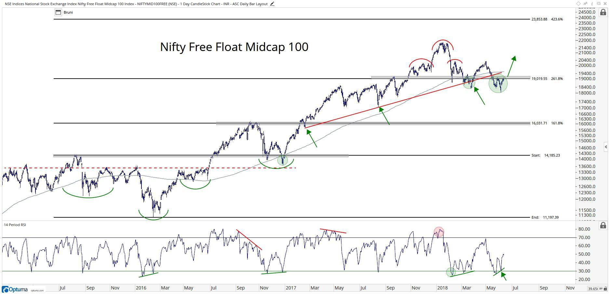

The rise of mid-cap stocks as a key component in investment portfolios has garnered notable interest from investors. These stocks, defined by their market capitalizations typically ranging between $2 billion and $10 billion, present a distinctive balance of growth potential and stability. As investors seek to enhance their portfolio's performance, understanding the intricacies of investing in mid-cap stocks through strategic analysis and algorithmic trading is essential. This article is designed to explore these investment strategies and tools, emphasizing the unique advantages of incorporating mid-cap stocks into a diversified portfolio.

Key aspects that will be examined include the profitability, financial health, and growth potential of mid-cap stocks. Evaluating these factors offers a comprehensive framework for making informed investment decisions. By focusing on companies with solid fundamentals and growth trajectories, investors can identify opportunities that promise enhanced returns coupled with manageable risk levels.



Furthermore, the integration of advanced technological tools, such as algorithmic trading and artificial intelligence (AI), can significantly augment investment performance. These technologies provide sophisticated data analysis capabilities, enabling more precise predictions and disciplined trading strategies. AI-driven models, for instance, can assess vast amounts of historical and real-time data to forecast future stock behaviors, while algorithmic trading can improve execution efficiency and risk management.

A successful approach to investing in mid-cap stocks requires a balanced consideration of traditional analysis techniques and modern technological advancements. By leveraging these elements, investors can optimize their strategies for investing in mid-cap stocks, aiming to achieve a prudent mix of growth and stability in their portfolios.

## Table of Contents

## Why Invest in Mid-Cap Stocks?

Mid-cap stocks, defined as those companies with market capitalizations ranging from $2 billion to $10 billion, occupy a noteworthy niche within the investment landscape. They provide investors with an enticing balance of growth and stability, an attribute that has contributed to their rising popularity in diversified portfolios. The potential of mid-cap stocks to outperform both large-cap and small-cap stocks with comparatively lower risk underscores their attractiveness to investors seeking robust performance without excessive volatility.

One primary advantage of mid-cap stocks is their capacity to outperform other market capitalizations. Historical data suggests that mid-caps can achieve superior returns over time, often surpassing their large-cap and small-cap counterparts. This performance can be attributed to their unique position within the market; they are typically well-established, stable entities compared to small caps, yet they still possess significant growth potential akin to emerging companies.

Investing in mid-cap stocks can result in enhanced portfolio returns and reduced [volatility](/wiki/volatility-trading-strategies). The inherent stability of mid-caps stems from their ability to bridge the gap between small-cap growth and large-cap reliability. These companies often possess established business models, experienced management teams, and strong market positions, which can provide a buffer against economic fluctuations. Consequently, their balance between growth and stability can lead to improved risk-adjusted returns in investment portfolios.

The appeal of mid-cap stocks further lies in their transitional nature. They are often at a stage where they are evolving from the aggressive growth phase characteristic of small caps to the mature, stable phase associated with large caps. This transformation period presents an advantageous investment window, where the company could potentially capitalize on growth opportunities while maintaining a solid foundation. 

By including mid-cap stocks in an investment portfolio, investors can capitalize on their growth potential, stability, and ability to act as a bridge between different market capitalization categories. As these companies continue to transition and expand, they offer promising opportunities for sustainable investment performance. Additionally, the diverse nature and sectoral representation of mid-cap stocks provide valuable diversification benefits, further enhancing their role in a well-rounded investment strategy.

## Key Attributes of Mid-Cap Stocks: Profitability and Financial Health

Mid-cap stocks are recognized for their profitability and the experienced management teams that often steer them. These characteristics contribute to a sustainable earnings growth trajectory, making mid-cap stocks an attractive option for investors seeking a balance between risk and reward.

Evaluating a company's profitability is crucial in the investment decision-making process. Key financial metrics such as gross margin and operating margin provide insightful indicators of a company's capacity to manage its costs effectively and generate profits. Gross margin is calculated as:

$$
\text{Gross Margin} = \frac{\text{Revenue} - \text{Cost of Goods Sold}}{\text{Revenue}}
$$

This metric reflects the percentage of revenue that exceeds the cost of goods sold, offering a snapshot of the efficiency with which a company produces its goods. A high gross margin suggests strong profitability potential, indicating effective cost control.

Similarly, the operating margin, defined as:

$$
\text{Operating Margin} = \frac{\text{Operating Income}}{\text{Revenue}}
$$

measures the percentage of revenue left after paying for variable costs of production. A high operating margin typically suggests efficient resource management and robust profit generation capabilities, both vital for assessing growth potential.

Financial health remains a cornerstone for sustainable growth, and mid-cap stocks often exhibit strong balance sheets. Indicators such as the current ratio and manageable debt levels are crucial for determining a company's stability. The current ratio, calculated as:

$$
\text{Current Ratio} = \frac{\text{Current Assets}}{\text{Current Liabilities}}
$$

provides insights into the liquidity of a company by assessing its capacity to cover short-term obligations with short-term assets. A ratio above 1 indicates a favorable financial position, signaling an ability to meet forthcoming liabilities.

Debt levels are another pillar of financial scrutiny, as lower debt generally indicates a reduced risk of financial distress. This assessment aligns with Benjamin Graham's principles of value investing, which emphasize conservative financial management and the importance of maintaining a manageable debt-to-equity ratio. This ratio, represented as:

$$
\text{Debt-to-Equity Ratio} = \frac{\text{Total Debt}}{\text{Shareholders' Equity}}
$$

serves as a benchmark for assessing the proportion of company financing that comes from debt versus shareholder equity. A lower ratio implies a more financially stable company, reducing investor risk.

Adhering to these financial metrics allows investors to identify mid-cap stocks that not only demonstrate profitability and stable management but also possess the financial health necessary for sustainable long-term growth. Leveraging these insights can enhance strategic investment decisions and fortify portfolio performance.

## Growth Potential and Market Position

Mid-cap stocks have demonstrated significant growth potential, often outpacing both small-cap and large-cap stocks in terms of revenue and earnings growth. This growth is attributed to their unique market position—these companies typically have the agility to innovate and expand like small companies while having the resources and established market presence associated with larger firms. As they transition towards becoming large-cap enterprises, they frequently realize benefits from increased economies of scale and improved operational efficiencies, enhancing their profitability margins.

Investors should scrutinize mid-cap companies with rising gross margins and the ability to leverage economies of scale, as these traits are indicative of increasing profitability. Gross margin, calculated as (Revenue - Cost of Goods Sold) / Revenue, serves as a critical metric for assessing the profitability improvement. Companies with competitive gross margins can reinvest profits to foster further growth or streamline operations to reduce costs, thereby bolstering their market positions.

Analyzing the broader industry landscape is vital for identifying mid-cap companies with robust competitive advantages. Key factors to consider include market share, product differentiation, and the ability to leverage technological advancements. A strong industry position not only reinforces a company's current standing but also equips it to navigate competitive challenges effectively and capture future growth opportunities.

Identifying companies with a sustainable competitive edge involves assessing their unique selling propositions and strategic positioning within the industry. Factors such as brand strength, intellectual property, strategic alliances, and cost leadership can distinguish market leaders. By focusing on these attributes, investors can pinpoint mid-cap companies that are well-positioned to maintain and enhance their competitive status, leading to sustained growth and potential market dominance. 

In summary, the growth potential of mid-cap stocks is highly contingent on their ability to enhance profitability through improved margins and strategic industry positioning, making them compelling additions to investment portfolios aiming for both growth and stability.

## Valuation: Buying at a Reasonable Price

Investing in mid-cap stocks requires careful consideration of their market valuation to ensure sustainable returns. A favored approach among investors is the Growth at a Reasonable Price (GARP) strategy, which seeks to identify stocks that offer a balanced blend of growth potential and value. This method acknowledges that while growth is important, paying an excessively high price can erode future returns.

To assess whether a mid-cap stock is priced reasonably, investors often rely on key valuation metrics. Among the most influential are the price/earnings (P/E) ratio and the price/cash flow (P/CF) ratio. The P/E ratio is calculated by dividing the company's current share price by its earnings per share (EPS). This metric provides insight into how much investors are willing to pay for each dollar of earnings, and a lower P/E ratio might suggest a more attractively priced stock when compared with industry peers.

Similarly, the P/CF ratio offers another dimension of valuation by comparing a company's current share price to its cash flow per share. It evaluates the stock's price in relation to its actual cash generation capability, which is crucial for understanding the company's financial health beyond just earnings.

To evaluate a company based on these metrics, consider the Python function below, which calculates the P/E and P/CF ratios:

```python
def valuation_ratios(current_price, earnings_per_share, cash_flow_per_share):
    pe_ratio = current_price / earnings_per_share
    pcf_ratio = current_price / cash_flow_per_share
    return pe_ratio, pcf_ratio

# Example usage:
current_price = 50
earnings_per_share = 5
cash_flow_per_share = 10
pe, pcf = valuation_ratios(current_price, earnings_per_share, cash_flow_per_share)
print(f"P/E Ratio: {pe}, P/CF Ratio: {pcf}")
```

In this example, the function takes a stock's current price, earnings per share, and cash flow per share as inputs, calculating the P/E and P/CF ratios. These calculated ratios help investors determine whether the stock is valued appropriately relative to its financial performance.

By employing such analytical techniques, investors can more effectively evaluate mid-cap stocks, ensuring that they purchase equities that not only offer promising growth trajectories but also come at a fair and justifiable price. This strategic evaluation enhances the potential for achieving favorable long-term investment returns while mitigating the risks associated with overpaying for growth potential.

## Stocks or Funds: Diversification and Management

Individual stock selection within the universe of mid-cap stocks offers the potential for impressive returns, owing to the capacity to handpick specific firms with favorable growth prospects and financial health. However, this approach demands a substantial degree of expertise and a considerable investment of time for research and analysis. An investor must evaluate numerous factors, including the company's profitability metrics, market position, and valuation indicators, to make informed decisions.

For those investors who prefer a more hands-off strategy, exchange-traded funds (ETFs) and mutual funds targeting mid-cap stocks present a compelling alternative. These investment vehicles allow for exposure to a diversified portfolio of mid-cap stocks without the necessity for exhaustive individual stock analysis. Typically, such funds are managed by professional fund managers who employ a systematic strategy to select and balance the stocks within the fund, aiming to achieve returns that mirror or surpass market benchmarks.

The primary advantage offered by ETFs and mutual funds is diversification. By investing in a broad spectrum of mid-cap stocks, these funds reduce the idiosyncratic risk associated with any single company's performance. This diversification can mitigate potential losses that might result from an adverse development in a particular company or sector within the mid-cap category.

Additionally, the professional management inherent in these funds provides another layer of risk management. Fund managers often use sophisticated analytical techniques and tools to optimize the selection and weighting of stocks, ensuring that the fund’s portfolio aligns with its investment objectives. This professional oversight can be especially advantageous for investors lacking the time or resources to conduct detailed market analyses.

While ETFs usually offer lower expense ratios and greater [liquidity](/wiki/liquidity-risk-premium) compared to mutual funds, both types of funds offer distinct structural benefits. ETFs, for instance, are traded on exchanges like stocks and can be bought and sold throughout the trading day. Mutual funds, on the other hand, are transacted at their net asset value (NAV) calculated at the end of the trading day.

In summary, while individual stock selection in the mid-cap arena holds the allure of potentially higher returns, the choice of ETFs or mutual funds allows investors to achieve a diversified and professionally managed investment exposure. This strategy is ideal for those who seek the growth potential associated with mid-cap stocks but prefer to avoid the intricacies and labor-intensive nature of individual stock selection.

## Algorithmic Trading and AI in Mid-Cap Stock Investment

Algorithmic trading harnesses technology to analyze market trends and execute trades with precision, significantly enhancing investment strategies for mid-cap stocks. This approach involves leveraging computer algorithms to automate trading decisions, often based on complex statistical and mathematical models. The goal is to optimize execution speed, reduce trading costs, and minimize human error, which can be critical when dealing with the volatility of mid-cap stocks.

AI-driven models lie at the heart of modern [algorithmic trading](/wiki/algorithmic-trading) systems. These models utilize [machine learning](/wiki/machine-learning) techniques to assess historical data, identifying patterns and correlating factors that can predict future price movements. For mid-cap stock investments, AI can provide insights into market sentiment, liquidity, and potential price fluctuations, enabling investors to make informed decisions swiftly.

One fundamental practice in algorithmic trading is [backtesting](/wiki/backtesting), which involves running these AI algorithms through past market data to evaluate their performance and refine strategies. By doing this, investors can validate their models before deploying them in real-world trading scenarios, thereby reducing risk and improving the expected profitability. Backtesting can be implemented using various software tools, with Python being a preferred language due to its extensive libraries and ease of use.

Here is an example of a simple Python script to perform backtesting on historical stock data using a [momentum](/wiki/momentum)-based strategy:

```python
import pandas as pd
import numpy as np

# Load historical data
data = pd.read_csv('midcap_stock_data.csv')
prices = data['Close']

# Calculate returns
returns = prices.pct_change()

# Define momentum strategy
def momentum_strategy(prices, window=20):
    signal = prices.rolling(window).mean().shift() < prices
    return np.where(signal, 1, -1)  # Buy if True, else Sell

# Apply strategy and calculate returns
signals = momentum_strategy(prices)
strategy_returns = returns * signals.shift()
cumulative_returns = (1 + strategy_returns).cumprod()

print(cumulative_returns.tail())  # Show final returns
```

This script illustrates the process of formulating a simple momentum strategy where the signal is based on whether the price is above its moving average. The strategy's performance is then evaluated by calculating the cumulative returns.

Algorithmic trading and AI offer significant advantages in the mid-cap sector due to their ability to process large datasets and execute orders at high speed, providing a competitive edge in capturing short-lived market opportunities. The integration of these technologies into investment strategies is becoming increasingly essential as the financial markets evolve with technological advancements.

## Conclusion

Investing in mid-cap stocks presents a significant opportunity for both growth and stability, making it an appealing choice for investors with varied portfolios. Mid-cap stocks, typically characterized by market capitalizations between $2 billion and $10 billion, often strike a balance between the rapid growth potential of small-cap stocks and the stability of large-cap stocks. As these companies are often in the growth phase, they can provide higher returns than large-cap stocks while offering more stability than small-caps.

Leveraging advanced trading algorithms along with a sound understanding of key financial metrics can significantly optimize mid-cap investment strategies. Algorithmic trading applies sophisticated technology to analyze market trends and execute trades efficiently. This approach can harness large datasets and identify patterns that may not be easily discernible to human traders. For example, using machine learning models, such as Python's `scikit-learn` library, investors can train algorithms to predict stock movements based on historical data. Here's a simple example of using Python to implement a basic machine learning model for stock prediction:

```python
from sklearn.model_selection import train_test_split
from sklearn.ensemble import RandomForestRegressor
import pandas as pd

# Assume 'data' is a DataFrame with historical stock prices
features = data[['opening_price', 'closing_price', 'volume']]
target = data['future_price']

X_train, X_test, y_train, y_test = train_test_split(features, target, test_size=0.2, random_state=42)

model = RandomForestRegressor(n_estimators=100, random_state=42)
model.fit(X_train, y_train)

predictions = model.predict(X_test)
```

This model can help in assessing potential future prices, thus refining investment strategies.

Incorporating traditional analysis remains essential, particularly when understanding core financial metrics such as earnings growth, profitability ratios, and valuation metrics. This balanced approach between quantitative data analysis using high-tech tools and qualitative assessment of financial health allows investors to make more informed decisions.

By effectively combining traditional investment analysis with cutting-edge technology, investors can confidently navigate the complexities of the mid-cap stock market. This holistic approach provides investors with the tools to manage risks better and capitalize on potential growth opportunities, thus enhancing their investment performance and ensuring a well-rounded, robust investment portfolio.

## References & Further Reading

[1]: Bergstra, J., Bardenet, R., Bengio, Y., & Kégl, B. (2011). ["Algorithms for Hyper-Parameter Optimization."](https://dl.acm.org/doi/10.5555/2986459.2986743) Advances in Neural Information Processing Systems 24.

[2]: ["Advances in Financial Machine Learning"](https://www.amazon.com/Advances-Financial-Machine-Learning-Marcos/dp/1119482089) by Marcos Lopez de Prado

[3]: ["Evidence-Based Technical Analysis: Applying the Scientific Method and Statistical Inference to Trading Signals"](https://www.amazon.com/Evidence-Based-Technical-Analysis-Scientific-Statistical/dp/0470008741) by David Aronson

[4]: ["Machine Learning for Algorithmic Trading"](https://github.com/stefan-jansen/machine-learning-for-trading) by Stefan Jansen

[5]: ["Quantitative Trading: How to Build Your Own Algorithmic Trading Business"](https://www.amazon.com/Quantitative-Trading-Build-Algorithmic-Business/dp/1119800064) by Ernest P. Chan