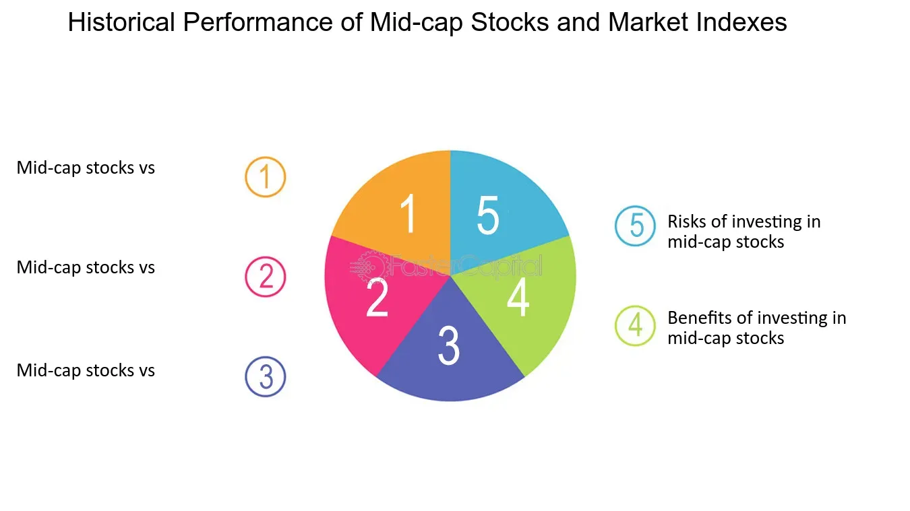

## Table of Contents

## What are mid-cap stocks and how are they defined?

Mid-cap stocks are companies that are in the middle range when it comes to their size. They are bigger than small companies but smaller than big ones. In the stock market, size is usually measured by how much the company is worth, which is called its market capitalization or "market cap." Mid-cap companies usually have a market cap between $2 billion and $10 billion.

These stocks are seen as a good mix between growth and stability. They are often growing faster than big companies but are more stable than small ones. This makes them attractive to investors who want to balance the potential for higher returns with a bit less risk than what you might find with smaller companies. However, they can still be riskier than large-cap stocks because they might not have as much money or as many resources to weather tough times.

## How do mid-cap stocks differ from small-cap and large-cap stocks?

Mid-cap stocks are different from small-cap and large-cap stocks mainly because of their size. Size is measured by market capitalization, which is the total value of a company's stock. Mid-cap companies have a market cap between $2 billion and $10 billion. Small-cap companies are smaller, with a market cap usually less than $2 billion. Large-cap companies are bigger, with a market cap over $10 billion. This size difference affects how these companies operate and how their stocks behave in the market.

Mid-cap stocks often offer a good balance between growth and stability. They are usually growing faster than large-cap companies but are more stable than small-cap ones. This makes them attractive to investors who want to grow their money but don't want to take on too much risk. On the other hand, small-cap stocks can grow very quickly but are also riskier because they might not have as much money or resources. Large-cap stocks are generally more stable and less risky, but they might not grow as fast as mid-cap or small-cap stocks. Each type of stock has its own advantages and risks, depending on what an investor is looking for.

## What are the potential benefits of investing in mid-cap stocks?

Investing in mid-cap stocks can offer good growth opportunities. These companies are often in a sweet spot where they are growing faster than big companies but are not as risky as small ones. This means there's a chance for your money to grow more than if you put it in large-cap stocks. Mid-cap companies are usually expanding, trying new things, and getting bigger, which can lead to higher stock prices.

Another benefit is that mid-cap stocks can be a good way to spread out your investments. They can help balance out your portfolio because they are not as closely watched by big investors and analysts as large-cap stocks. This can mean less ups and downs in their stock prices compared to small-cap stocks. By including mid-cap stocks, you can have a mix of growth and stability, which can make your overall investment safer and potentially more rewarding.

## What are the risks associated with mid-cap stocks?

Mid-cap stocks can be riskier than large-cap stocks. They are not as big or as well-known as large companies, so they might not have as much money or resources to handle tough times. If something goes wrong, like a drop in sales or a problem with their business, it can be harder for a mid-cap company to bounce back. This means their stock prices can go down a lot if things don't go well.

Another risk is that mid-cap stocks might not be watched as closely by investors and analysts as large-cap stocks. This can lead to less information available about the company, making it harder to know if it's a good investment. Sometimes, this can cause bigger swings in their stock prices because fewer people are paying attention, and the market can react more strongly to news or changes in the company.

Overall, while mid-cap stocks offer good growth opportunities, they also come with more risk than large-cap stocks. It's important for investors to understand these risks and consider how much risk they are comfortable taking before investing in mid-cap stocks.

## How can one identify promising mid-cap stocks?

To find good mid-cap stocks, you should look at how the company is doing financially. Check if the company is making more money over time, if it's not spending too much, and if it's not in a lot of debt. These things can tell you if the company is healthy and growing. Also, see if the company is doing well compared to other companies in the same business. If it's doing better than its competitors, it might be a good pick.

Another way to find promising mid-cap stocks is to look at what the company is doing to grow. See if it's coming up with new products, entering new markets, or making smart business moves. Companies that are trying new things and growing can be good investments. It's also helpful to read what experts say about the company. Sometimes, financial analysts and reports can give you good ideas about which mid-cap stocks might do well in the future.

## What financial metrics are important when analyzing mid-cap stocks?

When looking at mid-cap stocks, it's important to check some key financial numbers. One important number is earnings growth. This tells you if the company is making more money over time. Another number to look at is the price-to-earnings (P/E) ratio. This helps you see if the stock is a good deal compared to how much money the company makes. Also, check the company's debt levels. Too much debt can be risky, especially for mid-cap companies that might not have a lot of money to pay it back.

Another useful metric is the return on equity (ROE). This shows how well the company is using the money that shareholders have invested to make more money. A high ROE can mean the company is doing a good job. It's also good to look at the company's revenue growth. If the company is selling more over time, it's a sign that the business is growing. Lastly, consider the company's operating margin, which tells you how much profit the company makes from its sales after paying for the costs of running the business. A higher operating margin can mean the company is efficient and good at making money.

## How does sector performance impact mid-cap stocks?

Sector performance can have a big impact on mid-cap stocks. If the sector a mid-cap company is in is doing well, it can help the company grow and make more money. For example, if a mid-cap company is in the technology sector and technology is popular, the company's stock might go up because more people want to buy it. On the other hand, if the sector is not doing well, it can hurt the mid-cap company. If the sector is struggling, it might be harder for the company to make money, and its stock price could go down.

It's also important to look at how the sector is doing compared to other sectors. Sometimes, certain sectors do better than others because of what's happening in the economy or because of new trends. If a mid-cap company is in a sector that's doing better than others, it might have a better chance of growing and doing well. But if the sector is falling behind, the company might face more challenges, even if it's doing okay on its own. So, when you're thinking about investing in mid-cap stocks, it's a good idea to pay attention to how the sector is doing.

## What role do mid-cap stocks play in a diversified investment portfolio?

Mid-cap stocks can be a good addition to a diversified investment portfolio. They help balance the risk and reward in your investments. Mid-cap companies are bigger than small ones but smaller than big ones. This means they can grow faster than large companies but are usually more stable than small ones. By including mid-cap stocks, you can spread out your money across different sizes of companies, which can make your overall investment less risky and more likely to grow over time.

Including mid-cap stocks in your portfolio can also help you take advantage of different parts of the market. These stocks often come from sectors that are growing or changing, which can lead to good opportunities for growth. Since mid-cap stocks are not as closely watched by big investors as large-cap stocks, they might be overlooked sometimes, which can mean you find good deals. By having a mix of large-cap, mid-cap, and small-cap stocks, you can be ready for different market conditions and have a better chance of doing well no matter what happens.

## How have mid-cap stocks performed historically compared to other market segments?

Over the years, mid-cap stocks have often done better than large-cap stocks but not as well as small-cap stocks. This is because mid-cap companies are in a good spot where they can grow faster than big companies but are not as risky as small ones. From 1979 to 2022, the S&P MidCap 400, which is a group of mid-cap stocks, has had an average yearly return of about 12%. This is a bit higher than the S&P 500, which is made up of large-cap stocks and had an average yearly return of about 11% during the same time. Small-cap stocks, tracked by the Russell 2000, have had even higher returns, around 12.5% a year.

However, mid-cap stocks can be more up and down than large-cap stocks. This means their prices can go up and down more over short periods. But over the long term, they have shown they can be a good way to grow your money. They can be a good choice for people who want to balance the chance for higher returns with less risk than small-cap stocks. So, if you are looking to invest for the long term, mid-cap stocks can be a good part of your plan.

## What are some advanced valuation techniques specific to mid-cap stocks?

When looking at mid-cap stocks, one advanced way to figure out if they're a good buy is to use something called the Discounted Cash Flow (DCF) analysis. This method tries to guess how much money the company will make in the future and then figures out what that money is worth today. Since mid-cap companies are growing, this can help you see if their stock price is a good deal. You need to guess how fast the company will grow, how much money it will make, and what interest rates will be. It's a bit tricky, but it can give you a good idea of what the company might be worth.

Another way to value mid-cap stocks is to use the EV/EBITDA ratio. EV stands for Enterprise Value, which is how much the whole company is worth, including its debts. EBITDA stands for Earnings Before Interest, Taxes, Depreciation, and Amortization, which is a way to see how much money the company is making before some costs. This ratio helps you compare mid-cap companies to each other, even if they have different amounts of debt. It's useful because mid-cap companies might have different levels of debt, and this ratio can help you see past that to find out if the company is a good buy.

## How do macroeconomic factors influence mid-cap stock performance?

Macroeconomic factors can have a big impact on how mid-cap stocks do. Things like interest rates, inflation, and how the economy is doing overall can affect mid-cap companies a lot. If interest rates go up, it can be harder for mid-cap companies to borrow money to grow their business. This can slow down their growth and make their stock prices go down. Also, if inflation is high, it can make it more expensive for these companies to run their business, which can hurt their profits and stock prices.

On the other hand, when the economy is doing well, mid-cap stocks can do better. If people are spending more money and the economy is growing, mid-cap companies can sell more of their products and make more money. This can make their stock prices go up. But if the economy is not doing well, like during a recession, mid-cap companies can struggle more than big companies because they might not have as much money saved up to get through tough times. So, it's important to keep an eye on what's happening in the economy when you're thinking about investing in mid-cap stocks.

## What are the latest trends and future outlook for mid-cap stocks?

Mid-cap stocks have been doing well lately, especially in areas like technology and healthcare. These sectors are growing fast, and many mid-cap companies in them are coming up with new products and services. This has helped their stock prices go up. Also, with more people investing in the stock market through things like online trading apps, mid-cap stocks are getting more attention. They are seen as a good way to grow your money without taking too much risk.

Looking ahead, the future for mid-cap stocks looks promising. As the economy keeps growing, mid-cap companies should keep getting bigger and making more money. But there are also some things to watch out for. If interest rates go up a lot or if there's another big economic problem, mid-cap stocks could be hit harder than big companies. Still, if you're looking to invest for the long term, mid-cap stocks can be a good choice because they offer a good balance between growth and risk.

## What are the key attributes of mid-cap stocks in terms of profitability and financial health?

Mid-cap stocks are recognized for their profitability and the experienced management teams that often steer them. These characteristics contribute to a sustainable earnings growth trajectory, making mid-cap stocks an attractive option for investors seeking a balance between risk and reward.

Evaluating a company's profitability is crucial in the investment decision-making process. Key financial metrics such as gross margin and operating margin provide insightful indicators of a company's capacity to manage its costs effectively and generate profits. Gross margin is calculated as:

$$
\text{Gross Margin} = \frac{\text{Revenue} - \text{Cost of Goods Sold}}{\text{Revenue}}
$$

This metric reflects the percentage of revenue that exceeds the cost of goods sold, offering a snapshot of the efficiency with which a company produces its goods. A high gross margin suggests strong profitability potential, indicating effective cost control.

Similarly, the operating margin, defined as:

$$
\text{Operating Margin} = \frac{\text{Operating Income}}{\text{Revenue}}
$$

measures the percentage of revenue left after paying for variable costs of production. A high operating margin typically suggests efficient resource management and robust profit generation capabilities, both vital for assessing growth potential.

Financial health remains a cornerstone for sustainable growth, and mid-cap stocks often exhibit strong balance sheets. Indicators such as the current ratio and manageable debt levels are crucial for determining a company's stability. The current ratio, calculated as:

$$
\text{Current Ratio} = \frac{\text{Current Assets}}{\text{Current Liabilities}}
$$

provides insights into the liquidity of a company by assessing its capacity to cover short-term obligations with short-term assets. A ratio above 1 indicates a favorable financial position, signaling an ability to meet forthcoming liabilities.

Debt levels are another pillar of financial scrutiny, as lower debt generally indicates a reduced risk of financial distress. This assessment aligns with Benjamin Graham's principles of value investing, which emphasize conservative financial management and the importance of maintaining a manageable debt-to-equity ratio. This ratio, represented as:

$$
\text{Debt-to-Equity Ratio} = \frac{\text{Total Debt}}{\text{Shareholders' Equity}}
$$

serves as a benchmark for assessing the proportion of company financing that comes from debt versus shareholder equity. A lower ratio implies a more financially stable company, reducing investor risk.

Adhering to these financial metrics allows investors to identify mid-cap stocks that not only demonstrate profitability and stable management but also possess the financial health necessary for sustainable long-term growth. Leveraging these insights can enhance strategic investment decisions and fortify portfolio performance.

## References & Further Reading

[1]: Bergstra, J., Bardenet, R., Bengio, Y., & Kégl, B. (2011). ["Algorithms for Hyper-Parameter Optimization."](https://dl.acm.org/doi/10.5555/2986459.2986743) Advances in Neural Information Processing Systems 24.

[2]: ["Advances in Financial Machine Learning"](https://www.amazon.com/Advances-Financial-Machine-Learning-Marcos/dp/1119482089) by Marcos Lopez de Prado

[3]: ["Evidence-Based Technical Analysis: Applying the Scientific Method and Statistical Inference to Trading Signals"](https://www.amazon.com/Evidence-Based-Technical-Analysis-Scientific-Statistical/dp/0470008741) by David Aronson

[4]: ["Machine Learning for Algorithmic Trading"](https://github.com/stefan-jansen/machine-learning-for-trading) by Stefan Jansen

[5]: ["Quantitative Trading: How to Build Your Own Algorithmic Trading Business"](https://www.amazon.com/Quantitative-Trading-Build-Algorithmic-Business/dp/1119800064) by Ernest P. Chan