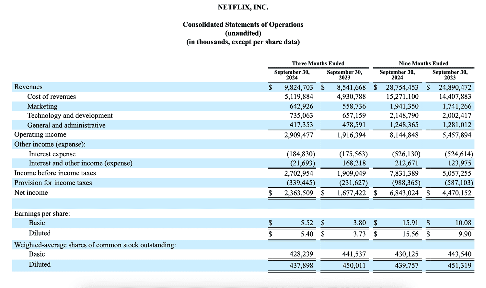

## Table of Contents

## What is an income statement and why is it important for Netflix?

An income statement is a financial report that shows how much money a company made and how much it spent over a certain period, like a year or a quarter. It lists the company's revenues, which is the money it gets from selling its products or services, and its expenses, which are the costs of running the business. At the end, it shows if the company made a profit or a loss by subtracting the expenses from the revenues.

For Netflix, the income statement is very important because it helps them and others see if their business is doing well. It shows how much money Netflix is making from its subscribers around the world and how much it is spending on making new shows and movies, marketing, and other costs. By looking at the income statement, Netflix can make decisions about where to spend money and how to grow their business, and investors can decide if they want to invest in Netflix based on whether the company is making a profit or not.

## How does Netflix generate its revenue?

Netflix makes money mainly by charging people to use their service. People pay a monthly fee to watch movies, TV shows, and other videos on Netflix. This money from subscribers all over the world is the biggest part of Netflix's revenue. The more subscribers they have, the more money they make.

Sometimes, Netflix also gets money from other places. They can make deals with companies to show their shows and movies on other platforms or in different countries. They might also get paid for letting other companies use their technology or for selling things like merchandise related to their popular shows. But the main way Netflix earns money is still from the monthly fees that subscribers pay.

## What are the main components of Netflix's income statement?

Netflix's income statement has a few main parts that show how the company is doing financially. The first part is revenue, which is the money Netflix gets from its subscribers around the world. This is the biggest part of their income statement because it shows how many people are paying to use Netflix. The second part is the cost of revenue, which includes the money Netflix spends to make and buy the shows and movies they offer. This is important because it shows how much it costs to keep their service full of things people want to watch.

The next part of the income statement is operating expenses. This includes things like marketing, technology, and other costs to run the business. Marketing helps Netflix get more subscribers, while technology costs are for keeping their service working well. After subtracting these expenses from the revenue, you get the operating income, which shows if Netflix is making money from its main business before other costs. Finally, there are other incomes and expenses, like interest and taxes, which are subtracted to find the net income. This is the final number that shows if Netflix made a profit or a loss for the period.

## How has Netflix's revenue grown over the past five years?

Over the past five years, Netflix's revenue has grown a lot. In 2019, they made about $20 billion. By 2020, their revenue went up to around $25 billion. This was because more people started using Netflix, especially when many were staying home because of the global health situation. In 2021, their revenue jumped to about $29 billion. This shows that Netflix kept getting more subscribers and making more money from them.

In 2022, Netflix's revenue grew to about $31.6 billion. Even though they faced some challenges, like people sharing accounts and more competition from other streaming services, they still made more money. By 2023, their revenue reached about $33.7 billion. This growth over five years shows that Netflix has been successful in getting more people to pay for their service and in making more money from their subscribers around the world.

## What are the major expenses for Netflix and how have they changed over time?

The biggest expense for Netflix is the cost of making and buying shows and movies. This is called the content cost. They spend a lot of money to have a lot of good things for people to watch. Over the past few years, this cost has gone up a lot. In 2019, Netflix spent about $13 billion on content. By 2020, this went up to around $15 billion. In 2021, they spent about $17 billion, and in 2022, it was around $18 billion. By 2023, they spent about $19 billion. This shows that Netflix is spending more and more money to keep their service full of things people want to watch.

Another big expense for Netflix is marketing. They need to spend money to tell people about their service and get more subscribers. Marketing costs have also gone up over time. In 2019, Netflix spent about $2.7 billion on marketing. By 2020, this went up to around $2.2 billion, but then it increased to about $2.5 billion in 2021. In 2022, they spent around $2.6 billion, and in 2023, it was about $2.7 billion. Even though marketing costs can go up and down a bit, they are still a big part of what Netflix spends money on. These two expenses, content and marketing, are the main ones that Netflix has to manage carefully to keep making money.

## How does Netflix's operating income compare to its competitors?

Netflix's operating income is important because it shows how much money they make from their main business before other costs. When we compare Netflix to other big streaming companies like Disney+ and Amazon Prime Video, we see that Netflix usually has a higher operating income. In 2023, Netflix's operating income was about $7 billion. Disney+, which is part of Disney's bigger business, had an operating loss in its streaming part, meaning they spent more money than they made. Amazon Prime Video is part of Amazon's huge business, and while they don't break out the exact operating income for just Prime Video, Amazon's overall operating income was around $13 billion in 2023, but this includes many other parts of their business, not just streaming.

Netflix's higher operating income compared to Disney+ shows that they are good at making money from their subscribers and managing their costs. Disney+ is still growing and spending a lot on new shows and movies, which can lead to losses in the short term but might help them make more money in the future. Amazon Prime Video is part of a bigger company, so it's harder to compare directly, but Amazon's overall business is very profitable. Netflix's focus on streaming and their ability to keep their operating income high is a big reason why they are seen as a leader in the streaming world.

## What is Netflix's net income margin and how has it evolved?

Netflix's net income margin is the percentage of money they keep as profit after all their expenses. In simple terms, it shows how much of every dollar they make ends up being profit. Over the past few years, Netflix's net income margin has changed a bit. In 2019, their net income margin was around 10%, meaning they kept about 10 cents of every dollar they made as profit. By 2020, this went up to about 11%, and in 2021, it reached around 17%. This shows that Netflix was getting better at making money and managing their costs during those years.

However, in 2022, Netflix's net income margin dropped to about 14%. This happened because they spent a lot more money on making new shows and movies, and they also faced more competition from other streaming services. By 2023, their net income margin went back up to around 16%. This shows that even though they had some challenges, Netflix was still able to make a good profit and keep most of their business strong. Overall, Netflix's net income margin has gone up and down but has generally stayed pretty high, showing that they are good at making money from their streaming service.

## How do foreign exchange rates impact Netflix's income statement?

Foreign exchange rates can affect Netflix's income statement because they make money from subscribers all over the world. When the value of the US dollar changes compared to other countries' money, it can make Netflix's earnings from those countries go up or down. For example, if the US dollar gets stronger, the money Netflix makes from subscribers in other countries might be worth less when they change it back to dollars. This can make their total revenue look smaller. On the other hand, if the US dollar gets weaker, the money from other countries might be worth more, making their revenue look bigger.

Netflix also has to deal with foreign exchange rates when they spend money in other countries. They might pay to make shows and movies in different places, and if the US dollar gets weaker, it can cost them more money. This can make their expenses go up, which might lower their profit. To handle these changes, Netflix uses some ways to protect themselves, like making deals to fix the exchange rate ahead of time. But even with these protections, big changes in foreign exchange rates can still affect their income statement and how much profit they make.

## What are the key financial ratios to analyze Netflix's profitability?

To understand how profitable Netflix is, we can look at a few important financial ratios. The first one is the net profit margin, which shows how much of every dollar Netflix makes ends up being profit after all their costs. A higher net profit margin means Netflix is good at making money and keeping costs low. Another important ratio is the return on assets (ROA), which tells us how well Netflix uses its money to make a profit. A higher ROA means they are using their money in a smart way to make more profit.

Another useful ratio is the return on equity (ROE), which shows how much profit Netflix makes with the money that shareholders have put into the company. A high ROE means Netflix is good at using the money from shareholders to make profits. Finally, the operating margin is also important because it shows how much money Netflix makes from its main business before other costs like taxes and interest. A higher operating margin means Netflix is doing well at making money from its streaming service. By looking at these ratios, we can see how profitable Netflix is and how well they are managing their business.

## How does Netflix's content amortization affect its income statement?

Netflix's content amortization is how they spread out the cost of making or buying shows and movies over time. Instead of putting the whole cost on their income statement right away, they divide it over several years. This means that every year, they only show a part of the total cost as an expense. This helps Netflix show a better profit on their income statement because the big costs are spread out instead of hitting all at once.

For example, if Netflix spends $100 million to make a new show, they might decide to show $20 million as an expense each year for five years. This way, their yearly income statement doesn't show the whole $100 million at once, which would make their profit look smaller. By spreading out the cost, Netflix can keep their expenses lower each year and show a higher profit. This is important because it helps them look more profitable to investors and helps them plan their finances better over time.

## What are the implications of Netflix's stock-based compensation on its net income?

Netflix gives some of its employees stock instead of just paying them with money. This is called stock-based compensation. When Netflix gives out these stocks, it has to count them as an expense on their income statement. This means that even though they aren't spending actual money, they still have to show this as a cost, which makes their net income, or profit, look smaller. In simple terms, stock-based compensation is like saying, "We're giving you part of the company instead of cash," but it still shows up as an expense.

The impact of stock-based compensation on Netflix's net income can be big. For example, if Netflix gives out a lot of stock to employees in a year, their expenses go up, and their net income goes down. This can make it look like they are not making as much profit as they really are. Investors need to understand this because it can change how they see Netflix's financial health. Even though it makes the net income look lower, stock-based compensation can help Netflix keep good employees without spending a lot of cash right away.

## How does Netflix's approach to accounting for original content impact its financial reporting?

Netflix makes a lot of its own shows and movies, which they call original content. When they spend money to make these shows, they don't put the whole cost on their income statement right away. Instead, they spread it out over a few years. This is called amortization. They decide how long to spread out the cost based on how long they think people will watch the show. By doing this, Netflix can show smaller expenses each year instead of one big cost, which makes their profit look better on their income statement.

This way of accounting for original content can make Netflix's financial reports look different than if they showed all the costs at once. It helps them manage their expenses and show a higher profit each year. But it also means that their financial reports might not show the full cost of making a show right away. Investors need to understand this to see the real cost of Netflix's content and how it affects their profits over time.

## What are the main components of the income statement?

The income statement can be understood by examining its three primary sections: direct costs, indirect costs, and capital expenses. This financial document is integral in gauging the company's financial performance over a specific reporting period.

Direct costs, often termed as costs of goods sold (COGS), encompass expenditures directly associated with the production and distribution of Netflix's content. These costs are subtracted from total revenue to calculate the gross profit. Mathematically, it can be expressed as:

$$
\text{Gross Profit} = \text{Revenue} - \text{COGS}
$$

The gross profit provides an initial view of Netflix's profitability from its core business operations.

Next are the indirect costs, which refer to expenses not directly tied to the creation of content but necessary for overall operations. These include marketing expenses—vital for promoting content and acquiring new subscribers, costs related to technological development—ensuring platform reliability and content delivery, and administrative expenses needed for the daily management of the company. After deducting these indirect costs from the gross profit, we arrive at the operating income or Earnings Before Interest and Taxes (EBIT):

$$
\text{Operating Income (EBIT)} = \text{Gross Profit} - \text{Indirect Costs}
$$

EBIT provides a clearer indication of Netflix's operating efficiency, reflecting incomes from its operations while ignoring unique financial and capital structure.

The final part of the income statement pertains to capital expenses. This section accounts for interest payouts on debt, any tax obligations, and occasionally, non-operating income or expenses. By subtracting these amounts from the operating income, we obtain the net income, which is crucial for assessing overall profitability and is often a key metric for investors:

$$
\text{Net Income} = \text{Operating Income} - (\text{Interest} + \text{Taxes})
$$

This net income figure is vital for stakeholder assessments as it speaks to the financial success of the business, guiding investor decisions and shaping company valuation. These components of Netflix's income statement collectively offer a snapshot of the financial health and operational competence, delivering pivotal insights for financial analysis and strategic decision-making.

## References & Further Reading

[1]: Bergstra, J., Bardenet, R., Bengio, Y., & Kégl, B. (2011). ["Algorithms for Hyper-Parameter Optimization."](https://dl.acm.org/doi/10.5555/2986459.2986743) Advances in Neural Information Processing Systems 24.

[2]: ["Advances in Financial Machine Learning"](https://www.amazon.com/Advances-Financial-Machine-Learning-Marcos/dp/1119482089) by Marcos Lopez de Prado

[3]: ["Evidence-Based Technical Analysis: Applying the Scientific Method and Statistical Inference to Trading Signals"](https://www.amazon.com/Evidence-Based-Technical-Analysis-Scientific-Statistical/dp/0470008741) by David Aronson

[4]: ["Machine Learning for Algorithmic Trading"](https://github.com/stefan-jansen/machine-learning-for-trading) by Stefan Jansen

[5]: ["Quantitative Trading: How to Build Your Own Algorithmic Trading Business"](https://www.amazon.com/Quantitative-Trading-Build-Algorithmic-Business/dp/1119800064) by Ernest P. Chan