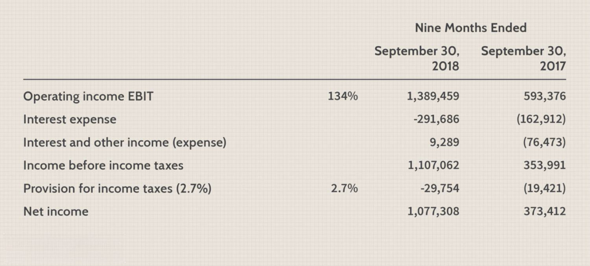

The world of finance and investing is constantly evolving, driven largely by technological advancements that reshape traditional practices. At the forefront of this evolution is Netflix, a leading streaming service known for its ability to captivate global audiences. Beyond its entertainment value, Netflix also offers intriguing opportunities for financial analysis and the application of algorithmic trading—a method where automated systems execute trades based on predefined criteria derived from data analysis.

This article explores the intricacies of Netflix's income statement, a fundamental tool for evaluating the company’s financial health. By examining revenues, expenses, and profits over time, the income statement provides insights essential for understanding Netflix's operational efficiency and profitability. Furthermore, we investigate how algorithmic trading leverages specific data from Netflix's financial reports to enable profitable trading strategies. These automated systems analyze large volumes of financial data, detecting patterns and trends that inform decision-making with high speed and accuracy, thus bringing a level of precision often absent from traditional trading methods.



Our aim is to provide a comprehensive overview that caters to both seasoned investors and those new to the field. By understanding the financial nuances of Netflix and the strategies employed by modern trading algorithms, investors can better navigate this dynamic environment. Whether one's interest lies in Andrew Ng's AI methods or Warren Buffett's value investing, the interactions between financial statements and algorithmic trading underscore the importance of both domains in today's investment landscape. Through a meticulous examination of these elements, we aim to equip readers with the knowledge required to capitalize on emerging financial opportunities presented by advancements in technology.

## Table of Contents

## Understanding Netflix's Income Statement

Netflix’s income statement is an essential component for appraising the company’s financial stability and performance. At its core, the income statement provides a comprehensive snapshot of the company's financial activities over a designated timeframe. It meticulously outlines critical financial details, beginning with revenue generation and culminating in earnings per share (EPS), thus serving as a quintessential measure of shareholder value.

Revenues represent the total income generated from Netflix's business operations. For Netflix, this primarily includes subscription fees from its broad subscriber base across various geographical markets. Understanding the revenue generation model is crucial, as it highlights the company’s capability to attract and retain subscribers, which directly influences its profitability.

Following revenues, the income statement addresses various costs and expenses that are requisite for Netflix's operations. Direct costs, commonly termed as costs of goods sold (COGS), encompass expenses directly tied to delivering streaming services, such as content acquisition and production costs. These expenditures are vital to maintaining and expanding Netflix’s extensive library, which is pivotal for subscriber retention and growth.

Indirect costs in the income statement involve overheads like marketing and administrative expenses. Marketing plays a pivotal role in Netflix, helping to drive brand awareness and attracting new subscribers in an increasingly competitive streaming industry. Administrative expenses, on the other hand, cover costs related to corporate management, employee salaries, and other day-to-day operational activities.

Capital expenditures, although not directly shown in the income statement, are connected as they reflect investments in long-term assets. For Netflix, this might involve investment in technology infrastructure to enhance streaming quality and user experience. Understanding these investments is critical for evaluating Netflix's long-term strategic positioning and capacity for innovation.

Analyzing the distinct components of Netflix’s income statement provides significant insights into the company's profitability and operational agility. Profitability is often gauged by examining key metrics like net income and operating margin, which reflect the company’s efficiency in converting revenue into profit. Operational efficiency can be gleaned by assessing the management of costs relative to revenue growth.

In conclusion, an exhaustive examination of Netflix’s income statement reveals crucial financial dynamics, offering a window into both current performance and potential areas for strategic advancement.

## Main Components of the Income Statement

The income statement can be understood by examining its three primary sections: direct costs, indirect costs, and capital expenses. This financial document is integral in gauging the company's financial performance over a specific reporting period.

Direct costs, often termed as costs of goods sold (COGS), encompass expenditures directly associated with the production and distribution of Netflix's content. These costs are subtracted from total revenue to calculate the gross profit. Mathematically, it can be expressed as:

$$
\text{Gross Profit} = \text{Revenue} - \text{COGS}
$$

The gross profit provides an initial view of Netflix's profitability from its core business operations.

Next are the indirect costs, which refer to expenses not directly tied to the creation of content but necessary for overall operations. These include marketing expenses—vital for promoting content and acquiring new subscribers, costs related to technological development—ensuring platform reliability and content delivery, and administrative expenses needed for the daily management of the company. After deducting these indirect costs from the gross profit, we arrive at the operating income or Earnings Before Interest and Taxes (EBIT):

$$
\text{Operating Income (EBIT)} = \text{Gross Profit} - \text{Indirect Costs}
$$

EBIT provides a clearer indication of Netflix's operating efficiency, reflecting incomes from its operations while ignoring unique financial and capital structure.

The final part of the income statement pertains to capital expenses. This section accounts for interest payouts on debt, any tax obligations, and occasionally, non-operating income or expenses. By subtracting these amounts from the operating income, we obtain the net income, which is crucial for assessing overall profitability and is often a key metric for investors:

$$
\text{Net Income} = \text{Operating Income} - (\text{Interest} + \text{Taxes})
$$

This net income figure is vital for stakeholder assessments as it speaks to the financial success of the business, guiding investor decisions and shaping company valuation. These components of Netflix's income statement collectively offer a snapshot of the financial health and operational competence, delivering pivotal insights for financial analysis and strategic decision-making.

## Current Financial Analysis and Trends

Netflix has consistently demonstrated steady revenue growth over recent years, signifying its expanding global customer base and increasing market penetration. Detailed analysis of key financial metrics such as revenue growth, net income, and earnings per share (EPS) growth provide insights into Netflix's financial trajectory.

### Revenue Growth

Netflix's revenue has seen robust annual increases, driven by subscriber growth and price adjustments. For example, their financial reports indicate a compounded annual growth rate (CAGR) in revenue. This growth reflects not only added subscribers but also strategic international expansions and content diversification.

### Net Income and EPS Growth

Net income figures are crucial as they provide insights into Netflix's profitability after accounting for all costs and expenses. Recent years have shown an upward trend in net income, attributed to operational efficiencies and scale economies. The EPS, calculated as:
$$
\text{EPS} = \frac{\text{Net Income} - \text{Dividends on Preferred Stock}}{\text{Average Outstanding Shares}}
$$
gives investors an understanding of profit distribution per share. Analyzing EPS growth helps stakeholders assess Netflix's ability to generate value for shareholders.

### Valuation Measures: P/E and P/S Ratios

Valuation metrics like the Price-to-Earnings (P/E) and Price-to-Sales (P/S) ratios offer insights into how the market values Netflix's stock relative to its earnings and sales, respectively. The P/E ratio, calculated by: 
$$
\text{P/E Ratio} = \frac{\text{Market Value per Share}}{\text{Earnings per Share (EPS)}}
$$
indicates how much investors are willing to pay per dollar of earnings. A high P/E ratio might suggest that the market expects future growth.

The P/S ratio, defined as:
$$
\text{P/S Ratio} = \frac{\text{Market Capitalization}}{\text{Total Sales}}
$$
reflects the value placed on Netflix's revenues. Together, these ratios help gauge investor sentiment and market expectations for Netflix relative to peers, including other FAANG companies (Facebook, Apple, Amazon, Google).

### Market Positioning and Comparisons

Positioned among the FAANG stocks, Netflix's valuation and market performance are often compared against these technology giants. Despite differences in service offerings, market positioning assessments consider growth prospects and competitive dynamics. Netflix's investment in original content and technological infrastructure positions it uniquely in the streaming landscape.

### Forecasts and Market Opportunities

Market analysts project continued growth for Netflix, fueled by expanding content libraries, strategic geographic rollouts, and technological advancements like improved streaming quality. However, these opportunities are accompanied by challenges including intensified competition, content costs, and regulatory hurdles in various markets.

Overall, Netflix's financial analysis and trending data suggest it remains a key player in the streaming industry with significant growth potential, although investors must weigh market conditions and strategic developments carefully.

## Algorithmic Trading and Netflix’s Financials

Algorithmic trading refers to the use of computer algorithms to automate trading processes based on predefined criteria. These algorithms can analyze financial data at speeds and volumes far exceeding human capabilities, enabling traders to make quicker and often more informed decisions. In the context of Netflix, the company’s detailed financial statements, including income statements, provide extensive data for algorithmic models to utilize.

Key performance indicators (KPIs) extracted from Netflix's income statement, such as revenue, net income, and earnings per share (EPS), play a significant role in shaping these trading strategies. By analyzing historical trends in these KPIs, algorithms can identify patterns that are indicative of future performance. For instance, a consistent upward trend in quarterly earnings might be interpreted by an algorithm as a sign of strong company growth, thus triggering buy signals.

Moreover, these algorithms incorporate variables from Netflix's financial reports, such as changes in marketing expenditure or shifts in capital expenditure, to predict market movements. For example, a notable increase in marketing expense might suggest an aggressive customer acquisition strategy, potentially increasing future revenue. Algorithms assess these nuances rapidly, forming trading strategies that could include buying or selling Netflix stock based on anticipated movements derived from these insights.

The speed and accuracy of [algorithmic trading](/wiki/algorithmic-trading) offer substantial advantages over traditional trading methods. Trades can be executed in fractions of a second, allowing traders to capitalize on brief windows of opportunity. The precision of algorithms reduces the likelihood of human error, and their execution without emotion prevents decisions based on fear or greed.

Python is commonly used to develop algorithmic trading models due to its rich ecosystem of libraries like NumPy, pandas, and scikit-learn, which are ideal for data analysis and [machine learning](/wiki/machine-learning) tasks. Here is a simple Python example illustrating how one might begin to explore Netflix's historical financial data:

```python
import pandas as pd

# Load historical financial data for Netflix
data = pd.read_csv('netflix_financials.csv')

# Example: Calculate a moving average of quarterly revenue
data['Revenue_MA'] = data['Revenue'].rolling(window=4).mean()

# Analyze periods where revenue growth exceeds the moving average
growth_periods = data[data['Revenue'] > data['Revenue_MA']]

print(growth_periods[['Quarter', 'Revenue']])
```

This code snippet provides a basic analysis of Netflix’s revenue trends, identifying periods where revenue growth surpasses the calculated moving average, which may be used in algorithmic decision-making. By leveraging such techniques, traders can execute strategies grounded in comprehensive financial analysis, thereby enhancing the potential for financial gain. The continuous evolution and refinement of these algorithms are crucial in keeping pace with the dynamic nature of the financial markets.

## Conclusion

The financial landscape continues to be influenced by digital advancements, with companies like Netflix offering substantial data for analysis. A thorough examination of Netflix's income statement reveals its financial strengths, such as robust revenue growth and a vast global subscriber base, as well as potential areas for improvement, including managing content expenditure and mitigating rising competition costs. By dissecting these financial statements, investors gain valuable insights into the company's profitability influenced by both direct and indirect expenses.

Algorithmic trading represents a notable evolution in investment strategies, where precise financial data interpretation drives decision-making. Such automated trading systems rely heavily on financial indicators extracted from income statements, which enable traders to develop strategies based on pattern recognition, historical trends, and predictive analytics. These algorithms can rapidly analyze large datasets, providing traders with agility and precision that traditional methods often lack.

Investors equipped with insights from financial statements and advanced trading algorithms are well-positioned to capitalize on opportunities within this dynamic environment. The ability to interpret and leverage financial data is increasingly crucial as digital transformations drive market dynamics and investor expectations. Algorithmic trading offers a competitive edge by processing complex financial information quickly and executing trades at optimal timings.

As market conditions evolve, continuous learning and adaptation in trading methodologies are key to success. Staying abreast of technological advancements and maintaining a comprehensive understanding of financial statements will empower investors to make informed decisions. By integrating innovative trading techniques and analytical tools, market participants can navigate the shifting landscape effectively, ensuring sustained profitability and growth.

## References & Further Reading

[1]: Bergstra, J., Bardenet, R., Bengio, Y., & Kégl, B. (2011). ["Algorithms for Hyper-Parameter Optimization."](https://dl.acm.org/doi/10.5555/2986459.2986743) Advances in Neural Information Processing Systems 24.

[2]: ["Advances in Financial Machine Learning"](https://www.amazon.com/Advances-Financial-Machine-Learning-Marcos/dp/1119482089) by Marcos Lopez de Prado

[3]: ["Evidence-Based Technical Analysis: Applying the Scientific Method and Statistical Inference to Trading Signals"](https://www.amazon.com/Evidence-Based-Technical-Analysis-Scientific-Statistical/dp/0470008741) by David Aronson

[4]: ["Machine Learning for Algorithmic Trading"](https://github.com/stefan-jansen/machine-learning-for-trading) by Stefan Jansen

[5]: ["Quantitative Trading: How to Build Your Own Algorithmic Trading Business"](https://www.amazon.com/Quantitative-Trading-Build-Algorithmic-Business/dp/1119800064) by Ernest P. Chan