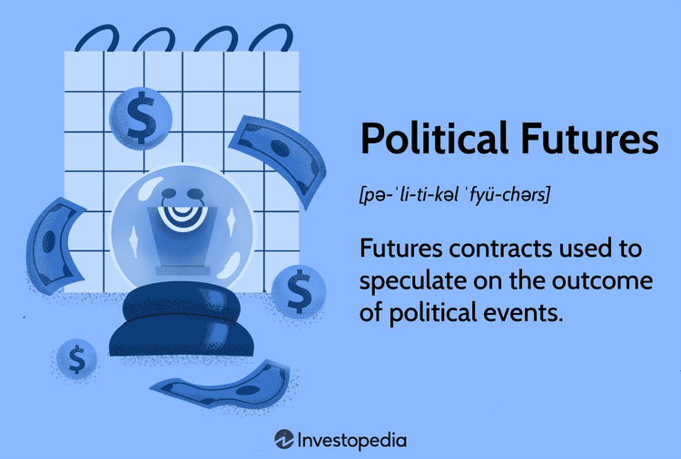

In today's rapidly evolving world, the intersection of politics, finance, and technology has never been more pronounced. As global landscapes shift, the influence of political events on financial markets becomes increasingly significant. Political analysis, therefore, plays a crucial role in shaping and forecasting market dynamics. Instruments such as political futures have emerged, allowing investors to speculate on political outcomes and adapt their strategies accordingly. These contracts function similarly to commodity futures, enabling traders to manage risk and potentially benefit from political developments.

Moreover, the rise of algorithmic trading (algo trading) has revolutionized how investors engage with financial markets. By leveraging advanced algorithms, traders can execute transactions with remarkable speed and precision, often outpacing traditional methods. This technology eliminates the human emotions that can lead to inconsistent decision-making, enabling a data-driven approach to investments.



This article explores the future of politics and political futures, examining how they simultaneously impact and are impacted by algo trading. By integrating insights from political analysis with the technical efficiencies of algorithmic trading, investors can develop strategies that anticipate and capitalize on market movements triggered by political changes. As technology advances, the fusion of these domains offers both challenges and opportunities, requiring investors to stay informed and adaptable in a rapidly changing world.

## Table of Contents

## Understanding Political Futures

Political futures are a type of financial contract that allows individuals to speculate on the outcomes of political events. These contracts function similarly to commodity futures, where traders place bets based on the anticipated results of specific occurrences, such as elections, legislative decisions, or geopolitical developments. The fundamental concept is to predict political events and capitalize on those predictions. Just as a trader might invest in oil futures by predicting a rise in oil prices, a political futures trader speculates on the likelihood of a particular political outcome.

In the United States, political futures face legal restrictions. The primary concern revolves around the ethical and regulatory implications of betting on political outcomes, which can be perceived as gambling. As a result, real-money political futures markets are generally illegal in the U.S. However, the Iowa Electronic Markets (IEM) operate as an exception, primarily for academic and research purposes. The IEM offers a limited scale market where participants can trade contracts based on political events, but within a controlled environment meant to study and analyze market behaviors rather than purely financial gain.

Beyond traditional structures, innovative technologies have given rise to decentralized platforms like Augur. Powered by blockchain technology, Augur provides a marketplace for trading political futures in a decentralized manner. The platform leverages smart contracts on the Ethereum blockchain to manage the trades, ensuring transparency, security, and a lack of centralized control. These features are vital in maintaining trust among users, as transactions and outcomes on such platforms are immutable and verifiable by anyone with access to the blockchain.

Decentralized prediction markets like Augur do not face the same limitations as traditional markets because they do not directly manage user funds or outcomes in a centralized manner. Instead, the use of decentralized architectures allows users globally to interact with and create markets based on political predictions, offering a new playground for speculation on future political landscapes. It is essential, however, for users to remain aware of the local regulations affecting their participation, as legal perspectives on such markets can differ widely internationally.

In conclusion, political futures present an intriguing intersection of finance, politics, and technology, serving as tools for speculation and insight while navigating the regulatory landscape and employing cutting-edge platforms like blockchain technology to facilitate decentralized trading opportunities.

## The Impact of Political Analysis on Financial Markets

Political analysis plays a pivotal role in guiding investors through the complex landscape of financial markets by providing insights into potential market movements driven by political events. This analysis is particularly crucial during elections, legislative changes, and geopolitical events, which often introduce significant [volatility](/wiki/volatility-trading-strategies) in financial markets.

Elections are a primary focus for political analysts as they often herald shifts in economic policies, regulatory environments, and domestic and international relations. For instance, the outcome of a presidential election can reshape fiscal policies, trade agreements, and international alliances, directly affecting stock markets, currency values, and interest rates. Investors keenly follow electoral processes and potential outcomes to adjust their portfolios in anticipation of such changes. For example, a candidate favoring increased government spending in infrastructure may positively impact the construction and materials sectors, prompting investors to reallocate resources accordingly.

Policy changes, including new legislation or amendments to existing laws, can also lead to market fluctuations. Regulatory reforms in sectors like finance, healthcare, and energy can influence corporate profitability and market strategies. A clear example is the Dodd-Frank Act in the United States, which significantly impacted financial institutions by imposing stringent regulations aimed at increasing transparency and reducing systemic risk. Political analysis in such scenarios involves evaluating the broad economic impact of proposed regulations and understanding the nuances of policy implementation, allowing investors to make strategic decisions.

Geopolitical developments often create ripples in global markets due to their potential to disrupt economic stability and international trade. Political tensions, such as trade disputes or military conflicts, can lead to volatility in commodities, currencies, and equities. An ongoing trade dispute, for instance, may result in tariffs that affect global supply chains, impacting companies operating in export-driven economies. Political analysts assess the likelihood and potential impact of these developments, enabling investors to hedge against risks or capitalize on emerging opportunities.

An effective political analysis that accurately anticipates market reactions can provide investors with a competitive advantage. By understanding the implications of political dynamics, investors can time their entries and exits in the market more precisely. Moreover, comprehensive political analysis helps in identifying sectors poised for growth or contraction, allowing for informed asset allocation. This strategic foresight is invaluable in navigating the uncertainties inherent in financial markets, offering a buffer against unexpected losses and opening avenues for profit through well-timed investments. 

In summary, political analysis serves as an essential tool for investors aiming to align their financial strategies with the ever-evolving political landscape, ultimately influencing market directions and investment success.

## Algorithmic Trading: A Tool for Modern Investors

Algorithmic trading, commonly known as algo trading, utilizes complex algorithms to automate the process of trading financial securities. These algorithms are built on a set of predefined criteria, allowing trades to be executed with high precision and minimal delay. The primary advantage of algo trading lies in its ability to provide unparalleled speed and accuracy, facilitating transactions that would be impossible for a human to perform.

One of the key benefits of algo trading is its capacity to eliminate human emotion from the trading process. Emotional decision-making can lead to suboptimal trading results, often characterized by panic selling or irrational exuberance. By relying on algorithms, investors can ensure a disciplined approach to trading, adhering strictly to the strategy without the influence of emotional biases.

Several popular strategies are employed in algo trading, each leveraging the rapid computational capacity of modern technology to analyze large datasets and execute trades:

1. **Trend-following Strategy**: This approach involves creating algorithms that identify and capitalize on market trends. The algorithms analyze historical price data and market indicators to predict future price movements. One common technique is the moving average crossover, where buy and sell signals are generated when a short-term moving average crosses a long-term moving average. The objective is to ride a trend until the indicators suggest a reversal.

2. **Arbitrage**: Arbitrage strategies exploit price discrepancies between different markets or instruments. Algorithms are designed to quickly identify these discrepancies and execute trades to profit from the differential. For example, if a stock is trading at different prices on two exchanges, the algorithm can simultaneously buy on the lower-priced exchange and sell on the higher-priced one, locking in a risk-free profit.

3. **Market-making**: In market-making strategies, algorithms provide liquidity to markets by placing both buy and sell orders for a particular security. The algorithm continuously updates these orders based on market conditions to profit from the bid-ask spread. Market makers play a crucial role in ensuring sufficient liquidity in financial markets, thereby contributing to efficient price discovery.

To implement an [algorithmic trading](/wiki/algorithmic-trading) strategy, a basic Python example using the trend-following moving average crossover might look like this:

```python
import pandas as pd

def moving_average(prices, window):
    return prices.rolling(window=window).mean()

def generate_signals(prices):
    short_window = 40
    long_window = 100

    signals = pd.DataFrame(index=prices.index)
    signals['price'] = prices
    signals['short_mavg'] = moving_average(prices, short_window)
    signals['long_mavg'] = moving_average(prices, long_window)

    signals['signal'] = 0.0
    signals['signal'][short_window:] = \
        np.where(signals['short_mavg'][short_window:] > signals['long_mavg'][short_window:], 1.0, 0.0)  
    signals['positions'] = signals['signal'].diff()

    return signals

# Example usage with hypothetical price data
prices = pd.Series([/* hypothetical price data */])
signals = generate_signals(prices)
```

In conclusion, algorithmic trading stands as a powerful tool for modern investors, offering speed, accuracy, and an emotion-free approach to trading. By adopting various strategies such as [trend following](/wiki/trend-following), [arbitrage](/wiki/arbitrage), and [market making](/wiki/market-making), traders can effectively leverage the power of technology to achieve their investment goals.

## Integrating Political Futures with Algo Trading

Combining political futures analysis with algorithmic trading offers significant potential to refine investment strategies. Political futures markets, which allow participants to speculate on the outcomes of political events, can be highly volatile and react quickly to new information. The effectiveness of algorithmic trading (algo trading) in such contexts lies in its ability to execute trades at high speeds based on predefined criteria, facilitating rapid responses to market changes.

Algo trading algorithms can monitor political futures markets 24/7, capturing minute-by-minute fluctuations that might not be perceptible to human traders. By leveraging historical data and statistical models, these algorithms can predict potential market movements and swiftly enact buy or sell orders. This speed is critical in political futures markets, where new information, such as polls or election results, can trigger sudden and substantial price shifts.

For instance, suppose a political futures contract is linked to an upcoming election result. As new polling data becomes available, the market prices of these contracts may fluctuate significantly. An algo trading system can be programmed to execute trades based on parameters like changes in polling trends or sentiment analysis derived from social media. Such an approach ensures that investment decisions are data-driven and timely, reducing the lag associated with human intervention.

Moreover, algorithmic strategies, such as trend-following or mean-reversion, can be tailored to accommodate the unique characteristics of political futures markets. Trend-following algorithms might identify a continuing trend in political sentiment and capitalize on it, while mean-reversion strategies could exploit rapid reversals in market sentiment following unexpected political developments.

However, the integration process also necessitates rigorous [backtesting](/wiki/backtesting) to ensure that the algorithms perform robustly across different political scenarios. By simulating trades with historical data, traders can fine-tune their algorithms to optimize performance and minimize risks, thereby increasing the precision and profitability of their investments.

By combining the analytical strengths of political futures with the speed and precision of algo trading, investors can effectively navigate the uncertainties of political climates. This integration not only enhances the capacity to capitalize on short-lived market inefficiencies but also offers a strategic advantage in managing the risks associated with heavily influenced political markets.

## Challenges and Opportunities Ahead

Political futures markets encounter significant legal and regulatory obstacles, particularly in the United States, where such contracts are generally considered illegal. The primary challenge exists in navigating U.S. laws that restrict gambling, categorizing political futures under this umbrella. This legal framework not only stifles market growth but also limits the potential for innovation in trading strategies and prediction mechanisms for political events. Nevertheless, platforms like the Iowa Electronic Markets, which operate under specific conditions for academic purposes, illustrate an exception to these regulations, thereby allowing limited exploration of political futures. Similarly, decentralized platforms utilizing blockchain, such as Augur, offer a way to circumvent traditional regulatory environments, though they face their own sets of challenges and uncertainties.

Algorithmic trading (algo trading), on the other hand, presents its own set of technical challenges and opportunities. This trading approach necessitates the use of advanced technology to develop and execute complex algorithms capable of analyzing vast amounts of data and executing trades at high speeds. However, algo trading is not without risks. Technical failures, such as software bugs and hardware malfunctions, can lead to significant financial losses. Moreover, the risk of overfitting, where models are too closely tailored to historical data and fail to adapt to new market conditions, remains a concern among traders utilizing algo trading.

As technology progresses, particularly in AI and [machine learning](/wiki/machine-learning), the potential to enhance these trading strategies grows. Machine learning algorithms can be employed to improve prediction accuracy by learning patterns from historical and real-time data far more efficiently than traditional models. For instance, techniques such as natural language processing (NLP) can analyze political speeches, news articles, and social media to assess sentiment and predict political outcomes. In Python, popular libraries like TensorFlow and PyTorch can be leveraged to build machine learning models that could forecast market movements with greater precision.

The continuous development of AI also introduces novel opportunities to address the challenges of algo trading. Improved algorithms can mitigate the risks associated with technical failures and overfitting by providing more robust and adaptive trading systems. Machine learning models can be designed to self-improve over time, using feedback loops to adjust trading strategies based on new data inputs, thus offering a more dynamic approach to market analysis.

In conclusion, while political futures and algo trading face distinct and complex challenges, the integration of advanced technologies offers promising pathways to overcome these hurdles and unlock new opportunities for investors. As legal frameworks, technological capabilities, and market demands continue to evolve, participants in these markets must stay informed and adaptable to maximize the potential benefits.

## Conclusion

In today's rapidly evolving landscape, the convergence of politics, financial markets, and technology presents significant opportunities and challenges. Political futures, as speculative instruments on political events, provide nuanced insight into potential market movements. When integrated with the precision of algorithmic trading (algo trading), these insights transform into actionable investment strategies, allowing investors to capitalize on political developments with unprecedented efficiency.

The dynamic nature of political events, ranging from elections to policy shifts, inherently influences market volatility. By quantifying these outcomes, political futures offer a predictive dimension that can be harnessed through advanced trading algorithms. This fusion not only enhances the ability to respond to political events but also optimizes trading strategies in volatile environments, aligning investment decisions with real-time developments.

As both political futures and algo trading continue to mature, they present a dual-edged opportunity. The potential for profitability is significant, yet requires vigilance and adaptability. Investors must remain informed on regulatory changes, technological advancements, and geopolitical events to effectively navigate this complex interplay. Continuous learning and flexible strategy implementation will be crucial for maintaining a competitive edge in this evolving landscape.

To fully exploit the benefits of this intersection, investors must embrace emerging technologies such as [artificial intelligence](/wiki/ai-artificial-intelligence) and machine learning. These technologies promise to further refine predictive models and enhance execution capabilities, offering deeper market insights and fostering more robust investment strategies. By leveraging these advancements, investors position themselves to unlock new opportunities that this integration promises in a world defined by rapid change and uncertainty.

## References & Further Reading

[1]: Wolfers, J., & Zitzewitz, E. (2004). ["Prediction Markets."](https://www.nber.org/papers/w10504) Journal of Economic Perspectives, 18(2), 107-126.

[2]: Manski, C. F. (2006). ["Interpreting the Predictions of Prediction Markets."](https://www.nber.org/papers/w10359) Economics Letters, 91(3), 425-429.

[3]: Fortson Jr, R. (2011). ["Algorithmic Trading: Do You Know Who Your Counterparty Is?"](https://onlinelibrary.wiley.com/doi/full/10.1111/j.1540-6261.2010.01624.x) Journal of Trading, 6(3), 61-72.

[4]: Black, F. (1976). ["Studies of Stock Price Volatility Changes."](https://www.scirp.org/reference/ReferencesPapers?ReferenceID=1969803) Proceedings of the 1976 Meetings of the American Statistical Association, Business and Economic Statistics Section, 177-181.

[5]: Augur. ["An open, global prediction market protocol."](https://github.com/AugurProject/augur)

[6]: Iowa Electronic Markets. ["A platform for prediction markets."](https://iem.uiowa.edu/iem/)

[7]: MacKinlay, A. C. (1997). ["Event Studies in Economics and Finance."](https://www.jstor.org/stable/2729691) Journal of Economic Literature, 35(1), 13-39.