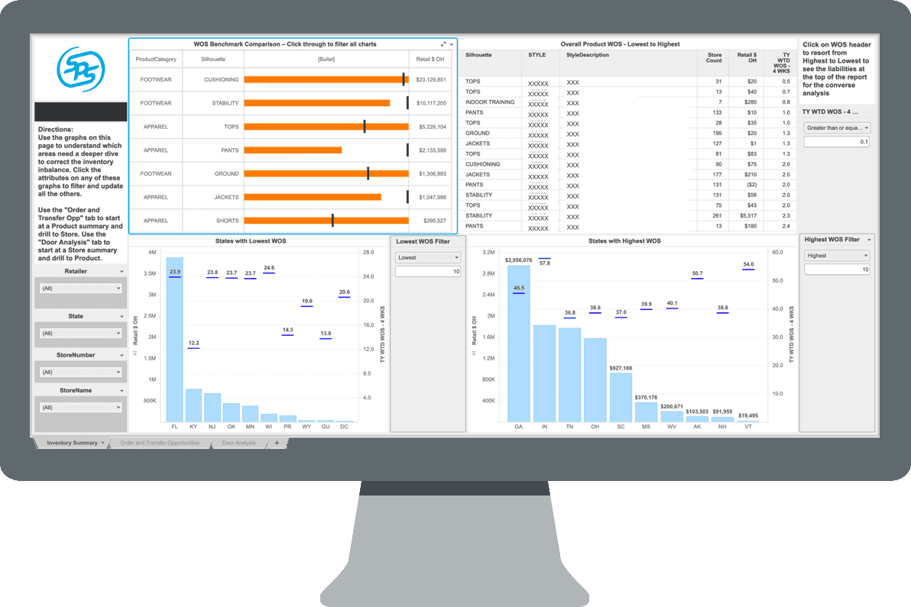

## Table of Contents

## What are retail stocks and why are they important?

Retail stocks are shares of companies that sell products directly to consumers. These companies can include big department stores, clothing shops, grocery stores, and online sellers like Amazon. When you buy a retail stock, you own a small piece of that company. The price of the stock can go up or down based on how well the company is doing. If the company makes more money, the stock price usually goes up, and if it loses money, the stock price usually goes down.

Retail stocks are important for a few reasons. First, they give investors a way to make money if they think a retail company will do well. If the company grows and makes more profit, the value of the stock can increase, and the investor can make a profit by selling the stock for more than they paid. Second, retail stocks can tell us a lot about how people are spending their money. If retail stocks are doing well, it often means that people are buying more things, which can be a sign that the economy is strong. On the other hand, if retail stocks are not doing well, it might mean that people are not spending as much, which can be a warning sign for the economy.

## How do retail stocks differ from other types of stocks?

Retail stocks are different from other types of stocks because they come from companies that sell things directly to people. This can be anything from clothes and food to electronics and furniture. Other types of stocks might be from companies that make things (like cars or computers), offer services (like banks or insurance companies), or even extract resources (like oil or mining companies). So, while retail stocks focus on selling products to consumers, other stocks might be about making things, providing services, or getting raw materials.

Another way retail stocks differ is how they react to what people are doing and feeling. Retail stocks can go up and down based a lot on how much people are spending. If people feel good about the economy and are buying a lot, retail stocks usually do well. But if people are worried and not spending much, retail stocks can struggle. Other types of stocks, like those from tech companies or utilities, might not change as much based on how people feel about spending money. They might be more affected by things like new technology, government rules, or changes in the cost of materials they need.

## What are some common retail companies listed on the stock market?

Some common retail companies you can find on the stock market are Walmart, Target, and Costco. These are big stores where people go to buy all sorts of things like food, clothes, and electronics. Walmart is known for having low prices and stores all over the world. Target is popular for its trendy products and good customer service. Costco is famous for selling things in big packs at lower prices, and you need a membership to shop there.

Another group of well-known retail companies includes Amazon, Home Depot, and Best Buy. Amazon started as an online bookstore but now sells almost everything you can think of, from toys to groceries. Home Depot is a big store for home improvement stuff, where people go to buy tools and materials for fixing up their homes. Best Buy is a place to go for electronics like TVs, computers, and smartphones. These companies are all listed on the stock market, and people can buy and sell their stocks.

There are also clothing and specialty retail companies like Nike, Macy's, and Ulta Beauty. Nike is famous for its sports shoes and clothes, and people all over the world wear their products. Macy's is a big department store that sells a lot of different things, from clothes to makeup. Ulta Beauty focuses on beauty products and services, like makeup, skincare, and hair care. All these companies are part of the retail sector and their stocks can be bought and sold by investors.

## What basic financial metrics should beginners look at when analyzing retail stocks?

When beginners start looking at retail stocks, they should pay attention to a few key financial metrics. One of the most important is revenue, which is the total amount of money a company makes from selling its products. If a retail company's revenue is going up, it usually means more people are buying things from them, which is a good sign. Another important metric is profit, or net income. This is what's left after the company pays for all its costs, like making products, paying employees, and other expenses. A growing profit means the company is not just selling more, but also keeping more of the money it makes.

Another key metric to look at is the company's earnings per share (EPS). This tells you how much money the company made for each share of its stock. If EPS is going up, it can make the stock more attractive to investors because it shows the company is doing well. Beginners should also consider the price-to-earnings (P/E) ratio, which compares the stock's price to its earnings. A lower P/E ratio might mean the stock is a good deal, while a higher one might mean it's expensive. By looking at these basic financial metrics, beginners can get a better idea of how well a retail company is doing and whether its stock might be a good investment.

## How does consumer behavior impact the performance of retail stocks?

Consumer behavior has a big impact on how well retail stocks do. When people feel good about their money and the economy, they tend to spend more. This means more sales for retail companies, which can lead to higher profits and higher stock prices. For example, if a lot of people are buying clothes and shoes from a store like Nike, Nike's revenue goes up. More revenue usually means more profit, and when a company makes more profit, its stock price often goes up too.

On the other hand, if people are worried about their money or the economy, they might spend less. This can hurt retail companies because they sell fewer things, which can lead to lower profits and lower stock prices. For instance, if people stop buying as many clothes from Macy's because they want to save money, Macy's revenue goes down. Less revenue means less profit, and when a company makes less profit, its stock price often goes down. So, understanding how people are spending their money can help predict how retail stocks might do.

## What role does economic cycles play in the valuation of retail stocks?

Economic cycles have a big impact on how much retail stocks are worth. When the economy is doing well and growing, people usually feel more confident about their money. They are more likely to spend on things they want, like new clothes, electronics, or home goods. This means more sales for retail companies, which can lead to higher profits. When a retail company makes more profit, its stock price often goes up because investors see it as a good investment. So, during good economic times, retail stocks often do well and their value goes up.

On the other hand, when the economy is not doing well and maybe even shrinking, people tend to worry more about their money. They might cut back on spending and only buy what they really need. This can hurt retail companies because they sell fewer products, which leads to lower profits. When a company's profits go down, its stock price usually goes down too because investors might see it as a riskier investment. So, during bad economic times, retail stocks often struggle and their value can go down. Understanding where we are in the economic cycle can help investors guess how retail stocks might perform.

## How can investors use technical analysis to predict movements in retail stocks?

Investors can use technical analysis to predict movements in retail stocks by looking at charts and patterns. They study things like stock prices and trading volumes over time. By spotting trends and patterns, like when a stock price keeps going up or down, investors can guess where the stock might go next. For example, if a retail stock's price has been going up in a steady pattern, an investor might think it will keep going up for a while. They use tools like moving averages, which smooth out price changes over time, to help them see these trends more clearly.

Another way investors use technical analysis is by looking at support and resistance levels. Support is a price level where a stock often stops falling and starts going up again, while resistance is where it stops going up and starts falling. If a retail stock keeps bouncing off a certain support level, an investor might think it's a good time to buy because the price might go up from there. On the other hand, if the stock keeps hitting a resistance level and then going down, it might be a sign to sell or wait for a better time to buy. By understanding these patterns and levels, investors can make better guesses about when to buy or sell retail stocks.

## What are the key financial ratios specific to retail that investors should monitor?

When looking at retail stocks, investors should pay attention to the inventory turnover ratio. This ratio shows how quickly a retail company sells and replaces its stock of goods. A high inventory turnover means the company is selling its products fast, which is good because it shows people want to buy what the store is selling. A low turnover might mean the company has too much stuff that isn't selling, which can be bad because it ties up money in products that aren't moving.

Another important ratio is the gross margin, which tells you how much money a retail company makes after paying for the things it sells. A higher gross margin means the company is good at keeping costs low and selling at a good price. This can be a sign that the company is doing well. Investors should also look at the same-store sales growth, which compares sales in stores that have been open for at least a year. If same-store sales are going up, it means the company is doing better at selling things, even without opening new stores.

## How do mergers and acquisitions affect retail stock prices?

Mergers and acquisitions can have a big impact on retail stock prices. When one retail company buys another, it can make the stock price of the company being bought go up. This is because the buying company usually pays more for the stock than what it's worth on the market. People who own the stock of the company being bought can make money from this. Also, if investors think the merger or acquisition will make the buying company stronger and more profitable, they might want to buy more of its stock, which can push the price up.

On the other hand, mergers and acquisitions can also make stock prices go down. If investors think the deal will cost too much or won't help the company make more money, they might sell their stock. This can make the stock price drop. Sometimes, the uncertainty about how the merger or acquisition will work out can also make people nervous, and they might sell their stock until they know more. So, while mergers and acquisitions can be good for stock prices, they can also be risky and lead to lower prices if things don't go as planned.

## What are the emerging trends in the retail sector that could influence stock performance?

One big trend in the retail sector is the move to online shopping. More and more people are buying things on the internet instead of going to stores. This has made companies like Amazon very popular, and their stock prices have gone up a lot. But it's not just big companies; smaller retailers are also selling online. This shift can affect stock prices because companies that do well online can grow faster and make more money. On the other hand, companies that don't have a good online presence might struggle, and their stock prices could go down.

Another trend is the focus on sustainability and ethical shopping. More people want to buy from companies that care about the environment and treat their workers well. This has pushed retailers to change how they do things, like using less plastic and paying workers better. If a retail company can show it's doing these things, its stock might go up because more people want to buy from them. But if a company doesn't keep up with these trends, people might stop buying from them, which could hurt its stock price. So, understanding these trends can help investors guess how retail stocks might do in the future.

## How can advanced statistical models be used to forecast retail stock performance?

Advanced statistical models can help investors predict how retail stocks might do by looking at a lot of data and finding patterns. These models use things like past stock prices, how much people are spending, and even what people are saying on social media. By putting all this information together, the models can guess if a stock will go up or down. For example, if a model sees that a retail company's sales are going up and people are talking more about it online, it might predict that the stock price will go up too. This can help investors make better choices about when to buy or sell stocks.

Another way these models work is by using something called [machine learning](/wiki/machine-learning). This means the model can learn from new data and get better at making predictions over time. For instance, if a model keeps track of how a retail company does during different times of the year, like the holiday season, it can start to see patterns and predict how the stock might do in the future. By using these advanced models, investors can get a clearer picture of what might happen with retail stocks, which can help them make smarter investment decisions.

## What are the global factors that experts consider when analyzing international retail stocks?

When experts look at international retail stocks, they think about how strong the economy is in different countries. If a country's economy is growing, people might have more money to spend on things from retail stores. This can make retail stocks in that country do well. But if a country's economy is not doing well, people might not spend as much, which can hurt retail stocks. Experts also look at things like how much people earn, how many people have jobs, and what the government is doing with money. All these things can change how much people buy from retail stores and affect stock prices.

Another thing experts consider is how easy it is for companies to sell things in different countries. This includes things like trade rules, taxes, and how much it costs to ship things. If it's easy and cheap for a retail company to sell things in another country, it might do well and its stock could go up. But if there are a lot of rules or high costs, it might be harder for the company to make money, which could hurt its stock price. Experts also look at what people in different countries like to buy and how they shop, because these things can be different all over the world and can affect how well a retail company does.

## What are the key metrics for analyzing retail stocks?

Retail stocks can be effectively analyzed by focusing on key performance indicators that reflect the health and prospects of a company within the sector. A comprehensive analysis should incorporate both qualitative and quantitative assessments, starting with an examination of the physical and digital interfaces that the company offers its customers.

Visiting physical and online stores allows investors to gauge the customer experience and evaluate product offerings. Observing factors such as store layout, staff interaction, and product availability can provide insights into customer satisfaction and loyalty. Online platforms should be assessed for user-friendliness, website design, and the efficiency of transaction processes.

Analyzing promotional activities is essential to understanding a company's pricing strategies and inventory management practices. Promotions can indicate a company's approach to pricing, whether they rely on discounting to drive sales or focus on premium pricing strategies. This analysis can also point to inventory management efficiencies; frequent stockouts or excessive inventories can highlight potential operational challenges.

Gross margin trends and sales-per-square-foot data are critical quantitative metrics for assessing operational efficiency. The gross margin, calculated as:

$$
\text{Gross Margin} = \frac{\text{Revenue} - \text{Cost of Goods Sold}}{\text{Revenue}}
$$

reflects a company's ability to control production costs relative to its sales price. An increasing gross margin suggests improved cost control or pricing power, while a decline may indicate rising costs or competitive pricing pressures. 

Sales-per-square-foot is another vital metric, offering insights into how effectively a retailer utilizes its physical space. This measure is calculated by dividing total sales by the total square footage of the store. Higher values suggest efficient use of retail space to generate revenue.

Investigating inventory and receivable trends can further reveal insights into the financial health of a retail company. Inventory turnover ratio, calculated as:

$$
\text{Inventory Turnover} = \frac{\text{Cost of Goods Sold}}{\text{Average Inventory}}
$$

indicates how quickly a company is selling its inventory. A higher turnover rate is generally positive, suggesting effective inventory management and strong sales. Conversely, a low turnover rate may signal overstocking or insufficient demand.

Receivable turnover, defined as:

$$
\text{Receivable Turnover} = \frac{\text{Net Credit Sales}}{\text{Average Accounts Receivable}}
$$

measures how efficiently a company collects on its credit sales. A higher ratio implies that the company collects receivables quickly, improving cash flow, while a lower ratio could signal potential issues with credit policies or customer satisfaction.

By thoroughly assessing these metrics, investors can gain a detailed understanding of a retail company's operational health, which is crucial for making informed investment decisions.

## References & Further Reading

[1]: Bergstra, J., Bardenet, R., Bengio, Y., & Kégl, B. (2011). ["Algorithms for Hyper-Parameter Optimization."](https://proceedings.neurips.cc/paper/2011/file/86e8f7ab32cfd12577bc2619bc635690-Paper.pdf) Advances in Neural Information Processing Systems 24.

[2]: ["Advances in Financial Machine Learning"](https://www.amazon.com/Advances-Financial-Machine-Learning-Marcos/dp/1119482089) by Marcos Lopez de Prado

[3]: ["Evidence-Based Technical Analysis: Applying the Scientific Method and Statistical Inference to Trading Signals"](https://books.google.com/books/about/Evidence_Based_Technical_Analysis.html?id=MeoJAQAAMAAJ) by David Aronson

[4]: ["Machine Learning for Algorithmic Trading"](https://github.com/stefan-jansen/machine-learning-for-trading) by Stefan Jansen

[5]: ["Quantitative Trading: How to Build Your Own Algorithmic Trading Business"](https://github.com/LucindaYa/quant-resources/blob/master/Quantitative%20Trading%20How%20to%20Build%20Your%20Own%20Algorithmic%20Trading%20Business.pdf) by Ernest P. Chan