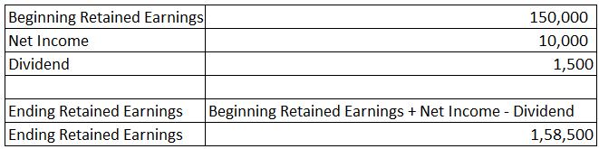

## Table of Contents

## What are retained earnings?

Retained earnings are the profits that a company keeps after it pays out dividends to its shareholders. Imagine a company makes some money. Instead of giving all of that money to the people who own the company, it keeps some of it. That money is called retained earnings. It's like saving some of your allowance instead of spending it all.

Companies use retained earnings for many things. They might use it to buy new equipment, pay off debts, or even start new projects. It's a way for the company to grow and improve without needing to borrow money or find new investors. Retained earnings are important because they show how well a company is doing and how it plans to use its profits in the future.

## How are retained earnings calculated?

Retained earnings are calculated by starting with the retained earnings from the previous year. Then, you add the net income the company made during the current year. Net income is what's left after the company pays all its bills and taxes. But, if the company paid out any dividends to its shareholders, you subtract that amount from the total. So, the formula is simple: last year's retained earnings plus this year's net income minus any dividends paid out equals this year's retained earnings.

This calculation helps show how much money the company is keeping to use for future growth or other needs. It's like keeping track of your savings. If you saved $100 last year, earned $50 this year, and spent $20 on something fun, your new savings would be $130. Companies do the same thing but on a bigger scale. By looking at retained earnings, you can see if a company is doing well and planning for the future.

## Why are retained earnings important for a business?

Retained earnings are important for a business because they show how much money the company has saved up over time. This money comes from the profits the company makes after paying all its bills and taxes. When a business keeps some of its profits instead of giving all of it to shareholders, it can use that money to grow and improve. It's like saving money in a piggy bank for something big, like buying new equipment or starting a new project.

Having a good amount of retained earnings also tells people that the business is doing well. If a company can save money year after year, it means it's making more money than it's spending. This can make shareholders and investors happy because it shows the company is strong and has a good plan for the future. Retained earnings are like a report card that shows how healthy and successful a business is.

## What is the difference between retained earnings and net income?

Retained earnings and net income are two important numbers for a business, but they are different. Net income is the money a company makes after it pays all its bills and taxes. It's like the money you have left after buying everything you need. This is the profit the company makes in one year. On the other hand, retained earnings are the profits that the company keeps over time. It's like saving some of your allowance instead of spending it all. Retained earnings start with last year's retained earnings, add the current year's net income, and then subtract any dividends paid to shareholders.

The key difference is that net income is a snapshot of the company's profit for one year, while retained earnings show how much profit the company has saved up over many years. Think of net income as your weekly allowance, and retained earnings as the total amount of money you've saved from all your allowances over time. Retained earnings help the company grow and improve by using the money they've saved, while net income shows how well the company did in a single year.

## How do dividends affect retained earnings?

Dividends are payments that a company gives to its shareholders from its profits. When a company decides to pay dividends, it takes some of its net income and gives it to the people who own the company. This means that the money paid out as dividends is not kept by the company. So, when you calculate retained earnings, you start with the retained earnings from last year, add the net income from this year, but then you have to subtract the dividends that were paid out. The more dividends a company pays, the less money it has left as retained earnings.

Think of it like this: if you earn $100 and decide to spend $30 on a toy, you only have $70 left to save. The same goes for a company. If it makes a profit of $100,000 and pays out $30,000 in dividends, it only keeps $70,000 as retained earnings. Dividends directly reduce the amount of money a company can keep for future use, like buying new equipment or starting new projects. So, dividends are important to consider when looking at how much money a company is saving up over time.

## Can retained earnings be negative, and what does that indicate?

Yes, retained earnings can be negative, and that means the company has more losses than profits over time. Imagine you have a piggy bank where you save your allowance. If you spend more money than you put in, you end up with less than zero. It's the same for a company. If it keeps losing money year after year, and those losses are bigger than any profits it made before, the retained earnings will be negative.

When a company has negative retained earnings, it's a sign that it might be struggling. It shows that the business has not been able to make enough money to cover its costs and pay dividends. This can worry shareholders and investors because it means the company might not have enough money to grow or even stay in business. It's like a warning sign that the company needs to find a way to make more money or cut back on spending.

## How do companies use retained earnings for growth?

Companies use retained earnings to grow in many ways. One way is by buying new equipment or technology that helps them make their products faster or better. For example, a bakery might use its saved money to buy a new oven that can bake more bread at once. This helps the bakery make more money because it can sell more bread. Another way is by starting new projects or opening new stores. If a clothing store has saved up enough money, it might open a new location in a different city. This can help the company reach more customers and make more sales.

Retained earnings can also be used to pay off debts. When a company owes money, using retained earnings to pay it back means the company doesn't have to pay interest on that debt anymore. This saves money in the long run and helps the company grow because it has more money to use for other things. Sometimes, companies use retained earnings to buy other businesses. This can help them grow quickly because they can start selling new products or services right away. By using retained earnings wisely, companies can keep getting bigger and stronger.

## What are the accounting entries for retained earnings?

When a company makes a profit, it records this as net income on its income statement. At the end of the year, this net income is transferred to the retained earnings account on the balance sheet. This is done with a journal entry that debits the income summary account and credits the retained earnings account. If the company has a loss instead of a profit, the loss is debited to the retained earnings account, reducing the amount of retained earnings.

If the company decides to pay dividends to its shareholders, it will record this by debiting the retained earnings account and crediting the dividends payable account. When the dividends are actually paid out, the company will debit the dividends payable account and credit the cash account. This process shows how the company's profits are either kept as retained earnings or paid out as dividends, and it keeps the balance sheet up to date.

## How do changes in accounting policies impact retained earnings?

When a company changes its accounting policies, it can affect the retained earnings. Imagine you have been keeping track of your allowance in a certain way, but then you decide to count your money differently. This new way might show you have more or less money saved up than before. The same thing happens with a company. If it changes how it counts its profits or expenses, the amount of money it shows as retained earnings can change too. This is because the new policy might make the company's past profits look different, which changes the starting point for calculating retained earnings.

For example, if a company used to count its inventory one way and switches to another way, the value of its inventory might go up or down. This change can make the company's past profits look higher or lower, which then changes the retained earnings. Companies have to tell everyone about these changes and show how much the retained earnings changed because of the new policy. This helps everyone understand the company's financial health better, even if the numbers look different now.

## What role do retained earnings play in financial analysis and valuation?

Retained earnings are really important when people want to understand how well a company is doing and how much it might be worth. When someone looks at a company's financials, they check the retained earnings to see how much profit the company has saved up over time. This helps them figure out if the company is good at making money and if it's using that money wisely. If a company has a lot of retained earnings, it shows that it's doing well and has money to grow or pay off debts. This can make the company look more valuable because it has a strong financial position.

On the other hand, if a company has low or negative retained earnings, it might mean the company is struggling. This can make people worry about the company's future and might lower its value. Financial analysts use retained earnings to compare different companies and see which ones are better at saving and using their profits. This helps them decide which companies are good investments. So, retained earnings are a big part of figuring out a company's health and worth.

## How can a company's strategy influence its retained earnings?

A company's strategy can have a big impact on its retained earnings. If a company decides to grow quickly, it might use a lot of its profits to buy new things or start new projects. This means the company will have less money left over as retained earnings because it's spending more on growth. On the other hand, if a company wants to be safe and save money, it might keep more of its profits as retained earnings instead of spending them. This can help the company have more money in the future, but it might grow more slowly.

Another way a company's strategy can affect retained earnings is by deciding how much to pay in dividends. If a company wants to make its shareholders happy, it might pay out a lot of its profits as dividends. This means less money will be left as retained earnings. But if the company decides to keep more money for itself, it can pay smaller dividends and have more retained earnings. This choice depends on what the company thinks is best for its future plans and goals.

## What are advanced analytical techniques for assessing the efficiency of retained earnings?

One advanced way to look at how well a company uses its retained earnings is by using the return on retained earnings (RORE) ratio. This ratio helps you see if the money the company has saved up is being used in a smart way. To find the RORE, you take the company's net income and divide it by its retained earnings from the start of the year. If the RORE is high, it means the company is good at turning its saved money into more profits. If it's low, the company might not be using its retained earnings as well as it could.

Another way to check the efficiency of retained earnings is by looking at the company's growth in earnings per share (EPS). If a company uses its retained earnings to grow its business, you should see the EPS go up over time. If the EPS stays the same or goes down, it might mean the company isn't using its retained earnings in a way that helps it grow. By comparing the growth in EPS to the amount of retained earnings, you can see if the company's strategy is working. These methods help investors and analysts understand if a company is making good use of the money it keeps from its profits.

## What is Understanding Retained Earnings?

Retained earnings are a fundamental component of a company's financial structure, representing the cumulative amount of net income that a company chooses to retain rather than distribute to shareholders as dividends. These earnings play a pivotal role in enhancing a company's financial flexibility, enabling management to allocate resources towards capital projects, reduce debt, or maintain a financial buffer for unforeseen circumstances. 

By retaining a portion of net income, companies are better positioned to invest in growth opportunities, such as research and development or expanding operational capacity. This reinvestment can lead to increased revenue streams and improved market competitiveness over time. Furthermore, retained earnings contribute to a company's balance sheet strength, reflecting its ability to sustain operations without relying excessively on external financing.

To comprehend a company's growth potential and overall financial health, analyzing its retained earnings is crucial. A high level of retained earnings indicates consistent profitability and prudent management practices, which are positive signals for investors assessing a company's long-term viability.

The calculation of retained earnings involves several key financial elements. The formula for retained earnings is:

$$
\text{Retained Earnings} = \text{Beginning Retained Earnings} + \text{Net Income} - \text{Dividends Paid}
$$

- **Beginning Retained Earnings**: This is the amount of retained earnings carried over from the previous accounting period.

- **Net Income**: This represents the total profit a company earns during a specific period after accounting for all expenses, taxes, and costs.

- **Dividends Paid**: This refers to the portion of net income distributed to shareholders. A company deducts dividends from its net income to determine the retained earnings.

By consistently analyzing retained earnings, stakeholders gain valuable insights into a company's strategic financial decisions and its capacity to support future growth. Understanding how effectively a company uses its retained earnings provides a comprehensive view of its potential for sustaining competitive advantage and delivering long-term value to its shareholders.

## What is the role of retained earnings in financial analysis?

Retained earnings are a critical component of a company's financial framework, fundamentally impacting financial analysis and decision-making. They represent the accumulated portion of net income that is held back by a company instead of being distributed to shareholders as dividends. This figure is significant because it directly reflects a company’s ability to effectively use its profits toward growth and expansion initiatives.

Retained earnings provide valuable insights into a company's strategic orientation. Companies can choose to reinvest retained earnings into business operations, such as funding new projects, research and development, or acquiring assets. Alternatively, they might focus on returning value to shareholders through increased dividend payouts. The decision regarding the allocation of retained earnings signals the company's long-term strategy. If a company consistently reinvests its retained earnings, it typically indicates a focus on growth and market expansion. In contrast, substantial dividend distributions suggest an emphasis on providing immediate shareholder returns.

For analysts and investors, examining retained earnings alongside other financial statements, such as the balance sheet and income statement, supports a comprehensive understanding of a company's financial health and strategic direction. This analysis helps in evaluating management's efficiency in leveraging retained earnings for fostering company growth. Consider the formula for calculating retained earnings:

$$
\text{Retained Earnings}_{\text{Ending}} = \text{Retained Earnings}_{\text{Beginning}} + \text{Net Income} - \text{Dividends Paid}
$$

This formula reflects the changes in retained earnings over a period, integrating net income and dividends into the analysis. It demonstrates how effectively a company balances reinvestment and dividend distribution.

For long-term investors, retained earnings are a crucial indicator of the company's potential for future success. A company with a robust level of retained earnings implies a strong capacity for financing growth without relying heavily on external debt or equity financing. This self-sufficiency can be a positive sign for investors seeking long-term value appreciation, as it suggests sustainable growth prospects and financial resilience.

Furthermore, assessing retained earnings allows investors to gauge a company's profitability trends over time. Consistent growth in retained earnings may signal ongoing profitability and efficient management, qualities that are highly attractive to investors focused on building a stable, long-term investment portfolio.

In summary, retained earnings serve as a barometer of a company's strategic decisions and its potential to drive future success, offering profound insights to those analyzing a company's financial statements and overall market position.

## References & Further Reading

#