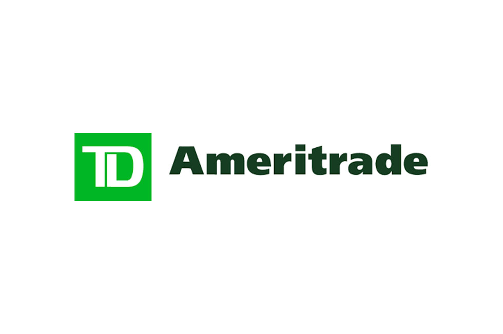

TD Ameritrade is a well-regarded brokerage firm known for its extensive platform offerings, appealing to both beginner and experienced investors. Founded in 1975, the company has built a reputation for a wide array of trading options and educational resources. As of its acquisition by Charles Schwab in 2020, TD Ameritrade continues to operate under Schwab's branding, maintaining distinct services with ongoing integration that is anticipated to conclude by late 2024.

The firm provides a comprehensive approach to investment, facilitated through its advanced thinkorswim platform. Thinkorswim offers a suite of powerful tools designed for robust investment analysis and algorithmic trading, accommodating the needs of various investor profiles. This platform is especially appealing to those interested in fine-tuning trading strategies through features like scripting for custom algorithms and backtesting strategies with extensive historical data. TD Ameritrade also supports a wide range of investment options, including stocks, mutual funds, ETFs, options, futures, and forex.

Educational resources constitute a significant part of TD Ameritrade's appeal. The platform offers a wealth of knowledge enhancement tools, from webinars to interactive tutorials, ensuring investors are well-equipped to develop and execute sound financial strategies. 

Investors interested in exploring the brokerage's services should be aware of both its strengths and constraints. While it lacks features such as fractional share trading and direct cryptocurrency investments, its comprehensive suite of tools and resources caters effectively to a variety of trading needs. 

This article will examine TD Ameritrade's offerings, focusing on platform features, user experiences, costs, and especially the algorithmic trading tools available. Understanding these elements is crucial for investors looking for a dependable brokerage to support their trading goals.

## Table of Contents

## Overview of TD Ameritrade

Founded in 1975, TD Ameritrade has consistently demonstrated its position as a leader in the financial services industry, providing extensive trading options alongside a robust offering of educational resources. The platform's history of innovation and dedication to customer service has cemented its reputation among both new and experienced investors.

In 2020, TD Ameritrade was acquired by Charles Schwab, a move that has positioned the combined entity to offer even more expansive services to a broad client base. The integration process of TD Ameritrade's offerings with Schwab's services is ongoing and anticipated to conclude by late 2024. This merger is expected to enhance the complementary strengths of both companies, optimizing service delivery and broadening access to investment tools for users.

One of the standout features of TD Ameritrade is its lack of minimum balance requirements. This inclusivity ensures accessibility for a diverse range of investors, allowing individuals to start investing regardless of their financial standing. Additionally, TD Ameritrade provides intuitive, user-friendly interfaces across its web, mobile, and desktop applications. This multiplatform approach caters to the preferences and needs of its users, facilitating an easy and seamless trading experience.

TD Ameritrade serves a comprehensive spectrum of investors through its wide array of services. Beginners benefit from the firm's extensive educational materials designed to foster an understanding of financial markets and investment strategies. Meanwhile, seasoned traders are attracted to its particularly robust thinkorswim platform. Thinkorswim is renowned for its advanced trading capabilities, offering sophisticated tools that enable users to engage in more complex trading activities, such as options and futures trading.

Overall, TD Ameritrade continues to occupy a significant role in the brokerage industry. Its integration with Charles Schwab is expected to lead to further innovative solutions and improved client experiences. The platform's commitment to accessibility, user-friendly design, and educational support upholds its reputation as a preferred choice for investors worldwide.

## Investment Analysis Features

TD Ameritrade offers a comprehensive suite of investment analysis tools designed to meet the diverse needs of investors. Among these features, stock screeners and market analysis software stand out, aiding users in making informed investment decisions. 

The thinkorswim platform, a cornerstone of TD Ameritrade’s offerings, provides detailed charting capabilities crucial for technical analysis. Users can access extensive stock scanners that enable them to filter through thousands of stocks based on specific criteria, such as price movements, [volume](/wiki/volume-trading-strategy), and technical indicators. These tools are essential for investors seeking thorough analysis before making trading decisions.

In addition to equities, the platform supports a range of investment options, including mutual funds, exchange-traded funds (ETFs), options, futures, and foreign exchange ([forex](/wiki/forex-system)) trading. This diversity allows investors to construct versatile and well-balanced portfolios, optimizing their investment strategies across various asset classes.

Educational resources are prominently featured, assisting investors in refining their trading skills and strategies. TD Ameritrade enhances user competency through webinars, tutorials, and articles that cover a broad spectrum of financial topics. These resources are particularly valuable for those looking to deepen their understanding of market dynamics and improve their ability to execute sound financial strategies effectively. 

Overall, TD Ameritrade empowers investors by providing a robust array of tools and educational materials, facilitating a holistic approach to investment analysis and strategy formulation.

## Algorithmic Trading at TD Ameritrade

Algorithmic trading at TD Ameritrade is significantly enhanced through its thinkorswim platform, a sophisticated tool designed to cater to both novice and experienced traders aiming to harness the power of automation in trading decisions. Central to this is the platform's proprietary scripting language, thinkScript, which allows users to craft custom trading algorithms tailored to their specific investment strategies.

Thinkorswim supports the creation of custom trading algorithms where investors can meticulously plan and automate trading actions based on predetermined criteria. This customization is achieved using thinkScript, which provides users with the capability to write scripts that can define entry and [exit](/wiki/exit-strategy) points, set up conditional alerts, and automate trading strategies. The language's syntax is user-friendly, making it accessible even to those who may not possess extensive programming knowledge.

Backtesting, a critical feature for validating trading strategies, is robustly supported on the thinkorswim platform. Investors can backtest their algorithms using historical data, allowing them to understand how their strategies would have performed in the past. This process involves evaluating the algorithm against past market conditions to ensure its reliability and effectiveness before deploying it in live trading environments. Users can access a range of historical data to fine-tune their strategies and optimize performance.

Moreover, thinkorswim provides a simulated trading environment where investors can test their strategies without financial risk. This feature is invaluable for refining algorithms, as it allows traders to observe how their automations function in real-time market conditions without the immediate impact of monetary loss. Such simulations enable the identification of potential weaknesses or the need for adjustments in trading logic.

While TD Ameritrade does not provide direct access to [cryptocurrency](/wiki/cryptocurrency) trading, the platform is versatile enough to apply algorithmic strategies to a variety of asset classes including futures, options, and other securities. This flexibility ensures that investors can leverage algorithmic approaches across different markets, diversifying their trading portfolios effectively.

Overall, TD Ameritrade's offerings through thinkorswim enable a comprehensive approach to [algorithmic trading](/wiki/algorithmic-trading), providing the necessary tools and functions to design, test, and execute automated trading strategies with precision and confidence.

## Usability and User Experience

Navigating TD Ameritrade's platforms is designed to be intuitive, whether through its mobile app or web interface. The user-centric design ensures that both novice and seasoned investors can efficiently manage their trades and portfolios. The platform's layout is straightforward, with accessible menus and customizable dashboards that users can tailor to their trading needs. Additionally, its mobile application mirrors the desktop experience, ensuring seamless functionality across devices.

The platform is praised for its comprehensive educational resources, making it accessible for beginners and empowering them to grow their investing acumen. TD Ameritrade provides a rich library of educational content, including webinars, articles, and tutorials that cover a wide range of investment topics. This extensive educational support allows users to build their knowledge base and improve their investment strategies progressively.

The customization and responsive design of thinkorswim allow active traders to monitor market movements effectively and make timely decisions. Thinkorswim, TD Ameritrade's advanced trading platform, offers robust charting tools and the ability to customize technical indicators. Traders can create personalized watchlists and set alerts for specific market events, ensuring they are always informed of potential trading opportunities. The responsive design ensures that these features are easily accessible, whether on a desktop or a mobile device, facilitating timely decision-making.

Reviews highlight excellent customer support and reliable service, contributing to a positive overall user experience. TD Ameritrade is renowned for its customer support services, providing multiple channels, such as phone, chat, and email, through which users can seek assistance. The availability of knowledgeable support staff and prompt attention to inquiries enhance the overall reliability of the platform. Consequently, users frequently report high satisfaction levels with the assistance they receive, reinforcing TD Ameritrade's reputation as a dependable brokerage.

## Cost and Fees Structure

TD Ameritrade offers a competitive fee structure, particularly appealing due to its commission-free trading on online equity and [ETF](/wiki/etf-trading-strategies) trades. This move aligns TD Ameritrade with current industry standards, allowing cost-sensitive investors to engage in trading without incurring traditional commission fees.

For options traders, TD Ameritrade imposes a $0.65 fee per contract. Notably, this charge does not include a per-leg commission, making it an economically favorable choice for active options traders seeking to manage multiple legs in their trading strategies. This pricing structure provides a transparent and predictable cost environment, allowing traders to strategize effectively without concern for hidden or unexpected charges.

The absence of inactivity fees at TD Ameritrade ensures that clients face no penalties for infrequent trading activity. This absence facilitates a flexible trading approach, accommodating both active traders and those who prefer a more passive investment strategy. Clients can utilize a broad spectrum of services offered by TD Ameritrade without the concern of additional costs related to account dormancy.

While commission-free trading reduces upfront costs, margin accounts are subject to interest rates and other relevant fees. These fees are clearly communicated to clients, ensuring transparency in pricing and aiding investors in understanding their financial commitments. This transparency is crucial for investors managing leveraged positions or those looking to exploit margin opportunities, as it allows them to precisely calculate potential costs associated with their trades.

Overall, TD Ameritrade's fee structure accentuates its commitment to providing cost-effective trading solutions without sacrificing service quality or financial clarity. This makes it an attractive option for a wide range of investors, from those with modest portfolios to high-frequency traders.

## Conclusion

TD Ameritrade remains a formidable choice for investors and traders, backed by its powerful platform and extensive educational content. The company's recent integration with Charles Schwab aims to create a more unified and enhanced trading experience while preserving TD Ameritrade's core strengths. This partnership promises to introduce new features and improvements reflecting both firms' commitments to innovation and customer satisfaction.

Despite lacking certain features, such as fractional shares and direct cryptocurrency trading, TD Ameritrade offers a wide array of services that cater to a diverse range of trading needs. Its robust offerings, including the highly regarded thinkorswim platform, ensure that investors have access to comprehensive trading tools and resources. These features support both novice and seasoned investors in making informed trading decisions.

For those seeking additional support, the platform’s extensive educational resources and intuitive trading tools provide a solid foundation for developing and executing investment strategies. TD Ameritrade's commitment to comprehensive market analysis further reinforces its position as an accommodating and resourceful brokerage option for traders looking to navigate complex financial markets effectively.

## FAQs

### What is the minimum deposit required to open a TD Ameritrade account?

TD Ameritrade does not require a minimum deposit to open a new account. This makes it accessible for a broad range of investors, from beginners starting with smaller amounts to seasoned traders managing substantial portfolios. 

### Does TD Ameritrade support cryptocurrency trading?

As of the most recent information, TD Ameritrade does not offer direct cryptocurrency trading. While investors cannot trade cryptocurrencies directly on the platform, they can explore futures contracts and other investment vehicles related to or influenced by cryptocurrency markets. For direct cryptocurrency trading, investors may need to use dedicated cryptocurrency exchanges.

### What educational resources are available to TD Ameritrade clients?

TD Ameritrade provides a comprehensive suite of educational resources to its clients. These include webinars, tutorials, interactive courses, and articles covering various aspects of investing and trading. The thinkorswim platform further enhances learning with simulated trading environments, allowing users to practice strategies without financial risk. Additionally, TD Ameritrade offers in-person educational seminars and workshops at its branches.

### How does TD Ameritrade ensure the security of client data and investments?

TD Ameritrade employs robust security measures to protect client data and investments. These include encryption technologies to safeguard information during transmission and storage. The company utilizes firewalls and intrusion detection systems to monitor and defend against unauthorized access. Furthermore, TD Ameritrade offers account protection guarantees, such as the Asset Protection Guarantee, which covers losses due to unauthorized account activity.

### What are the costs associated with options trading on TD Ameritrade?

When trading options on TD Ameritrade, clients incur a cost of $0.65 per contract, with no additional per-leg commission. This structure aids traders in managing costs effectively, particularly when executing multi-leg options strategies. While options trading is subject to these specific commission charges, other potential fees include margin interest rates and regulatory fees, which are transparently outlined to help traders understand their overall cost commitments.

## References & Further Reading

[1]: ["Algorithms for Hyper-Parameter Optimization"](https://dl.acm.org/doi/10.5555/2986459.2986743) by Bergstra, J., Bardenet, R., Bengio, Y., & Kégl, B. Advances in Neural Information Processing Systems 24.

[2]: ["Advances in Financial Machine Learning"](https://www.amazon.com/Advances-Financial-Machine-Learning-Marcos/dp/1119482089) by Marcos Lopez de Prado

[3]: ["Evidence-Based Technical Analysis: Applying the Scientific Method and Statistical Inference to Trading Signals"](https://books.google.com/books/about/Evidence_Based_Technical_Analysis.html?id=jbD47VkOHAEC) by David Aronson

[4]: ["Machine Learning for Algorithmic Trading"](https://github.com/stefan-jansen/machine-learning-for-trading) by Stefan Jansen

[5]: ["Quantitative Trading: How to Build Your Own Algorithmic Trading Business"](https://www.amazon.com/Quantitative-Trading-Build-Algorithmic-Business/dp/1119800064) by Ernest P. Chan