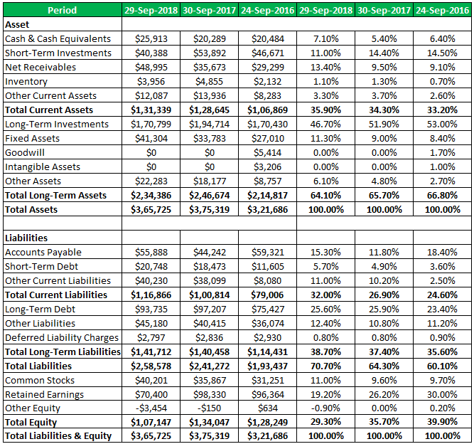

## Table of Contents

## What is a balance sheet?

A balance sheet is a financial statement that shows what a company owns and owes at a specific time. It is like a snapshot of the company's financial health. The balance sheet has three main parts: assets, liabilities, and equity. Assets are things the company owns, like money, buildings, and equipment. Liabilities are what the company owes, like loans and bills. Equity is the value left for the owners after paying off all the debts.

The balance sheet follows a simple equation: Assets = Liabilities + Equity. This means that everything the company owns (assets) is financed by either borrowing money (liabilities) or by the owners' investment (equity). By looking at a balance sheet, people can see if a company has enough assets to cover its debts. This helps investors, managers, and others understand the company's financial position and make smart decisions.

## What are the main components of a balance sheet?

A balance sheet has three main parts: assets, liabilities, and equity. Assets are everything a company owns that has value. This includes cash, buildings, equipment, and even things like patents or trademarks. Assets can be split into current assets, which can be turned into cash quickly, and non-current assets, which are long-term and not easily turned into cash.

Liabilities are what the company owes to others. This includes loans, bills that need to be paid, and any other debts. Just like assets, liabilities can be split into current liabilities, which need to be paid soon, and non-current liabilities, which are long-term debts.

Equity is the value that is left for the owners after all the debts are paid. It represents the owners' stake in the company. Equity can come from money the owners put into the business or from profits that the company keeps instead of giving out as dividends. Together, these three parts make up the balance sheet and help show if a company is financially healthy.

## How do assets, liabilities, and equity relate to each other on a balance sheet?

Assets, liabilities, and equity are the three main parts of a balance sheet, and they are connected by a simple equation: Assets = Liabilities + Equity. This equation means that everything a company owns (its assets) is paid for by either borrowing money (liabilities) or by the money the owners put into the business (equity). So, if you add up all the debts the company has and all the money the owners have put in, you should get the total value of everything the company owns.

Think of it like a seesaw. On one side, you have all the company's assets. On the other side, you have the liabilities and equity. For the seesaw to balance, the total value of the assets must equal the total of the liabilities and equity. This balance helps people see if a company has enough to cover its debts and how much value is left for the owners. It's a useful tool for understanding a company's financial health.

## What is the difference between current and non-current assets?

Current assets are things a company owns that can be turned into cash quickly, usually within a year. This includes money in the bank, money that customers owe the company (accounts receivable), and things like inventory that the company plans to sell soon. These assets are important because they help the company pay for day-to-day expenses and keep the business running smoothly.

Non-current assets, on the other hand, are things that a company owns but won't turn into cash quickly. These are long-term assets that the company plans to keep for more than a year. Examples include buildings, machinery, and even things like patents or trademarks. These assets are important for the long-term health and growth of the company, but they aren't as easy to turn into cash if the company needs money right away.

## How are liabilities classified on a balance sheet?

Liabilities on a balance sheet are divided into two main types: current liabilities and non-current liabilities. Current liabilities are debts that a company needs to pay within a year. This can include things like bills the company owes, money it borrowed that needs to be paid back soon, and wages it owes to employees. These are important because they show how much money the company needs to find quickly to keep running smoothly.

Non-current liabilities are debts that the company doesn't need to pay back within a year. These are long-term debts, like long-term loans or bonds the company issued. Non-current liabilities are important because they show how much the company is relying on long-term borrowing to keep going. Both types of liabilities help people understand how much the company owes and how it is managing its debts.

## What does shareholders' equity represent on a balance sheet?

Shareholders' equity on a balance sheet shows the value that is left for the owners of the company after all the debts are paid. It's like the net worth of the company from the owners' point of view. Shareholders' equity comes from two main places: the money that owners put into the business, which is called paid-in capital, and the profits that the company has made and kept instead of giving out as dividends, which is called retained earnings.

Think of shareholders' equity as what the owners would get if the company sold all its assets and used the money to pay off all its debts. If there's money left over after paying everyone the company owes, that's the shareholders' equity. It's a key part of the balance sheet because it shows how much the company is worth to its owners and helps investors see how well the company is doing over time.

## How can you assess a company's liquidity using the balance sheet?

You can assess a company's liquidity by looking at its balance sheet, which shows how easily the company can turn its assets into cash to pay off its short-term debts. Liquidity is important because it tells you if a company can pay its bills on time. To check liquidity, you look at the company's current assets, like cash, money customers owe (accounts receivable), and inventory. These are things the company can turn into cash quickly, usually within a year.

One way to measure liquidity is by using the current ratio, which you find by dividing current assets by current liabilities. If the current ratio is more than 1, it means the company has more current assets than current liabilities, which is good because it can pay its short-term debts. Another way is the quick ratio, which is like the current ratio but doesn't count inventory because it might take longer to sell. The quick ratio gives you a stricter test of liquidity. By looking at these ratios on the balance sheet, you can see if a company is in a good position to handle its short-term financial needs.

## What are some key financial ratios derived from the balance sheet?

From the balance sheet, you can figure out some important ratios that help you understand how well a company is doing. One key ratio is the current ratio, which you get by dividing current assets by current liabilities. This ratio shows if a company can pay its short-term bills. If the current ratio is more than 1, it means the company has enough short-term assets to cover its short-term debts, which is good. Another ratio is the quick ratio, which is similar but doesn't count inventory. It's a stricter test of how easily a company can pay its bills because inventory might take longer to turn into cash.

Another important ratio is the debt-to-equity ratio, which you find by dividing total liabilities by total equity. This ratio tells you how much the company is relying on borrowing compared to the money put in by the owners. A high debt-to-equity ratio might mean the company is taking on a lot of risk, while a lower ratio could mean it's more stable. Finally, the return on equity (ROE) is a ratio that shows how well the company is using the money the owners put in to make a profit. You get it by dividing net income by shareholders' equity. A higher ROE means the company is doing a good job turning the owners' money into profits.

## How does the balance sheet help in understanding a company's financial health?

The balance sheet helps us understand a company's financial health by showing what it owns and what it owes at a specific time. It's like a financial snapshot that lists all the company's assets, like cash, buildings, and equipment, and all its liabilities, like loans and bills. By looking at the balance sheet, you can see if the company has enough assets to cover its debts. This is important because it tells us if the company can pay its bills and keep running smoothly. If the company has more assets than liabilities, it's a good sign that it's financially healthy.

Another way the balance sheet helps is by showing the equity, which is the value left for the owners after paying off all the debts. This part of the balance sheet tells us how much the company is worth to its owners. If the equity is growing over time, it's a good sign that the company is doing well and making money. By using the balance sheet to calculate financial ratios like the current ratio, debt-to-equity ratio, and return on equity, we can get a clearer picture of the company's financial health and make better decisions about investing or managing the business.

## What are common adjustments made to the balance sheet for analytical purposes?

When people want to understand a company's financial health better, they often make some changes to the balance sheet. One common change is to take out things that might not be worth what they're listed at on the balance sheet. For example, they might lower the value of inventory if they think it won't sell for the price listed. They might also take out things like goodwill, which is the value a company paid for another company that's more than what the other company's stuff is worth. By making these changes, people can get a clearer picture of what the company is really worth.

Another change people often make is to look at the balance sheet without things that don't happen every day. For example, they might take out any one-time costs or gains that won't happen again. This helps them see how the company is doing in its normal, day-to-day business. By making these adjustments, people can get a better idea of the company's true financial health and make smarter decisions about investing or running the business.

## How can trends in balance sheet items over time inform investment decisions?

Looking at how things on the balance sheet change over time can help people make better choices about investing in a company. If you see that a company's assets are growing faster than its liabilities, it's a good sign. It means the company is getting stronger and might be a good place to put your money. On the other hand, if the company's debts are growing faster than its assets, it could be a warning sign. It might mean the company is taking on too much risk and might have trouble paying its bills in the future.

Another thing to watch is how the company's equity changes over time. If the equity is going up, it means the company is making money and keeping it, which is good for the owners. This can make the company more attractive to investors because it shows the company is doing well. By looking at these trends, people can get a better idea of whether a company is a good investment or if they should look somewhere else.

## What advanced techniques can be used to analyze the quality of earnings through the balance sheet?

To figure out how good a company's earnings are by looking at the balance sheet, you can use a few smart tricks. One trick is to check the balance sheet for things that might not be worth what they're listed at. For example, if the company has a lot of inventory but it's not selling, it might not be worth as much as it's listed on the balance sheet. By taking out these things, you can see if the company's earnings are really as good as they look. Another trick is to look at how the company's cash and other liquid assets are changing over time. If the company is making money but its cash isn't growing, it might be a sign that the earnings aren't as strong as they seem.

Another way to check the quality of earnings is to look at how the company is using its money. If the company is borrowing a lot of money to make its earnings look good, it might not be a good sign. You can see this by looking at the company's debt levels on the balance sheet. If the debt is growing faster than the earnings, it could mean the company is taking on too much risk. Also, looking at changes in the company's working capital, like how much money customers owe the company or how much the company owes to others, can help you see if the earnings are real or if they're being puffed up by playing around with the balance sheet numbers. By using these tricks, you can get a better idea of how strong a company's earnings really are.

## What is Understanding Balance Sheet Accounting?

The balance sheet is a pivotal financial statement essential for understanding a company's financial position at a given moment. Comprising assets, liabilities, and equity, it forms the fundamental equation:

$$
\text{Assets} = \text{Liabilities} + \text{Equity}
$$

This equation is the cornerstone of balance sheet accounting, providing a comprehensive snapshot of what a company owns versus what it owes, along with the residual interest attributable to shareholders.

### Assets

Assets represent resources controlled by a company that are expected to bring future economic benefits. They are typically categorized into current assets and non-current assets. Current assets, such as cash, inventory, and receivables, are expected to be converted into cash within a year. Non-current assets, like property, plant, and equipment, are long-term resources that support business operations over time.

### Liabilities

Liabilities are the obligations a company owes to external parties, representing claims on its assets. These are divided into current liabilities, which are due within one year (e.g., accounts payable, short-term debt), and long-term liabilities, which are due at a later stage (e.g., bonds payable, long-term leases).

### Equity

Equity represents the residual interest in the assets of a company after deducting liabilities. It includes common stock, preferred stock, retained earnings, and additional paid-in capital. Equity reflects the ownership value held by shareholders and is crucial for understanding the net worth of a company.

### Importance of Balance Sheet Analysis

Analyzing these components is critical for assessing a company's financial health and its potential for growth. For instance, a higher proportion of assets over liabilities may indicate strong financial health, while significant equity levels can suggest greater stability and less reliance on external funding.

### Impact on Decision-Making Processes

By revealing how a company finances its operations and allocates resources, balance sheet analysis significantly influences managerial decision-making. It assists in evaluating [liquidity](/wiki/liquidity-risk-premium), solvency, and overall financial flexibility, which are vital for strategic planning, investment opportunities, and managing financial risks.

Understanding these elements of balance sheet accounting thus equips investors and professionals with the necessary insights to evaluate a company's financial position comprehensively, aiding in informed decision-making and strategic planning.

## What is the Role of Financial Analysis?

Financial analysis is a critical process for evaluating a company's financial statements, allowing investors and stakeholders to gain insights into its operational efficiency, financial stability, and potential for future growth. This analysis predominantly revolves around examining various financial metrics derived from statements such as the balance sheet, income statement, and cash flow statement.

Key metrics integral to financial analysis include liquidity ratios, profitability ratios, and solvency ratios. Liquidity ratios, such as the current ratio and quick ratio, measure a company's ability to meet its short-term obligations with its short-term assets. For example, the current ratio is calculated as follows:

$$
\text{Current Ratio} = \frac{\text{Current Assets}}{\text{Current Liabilities}}
$$

Profitability ratios, like the net profit margin and return on equity (ROE), assess a company's ability to generate profits relative to its revenue, assets, or equity. The net profit margin is expressed as:

$$
\text{Net Profit Margin} = \frac{\text{Net Income}}{\text{Revenue}} \times 100
$$

Solvency ratios, such as the debt to equity ratio, focus on a company's long-term viability by evaluating its debt levels relative to its equity. These ratios help investors understand the financial leverage and risk involved.

By systematically analyzing these metrics, investors can assess a company's risk levels and forecast potential returns, enabling them to make informed investment decisions. For instance, high liquidity ratios suggest a strong capacity to cover short-term debts, while favorable profitability ratios indicate efficient management and good profit generation capabilities.

Ongoing financial analysis is also vital for aligning business strategies with current financial conditions. By regularly reviewing financial statements and key metrics, businesses can adjust their strategies to capitalize on new opportunities or mitigate potential risks. This continuous evaluation ensures that companies remain competitive and responsive to market changes, ultimately supporting long-term growth and sustainability.

In conclusion, financial analysis serves as a foundational element for decision-making in business and investment contexts. It provides a structured approach to assessing a company's position and prospects, facilitating the alignment of strategies with the prevailing financial environment.

## How can Balance Sheet Analysis be integrated into Algorithmic Trading?

Integrating balance sheet analysis into [algorithmic trading](/wiki/algorithmic-trading) strategies involves leveraging financial data to refine and optimize trading algorithms. This process starts by understanding the core components of a balance sheet: assets, liabilities, and equity, which together form the fundamental accounting equation: 

$$
\text{Assets} = \text{Liabilities} + \text{Equity}
$$

By incorporating these metrics into algorithmic systems, traders can significantly enhance their capability to predict market movements and make informed trading decisions.

One of the primary ways balance sheet data can improve algorithmic trading is through performance analysis and risk assessment. For instance, ratios such as the current ratio (current assets divided by current liabilities) provide insights into a company's liquidity. This ratio can be used in algorithms to adjust trading strategies based on the financial health of the entities involved. A higher ratio may signify stability, whereas a lower ratio might suggest potential liquidity issues, prompting a reassessment of investment risks.

Moreover, balance sheets offer insight into a company's capital structure, which can influence trading decisions. The debt-to-equity ratio, calculated by dividing a company's total liabilities by its shareholder equity, serves as an indicator of financial leverage. High leverage may imply higher financial risk, which can be factored into algorithms to adjust the weighting of assets in a portfolio.

Integrating these financial metrics enables traders to enhance the predictability and profitability of their algorithmic strategies. By aligning strategic moves with a company's financial fundamentals, traders can better manage risk and optimize returns. For example, a Python-based trading algorithm could include a module that analyzes balance sheet ratios to filter out high-risk stocks from a trading portfolio:

```python
def filter_stocks_by_ratios(stocks_data):
    filtered_stocks = []
    for stock in stocks_data:
        current_ratio = stock['current_assets'] / stock['current_liabilities']
        debt_to_equity = stock['total_liabilities'] / stock['equity']
        if current_ratio > 1 and debt_to_equity < 2:
            filtered_stocks.append(stock)
    return filtered_stocks
```

Real-world examples of such integration include hedge funds and institutional investors who routinely incorporate financial statement analysis as part of their algorithmic trading systems. By doing so, they increase the likelihood of identifying undervalued securities and cushioning the impact of market [volatility](/wiki/volatility-trading-strategies).

As the financial landscape evolves, the fusion of balance sheet analysis with algorithmic trading continues to present traders with more refined tools for navigating complex markets. This integration not only supports robust risk management but also aligns trading strategies with intrinsic financial values, paving the way for more sophisticated and lucrative trading methodologies.

## References & Further Reading

[1]: Rosenbaum, P., & Pearl, J. (2010). ["Algorithmic Trading and DMA: An Introduction to Direct Access Trading Strategies"](https://searchworks.stanford.edu/view/9155503) Pearson Financial Times.

[2]: Penman, S. (2012). ["Financial Statement Analysis and Security Valuation"](https://www.mheducation.com/highered/product/financial-statement-analysis-security-valuation-penman/M9780078025310.html) McGraw-Hill Education.

[3]: Bodie, Z., Kane, A., & Marcus, A. J. (2020). ["Investments"](https://www.mheducation.com/highered/product/investments-bodie-kane/M9781264412662.html) McGraw-Hill Education.

[4]: Murphy, J. J. (1999). ["Technical Analysis of the Financial Markets: A Comprehensive Guide to Trading Methods and Applications"](https://archive.org/details/technicalanalysi0000murp) New York Institute of Finance.

[5]: Fabozzi, F. J., & Drake, P. P. (2009). ["Finance: Capital Markets, Financial Management, and Investment Management"](https://books.google.com/books/about/Finance.html?id=mUBsAwAAQBAJ) Wiley.