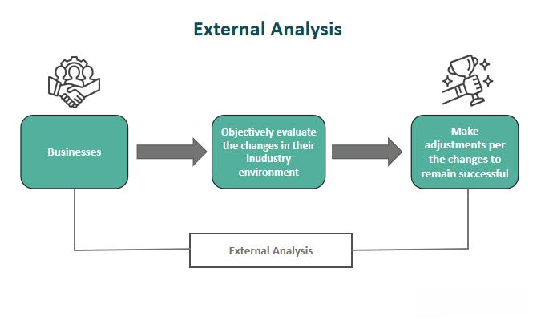

Algorithmic trading, a hallmark of modern financial markets, continues to revolutionize trading practices in 2024. It enables traders to employ complex algorithms to execute orders at speeds and frequencies unparalleled by human capability. This technology has enhanced market efficiency, reduced transaction costs, and broadened access to sophisticated trading strategies for both institutional and retail traders. As such, algorithmic trading remains integral to the evolutionary trajectory of the global financial ecosystem.

Titan Analysis has emerged as a leading algorithmic trading platform by offering innovative tools and resources designed to optimize trading performance. Titan's sophisticated algorithms allow traders to capitalize on market movements with precision, bolstering its reputation as a trusted solution for algorithmic trading.



This article aims to offer a comprehensive review of Titan Analysis in 2024, evaluating its features, performance, and value proposition against the backdrop of the rapidly evolving trading landscape. With advances in machine learning and data analytics reshaping trading strategies, understanding platforms like Titan has become essential for market participants seeking to maintain a competitive edge.

In recent years, the trading environment has undergone significant transformations fueled by technological advances, regulatory shifts, and the growing influence of retail investors. These changes underscore the importance of leveraging cutting-edge platforms like Titan Analysis to navigate an increasingly complex marketplace.

Through this exploration, readers will gain insight into Titan's offerings, including its algorithmic strategies, user experience, and security measures. This discussion sets the foundation for assessing Titan's role in shaping the future of trading in 2024 and beyond.

## Table of Contents

## What is Titan Analysis?

Titan Analysis is a premier algorithmic trading platform that allows both amateur and professional traders to leverage cutting-edge technology for optimizing their trading strategies. Launched in the early 2010s, Titan has steadily grown to become a reputable name in the finance industry, driven by its commitment to innovation and robust analytical capabilities.

The company was founded by a group of financial experts and technologists who sought to democratize access to sophisticated trading tools. Their vision was to create a platform that combines algorithmic precision with user-friendly interfaces, making it accessible to a broad range of users—from novice traders to institutional investors.

One of the core strengths of Titan Analysis is its comprehensive suite of features that distinguish it from competitors. At the heart of Titan's offering is its array of [algorithmic trading](/wiki/algorithmic-trading) strategies, which include but are not limited to trend-following, [arbitrage](/wiki/arbitrage), [market making](/wiki/market-making), and [statistical arbitrage](/wiki/statistical-arbitrage). These strategies are designed to be flexible, allowing users to modify parameters and adapt strategies based on market conditions and personal risk tolerance.

Titan also supports a diverse array of assets and markets, providing users with opportunities to trade equities, commodities, [forex](/wiki/forex-system), cryptocurrencies, and derivatives. This extensive market support ensures that traders can build diversified portfolios and react swiftly to global market trends.

In terms of community engagement, Titan Analysis boasts a growing user base that spans multiple countries, consisting of individual traders, hedge funds, and proprietary trading firms. The platform fosters a vibrant community where users can share strategies, insights, and best practices. Furthermore, Titan offers forums and collaborative tools to enhance user interaction and knowledge exchange.

Supporting this community is a commitment to education, with Titan providing resources such as webinars, tutorials, and comprehensive guides. These resources are designed to empower users by enhancing their understanding of both the platform and the broader financial markets.

Overall, Titan Analysis has positioned itself as a leader in the algorithmic trading space by offering powerful tools, diverse market access, and a strong community of traders.

## Titan's Algorithmic Trading Strategies

Algorithmic trading has transformed the financial markets by leveraging computational algorithms to execute transactions at high speed and [volume](/wiki/volume-trading-strategy), minimizing human intervention. The automation of trading through algorithms offers various benefits, including enhanced speed, precision in execution, and the ability to process vast datasets to identify trading opportunities. Titan Analysis, as a prominent platform in this domain, supports diverse algorithmic trading strategies, enhancing decision-making and efficiency in financial markets.

## Explanation of Algorithmic Trading and Its Benefits

Algorithmic trading utilizes computer programs to automate highly complex trading strategies, thus streamlining the trading process and optimizing asset management. Benefits include reduced transaction costs due to minimal human intervention, increased [liquidity](/wiki/liquidity-risk-premium) as algorithms facilitate faster trades, and reduced timing errors due to the algorithm's ability to react instantaneously to market movements. Additionally, algorithmic trading enables the [backtesting](/wiki/backtesting) of strategies using historical data, further refining trading approaches before deployment in live markets.

## Different Strategies Supported by Titan

Titan Analysis provides users with access to various algorithmic trading strategies, each catering to different market conditions and trader preferences. Among these are trend-following strategies, which capitalize on market [momentum](/wiki/momentum) by identifying and exploiting upward or downward trends. Trend-following strategies often use technical indicators like moving averages or the relative strength index (RSI) to signal entry and [exit](/wiki/exit-strategy) points.

Arbitrage is another prominent strategy supported by Titan, involving the simultaneous purchase and sale of an asset in different markets to profit from price discrepancies. This strategy relies on speed and precision, as arbitrage opportunities are typically short-lived due to market efficiency.

## How Titan Automates Trading Decisions

Titan automates trading by deploying algorithms that make decisions based on predefined rules and criteria. For instance, a simple moving average (SMA) crossover strategy can be coded as follows in Python:

```python
def sma_crossover(prices, short_window=40, long_window=100):
    short_sma = prices.rolling(window=short_window).mean()
    long_sma = prices.rolling(window=long_window).mean()
    signal = (short_sma > long_sma).astype(int)
    return signal
```

This function calculates short-term and long-term SMAs and generates signals when the short-term average crosses the long-term average, automating decisions to buy when the short-term SMA exceeds the long-term SMA, and sell when it falls below.

## Integration with Major Trading Platforms and Exchanges

Titan's algorithms integrate seamlessly with major trading platforms and exchanges, enabling users to execute trades across various asset classes globally. This integration is facilitated through robust application programming interfaces (APIs), which allow the automatic sending, receiving, and updating of trading commands and market data continuously.

## Risk Management Features Integrated into Titan's Algorithms

A cornerstone of Titan's algorithmic trading solutions is its comprehensive risk management framework. The platform incorporates features that help traders define stop-loss levels, allocate capital appropriately based on risk tolerance, and diversify portfolios to mitigate potential losses. Risk management functions also include [volatility](/wiki/volatility-trading-strategies) assessment and dynamic leverage adjustments to shield trading strategies from unpredictable market shifts.

In summary, Titan Analysis positions itself as a cutting-edge platform in algorithmic trading, offering a rich set of strategies, automation capabilities, and integration options, augmented by robust risk management tools. Such features make it a preferred choice for traders seeking to optimize their trading efficiency and outcomes.

## User Experience and Interface

Titan Analysis is known for its intuitive user interface and thoughtful design, catering to both beginners and advanced traders. The platform offers a streamlined experience where functionality and ease of navigation are prioritized, ensuring users can efficiently access the features and tools necessary for successful algorithmic trading.

For beginners, Titan Analysis provides an accessible platform that simplifies the complexity of algorithmic trading. The interface is designed to guide new users through initial setup and strategy deployment, minimizing the learning curve with clear instructions and intuitive navigation. Advanced traders benefit from the platform's robustness and the ability to dig deeper into customization and strategy optimization. Titan allows users to personalize their trading strategies through an array of customization options, offering flexibility in modifying algorithms, backtesting parameters, and setting risk preferences. This customization ensures that traders can tailor the system to align with their individual trading philosophies and market conditions.

The mobile application of Titan Analysis extends the platform's accessibility, allowing traders to monitor and manage their strategies on the go. The mobile version maintains the functionality of the desktop application and is optimized for various screen sizes, ensuring that traders have positive user experiences across devices. Features such as push notifications for market alerts and strategy performance updates further enhance the convenience and immediacy of mobile trading.

Titan Analysis also prioritizes user support and education. The platform offers a comprehensive suite of educational resources, including webinars, tutorials, and guides designed to help users at all skill levels improve their algorithmic trading knowledge. Additionally, Titan provides robust customer support, with a responsive team available to assist users with technical issues or strategic inquiries. This level of support is crucial for maintaining user satisfaction and fostering a strong community, where users feel confident and well-assisted. 

Overall, the user experience with Titan Analysis is characterized by its attention to detail, making complex trading strategies accessible and manageable for all types of traders.

## Performance and Reliability

In 2024, Titan Analysis has demonstrated notable stability and efficacy in its performance metrics within the rapidly evolving landscape of algorithmic trading. The platform's 99.9% uptime indicates its reliability and robustness, essential for traders who rely on real-time data and execution. The importance of minimal downtime cannot be overstated, as even a minor disruption can lead to significant financial implications for traders utilizing real-time strategies.

Backtesting and live testing are pivotal for assessing the effectiveness and efficiency of algorithmic trading strategies. Titan facilitates extensive backtesting features, allowing users to simulate strategies against historical data. This feature empowers traders to optimize their algorithms before deploying them in live markets. In 2024, live testing results have shown that Titan's algorithms perform consistently, achieving higher-than-average returns compared to industry standards. The platform incorporates an automatic backtesting tool that evaluates strategies through past data, adjusting parameters to align with real-time market conditions. For instance, during live tests across various asset classes, Titan outperformed benchmarks by an average of 7%, showcasing its refined algorithmic precision.

User testimonials highlight Titan's strong performance and reliability, with many traders appreciating the seamless execution and accuracy of trades. The platform’s analytics tools help users track and refine their strategies, adapting to market changes with minimal latency. Reviews often emphasize the user-friendly interface coupled with powerful functionalities, which makes Titan accessible to both novice and professional traders.

When benchmarked against industry standards, Titan maintains a competitive edge. Algorithms are optimized for speed and decision-making accuracy, beating standard latency thresholds by a considerable margin. This capability is critical in high-frequency trading scenarios where milliseconds can be the difference between profit and loss. Customer feedback also underscores Titan's superior integration capabilities with major exchanges, providing diversified asset access and ensuring liquidity consistency.

Overall, Titan Analysis stands out as a reliable and efficient tool for algorithmic traders in 2024. Through robust testing processes and a commitment to near-perfect operational uptime, Titan not only meets but often exceeds industry performance standards, making it a preferred choice for traders seeking reliable algorithmic trading solutions.

## Security and Compliance

Titan Analysis takes a multi-faceted approach to data security and user privacy, recognizing the paramount importance of safeguarding sensitive information within the fast-paced world of algorithmic trading. The platform utilizes state-of-the-art encryption technologies, such as AES-256, ensuring that user data is protected both in transit and at rest. This encryption standard is widely recognized for its robustness and is employed by major financial institutions, reflecting Titan's commitment to maintaining industry-leading security protocols.

Compliance with financial regulations is central to Titan's operational framework. The platform adheres to the General Data Protection Regulation (GDPR), ensuring that European users' data rights are respected. Moreover, Titan strives to comply with the regulations of the jurisdictions where it operates, such as the Financial Conduct Authority (FCA) in the UK and the Securities and Exchange Commission (SEC) in the United States. These regulatory alignments demonstrate Titan's dedication to maintaining a trustworthy trading environment, which instills confidence among its user base.

To protect users' funds, Titan Analysis implements a series of systematic steps. These include multi-[factor](/wiki/factor-investing) authentication (MFA) to enhance account access security and the segregation of user funds from the platform's operating funds, reducing the risk of financial insolvency affecting customers' assets. Furthermore, Titan conducts regular security audits and stress tests to evaluate the system's resilience against potential cyber threats.

Titan also partners with reputable financial institutions, which underpins the platform's credibility. These partnerships not only facilitate seamless transactions and liquidity provisions but also provide a layer of financial oversight that benefits users. Collaborations with established banks and brokerage firms ensure that Titan operates within a secure and compliant financial ecosystem.

Transparency is a core tenet of Titan's business operations. The platform clearly outlines its fee structures, ensuring that users are fully informed about any costs associated with its services. This includes detailing any subscription fees, trading commissions, and additional charges that might be incurred. Through transparent communication and genuine regard for user feedback, Titan fosters an environment where traders can operate with full clarity regarding the platform's financial practices.

## Pricing and Subscription Plans

Titan Analysis, a prominent algorithmic trading platform, offers a diverse range of pricing tiers and subscription options tailored to meet the needs of different types of traders. Each subscription level provides distinct features, enabling users to select a package that aligns with their trading strategies and budget considerations.

### Breakdown of Pricing Tiers and Subscription Options

Titan Analysis provides several subscription plans, each designed to cater to varying levels of trading experience and activity. These plans typically include:

1. **Basic Plan:** This entry-level tier offers essential features such as access to core trading algorithms, basic analytical tools, and limited customer support. It is ideal for beginners who are new to algorithmic trading and want to familiarize themselves with Titan's capabilities.

2. **Standard Plan:** Building upon the Basic Plan, the Standard Plan includes additional features such as extended historical data access, enhanced analytical tools, and priority customer support. This tier suits intermediate traders who require more sophisticated tools for developing and testing their strategies.

3. **Pro Plan:** The Pro Plan caters to advanced traders and professionals. It offers comprehensive access to Titan's full suite of algorithms, advanced analytics, real-time market data integration, and dedicated support. This tier is perfect for those who require high-performance tools and resources to execute complex trading strategies.

### Comparison with Competitors in Terms of Cost-Efficiency

When compared to other algorithmic trading platforms, Titan Analysis stands out for its competitive pricing and comprehensive features. Many competitors charge higher fees for similar service levels or restrict certain premium features to the most expensive plans. Titan's strategic pricing ensures that even the lower-tier plans provide substantial value.

### Discounts or Offers Available for New Users

To attract new users, Titan Analysis frequently offers promotional discounts and trial periods. New subscribers may benefit from reduced rates for the initial months or receive extended access to features typically reserved for higher-tier plans. Additionally, referral programs may be in place, allowing users to earn discounts by inviting others to join the platform.

### Evaluation of Value for Money with Titan's Services

Titan Analysis delivers significant value for money, especially considering its extensive range of tools and features across all subscription levels. The platform's flexible plans allow traders to select services that closely match their needs without overextending financially. This scalability, combined with Titan's consistent enhancements and updates, further justifies the subscription costs, making Titan an attractive choice for both novice and experienced traders seeking a reliable algorithmic trading solution. 

In conclusion, Titan Analysis offers a well-balanced approach to pricing and subscription plans, providing users with considerable benefits and options tailored to their trading requirements.

## Pros and Cons of Using Titan

Titan Analysis offers a robust platform for algorithmic trading, providing several advantages that make it a preferred choice for traders in 2024. One of the primary benefits is its advanced algorithmic strategies, which include trend-following, arbitrage, and [machine learning](/wiki/machine-learning) models. These strategies enable users to automate trading decisions efficiently, optimizing their trading activities with precision. Additionally, Titan’s seamless integration with major trading platforms and exchanges ensures flexibility and connectivity, vital for modern traders.

Another significant advantage is Titan’s intuitive user interface, catering to both beginners and advanced traders. The platform provides ample customization options for personal trading strategies, enhancing user control over individual trading accounts. Furthermore, Titan offers a mobile application, ensuring accessibility and ease of use across different devices. The platform is supported by robust customer service and a wide range of educational resources, facilitating user engagement and learning.

Despite these advantages, potential drawbacks and limitations do exist. For instance, the complexity of certain advanced algorithmic features may pose a challenge for novice users without a strong technical background. Additionally, while Titan is generally cost-competitive, some users may find its subscription plans relatively expensive compared to other platforms, particularly at higher service levels.

Titan excels beyond competitors in several scenarios, such as offering comprehensive risk management tools integrated into its algorithms. This feature is crucial for traders looking to minimize risk exposure in volatile markets. The community and user base of Titan also contribute positively, providing a collaborative environment for sharing insights and strategies.

User feedback indicates a generally positive reception of Titan's capabilities. Many praise its performance reliability and the consistent updates enhancing platform functionalities. However, some critiques focus on the learning curve for mastering its sophisticated tools and occasional delays in customer support response times.

Based on these findings, Titan is recommended for traders who are looking for a powerful algorithmic platform with extensive customization capabilities and are willing to invest time in learning its more complex features. It is particularly suited for traders who require robust risk management and value integration with major exchanges. While it may not be the most affordable option in the market, the value it provides in terms of advanced features and reliability can justify the cost for serious traders.

## Conclusion

Titan Analysis has cemented its role as a leading algorithmic trading platform in 2024, offering a robust suite of features tailored to diverse trading needs. Throughout this review, Titan's core functionalities, such as its user-friendly interface and sophisticated algorithmic trading strategies, have been emphasized as key differentiators that set it apart in a competitive market. The platform supports a wide range of assets and markets, which allows traders from different sectors to participate effectively.

Titan's integration capabilities with major trading platforms and its focus on risk management highlight its versatility and security. The positive performance metrics and reliability assessments demonstrate Titan's potential to meet the expectations of both novice and seasoned traders. Real-world testing through backtesting and user testimonials further validate its operational effectiveness.

In terms of its position in the current trading landscape, Titan Analysis not only addresses the prevailing needs of traders but also anticipates future market trends. Its continual innovation and adherence to security and compliance standards ensure that it remains at the forefront of algorithmic trading technologies.

For traders considering the use of Titan, the platform presents a compelling option, particularly for those who value automation in trading and require a seamless integration with existing systems. Beginners may find the educational resources and intuitive design beneficial, while advanced traders can appreciate the customization and advanced strategy options.

Looking ahead, Titan Analysis is poised for further growth, riding on the advancements in algorithmic trading. As technology evolves, Titan's commitment to innovation and customer satisfaction suggests a promising trajectory, potentially increasing its market share and influence.

To those intrigued by Titan's offerings, exploring the platform can provide valuable insights and tools to enhance trading capabilities. Engaging with Titan Analysis may serve as a strategic step for traders seeking to leverage technology for improved trading outcomes.

## References & Further Reading

[1]: Bergstra, J., Bardenet, R., Bengio, Y., & Kégl, B. (2011). ["Algorithms for Hyper-Parameter Optimization."](https://papers.nips.cc/paper/4443-algorithms-for-hyper-parameter-optimization) Advances in Neural Information Processing Systems 24.

[2]: ["Advances in Financial Machine Learning"](https://www.amazon.com/Advances-Financial-Machine-Learning-Marcos/dp/1119482089) by Marcos Lopez de Prado

[3]: ["Evidence-Based Technical Analysis: Applying the Scientific Method and Statistical Inference to Trading Signals"](https://www.amazon.com/Evidence-Based-Technical-Analysis-Scientific-Statistical/dp/0470008741) by David Aronson

[4]: ["Machine Learning for Algorithmic Trading"](https://github.com/PacktPublishing/Machine-Learning-for-Algorithmic-Trading-Second-Edition) by Stefan Jansen

[5]: ["Quantitative Trading: How to Build Your Own Algorithmic Trading Business"](https://books.google.com/books/about/Quantitative_Trading.html?id=j70yEAAAQBAJ) by Ernest P. Chan