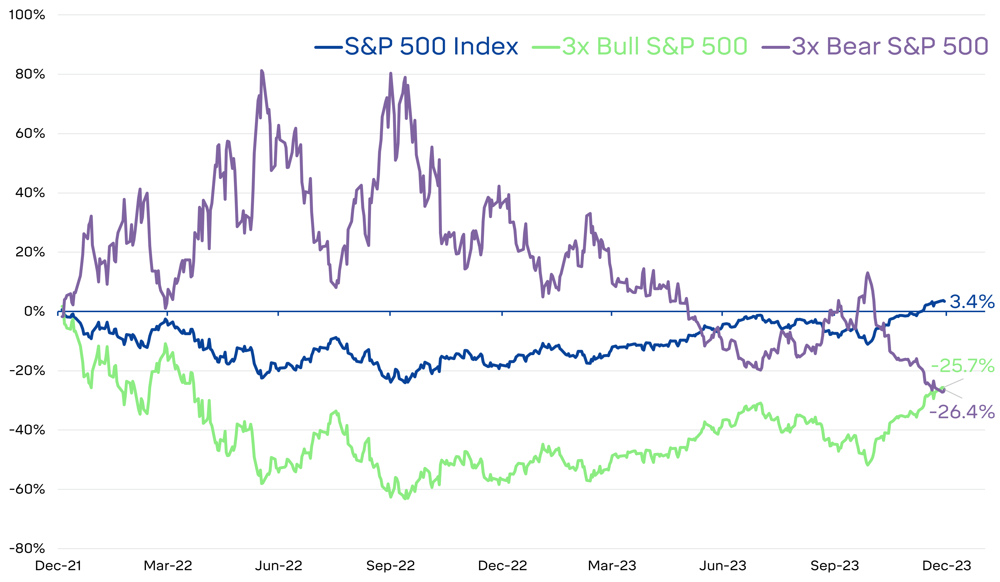

## Table of Contents

## What are ETFs and how do they work?

ETFs, or Exchange-Traded Funds, are a type of investment that works a lot like a mutual fund but trades on a stock exchange like a stock. They are designed to track the performance of a specific index, like the S&P 500, a commodity, bonds, or a basket of assets. When you buy shares of an ETF, you're buying a small piece of all the investments that the ETF holds. This makes it easy for you to diversify your investments without having to buy each asset individually.

ETFs are popular because they offer flexibility and lower costs compared to many other investment options. You can buy and sell ETF shares throughout the trading day at market prices, just like stocks. This is different from mutual funds, which are only priced at the end of the trading day. Also, ETFs often have lower expense ratios, which means you pay less in fees over time. This can make them a more cost-effective way to invest in a broad range of assets.

## What are leveraged ETFs and how do they differ from traditional ETFs?

Leveraged ETFs are a special type of ETF that aim to deliver multiples of the daily performance of the index or asset they track. For example, a 2x leveraged ETF tries to give you twice the daily return of its index, while a -2x leveraged ETF aims to give you twice the opposite return. This means if the index goes up by 1%, the 2x ETF would try to go up by 2%, and the -2x ETF would try to go down by 2%.

The main difference between leveraged ETFs and traditional ETFs is the use of financial derivatives and debt to amplify returns. Traditional ETFs simply track the performance of their underlying assets without trying to boost returns. Because of this, leveraged ETFs can be riskier and more volatile than traditional ETFs. They are designed for short-term trading, not long-term investing, because their performance can deviate significantly from the index over time due to daily resetting and compounding effects.

## What does 'triple leveraged' mean in the context of ETFs?

A triple leveraged ETF means that the ETF tries to give you three times the daily return of the index it follows. So, if the index goes up by 1% in a day, the triple leveraged ETF aims to go up by 3%. But if the index goes down by 1%, the ETF will try to go down by 3% too.

These ETFs use borrowed money and special financial tools to make their returns bigger. They are very risky and can go up or down a lot more than the index they track. They are meant for short-term trading, not for keeping for a long time, because their performance can change a lot over time.

## How are triple leveraged ETFs structured and what mechanisms do they use to achieve their leverage?

Triple leveraged ETFs are set up to give investors three times the daily return of the index they follow. They do this by using borrowed money and special financial tools called derivatives. Derivatives are like bets on how the index will do. The ETF uses these bets to make its returns bigger. For example, if the index goes up by 1%, the triple leveraged ETF tries to go up by 3%. But if the index goes down by 1%, the ETF will try to go down by 3% too.

These ETFs are very risky because they use a lot of borrowed money. This can make their value go up or down a lot more than the index they track. They are meant for short-term trading, not for keeping for a long time. Over time, the daily resetting and compounding effects can make their performance very different from the index. So, if you're thinking about investing in them, it's important to understand how they work and the risks involved.

## What are the potential benefits of investing in triple leveraged ETFs?

Triple leveraged ETFs can offer big potential returns in a short time. If you think the market or a specific index will go up a lot in a day, these ETFs can make your money grow three times faster than the index. This can be good for traders who want to make quick profits from short-term market moves. For example, if you believe a tech index will jump because of a new product launch, a triple leveraged ETF tracking that index could help you make more money from that jump.

However, these ETFs are not for everyone. They are very risky and can lose money just as fast as they can make it. If the market goes down, your losses will be three times bigger too. They are best used by people who know a lot about the market and can watch their investments closely every day. If you're thinking about using them, it's important to understand the risks and have a plan for when things might not go your way.

## What are the risks associated with triple leveraged ETFs?

Triple leveraged ETFs can be very risky. They use a lot of borrowed money to try to make three times the daily return of an index. This means if the index goes down, your losses can be three times bigger too. These ETFs are meant for short-term trading, not for keeping for a long time. If you hold them for more than a day, the daily resetting and compounding effects can make their performance very different from the index. This can lead to big losses even if the index goes up over time.

Another risk is that these ETFs can be very volatile. Their value can go up and down a lot more than the index they track. This can be stressful and hard to predict. If you're not watching your investments closely every day, you might miss the right time to sell and end up losing a lot of money. It's important to understand these risks and have a plan for what to do if the market moves against you.

## How do triple leveraged ETFs perform over different time horizons, and why is this important?

Triple leveraged ETFs are designed to give you three times the daily return of an index. But over longer periods, like weeks or months, they can act very differently from the index they track. This is because they reset their leverage every day. If the index goes up and down a lot, the ETF might not end up where you expect. For example, if an index goes up 10% over a month but has a lot of ups and downs along the way, the triple leveraged ETF might not go up 30%. It could even lose money because of the daily resets.

This is important because if you're planning to hold onto a triple leveraged ETF for more than a day, you need to understand how it might behave over time. These ETFs are meant for short-term trading, not for long-term investing. If you keep them for a long time, you might see big losses even if the index goes up overall. So, if you're thinking about using triple leveraged ETFs, make sure you know how they work over different time periods and be ready to watch them closely.

## Can you explain the concept of daily rebalancing in triple leveraged ETFs and its impact on long-term returns?

Daily rebalancing in triple leveraged ETFs means that the fund adjusts its holdings every day to keep its leverage at three times the daily return of the index it tracks. This happens because the ETF uses borrowed money and special financial tools to try to make its returns bigger. If the index goes up or down, the ETF needs to reset its position at the end of each day to stay at three times the index's daily move. This daily reset is important because it helps the ETF stay true to its goal of giving you three times the daily return.

However, this daily rebalancing can have a big impact on the ETF's long-term returns. Over time, if the index goes up and down a lot, the ETF might not end up where you expect. This is because the daily resets can make the ETF's performance very different from the index's overall performance. For example, if the index goes up 10% over a month but has a lot of ups and downs along the way, the triple leveraged ETF might not go up 30%. It could even lose money because of the daily resets. This is why triple leveraged ETFs are meant for short-term trading, not for keeping for a long time. If you hold them for more than a day, you need to be ready for the possibility of big losses, even if the index goes up overall.

## What are some common strategies for trading triple leveraged ETFs?

When trading triple leveraged ETFs, one common strategy is to use them for short-term trades based on market predictions. Traders might buy a triple leveraged ETF if they think the market or a specific index will go up quickly in a day or two. They aim to make quick profits from these short-term moves. For example, if a big news event is expected to boost a sector, a trader might buy a triple leveraged ETF that tracks that sector to make more money from the expected rise. However, this strategy needs careful timing and constant monitoring because these ETFs can lose value just as fast if the market moves the other way.

Another strategy is to use triple leveraged ETFs for hedging. If you have other investments that you think might go down in value, you can buy a triple leveraged ETF that moves in the opposite direction to protect your portfolio. For instance, if you own a lot of tech stocks and you're worried about a tech market drop, you might buy a triple leveraged ETF that goes down when tech stocks go up. This can help reduce your losses if the tech market does fall. But remember, this strategy also needs close attention because the high leverage can lead to big swings in value.

Both of these strategies need a good understanding of the market and the risks involved with triple leveraged ETFs. They are not for everyone and should be used by experienced traders who can watch their investments closely every day. If you're thinking about using these strategies, it's important to have a plan for when things might not go your way and be ready to act quickly.

## How do market conditions affect the performance of triple leveraged ETFs?

Market conditions have a big impact on how triple leveraged ETFs perform. These ETFs try to give you three times the daily return of an index. So, if the market goes up a lot in a day, the ETF can make you a lot of money quickly. But if the market goes down, the ETF can lose money three times faster too. This means that big moves in the market, either up or down, can make the ETF's value change a lot more than the index it follows.

Because of this, triple leveraged ETFs work best when the market is moving a lot in one direction. If the market is going up steadily, the ETF can keep making you money. But if the market is going up and down a lot, the ETF might not do as well as you expect. This is because the ETF resets its leverage every day, and all those ups and downs can make the ETF's performance different from the index over time. So, if you're thinking about using these ETFs, it's important to watch the market closely and understand how it might affect your investment.

## What are the tax implications of investing in triple leveraged ETFs?

When you invest in triple leveraged ETFs, you need to think about taxes. These ETFs can create a lot of taxable events because they trade a lot and use borrowed money to make their returns bigger. Every time the ETF sells something to keep its leverage at three times the index's daily return, it might make a capital gain or loss. If the ETF makes a gain, you might have to pay taxes on it, even if you don't sell your shares. This can happen a lot with triple leveraged ETFs because they are always buying and selling to stay true to their goal.

The tax rate you pay on these gains depends on how long the ETF held the assets it sold. If the ETF held them for less than a year, the gains are short-term and taxed at your regular income tax rate, which can be high. If the ETF held them for more than a year, the gains are long-term and taxed at a lower rate. But because triple leveraged ETFs are meant for short-term trading, they usually have more short-term gains, which means you might end up paying more in taxes. So, it's important to think about these tax implications before you decide to invest in triple leveraged ETFs.

## How can advanced investors use triple leveraged ETFs in a diversified investment portfolio?

Advanced investors can use triple leveraged ETFs in a diversified investment portfolio as a tool for short-term trading and to boost returns from specific market moves. If they think a certain sector or index will go up quickly in a day or two, they might buy a triple leveraged ETF that tracks that sector. This can help them make more money from that move than they would with a regular ETF. But they need to be ready to sell quickly if the market goes the other way, because the high leverage can lead to big losses just as fast as big gains.

Another way advanced investors might use triple leveraged ETFs is for hedging. If they have other investments that might go down in value, they can buy a triple leveraged ETF that moves in the opposite direction. This can help protect their portfolio from losses. For example, if they own a lot of tech stocks and are worried about a tech market drop, they might buy a triple leveraged ETF that goes down when tech stocks go up. This way, if the tech market does fall, the ETF can help make up for some of the losses in their tech stocks. But they need to watch these ETFs closely because the high leverage can make their value swing a lot.

## What is the understanding of Triple Leveraged ETFs?

Triple Leveraged Exchange-Traded Funds (ETFs), often referred to as 3x ETFs, are financial instruments designed to amplify the daily returns of an underlying index or asset. These funds seek to deliver three times the return of their benchmark index on a daily basis, using financial derivatives and debt to achieve these magnified returns. It is crucial for investors to understand that the multiplier effect of these ETFs applies only to daily returns, which can lead to substantial variations from the expected performance over longer periods due to the effects of compounding.

### The Role of Leverage in Magnifying Daily Returns

Leverage is a key feature of Triple Leveraged ETFs, using borrowed funds or derivatives to increase the exposure to the underlying assets without requiring a proportional increase in capital investment. The fundamental formula for calculating the leveraged return can be expressed as:

$$
\text{Leveraged Return} = \text{Leverage Ratio} \times \text{Daily Return of the Index}
$$

For instance, a 3x leveraged [ETF](/wiki/etf-trading-strategies) aims to provide a return of 3% for every 1% daily gain in the index it tracks. Conversely, the same multiplier effect applies to losses, which can lead to rapid declines in value if the underlying index performs poorly.

### Common Uses and Strategies Associated with Leveraged ETFs

Investors and traders utilize Triple Leveraged ETFs primarily for short-term investment strategies. These ETFs are popular among traders looking to capitalize on short-term market movements, given the amplified gains they can produce. Furthermore, they can be used for speculative purposes, allowing traders to take positions on anticipated market trends without directly investing in the underlying securities. Additionally, some sophisticated investors use leveraged ETFs for hedging purposes, balancing their portfolios against potential downturns by taking inverse leveraged positions.

### Risks and Rewards: Potential High Returns Versus Increased Volatility

The potential for high returns is often accompanied by increased [volatility](/wiki/volatility-trading-strategies), which is a notable risk [factor](/wiki/factor-investing) for Triple Leveraged ETFs. These funds are not typically suitable for long-term investors due to the effects of daily leverage compounding, which can lead to considerable deviations from the expected track of the underlying index over time. The inherent risks include:

- **Volatility Decay**: Continuous high volatility can lead to a decay in value, as the oscillations in daily percentage changes disproportionately affect the fund value.
- **Compounding Effect**: Multiplied gains and losses can cause discrepancies between the long-term performance of the ETF and that of the underlying index.

Understanding these dynamics is essential for employing a risk management strategy and deciding on the appropriate investment horizon with leveraged ETFs.

### Examples of Popular Triple Leveraged ETFs Available in the Market

The market offers a range of Triple Leveraged ETFs, providing exposure across various indices and sectors:

- **ProShares UltraPro QQQ (TQQQ)**: Tracks the Nasdaq-100 Index, aiming to deliver three times its daily performance.
- **Direxion Daily Financial Bull 3X Shares (FAS)**: Focuses on financial sector indices, offering triple leverage.
- **Direxion Daily S&P 500 Bull 3X Shares (SPXL)**: Targets the S&P 500, providing leverage for bullish investors.

These ETFs illustrate the diverse applications of triple leverage across different market segments. It is imperative that investors conduct thorough research and consider these vehicles' volatile nature before including them in their investment strategies.

## References & Further Reading

[1]: Bergstra, J., Bardenet, R., Bengio, Y., & Kégl, B. (2011). ["Algorithms for Hyper-Parameter Optimization."](https://papers.nips.cc/paper/4443-algorithms-for-hyper-parameter-optimization) Advances in Neural Information Processing Systems 24.

[2]: ["Advances in Financial Machine Learning"](https://www.amazon.com/Advances-Financial-Machine-Learning-Marcos/dp/1119482089) by Marcos Lopez de Prado

[3]: ["Evidence-Based Technical Analysis: Applying the Scientific Method and Statistical Inference to Trading Signals"](https://www.amazon.com/Evidence-Based-Technical-Analysis-Scientific-Statistical/dp/0470008741) by David Aronson

[4]: ["Machine Learning for Algorithmic Trading"](https://github.com/stefan-jansen/machine-learning-for-trading) by Stefan Jansen

[5]: ["Quantitative Trading: How to Build Your Own Algorithmic Trading Business"](https://www.amazon.com/Quantitative-Trading-Build-Algorithmic-Business/dp/1119800064) by Ernest P. Chan