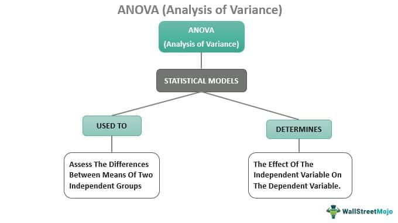

## Table of Contents

## What is Analysis of Variance (ANOVA)?

Analysis of Variance, often shortened to ANOVA, is a statistical method used to compare the means of three or more groups to see if they are significantly different from each other. It helps researchers understand if the differences between group means are due to actual effects or just random chance. For example, if you wanted to test if different fertilizers lead to different plant growth rates, ANOVA could help you determine if the growth differences are significant or just due to natural variation.

ANOVA works by analyzing the variance within each group and the variance between the groups. It does this by calculating an F-statistic, which is a ratio of the variance between the group means to the variance within the groups. If the F-statistic is large enough, it suggests that the group means are significantly different, and the differences are not just due to random variation. This method is widely used in fields like psychology, agriculture, and medicine to make informed decisions based on data.

In summary, ANOVA is a powerful tool that helps researchers make sense of data by comparing multiple groups at once. It's particularly useful when you want to see if different treatments or conditions have a real impact on the outcome you're studying. By using ANOVA, you can draw more reliable conclusions about your data and better understand the effects of different variables.

## What are the basic types of ANOVA?

There are three basic types of ANOVA: one-way ANOVA, two-way ANOVA, and repeated measures ANOVA. One-way ANOVA is used when you want to compare the means of three or more groups based on one factor. For example, if you're testing the effect of different diets on weight loss, you would use one-way ANOVA to see if the diets lead to different results.

Two-way ANOVA goes a step further by allowing you to study the effect of two factors at the same time, and it can also tell you if these two factors interact with each other. For instance, if you want to see how diet and exercise affect weight loss, two-way ANOVA can help you understand the individual effects of diet and exercise, as well as how they might work together.

Repeated measures ANOVA is used when the same subjects are tested multiple times under different conditions. This type of ANOVA is useful for studies where you want to track changes over time in the same group of people. For example, if you're studying the effect of a new medication over several weeks, repeated measures ANOVA can help you see if the medication's effect changes over time.

## How does ANOVA differ from a t-test?

ANOVA and t-tests are both statistical tools that help us understand if groups are different from each other. The main difference is that a t-test is used when you want to compare the means of just two groups. For example, if you want to see if a new teaching method works better than the old one, you would use a t-test to compare the test scores of students who used each method.

On the other hand, ANOVA is used when you want to compare the means of three or more groups. Let's say you're testing four different diets to see which one leads to the most weight loss. ANOVA would be the right tool for that because it can handle more than two groups at once. Another key difference is that ANOVA can also look at the effects of more than one factor at the same time, which a t-test cannot do.

In simple terms, if you're comparing two groups, use a t-test. If you're comparing three or more groups, or if you want to look at the effects of multiple factors, use ANOVA. Both methods help us make sense of data, but they are used in different situations.

## What are the assumptions that must be met for ANOVA to be valid?

For ANOVA to work properly, there are a few important things that need to be true about your data. First, the data in each group should be normally distributed. This means that if you made a graph of the data, it would look like a bell curve. This is important because ANOVA relies on the idea that the data is spread out in a certain way. Second, the groups you are comparing should have about the same amount of variability. This is called the assumption of homogeneity of variance. If one group's data is much more spread out than another's, it can mess up the results.

Another key assumption is that the observations in your data should be independent of each other. This means that the value of one observation should not affect the value of another. For example, if you're testing different diets on different people, the weight loss of one person should not influence the weight loss of another. If these assumptions are met, ANOVA can give you reliable results about whether the differences you see between groups are real or just due to chance. If the assumptions are not met, you might need to use a different statistical method or transform your data to make it fit the assumptions better.

## How do you calculate the F-statistic in ANOVA?

To calculate the F-statistic in ANOVA, you need to compare the variance between the groups to the variance within the groups. First, you find the variance between the groups by calculating the mean of each group and then figuring out how far apart these group means are from the overall mean of all the data. This gives you a measure of how much the groups differ from each other. You then divide this variance between the groups by the number of groups minus one to get the mean square between groups.

Next, you calculate the variance within the groups by looking at how spread out the data is within each group. You find the average of the squared differences between each data point and its group mean, and then you add up these variances from all the groups and divide by the total number of data points minus the number of groups. This gives you the mean square within groups. The F-statistic is then the ratio of the mean square between groups to the mean square within groups. A larger F-statistic suggests that the differences between the group means are significant and not just due to random chance.

## What is the purpose of the F-distribution in ANOVA?

The F-distribution is used in ANOVA to help us decide if the differences we see between groups are real or just due to chance. When we do ANOVA, we calculate something called the F-statistic. This F-statistic is a number that comes from comparing the variation between the groups to the variation within the groups. The F-distribution is like a guide that tells us what values of the F-statistic are likely to happen by chance. If our F-statistic is bigger than what the F-distribution says is common, we can say that the differences between our groups are probably real.

In simple terms, the F-distribution helps us figure out if our results are meaningful. Imagine you are comparing test scores from different teaching methods. If the F-statistic you calculate is very high and falls in the rare part of the F-distribution, it means that the teaching methods likely have a real impact on the test scores. By using the F-distribution, we can be more confident in our conclusions and make better decisions based on our data.

## How do you interpret the results of an ANOVA test?

When you do an ANOVA test, you are trying to find out if the differences you see between groups are real or just by chance. The main thing you look at is the F-statistic and the p-value. The F-statistic tells you how much the groups differ from each other compared to how much the data varies within each group. If the F-statistic is big, it means the groups are probably different. The p-value helps you decide if this difference is real. If the p-value is small (usually less than 0.05), it means the chance of the differences being just random is low, so you can say the groups are really different.

If the ANOVA test shows that the groups are different, you might want to do more tests to find out which groups are different from each other. These extra tests are called post-hoc tests. They help you see which specific groups have different means. For example, if you tested three diets and found they lead to different weight loss, post-hoc tests can tell you which diet is better than the others. So, interpreting ANOVA results involves looking at the F-statistic and p-value to see if there are real differences, and then using post-hoc tests to understand which groups are different if needed.

## What is the difference between one-way and two-way ANOVA?

One-way ANOVA is used when you want to compare the means of three or more groups based on one factor. For example, if you're testing different types of fertilizer to see which one helps plants grow the most, you would use one-way ANOVA. It helps you figure out if the differences in plant growth are because of the fertilizer or just by chance. One-way ANOVA is simple because it only looks at one thing at a time, like the type of fertilizer.

Two-way ANOVA goes a step further by letting you study the effect of two factors at the same time. It not only tells you about the effect of each factor separately but also if these two factors work together in a special way, which is called interaction. For instance, if you want to see how both fertilizer and watering schedule affect plant growth, two-way ANOVA can help you understand the impact of fertilizer, the impact of watering, and how these two things might work together. This makes two-way ANOVA more complex but also more powerful because it can give you a fuller picture of what's happening.

## How do you handle violations of ANOVA assumptions?

When the assumptions of ANOVA are not met, you need to find ways to fix it so your results are still good. One common way to handle this is by transforming your data. This means you change the numbers in a way that makes them fit the assumptions better. For example, if the data isn't normally distributed, you might take the log of the numbers or use a square root transformation. This can help make the data look more like a bell curve, which is what ANOVA needs. Another way is to use a different statistical test that doesn't need the same strict assumptions, like the Kruskal-Wallis test, which is good when the data isn't normally distributed.

If the problem is that the groups have different amounts of variability, you might use a test called Welch's ANOVA instead of regular ANOVA. Welch's ANOVA is better at dealing with groups that have different spreads of data. If the issue is that the data points are not independent, you might need to rethink how you collected your data. Maybe you need to make sure each observation is separate from the others. Sometimes, you can also use more advanced statistical methods, like mixed models, which can handle more complex data situations. The key is to find the right tool for your data so your conclusions are reliable.

## What are post-hoc tests and when are they used in ANOVA?

Post-hoc tests are extra tests you do after an ANOVA to find out which specific groups are different from each other. When you do an ANOVA and find out that there are differences between your groups, you might want to know more details. That's where post-hoc tests come in. They help you compare all the groups one by one to see which ones are really different. For example, if you tested four diets and found that they lead to different weight loss, post-hoc tests can tell you which diet is better than the others.

You use post-hoc tests when the ANOVA shows that there are significant differences between your groups. This means the p-value from the ANOVA is small, usually less than 0.05. After you know there are differences, post-hoc tests help you understand which specific groups are different. There are different types of post-hoc tests, like Tukey's test or Bonferroni correction, and which one you use depends on your data and what you want to find out. They are important because they give you a clearer picture of your results and help you make better decisions based on your data.

## How can you determine the effect size in ANOVA?

Effect size in ANOVA tells you how big the differences are between your groups. It's not just about whether the groups are different, but how much they are different. One common way to measure effect size in ANOVA is by using something called eta-squared (η²). Eta-squared is a number between 0 and 1 that shows what part of the total variation in your data is explained by the differences between the groups. If eta-squared is close to 1, it means the groups are very different from each other. If it's close to 0, the groups are pretty similar.

Another way to measure effect size is by using partial eta-squared (ηp²). This is similar to eta-squared but is used when you're doing more complex types of ANOVA, like two-way ANOVA. Partial eta-squared also gives you a number between 0 and 1, but it focuses on the effect of one factor while taking into account the effects of other factors. Both eta-squared and partial eta-squared help you understand how important the differences between your groups are, which can be really useful when you're trying to make decisions based on your data.

## What advanced techniques can be used to extend the capabilities of traditional ANOVA?

When traditional ANOVA isn't enough, you can use advanced techniques to learn more about your data. One such technique is Analysis of Covariance (ANCOVA). ANCOVA is like ANOVA, but it lets you take into account other variables that might affect your results. For example, if you're studying the effect of different diets on weight loss, ANCOVA can help you consider other factors like age or starting weight. This way, you get a clearer picture of how the diets really work.

Another advanced technique is Multivariate Analysis of Variance (MANOVA). MANOVA is useful when you want to look at more than one outcome at the same time. Instead of just comparing weight loss, you might want to see how diets affect both weight loss and cholesterol levels. MANOVA helps you understand if the diets have an effect on these multiple outcomes together. These advanced techniques can give you deeper insights into your data and help you make better decisions based on your research.

## What is ANOVA and how can it be understood?

Analysis of Variance (ANOVA) is a fundamental statistical technique designed to ascertain whether there are any statistically significant differences between the means of three or more independent groups. This method is pivotal in understanding the sources of variance within data, allowing analysts to determine whether observed variations stem from actual differences or merely random fluctuations.

ANOVA decomposes the total variance observed in a dataset into distinct components, each attributable to different sources of variation. This process involves examining two primary variances: the variance within groups and the variance between groups. The variance within groups captures how spread out the data points are within each group, reflecting internal consistency or variation not explained by the group effect. Conversely, the variance between groups measures the extent of differences among the group means, shedding light on how distinct the groups are from one another due to the treatment effect. 

The core metric utilized in ANOVA to evaluate these variances is the F-ratio. The F-ratio is derived by dividing the variance between groups by the variance within groups. Mathematically, it is expressed as:

$$
F = \frac{\text{MS}_{\text{between}}}{\text{MS}_{\text{within}}}
$$

Where:
- $\text{MS}_{\text{between}}$ represents the mean square between groups, calculated by dividing the sum of squares between groups by its corresponding degrees of freedom.
- $\text{MS}_{\text{within}}$ is the mean square within groups, obtained by dividing the sum of squares within groups by its associated degrees of freedom.

A significant F-ratio implies that there is more variation between the group means than would be expected due to chance—a sign that at least one group mean is different from the others.

ANOVA can be categorized into types based on the number of factors being analyzed. In a one-way ANOVA, the method tests the impact of a single [factor](/wiki/factor-investing) on a continuous dependent variable. This is used when there is only one categorical independent variable with three or more levels or groups. The analysis assumes that the samples are independent, the variances are equal (homogeneity of variances), and the populations are approximately normally distributed.

A two-way ANOVA, on the other hand, examines the influence of two different categorical independent variables on a continuous dependent variable. It not only evaluates the main effect of each factor but also assesses the interaction effect between the factors, determining whether the simultaneous interaction of the factors affects the dependent variable.

In terms of mathematical foundation, ANOVA is closely related to regression analysis. It can be viewed as a special case of linear regression where categorical variables are used as predictors. This relationship underscores ANOVA's utility in diverse applications, from experimental design to financial analysis, where understanding variability is crucial.

By dissecting the variances using these principles, ANOVA empowers users to make informed decisions based on statistical evidence, ensuring that insights drawn from data are robust and reliable.

## How does ANOVA work in financial analysis?

ANOVA (Analysis of Variance) serves as a crucial tool in financial analysis, particularly when comparing the performance of different investment strategies. The primary utility of ANOVA in finance is its ability to discern whether observed differences in strategy outcomes are statistically significant, rather than being the result of random variability. This is achieved by comparing the variance within individual strategies to the variance between different strategies.

In practice, ANOVA helps financial analysts determine whether the performance differences among multiple strategies can be attributed to actual strategic dissimilarities. For instance, when portfolio managers design various investment strategies focusing on different market sectors, ANOVA can be used to analyze whether the return differences among these strategies are significant. This involves computing the total variance in the dataset and dividing it into components associated with specific sources of variation (between-group and within-group variability).

Mathematically, the F-ratio forms the core of ANOVA's comparative analysis. It is calculated as:

$$
F = \frac{\text{Variance between the group means} / k-1}{\text{Variance within the groups} / N-k}
$$

where $N$ is the total number of observations, and $k$ is the number of groups. A significant F-ratio indicates that at least one group mean differs significantly from the others.

In financial contexts, ANOVA is not limited to performance evaluation of strategies but extends to performance benchmarking against market indices. For example, an investment fund may employ ANOVA to assess its strategy against benchmarks like the S&P 500 or other funds focusing on similar risk profiles. By identifying significant performance discrepancies, fund managers can make informed decisions about strategy modifications.

Furthermore, ANOVA can be utilized in optimizing asset allocation by evaluating the impact of different economic indicators on investment returns. By understanding how these external factors affect variability in performance, financial analysts can adjust strategies to capitalize on favorable economic conditions or hedge against potential downturns.

Moreover, a practical implementation of ANOVA in Python can be illustrated using the `scipy.stats` library. Consider the following example where ANOVA is used to compare returns of three investment strategies:

```python
import numpy as np
import scipy.stats as stats

# Simulated returns for three different strategies
strategy_A = np.random.normal(loc=0.05, scale=0.02, size=100)
strategy_B = np.random.normal(loc=0.04, scale=0.02, size=100)
strategy_C = np.random.normal(loc=0.06, scale=0.03, size=100)

# Perform one-way ANOVA
f_statistic, p_value = stats.f_oneway(strategy_A, strategy_B, strategy_C)

print(f"F-statistic: {f_statistic}, P-value: {p_value}")
```

In this example, the `stats.f_oneway()` function calculates the F-statistic and the p-value, which help determine if the differences in mean returns among the strategies are statistically significant. A low p-value would suggest that the variation in means is unlikely to be due to random chance.

In summary, ANOVA provides valuable insights in finance by allowing analysts to distinguish between intrinsic differences in strategy performance and random market fluctuations. Its application in strategy evaluation and performance benchmarking makes it indispensable for data-driven financial decision-making.

## References & Further Reading

Montgomery, D.C. (2017). *Design and Analysis of Experiments*. Wiley. This book is a comprehensive resource on experimental design, offering detailed insights into ANOVA and other statistical tools essential for analyzing variance in datasets. It discusses the foundational concepts and applications of these statistical methods, making it an invaluable resource for understanding their implementation in various fields, including finance.

de Prado, M.L. (2018). *Advances in Financial Machine Learning*. Wiley. This reference provides a deep dive into how machine learning techniques can be applied to financial markets, underscoring the importance of statistical methods like ANOVA in evaluating trading algorithms and strategies. It emphasizes the role of data-driven decision-making in enhancing trading performance and managing risk.

Aronson, D.R. (2006). *Evidence-Based Technical Analysis: Applying the Scientific Method and Statistical Inference to Trading Signals*. Wiley. Aronson's work bridges the gap between scientific methodologies and trading, advocating for the use of rigorous statistical inference, including ANOVA, in validating trading signals and strategies. This book highlights how statistical analysis can inform more reliable and evidence-based trading decisions.

Jansen, S. (2020). *Machine Learning for Algorithmic Trading: Predictive Models to Extract Signals from Market and Alternative Data for Systematic Trading Strategies with Python, 2nd Edition*. Packt Publishing. Jansen's book is a practical guide to applying [machine learning](/wiki/machine-learning) techniques in the development of algorithmic trading strategies. It includes Python implementations that demonstrate how statistical tools like ANOVA can optimize trading models by analyzing market data.

Chan, E.P. (2008). *Quantitative Trading: How to Build Your Own Algorithmic Trading Business*. Wiley. This book serves as a practical handbook for establishing an algorithmic trading business, incorporating statistical tools, such as ANOVA, to assess and enhance trading strategies. Chan provides practical examples and insights into the [quantitative trading](/wiki/quantitative-trading) process, highlighting the use of statistical analysis for improving trading outcomes.

