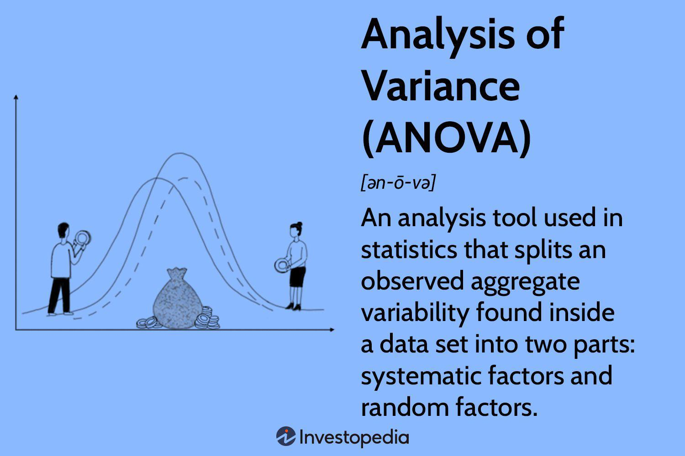

Algorithmic trading has revolutionized financial markets by employing automated strategies to execute trades at speeds and frequencies not possible for human traders. Statistical tools are integral to developing and refining these strategies, allowing traders to optimize performance and manage risks effectively. Among various statistical methods, Analysis of Variance (ANOVA) holds a prominent position due to its ability to dissect variance within datasets, thereby offering valuable insights that enhance trading decisions.

ANOVA is a statistical technique designed to ascertain whether there are any statistically significant differences between the means of three or more independent groups. In the context of trading, this involves analyzing datasets to discern patterns and relationships that may not be immediately apparent. By categorizing the variance into systematic and random components, ANOVA assists traders in identifying meaningful interactions among variables that can influence trading outcomes.



This technique's application extends beyond traditional statistical analysis, providing algorithmic traders with a robust tool to assess and compare the efficacy of different trading strategies. For example, ANOVA can help determine whether a particular strategy's superior performance is attributed to market conditions or is merely due to random chance. This distinction is crucial for traders aiming to identify reliable methods that perform consistently across various scenarios.

The potential of ANOVA in algorithmic trading is vast, offering a pathway to optimize strategies and make more informed decisions. As trading environments evolve and become increasingly complex, the ability to distinguish between real insights and random variations becomes paramount. Through the use of ANOVA, traders and analysts can enhance their strategies, optimize performance, and better manage risks.

## Table of Contents

## Understanding ANOVA

Analysis of Variance (ANOVA) is a statistical method used to determine whether there are any statistically significant differences between the means of three or more independent groups. It achieves this by analyzing the total variance observed in a dataset and partitioning it into components attributable to different sources of variation. This decomposition allows researchers to understand whether observed variations are likely due to true differences between group means or merely result from random variation.

At its core, ANOVA operates by comparing variance within groups (intra-group variance) to variance between groups (inter-group variance). The fundamental assumption is that if group means are indeed different, the variability between groups should exceed the variability within groups. This comparison is typically quantified using the F-ratio, calculated as follows:

$$
F = \frac{\text{Mean Square Between Groups (MSB)}}{\text{Mean Square Within Groups (MSW)}}
$$

Where:
- Mean Square Between Groups (MSB) measures variance due to the interaction between the samples.
- Mean Square Within Groups (MSW) measures variance within each of the sample groups.

The F-ratio follows an F-distribution under the null hypothesis, which posits that all group means are equal. If the computed F-statistic is significantly large, it suggests rejecting the null hypothesis in favor of the alternative hypothesis, which implies that at least one group mean deviates from the others.

There are primarily two types of ANOVA: one-way ANOVA and two-way ANOVA. 

**One-way ANOVA** is used when investigating the effect of a single factor on different groups. It is useful in scenarios where a sole categorical variable influences the dependent variable. An example scenario could be analyzing the impact of different marketing strategies on sales volume.

**Two-way ANOVA**, on the other hand, extends this concept by examining the influence of two distinct factors simultaneously. This approach also assesses potential interactions between the factors. This type is applicable in cases where two independent variables together affect the outcome, such as studying the effects of different teaching methods and class sizes on student performance.

Understanding and applying the appropriate type of ANOVA can significantly aid in identifying systematic patterns and relationships within datasets, especially when evaluating the interaction between multiple factors in complex environments. Through its ability to decompose variance effectively, ANOVA continues to be a powerful tool in experimental design and data analysis.

## How ANOVA Works in Financial Analysis

Analysis of Variance (ANOVA) is a statistical method widely used in financial analysis to evaluate performance across various groups or conditions. In financial contexts, diverse strategies and market conditions necessitate rigorous evaluation methods to discern patterns amid apparent randomness. ANOVA provides a structured approach to understanding whether observed variations in performance metrics are attributable to intrinsic strategic differences or merely the result of random fluctuations.

In practice, ANOVA is employed to compare the performance of multiple investment strategies, analyzing whether some strategies inherently perform better than others under similar market conditions. For instance, consider three different trading strategies: strategy A, strategy B, and strategy C. A financial analyst may apply ANOVA to ascertain if the average returns from these strategies differ significantly, which might suggest one strategy's superiority in certain market scenarios.

Mathematically, ANOVA tests the null hypothesis that all group means are equal against the alternative hypothesis that at least one group mean is different. The basic formula for the F-statistic in ANOVA is:

$$
F = \frac{\text{Between-group variability}}{\text{Within-group variability}}
$$

Where:
- **Between-group variability** measures how much the group means deviate from the overall mean.
- **Within-group variability** shows how data points within the same group differ from the group mean.

This F-statistic follows an F-distribution under the null hypothesis, allowing the analyst to calculate a p-value and determine statistical significance.

A practical application of ANOVA might involve evaluating the performance of different sector portfolios across various market conditions. By segmenting market conditions—such as bullish, bearish, and neutral phases—ANOVA can help identify whether specific portfolios have consistently superior returns in any particular market condition, thus aiding in strategy selection and risk management.

Moreover, ANOVA's capability to handle multiple comparisons simultaneously reduces the likelihood of Type I errors (false positives) compared to performing numerous pairwise t-tests. However, it is crucial to ensure assumptions such as homogeneity of variance are met, as violations can lead to inaccurate conclusions.

By leveraging ANOVA in financial analysis, traders can gain deeper insights into the performance variability across strategies and market states, improving their decision-making process and enhancing overall trading strategy effectiveness.

## Applications of ANOVA in Algorithmic Trading

In [algorithmic trading](/wiki/algorithmic-trading), Analysis of Variance (ANOVA) is a powerful statistical method used to compare multiple trading algorithms, thereby identifying the most effective ones. By examining different strategies, ANOVA helps traders ascertain whether observed performance differences in algorithms are statistically significant or merely due to random variability.

One of the key applications of ANOVA in this context is to evaluate and compare the performance of trading strategies under diverse market conditions. For instance, a trader might want to test if certain strategies outperform others during volatile markets compared to stable market conditions. Through ANOVA, it is possible to statistically test the hypothesis that different market phases lead to different trading outcomes, thus directing attention towards strategies that yield consistent results irrespective of market [volatility](/wiki/volatility-trading-strategies).

Moreover, ANOVA assists in optimizing algorithm parameters. It analyses the impact of various factors, such as different stop-loss levels or leverage ratios, on the overall performance of trading strategies. By systematically adjusting these parameters and using ANOVA to interpret the results, traders can refine their decision models to enhance profitability and manage risk more effectively.

The application of two-way ANOVA extends the basic analysis by considering the interaction between different groups and factors, such as the combination of market conditions and time of the day. This level of analysis provides deeper insights into how multiple factors simultaneously affect a trading strategy's performance, thus enabling more granular strategy optimization.

In practical terms, implementation can be facilitated using statistical programming environments like Python. Using libraries such as `scipy.stats` and `pandas`, traders can perform ANOVA to analyze historical trading data, as shown in this simple Python example:

```python
import pandas as pd
import scipy.stats as stats

# Sample data representing different strategies and their performance
data = {'Strategy_A': [0.05, 0.07, 0.06, 0.05],
        'Strategy_B': [0.04, 0.06, 0.07, 0.05],
        'Strategy_C': [0.03, 0.02, 0.04, 0.05]}

df = pd.DataFrame(data)

# Perform one-way ANOVA
f_value, p_value = stats.f_oneway(df['Strategy_A'], df['Strategy_B'], df['Strategy_C'])

print(f"F-value: {f_value}, P-value: {p_value}")
```

This example illustrates how to assess the statistically significant differences in performance among three hypothetical trading strategies. A low p-value in the results would indicate that there are significant differences in performance, suggesting which strategies to prioritize based on this analysis.

In summary, ANOVA within algorithmic trading provides a structured approach to evaluate and enhance trading algorithms' effectiveness by focusing attention on robust strategies and refining algorithm parameters. This statistical technique aids in making informed decisions that improve trading outcomes and strategy robustness.

## Case Studies and Examples

In the context of algorithmic trading, where decision-making is heavily data-driven, Analysis of Variance (ANOVA) proves to be a potent statistical tool for assessing and optimizing trading strategies. This section presents real-world applications illustrating how ANOVA can be leveraged to enhance trading outcomes.

One practical use of ANOVA in trading is the evaluation of risk management strategies. For instance, traders may employ different strategies such as stop-loss orders, trailing stops, or position sizing to manage risk across multiple trading algorithms. ANOVA can be used to determine if these strategies differ significantly in terms of their effectiveness in controlling risk during various market conditions. By conducting an ANOVA test, traders can statistically ascertain if one risk management approach consistently outperforms others, leading to informed decision-making for adopting the most robust strategy.

Consider a scenario where an investment firm assesses the performance of its portfolios across different economic cycles—boom, recession, recovery, and expansion. By applying ANOVA, the firm can analyze whether the mean returns of these portfolios differ significantly across the economic states. This statistical evaluation helps in identifying which economic cycle offers the most stable and high-performing investment outcomes, thereby guiding strategic asset allocation and portfolio management decisions.

Furthermore, ANOVA can be instrumental in examining algorithm performance over various temporal datasets. For example, a trader might want to test whether a specific trading algorithm maintains its performance consistency across different historical periods—say pre-2008 financial crisis, post-crisis, and recent data. Running a one-way ANOVA can reveal if there are statistically significant differences in algorithmic returns across these periods, thus allowing the trader to adjust strategies according to historical effectiveness.

The use of ANOVA is not limited to performance assessments but also extends to parameter optimization in trading algorithms. When optimizing parameters such as look-back periods, entry thresholds, or volatility filters, ANOVA can evaluate whether varying these parameters leads to meaningful differences in trading outcomes. By identifying optimal parameter sets using ANOVA, traders can tailor algorithms that are finely tuned to exploit market inefficiencies.

In practical terms, implementing ANOVA in financial analysis involves coding tasks that can be executed in statistical software or programming languages such as Python. Below is a basic example of how ANOVA might be applied using Python with the `scipy` library:

```python
import numpy as np
from scipy import stats

# Sample data representing returns from different strategies
returns_strategy_a = np.array([0.05, 0.06, 0.07, 0.04, 0.06])
returns_strategy_b = np.array([0.04, 0.05, 0.06, 0.03, 0.05])
returns_strategy_c = np.array([0.07, 0.08, 0.09, 0.06, 0.08])

# Perform ANOVA
f_statistic, p_value = stats.f_oneway(returns_strategy_a, returns_strategy_b, returns_strategy_c)
print(f'F-statistic: {f_statistic}, p-value: {p_value}')
```

This code snippet calculates the F-statistic and p-value to test the null hypothesis that the mean returns of different trading strategies are equal. A low p-value would indicate statistically significant differences among the strategies, thus providing guidance for strategy selection.

In conclusion, through applications such as risk management evaluation, performance analysis across economic cycles, and parameter optimization, ANOVA offers concrete methods for traders to enhance investment decision-making and improve financial outcomes. Its capacity to provide statistically validated insights makes it a valuable tool in the continuing evolution of algorithmic trading.

## Advantages and Limitations of ANOVA

ANOVA, or Analysis of Variance, is a powerful statistical tool employed for dissecting complex datasets, enabling detailed comparisons between multiple groups. One of the primary advantages of ANOVA is its ability to test the differences among three or more groups' means simultaneously, rather than conducting multiple t-tests which can increase the risk of Type I errors—erroneously detecting a difference when none exists. By applying ANOVA, the integrity of statistical inference is upheld, reducing the likelihood of such errors.

A significant benefit of ANOVA is its utility in isolating systematic variance from random noise, which is particularly advantageous in contexts like algorithmic trading where identifying true strategic differences is critical. For example, when evaluating trading strategies across different market conditions, ANOVA can help discern whether observed performance variations arise from strategic factors or are merely random fluctuations.

However, while ANOVA is robust, its application carries certain limitations tied to its underlying assumptions. One essential assumption is homogeneity of variance, which stipulates that all groups being compared should have similar variances. Violation of this assumption can lead to inaccurate conclusions, underscoring the importance of testing for variance equality before applying ANOVA. Tools like Levene's Test can be employed to check this assumption. Moreover, the data used must be normally distributed, especially when dealing with small sample sizes. For large samples, the Central Limit Theorem offers some leeway, reducing the impact of non-normal distributions on ANOVA results.

Furthermore, ANOVA does not indicate which specific groups are significantly different from each other when a difference is detected. Post hoc tests, such as Tukey's HSD (Honestly Significant Difference), are necessary for pinpointing these differences, requiring additional analysis beyond the initial ANOVA results.

In practical applications, understanding these assumptions and limitations is crucial. Missteps in assumption validation can lead to erroneous interpretations, adversely affecting decision-making. Thus, while ANOVA can significantly enhance the analysis process through its structured approach to variance decomposition, careful adherence to its assumptions is essential for extracting valid, actionable insights.

## Conclusion

As algorithmic trading continues to advance, incorporating robust statistical methods such as Analysis of Variance (ANOVA) has become increasingly important for traders seeking to enhance their decision-making processes. ANOVA provides a systematic approach to distinguish between genuine variations in trading strategies and random fluctuations inherent in market data. By effectively identifying these variations, traders can ascertain which elements of a strategy are consistently effective across different market conditions.

ANOVA's strength lies in its ability to analyze datasets involving multiple variables or groups, enabling traders and financial analysts to make informed adjustments to their trading algorithms. By accurately identifying significant differences in strategy performance, ANOVA aids in parameter optimization and model refinement—essential steps in crafting precision-driven trading systems.

Moreover, ANOVA contributes to comprehensive risk management by filtering out noise and highlighting systematic factors affecting financial outcomes. This ability to differentiate signal from noise is invaluable in minimizing risks associated with market volatility and improving overall trading strategy resilience.

For traders and analysts, leveraging ANOVA's capabilities offers the potential for improved investment decisions and enhanced performance outcomes. By adopting this statistical tool, they can ensure that their algorithms are not only more adaptive to market changes but also optimized for long-term success. Consequently, ANOVA remains a critical component in the toolkit of algorithmic trading, driving the evolution of more sophisticated and reliable trading systems.

## References & Further Reading

[1]: Montgomery, D. C. (2017). ["Design and Analysis of Experiments."](https://www.researchgate.net/publication/361342853_Design_and_Analysis_of_Experiments) Wiley.

[2]: de Prado, M. L. (2018). ["Advances in Financial Machine Learning."](https://www.amazon.com/Advances-Financial-Machine-Learning-Marcos/dp/1119482089) Wiley.

[3]: Aronson, D. R. (2006). ["Evidence-Based Technical Analysis: Applying the Scientific Method and Statistical Inference to Trading Signals."](https://www.amazon.com/Evidence-Based-Technical-Analysis-Scientific-Statistical/dp/0470008741) Wiley.

[4]: Jansen, S. (2020). ["Machine Learning for Algorithmic Trading: Predictive Models to Extract Signals from Market and Alternative Data for Systematic Trading Strategies with Python, 2nd Edition."](https://www.amazon.com/Machine-Learning-Algorithmic-Trading-alternative/dp/1839217715) Packt Publishing.

[5]: Chan, E. P. (2008). ["Quantitative Trading: How to Build Your Own Algorithmic Trading Business."](https://github.com/ftvision/quant_trading_echan_book) Wiley.