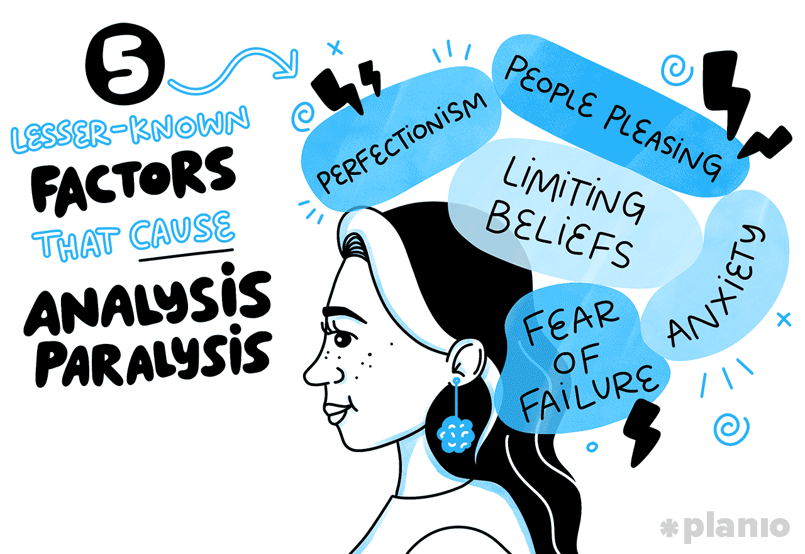

## Table of Contents

## What is analysis paralysis?

Analysis paralysis is when someone has a hard time making a decision because they think about it too much. They might feel stuck because they want to consider all the options and possible outcomes, but this can make choosing anything feel overwhelming. It's like wanting to pick the best fruit at the store, but there are so many choices that you end up not picking any at all.

This can happen in everyday life, like choosing what to eat for dinner, or in bigger situations, like deciding on a career path. When people experience analysis paralysis, they might feel stressed or anxious because they can't move forward. To help with this, it can be useful to set a time limit for making decisions, or to break down big choices into smaller, easier steps.

## What are common causes of analysis paralysis?

One common cause of analysis paralysis is having too many choices. When there are a lot of options, it can be hard to decide which one is the best. Imagine going to a store with hundreds of different kinds of cereal. It might be tough to pick just one because you want to make sure you choose the tastiest or healthiest one. This can make you feel stuck and unsure about what to do.

Another cause is the fear of making a wrong decision. People might worry that if they choose something, they will miss out on a better option or make a mistake that they can't fix. This fear can make them keep thinking and thinking without ever making a choice. It's like being afraid to jump into a pool because you're not sure if the water is too cold, so you just stand at the edge and never jump in.

Lastly, perfectionism can also lead to analysis paralysis. If someone wants everything to be perfect, they might spend a lot of time trying to find the perfect solution. They might keep looking for more information or better options, thinking that if they just keep searching, they'll find the best choice. But this can make it really hard to ever make a decision because nothing ever seems good enough.

## How does analysis paralysis affect decision-making?

Analysis paralysis makes decision-making really hard because it causes people to think too much about their choices. When someone is stuck in analysis paralysis, they might spend a lot of time looking at all the options and trying to figure out the best one. This can make them feel overwhelmed and unsure, so they end up not making any decision at all. It's like trying to choose a favorite color but getting stuck because there are so many colors to pick from.

This problem can slow down or even stop the decision-making process. Instead of moving forward and choosing something, people might keep thinking and thinking without ever taking action. This can lead to missed opportunities and a lot of stress because they feel stuck. It's important to find ways to break out of analysis paralysis, like setting time limits for decisions or breaking big choices into smaller steps, so that people can make choices and keep moving forward in life.

## What are the psychological impacts of analysis paralysis?

Analysis paralysis can make people feel really stressed and anxious. When someone can't make a decision because they're thinking too much, it can lead to feelings of being overwhelmed. They might worry a lot about making the wrong choice and feel like they're stuck in one place. This can build up stress over time and make everyday life feel harder. It's like trying to solve a puzzle but getting more and more frustrated because you can't find the right piece.

In the long run, analysis paralysis can affect someone's mental health. Constantly feeling stuck and unable to make choices can lead to feelings of helplessness and low self-esteem. People might start to doubt their ability to make good decisions, which can make them feel worse about themselves. It's important to find ways to manage this, like talking to someone about it or learning techniques to help make decisions more easily, so that the psychological impacts don't become too heavy to handle.

## Can analysis paralysis occur in both personal and professional settings?

Yes, analysis paralysis can happen in both personal and professional settings. In personal life, it might show up when someone is trying to decide what to cook for dinner, what movie to watch, or even bigger choices like where to live or who to date. They might feel overwhelmed by all the options and end up not making any choice at all, which can lead to stress and frustration.

In a professional setting, analysis paralysis can affect decisions about work projects, career moves, or business strategies. For example, a manager might spend too much time trying to figure out the perfect way to launch a new product, causing delays and missed opportunities. This can impact not just the individual but also the whole team or company, leading to stress and lower productivity.

## What are some signs that someone might be experiencing analysis paralysis?

When someone is experiencing analysis paralysis, they might spend a lot of time thinking about a decision without actually making one. They could keep looking for more information or trying to find the perfect solution, but never feel ready to choose. This can make them feel stuck and unsure, often leading to delays in making any kind of choice, whether it's small like [picking](/wiki/asset-class-picking) a restaurant or big like deciding on a job.

This problem can also show up as feeling overwhelmed by all the options. Someone might feel anxious or stressed because they're worried about making the wrong decision. They might ask for advice from a lot of people or keep changing their mind, which can make them feel even more confused and frustrated. It's like trying to solve a puzzle but getting more and more stuck because there are too many pieces to sort through.

## How can one differentiate between thorough analysis and analysis paralysis?

Thorough analysis is when someone looks at all the options carefully and makes a decision based on the information they have. It's like checking all the ingredients before cooking a meal to make sure you pick the best ones. When someone does a thorough analysis, they feel confident about their choice because they've thought it through but haven't taken too long to decide.

Analysis paralysis, on the other hand, is when someone keeps thinking about the options without ever making a choice. They might feel overwhelmed and stuck because they're worried about making the wrong decision. It's like standing in front of a big menu and never ordering because you can't decide which dish is the best. The key difference is that thorough analysis leads to a decision, while analysis paralysis leads to no decision at all.

## What strategies can be used to prevent analysis paralysis?

One way to prevent analysis paralysis is to set a time limit for making decisions. When you know you only have a certain amount of time to choose, it can help you focus and stop overthinking. For example, you might give yourself 10 minutes to decide what to eat for dinner. This way, you can look at your options, think about them, and then pick one without getting stuck.

Another strategy is to break big decisions into smaller steps. Instead of trying to solve everything at once, you can take one part at a time. If you're trying to choose a new job, you might first make a list of what you want in a job, then look at different job postings, and finally decide which one to apply for. Breaking it down like this can make the decision feel less overwhelming and help you move forward.

Lastly, it can be helpful to accept that no decision is perfect. Understanding that every choice has its pros and cons can take away some of the pressure to find the "best" option. Sometimes, making a good enough choice is better than not making any choice at all. By letting go of the need for perfection, you can feel more confident in your decisions and avoid getting stuck in analysis paralysis.

## Are there specific tools or techniques that help in overcoming analysis paralysis?

One helpful tool for overcoming analysis paralysis is using a decision matrix. This is a simple chart where you list your options and rate them based on what's important to you. For example, if you're choosing a new phone, you might rate each phone on things like price, battery life, and camera quality. By seeing all the options and their scores in one place, it can make choosing easier and stop you from feeling overwhelmed.

Another technique is called the "5 Whys" method. This involves asking "why" five times to get to the root of what you really want from a decision. For instance, if you're trying to decide on a vacation spot, you might ask, "Why do I want to go on vacation?" to figure out if it's for relaxation, adventure, or something else. This can help you focus on what matters most and make a choice based on your true priorities, rather than getting stuck thinking about too many details.

Lastly, practicing mindfulness can also help. Mindfulness means paying attention to the present moment without judging it. When you feel overwhelmed by a decision, take a few deep breaths and focus on what's happening right now. This can help calm your mind and make it easier to see things clearly. By staying present, you can avoid getting lost in too many thoughts and make a decision more confidently.

## How can organizations address analysis paralysis at a systemic level?

Organizations can address analysis paralysis at a systemic level by creating clear decision-making processes. This means setting up guidelines that help everyone know how to make choices quickly and confidently. For example, a company might use decision-making frameworks or checklists that guide employees through the steps of choosing the best option. By having these tools in place, people can focus on the important parts of a decision without getting overwhelmed by too many details. It's like having a map to follow so you don't get lost on the way to making a choice.

Another way organizations can help is by encouraging a culture that values action over perfection. This means celebrating decisions that are good enough rather than waiting for the perfect solution. Leaders can set an example by making timely decisions and showing that it's okay to move forward even if everything isn't perfect. By doing this, employees will feel less pressure to find the "best" option and more encouraged to make choices and keep moving forward. It's like giving everyone permission to take a step, even if it's not the biggest or the best step, because any step is better than standing still.

## What role does cognitive bias play in analysis paralysis?

Cognitive biases can make analysis paralysis worse. These are like shortcuts our brains take when thinking, but they can lead us to make mistakes. For example, the fear of missing out (FOMO) can make someone keep looking for more options because they're worried they'll miss a better choice. This can make it really hard to decide because they're always thinking there might be something better out there. Another bias is the sunk cost fallacy, where someone keeps thinking about a decision because they've already spent a lot of time on it, even if it's not the best choice anymore. These biases can keep someone stuck in analysis paralysis because they make it hard to see the situation clearly.

To deal with these biases, it's important to be aware of them. When you know your brain might be tricking you into overthinking, you can try to step back and look at the decision more clearly. For example, if you're feeling FOMO, remind yourself that no choice is perfect and that making a good enough decision is better than not deciding at all. If you're stuck because of the sunk cost fallacy, try to focus on what's best for the future, not what you've already spent time on. By understanding and managing these biases, you can make choices more easily and avoid getting stuck in analysis paralysis.

## How can one measure the effectiveness of interventions aimed at reducing analysis paralysis?

To measure how well interventions work to reduce analysis paralysis, you can look at how quickly people make decisions after the intervention. If someone used to take a long time to choose but now makes choices faster, that's a good sign the intervention is helping. You can also ask people how they feel about making decisions. If they feel less stressed or more confident, it means the intervention is working. Surveys or feedback forms can help gather this information.

Another way to measure effectiveness is by tracking how often decisions lead to good results. If the choices people make after the intervention are usually successful, it shows that the intervention is helping them make better decisions. You can also look at how often people get stuck and can't decide at all. If this happens less often after the intervention, it's another sign that it's working. By using these methods, you can see if the strategies to reduce analysis paralysis are really making a difference.

## What is the relationship between Cognitive Psychology and Decision-Making?

Cognitive psychology provides valuable insights into decision-making processes, particularly in trading environments where quick and accurate choices are essential. Cognitive psychology examines how individuals perceive, think, and process information, which directly influences their decision-making abilities. Two critical concepts relevant to traders are the paradox of choice and decision fatigue.

The paradox of choice refers to the phenomenon where having more options leads to increased anxiety and decision-making difficulty rather than improved satisfaction. When traders are presented with an overwhelming array of investment options and data, they may become indecisive, struggling to choose the optimal trade. The sheer [volume](/wiki/volume-trading-strategy) of information can hinder their ability to prioritize and make swift decisions, potentially leading to missed opportunities.

Herbert A. Simon’s concept of bounded rationality is often cited in this context. It suggests that cognitive limitations and time constraints cause individuals to make satisficing decisions rather than optimizing ones. Traders faced with extensive options may settle for satisfactory trades instead of optimal ones due to cognitive overload.

Moreover, decision fatigue describes the deteriorating quality of decisions after a long session of decision-making. In trading, continuous monitoring and analysis of market conditions can exhaust mental resources, diminishing a trader's capacity to make sound decisions. This exhaustion can lead to errors, impulsive trades, or avoidance of important decisions altogether.

A mathematical representation of decision fatigue can be expressed through the cumulative cost function $C(t)$, where $t$ is time spent making decisions:

$$
C(t) = \int_{0}^{t} c(x) \, dx
$$

Here, $c(x)$ represents the cost of making decisions over time, which increases as time progresses.

To mitigate these cognitive challenges, traders can employ strategies such as setting predefined criteria for decision-making, using checklists to streamline information processing, and taking regular breaks to maintain mental clarity. By understanding cognitive psychology principles like the paradox of choice and decision fatigue, traders can optimize their decision-making processes and improve their trading outcomes.

## References & Further Reading

[1]: Benartzi, S., & Thaler, R. H. (1995). ["Myopic Loss Aversion and the Equity Premium Puzzle."](https://www.nber.org/papers/w4369) The Quarterly Journal of Economics, 110(1), 73-92.

[2]: Kahneman, D., & Tversky, A. (1979). ["Prospect Theory: An Analysis of Decision under Risk."](https://www.jstor.org/stable/1914185) Econometrica, 47(2), 263-292.

[3]: Simon, H. A. (1955). ["A Behavioral Model of Rational Choice."](https://www.jstor.org/stable/1884852) The Quarterly Journal of Economics, 69(1), 99-118.

[4]: Schwartz, B. (2004). ["The Paradox of Choice: Why More is Less."](https://psycnet.apa.org/record/2004-13971-000) Harper Perennial.

[5]: Schachter, S. (1959). ["The Psychology of Affiliation: Experimental Studies of the Sources of Gregariousness."](https://psycnet.apa.org/record/1959-10111-000) Stanford University Press.

[6]: Thaler, R. H. (2015). ["Misbehaving: The Making of Behavioral Economics."](https://psycnet.apa.org/record/2015-22902-000) W. W. Norton & Company.