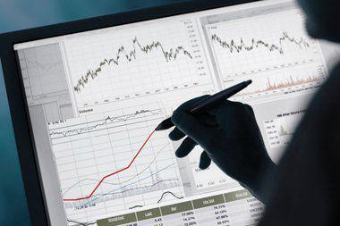

Analysis paralysis is a phenomenon that affects individuals across various domains, characterized by an inability to make decisions due to overanalyzing data or situations. This condition is particularly relevant in decision-making processes where the abundance of information or complexity of options can hinder effective action. In the context of financial trading, where decisions can significantly impact financial outcomes, understanding and managing analysis paralysis is crucial.

At the intersection of cognitive psychology and decision-making in trading environments, analysis paralysis emerges as a significant barrier. Cognitive psychology examines mental processes such as perception, memory, and reasoning, which are integral to making informed decisions. In trading, where rapid and accurate decisions are paramount, psychological factors like cognitive overload and biases can exacerbate analysis paralysis, making it challenging for traders to navigate complex market dynamics.



For algorithmic traders, understanding analysis paralysis is especially important. Algorithmic trading utilizes computer programs to execute strategies at high speeds and frequencies, often outperforming human capabilities in processing information. However, even in algorithmic trading, human oversight and decision-making are essential. Traders must decide which algorithms to use, when to intervene, and how to interpret algorithmic outputs. An awareness of analysis paralysis allows traders to design better decision-making frameworks, optimizing the balance between automated processes and human judgment.

This article will explore the concept of analysis paralysis and its impact on decision-making, particularly in trading scenarios. It will cover the psychological triggers that lead to analysis paralysis and examine how cognitive psychology principles, such as the paradox of choice and decision fatigue, influence traders. Additionally, it will look at how algorithmic trading can alleviate analysis paralysis and provide strategies for overcoming this condition, emphasizing the role of emotional intelligence. Understanding these dynamics can empower traders to enhance their performance and achieve more favorable outcomes.

## Table of Contents

## Understanding Analysis Paralysis

Analysis paralysis is a condition where an individual becomes unable to make decisions due to over-analysis of available information. In cognitive psychology, it is seen as a state where excessive cognitive processing leads to a breakdown in decision-making capability. This phenomenon often stems from the desire to make the best possible choice, leading individuals to overcomplicate the decision process by considering an overwhelming amount of data.

Several psychological triggers contribute to analysis paralysis. One significant factor is information overload, where the sheer volume of data overwhelms decision-makers, causing them to stall due to the inability to process every piece of information effectively. Cognitive biases such as overthinking and perfectionism further exacerbate this condition, as individuals may overestimate the consequences of their decisions or believe they must find the "perfect" solution, which is often unrealistic.

Examples of analysis paralysis are evident in both daily life and investment decisions. In everyday scenarios, consider someone trying to purchase a new smartphone. Faced with myriad choices, features, and prices, the individual may become so overwhelmed by the need to make the perfect choice that they delay their purchase indefinitely. Similarly, in investment decisions, a trader might hesitate to act due to the analysis of excessive market data, thereby missing opportune moments to buy or sell assets. The constant search for additional information can lead to indecision, causing potential financial losses when timely action is not taken.

In conclusion, understanding the triggers and manifestations of analysis paralysis is vital for recognizing its presence and developing strategies to mitigate its effects, particularly in decision-intensive fields such as trading.

## The Impact of Analysis Paralysis on Decision-Making

Analysis paralysis significantly impacts decision-making in trading scenarios, often leading to inefficiencies and missed opportunities. This phenomenon occurs when a trader becomes overwhelmed by the sheer [volume](/wiki/volume-trading-strategy) and complexity of information available, which hinders their ability to make timely decisions. In trading, where split-second choices can result in substantial profits or losses, analysis paralysis can be particularly detrimental.

Anxiety plays a crucial role in exacerbating analysis paralysis. When traders are anxious, they tend to overthink potential outcomes and second-guess their strategies. This often results in hesitation and indecision, preventing them from executing trades at optimal times. For example, a trader may scrutinize historical price charts, market trends, and news events for hours, only to miss the ideal buying or selling point due to excessive caution. Cognitive biases, such as overconfidence, confirmation bias, and the fear of making mistakes, further complicate decision-making. These biases can cloud judgment, leading traders to either over-rely on certain information or discount crucial data that contradicts their preconceived notions.

For instance, confirmation bias can cause traders to focus solely on information that supports their existing beliefs while disregarding evidence to the contrary. This narrowed perspective can limit their ability to consider alternative strategies or market conditions, thereby reinforcing analysis paralysis. In a similar vein, overconfidence can mislead traders into overanalyzing situations because they believe they are capable of making the perfect decision with enough data, which rarely happens in the fast-moving trading environment.

Analysis paralysis often results in missed trading opportunities and financial losses. The inability to act decisively can lead to holding positions for too long, missing out on profitable trades, or failing to cut losses at the right time. In many instances, traders might find themselves 'frozen', unable to capitalize on market movements due to over-analysis. The trading adage "paralysis by analysis" aptly describes this phenomenon, where traders are so overwhelmed by their assessment and reassessment of data that timely execution is compromised.

To illustrate this further, consider this simplified pseudocode that models a situation where analysis paralysis might occur during [algorithmic trading](/wiki/algorithmic-trading):

```python
def trade_decision(data, strategy):
    while True:
        # Simulating continuous data analysis
        current_analysis = analyze_market_data(data)

        # If the analysis output meets the strategy criteria, execute trade
        if strategy_criteria_met(current_analysis, strategy):
            execute_trade(current_analysis)
            break  # Trade executed, exit loop
        else:
            # Log failure to act due to continued analysis
            log("Analysis paralysis: Not executing due to ongoing analysis")

def strategy_criteria_met(analysis, strategy):
    # Placeholder for strategy condition checks
    return meets_conditions(analysis, strategy)

def execute_trade(analysis):
    # Placeholder function for executing a trade based on analysis
    print("Trade executed based on analysis:", analysis)

def analyze_market_data(data):
    # Placeholder function for market data analysis
    return some_complex_analysis(data)

data = ...  # Assumed market data
strategy = ...  # Assumed trading strategy
trade_decision(data, strategy)
```

In this pseudocode, the trader's failure to meet strategy criteria due to constant re-analysis highlights how analysis paralysis stalls decision-making. By understanding and addressing these psychological challenges, traders can develop more effective strategies to avoid analysis paralysis, enhancing both their decision-making processes and trading outcomes.

## Cognitive Psychology and Decision-Making

Cognitive psychology provides valuable insights into decision-making processes, particularly in trading environments where quick and accurate choices are essential. Cognitive psychology examines how individuals perceive, think, and process information, which directly influences their decision-making abilities. Two critical concepts relevant to traders are the paradox of choice and decision fatigue.

The paradox of choice refers to the phenomenon where having more options leads to increased anxiety and decision-making difficulty rather than improved satisfaction. When traders are presented with an overwhelming array of investment options and data, they may become indecisive, struggling to choose the optimal trade. The sheer volume of information can hinder their ability to prioritize and make swift decisions, potentially leading to missed opportunities.

Herbert A. Simon’s concept of bounded rationality is often cited in this context. It suggests that cognitive limitations and time constraints cause individuals to make satisficing decisions rather than optimizing ones. Traders faced with extensive options may settle for satisfactory trades instead of optimal ones due to cognitive overload.

Moreover, decision fatigue describes the deteriorating quality of decisions after a long session of decision-making. In trading, continuous monitoring and analysis of market conditions can exhaust mental resources, diminishing a trader's capacity to make sound decisions. This exhaustion can lead to errors, impulsive trades, or avoidance of important decisions altogether.

A mathematical representation of decision fatigue can be expressed through the cumulative cost function $C(t)$, where $t$ is time spent making decisions:

$$
C(t) = \int_{0}^{t} c(x) \, dx
$$

Here, $c(x)$ represents the cost of making decisions over time, which increases as time progresses.

To mitigate these cognitive challenges, traders can employ strategies such as setting predefined criteria for decision-making, using checklists to streamline information processing, and taking regular breaks to maintain mental clarity. By understanding cognitive psychology principles like the paradox of choice and decision fatigue, traders can optimize their decision-making processes and improve their trading outcomes.

## Algorithmic Trading and Analysis Paralysis

Algorithmic trading has emerged as a prominent solution to mitigate analysis paralysis, a condition wherein excessive analysis hampers timely decision-making. By leveraging advanced computational techniques, algorithmic trading systems reduce the cognitive load on traders, allowing for swifter decisions based on data-driven insights.

Algorithmic trading systems are designed to execute trades automatically, following pre-defined rules and logic. These systems utilize decision-making frameworks which enhance efficiency by circumventing human biases and emotions that often contribute to analysis paralysis. For instance, algorithms can quickly process vast amounts of market data, identify patterns, and execute trades based on statistical probabilities rather than emotional reactions. This capacity for rapid, automated decision-making minimizes the delays associated with human contemplation and hesitation.

Moreover, the frameworks embedded in trading algorithms often incorporate risk management strategies, such as stop-loss orders and diversification models, to optimize trading performance while keeping potential losses in check. Consider the following Python pseudocode snippet that exemplifies a simple decision-making framework for an algorithmic trading bot:

```python
def trading_signal(moving_average_short, moving_average_long):
    if moving_average_short > moving_average_long:
        return "buy"
    elif moving_average_short < moving_average_long:
        return "sell"
    else:
        return "hold"

# Example of implementing the decision-making framework
moving_average_short = calculate_moving_average(prices, short_window)
moving_average_long = calculate_moving_average(prices, long_window)
signal = trading_signal(moving_average_short, moving_average_long)

if signal == "buy":
    execute_trade("buy")
elif signal == "sell":
    execute_trade("sell")
```

This pseudocode showcases a basic moving average crossover strategy, a common algorithmic approach. The algorithm generates buy or sell signals based on the relative movements of short-term and long-term moving averages, ensuring decisions are made systematically and without hesitation.

However, while algorithms provide substantial benefits, they also pose the risk of over-reliance, potentially diminishing the role of human intuition. Human traders possess the ability to interpret qualitative information, such as geopolitical events or economic sentiments, which may not be readily quantifiable by algorithms. Therefore, the optimal trading approach often involves a balanced integration of algorithm-driven systems and human oversight. Experienced traders can provide strategic insights and adapt to unprecedented market conditions, complementing the algorithm's data-processing prowess.

In conclusion, algorithmic trading serves as a critical tool in addressing analysis paralysis by streamlining decision-making processes through automated, logic-based frameworks. Nevertheless, maintaining a harmonious balance between algorithmic strategies and human intuition is vital for achieving comprehensive and adaptive trading strategies.

## Overcoming Analysis Paralysis in Trading

Overcoming analysis paralysis in trading involves employing a combination of strategies that utilize both cognitive approaches and technological advancements. By focusing on structured decision-making frameworks and capitalizing on technological tools like [artificial intelligence](/wiki/ai-artificial-intelligence) (AI), traders can enhance their decision-making efficiency and reduce the debilitating effects of excessive analysis.

### Strategies to Mitigate Analysis Paralysis

1. **Simplify Decision-Making Processes**: Traders can benefit from simplifying complex decisions. Breaking down decisions into manageable parts can prevent overwhelming feelings that often lead to paralysis. A helpful approach can be using decision matrices to evaluate potential trades based on criteria such as risk, reward, and probability of success.

2. **Limit Available Options**: Reducing the number of available options can help streamline decisions. According to the paradox of choice, having too many options can lead to decision fatigue and analysis paralysis. By focusing on a set number of preferred trading strategies or instruments, traders can make quicker, more confident decisions.

3. **Leverage Checklists**: Traders can use checklists to ensure all critical factors are considered before making a trade, promoting consistency and reducing the mental load. A checklist might include parameters such as entry points, stop-loss levels, and market conditions.

### Role of Technology and AI

1. **Algorithmic Trading Systems**: These systems can automate trading strategies, significantly reducing the burden on human decision-making. By embedding decision-making frameworks within these algorithms, traders can execute predetermined strategies efficiently without succumbing to analysis paralysis. Here's a basic example in Python using a simple moving average strategy:

   ```python
   import pandas as pd

   def moving_average_strategy(data, short_window=40, long_window=100):
       signals = pd.DataFrame(index=data.index)
       signals['signal'] = 0.0

       signals['short_mavg'] = data['price'].rolling(window=short_window, min_periods=1, center=False).mean()
       signals['long_mavg'] = data['price'].rolling(window=long_window, min_periods=1, center=False).mean()

       signals['signal'][short_window:] = np.where(signals['short_mavg'][short_window:] > signals['long_mavg'][short_window:], 1.0, 0.0)   
       signals['positions'] = signals['signal'].diff()
       return signals

   # Example usage
   # data = pd.DataFrame({'price': [......]})  # Replace with actual price data
   # signals = moving_average_strategy(data)
   ```

2. **AI-Powered Decision Support**: Artificial intelligence can support traders by analyzing vast datasets and providing insights that might not be immediately apparent to humans. AI tools can identify patterns and optimize entry and exit points, making the decision process more data-driven and less prone to emotional interference.

### Importance of Setting Clear Goals and Time Constraints

1. **Establishing Investment Goals**: Clearly defined investment goals provide direction and purpose, reducing the uncertainty that often leads to analysis paralysis. Goals should be specific, measurable, achievable, relevant, and time-bound (SMART). 

2. **Implementing Time Constraints**: Allocating specific time limits for decision-making can prevent overthinking. This approach ensures that traders stick to a timetable, promoting discipline and minimizing hesitation. For instance, implementing a rule where a decision must be made within a certain timeframe after specific market signals are observed can be beneficial.

By integrating these strategies, traders can effectively navigate the complexities of modern markets while curbing the adverse effects of analysis paralysis. Understanding when and how to leverage technology alongside human judgment is crucial for achieving optimal trading outcomes.

## The Role of Emotional Intelligence

Emotional intelligence (EI) is a critical [factor](/wiki/factor-investing) for traders in managing analysis paralysis, which is characterized by an overwhelming state due to excessive analysis or information. EI involves the ability to recognize, understand, and manage one's emotions, as well as those of others. This skillset is particularly beneficial for traders who face high-pressure environments where rapid decision-making is essential.

A key aspect of leveraging emotional intelligence in trading is mindfulness, which is the practice of maintaining awareness of one's thoughts, emotions, and bodily sensations without judgment. Mindfulness helps traders stay grounded, enabling them to distinguish between relevant and irrelevant information. This, in turn, reduces the likelihood of succumbing to analysis paralysis. By practicing mindfulness, traders can better manage stress, which is a significant trigger of paralysis. Regular mindfulness exercises, such as meditation or deep-breathing practices, can cultivate a calm mental state that aids in maintaining focus and clarity.

Stress management is another vital element in using emotional intelligence effectively. High stress can impair cognitive function and exacerbate tendencies towards indecision. Proactively managing stress through structured routines, adequate rest, and physical activity helps maintain optimal cognitive performance. Additionally, having a balanced lifestyle supports emotional stability, essential for traders who need to adapt to the dynamic nature of financial markets.

Developing emotional resilience is crucial for traders to stay focused and make sound decisions. Emotional resilience refers to the ability to adapt to stressful situations and bounce back from setbacks. Traders can build resilience by setting clear trading plans and objectives, which provide direction and reduce uncertainty. Strategies such as journaling to reflect on past trading decisions and outcomes can help foster learning and emotional growth. Also, traders may benefit from cognitive reframing, a technique used to alter negative thought patterns by viewing situations from a more positive or realistic perspective.

Ultimately, enhancing emotional intelligence can mitigate the effects of analysis paralysis by promoting self-awareness, stress management, and emotional regulation. Traders who invest in developing these skills are better equipped to handle complex decision-making scenarios efficiently, reducing instances of missed opportunities and mitigating financial losses. As such, emotional intelligence serves as an valuable asset for traders aiming for sustained success in the markets.

## Conclusion

Analysis paralysis emerges as a critical obstacle in the decision-making process, particularly within trading environments. Through understanding the psychological underpinnings and cognitive biases contributing to this phenomenon, traders can cultivate more effective strategies for managing their decision-making processes. By acknowledging factors such as the paradox of choice, decision fatigue, and emotional intelligence, traders can develop a holistic approach to overcoming analysis paralysis.

The application of algorithmic trading stands out as a promising avenue to mitigate analysis paralysis. By leveraging decision-making frameworks embedded in algorithms, traders can enhance efficiency and clarity in executing trades. However, maintaining a balance between automated and intuitive human-driven decisions enables traders to optimize their performance in dynamic market conditions.

To truly overcome analysis paralysis, traders are encouraged to integrate clear investment goals and time constraints into their strategies. This structured approach aids in eliminating unnecessary complexity, reducing anxiety, and focusing on actionable insights. Moreover, technology and AI tools offer tremendous potential to streamline the decision-making processes, thereby minimizing cognitive overload.

Emphasizing emotional intelligence and resilience further equips traders with the necessary skills to handle stress and maintain focus in volatile markets. Mindfulness practices and stress management techniques play a pivotal role in preserving mental acuity and facilitating better trading outcomes.

In conclusion, understanding and overcoming analysis paralysis is imperative for traders aiming to improve their decision-making capabilities and financial outcomes. By incorporating the strategies discussed, traders can navigate the complexities of the trading landscape with greater confidence and success, ultimately leading to enhanced trading performance and reduced risk of missed opportunities.

## References & Further Reading

[1]: Benartzi, S., & Thaler, R. H. (1995). ["Myopic Loss Aversion and the Equity Premium Puzzle."](https://www.nber.org/papers/w4369) The Quarterly Journal of Economics, 110(1), 73-92.

[2]: Kahneman, D., & Tversky, A. (1979). ["Prospect Theory: An Analysis of Decision under Risk."](https://www.jstor.org/stable/1914185) Econometrica, 47(2), 263-292.

[3]: Simon, H. A. (1955). ["A Behavioral Model of Rational Choice."](https://www.jstor.org/stable/1884852) The Quarterly Journal of Economics, 69(1), 99-118.

[4]: Schwartz, B. (2004). ["The Paradox of Choice: Why More is Less."](https://psycnet.apa.org/record/2004-13971-000) Harper Perennial.

[5]: Schachter, S. (1959). ["The Psychology of Affiliation: Experimental Studies of the Sources of Gregariousness."](https://psycnet.apa.org/record/1959-10111-000) Stanford University Press.

[6]: Thaler, R. H. (2015). ["Misbehaving: The Making of Behavioral Economics."](https://psycnet.apa.org/record/2015-22902-000) W. W. Norton & Company.