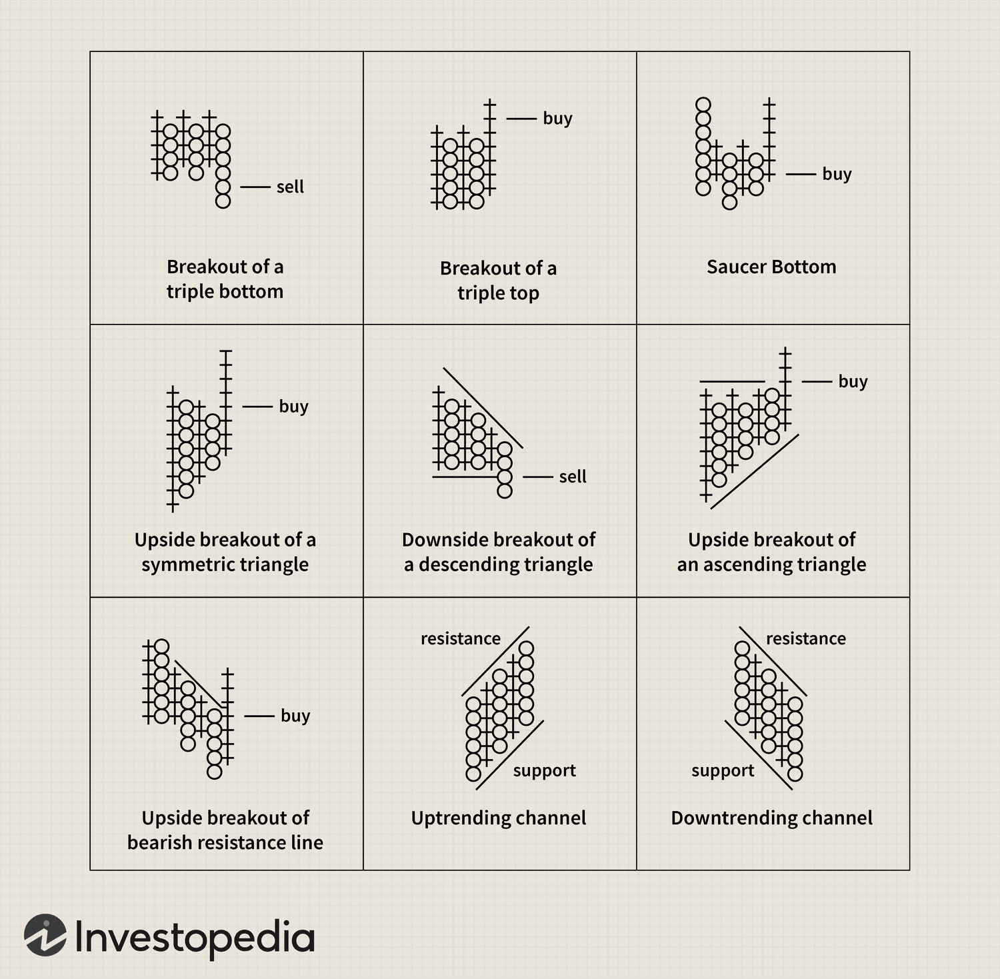

Technical analysis is pivotal in empowering traders to scrutinize and capitalize on market opportunities by leveraging various analytical tools and techniques. Central to this analytical framework are chart patterns and point-and-figure (P&F) charts, which provide unique insights into price movements and market sentiment. Chart patterns, the graphical representations of price movements over time, assist traders in forecasting future price directions by identifying historical trends and potential breakout points. These patterns, ranging from head and shoulders to double tops and triangles, form the backbone of technical analysis, offering visual cues of market psychology.

Point-and-figure charting, distinct from traditional charting methods, focuses solely on price fluctuations, disregarding the element of time. This method employs a straightforward plotting technique using Xs and Os to denote rising and falling prices, respectively. By eschewing time-based data, P&F charts highlight significant price trends, stripping away market noise and allowing traders to focus on pure price action. This clarity is crucial in identifying key support and resistance levels, as well as pivotal patterns such as double tops and bottoms, offering a distilled view of market dynamics.



The integration of P&F charting within algorithmic trading systems heralds an evolution in trading strategy development. The automation of P&F chart generation and subsequent pattern recognition enables computers to execute trades based on predefined criteria, enhancing the speed and accuracy of trade execution. As algorithmic trading continues to evolve, the ability to integrate technical analyses like P&F charting into trading algorithms can significantly bolster trading strategies by ensuring that trades are based on clear, actionable insights.

This article investigates the convergence of these elements—chart patterns, technical analysis, and point-and-figure charting—and their extensive application in modern-day algorithmic trading. Through this exploration, we aim to highlight how these tools work together to improve trading precision and decision-making in the fast-paced world of financial markets.

## Table of Contents

## Historical Background of Point-and-Figure Charting

Point-and-figure (P&F) charting is a distinguished technique in technical analysis, first documented by Charles H. Hoyle in 1898. This method represents price movements without considering the passage of time, focusing solely on significant price changes. In its early inception, P&F charting was a straightforward approach that aimed to strip down market data to its core by emphasizing substantial price movements, thus removing the noise associated with minor fluctuations.

As the method gained traction, notable contributions in the 20th century played a crucial role in refining and popularizing point-and-figure charts. Victor Devilliers was instrumental in advancing the technique, integrating innovative concepts that enhanced its analytical capabilities. Chartcraft Inc., one of the prominent technical analysis firms, further contributed to this refinement, ensuring the technique remained relevant and practical for traders.

One of the primary appeals of point-and-figure charts lies in their ability to offer a distilled view of market sentiment and dynamics. Unlike traditional charting methods that incorporate time as a [factor](/wiki/factor-investing), such as candlestick or bar charts, P&F charts focus exclusively on price movements. This unique approach allows traders to clearly identify and analyze significant trends and reversals, offering valuable insights into market behavior.

Throughout its evolution, point-and-figure charting has preserved its utility, adapting to modern trading environments while maintaining its original simplicity and effectiveness. The ongoing interest in this technique underscores its enduring relevance and importance for traders seeking to understand underlying market patterns and make informed trading decisions.

## Key Features and Construction of Point-and-Figure Charts

Point-and-figure (P&F) charts are a unique and valuable tool in technical analysis, focusing exclusively on price movements while disregarding time intervals. This approach differentiates them from traditional charting techniques, which typically plot price against time. By emphasizing significant price changes, P&F charts provide a clearer picture of market trends and dynamics.

The core methodology of P&F charting involves a grid-based plotting system, utilizing symbols such as Xs and Os to represent rising and falling prices, respectively. This method inherently filters out minor price fluctuations, thereby eliminating market noise and highlighting vital price trends and patterns. 

### Construction
To construct a P&F chart, the following steps are generally followed:

1. **Box Size**: Determine the box size, which is the minimum price movement needed to draw an X or O. The choice of box size depends on the trader's preference and the volatility of the traded asset.

2. **Reversal Amount**: Define the reversal amount, which determines the minimum price movement required to switch from Xs to Os or vice versa. A typical choice is three times the box size.

3. **Plotting Rules**: Begin plotting by recording the movement of prices. Each X is plotted when the price rises by the box size, and each O is plotted when the price falls by the same measure. A reversal—a switch from Xs to Os, or vice versa—occurs only when the price movement equals the defined reversal amount.

This plotting mechanism aids traders in identifying significant support and resistance levels, as well as classic chart patterns such as double tops and bottoms, which may signal potential market reversals or continuations.

### Trend Lines and Patterns
In P&F charting, 45-degree trend lines play a crucial role. These lines, plotted from significant peaks or troughs and rising or falling at a 45-degree angle, help assess market trend strength. They provide a visual guide for potential reversals or continuations, assisting traders in strategizing their trades based on market trends.

The clarity and simplicity of P&F charts make them especially valuable for those looking to identify distinct trading signals without the clutter of time-based data. As such, they remain a favored tool among many traders seeking powerful insights into market behavior.

## Advantages of Point-and-Figure Charting

Point-and-figure (P&F) charting stands out in technical analysis due to its distinct approach of concentrating exclusively on price movements, while disregarding the element of time. This characteristic provides a lucid visual representation of market trends, free from the distractions caused by insignificant price fluctuations and time-based noise. By focusing solely on price action, P&F charts enable traders to more easily identify genuine market trends and potential reversals. This clarity is a significant advantage for traders seeking to streamline decision-making processes.

The methodology employed in P&F charting excels in filtering out minor price movements that might otherwise clutter a traditional time-based chart. This filtering process assists traders in discerning substantial market shifts from mere market noise, thereby facilitating a more accurate analysis of price action. For instance, P&F charts are adept at showcasing patterns such as double tops and bottoms, which are essential for predicting potential market reversals or continuations. By concentrating on the critical price points that define these patterns, traders can more effectively forecast future price movements.

In practical terms, P&F charts utilize a grid-based plotting system consisting of Xs and Os to represent rising and falling prices, respectively. This system simplifies the visualization of supply and demand dynamics, enabling traders to quickly ascertain important support and resistance levels. The reduction of superfluous data within the chart ensures that traders focus on the pivotal price actions, thereby streamlining the analysis process.

Moreover, P&F charts aid in the simplification of technical analysis, providing traders with an efficient tool that is less clouded by extraneous data. The cleaner presentation of data facilitates quicker and more confident trading decisions. Whether a trader is assessing potential breakouts, tracking ongoing trends, or pinpointing reversal signals, the distilled perspective offered by P&F charts enhances their ability to respond decisively.

Overall, the advantages of P&F charting lie in its simplicity and precision, offering a compelling alternative to traditional charting methods. By presenting a clear view of crucial market movements, P&F charts empower traders to execute actions based on a more refined understanding of price behavior, ultimately enhancing their trading efficacy.

## Algorithmic Trading with Point-and-Figure Charts

The integration of point-and-figure (P&F) charting techniques into [algorithmic trading](/wiki/algorithmic-trading) systems has dramatically transformed financial markets since the 1980s with the introduction of computers. This technological advancement has enabled the swift generation of P&F charts and the automation of technical analysis processes, effectively bridging the gap between manual chart interpretation and automated trading strategies.

One of the core reasons P&F charts are compatible with algorithmic trading is their ability to distill significant price trends and identify clear actionable signals without the noise associated with time-based data. Algorithms can exploit these attributes by designing trading models that respond to predefined [breakout](/wiki/breakout-trading) and reversal patterns. This enhances the precision of trade execution and reduces response times, crucial in the fast-paced trading environment. For instance, a simple algorithm might trigger buy or sell signals when a new column surpasses the previous one, or initiate a trade reversal at the identification of a double top or bottom pattern.

Python is frequently used to implement such algorithms due to its wide range of libraries like Pandas for data manipulation and Matplotlib for visualization. A sample approach might involve [backtesting](/wiki/backtesting) a strategy using historical P&F data to evaluate trading signals. A basic implementation could look like this:

```python
import pandas as pd
import numpy as np

# Load price data into a DataFrame
data = pd.DataFrame({'Price': [.....]})

# Define P&F parameters
box_size = 1
reversal = 3

# Generate P&F chart
def generate_pnf(data, box_size, reversal):
    data['Change'] = data['Price'].diff()
    pnf_chart = []
    direction = 'x'  # x for up, o for down
    column_count = 0
    for price in data['Price']:
        if not pnf_chart:
            pnf_chart.append(price)
        elif direction == 'x' and price >= pnf_chart[-1] + box_size:
            pnf_chart.append(price)
        elif direction == 'o' and price <= pnf_chart[-1] - box_size:
            pnf_chart.append(price)
        elif (direction == 'x' and price <= pnf_chart[-1] - reversal * box_size) or \
             (direction == 'o' and price >= pnf_chart[-1] + reversal * box_size):
            direction = 'o' if direction == 'x' else 'x'
            pnf_chart.append(price)
            column_count += 1
    return pnf_chart

pnf_data = generate_pnf(data, box_size, reversal)
print(pnf_data)
```

Backtesting and iterative learning are essential practices when optimizing algorithmic strategies for P&F charts. These methods allow algorithms to fine-tune parameters such as box size and reversal threshold, ensuring adaptability across varying market conditions. By adjusting these parameters, algorithms can increase their sensitivity to market changes and improve trading performance. This kind of optimization is analogous to [machine learning](/wiki/machine-learning) techniques where models are trained to recognize patterns and make predictions based on historical data.

As technology continues to evolve, integrating advanced learning algorithms and machine learning techniques into P&F charting will likely enhance their predictive capabilities. This will not only refine the precision of algorithmic trading but will also further affirm the relevance of P&F charts in modern financial markets.

## Developing Price Targets with Point-and-Figure

Unique to point-and-figure (P&F) charting, the vertical and horizontal count methods offer precise tools for forecasting price targets, aiding traders and algorithms in making strategic trading decisions.

The vertical count method capitalizes on the initial upward movement represented by the 'X' columns in a P&F chart. To calculate a price target using this method, one starts by identifying a completed column of Xs that marks a significant upward price movement. Essential variables include the number of Xs in the column, the box size, and the reversal amount. The formula for calculating the vertical count price target is given by:

$$
\text{Price Target} = \text{X Column Low} + (\text{Number of Xs} \times \text{Box Size} \times \text{Reversal Amount})
$$

For example, if a column consists of 10 Xs, with a box size of $1 and a reversal amount of 3, and this column starts at a low of $50, the target would be:

$$
\text{Price Target} = 50 + (10 \times 1 \times 3) = 80
$$

The horizontal count method, in contrast, evaluates the width of a base formation, often appearing as a congestion area in the chart. It calculates targets by multiplying the base width, box size, and reversal amount. The horizontal count method is expressed as:

$$
\text{Price Target} = \text{Start of Formation} + (\text{Width of Base} \times \text{Box Size} \times \text{Reversal Amount})
$$

For instance, if a base has a width of 5 boxes, with a box size of $2 and a reversal amount of 3, starting from a price of $45, the calculated target would be:

$$
\text{Price Target} = 45 + (5 \times 2 \times 3) = 75
$$

These methodologies allow traders and algorithms to set strategic price targets grounded in historical price patterns. Employing these methods enhances the effectiveness of trading strategies by providing clear and structured target forecasting, aligned with market movements captured through point-and-figure charting.

## Conclusion

Point-and-figure charting remains an essential tool in technical analysis, valued for its ability to provide traders with a clear and unobstructed view of market trends. Unlike other charting methods that include time as a variable, P&F charts focus exclusively on price movement, effectively filtering out market noise and allowing traders to concentrate on significant price action. This distinctive approach simplifies the decision-making process and aids traders in identifying genuine trends and potential reversals.

In the context of algorithmic trading, the adaptability of point-and-figure charts enhances the accuracy and speed of real-time market analysis. Their straightforward representation of price data aligns well with automated trading algorithms, which rely on clear, actionable signals to execute trades with precision. Algorithms can leverage the robust yet simple architecture of P&F charts to identify breakout and reversal patterns, optimizing trade entry and [exit](/wiki/exit-strategy) points. Furthermore, the ability to customize parameters such as box size and reversal threshold allows algorithms to adjust to varying market conditions, increasing their efficacy.

As technology evolves, the integration of machine learning could further elevate the predictive capabilities of point-and-figure charting. Machine learning algorithms could analyze historical P&F charts to detect complex patterns and refine trading strategies, potentially predicting future market movements with greater accuracy. This integration could solidify the role of P&F charting as an integral component of modern trading systems, offering traders a blend of traditional techniques with cutting-edge technological advancements.

## References & Further Reading

[1]: ["Point and Figure Charting: The Essential Application for Forecasting and Tracking Market Prices"](https://www.amazon.com/Point-Figure-Charting-Application-Forecasting/dp/1118445708) by Thomas J. Dorsey

[2]: ["The Definitive Guide to Point and Figure"](https://www.amazon.com/Definitive-Guide-Point-Figure-Comprehensive/dp/0857192450) by Jeremy du Plessis

[3]: ["Advances in Financial Machine Learning"](https://www.amazon.com/Advances-Financial-Machine-Learning-Marcos/dp/1119482089) by Marcos Lopez de Prado

[4]: ["Quantitative Technical Analysis: An integrated approach to trading system development and trading management"](https://www.amazon.com/Quantitative-Technical-Analysis-integrated-development/dp/0979183855) by Dr. Howard B. Bandy

[5]: ["Technical Analysis of Stock Trends"](https://www.investopedia.com/terms/t/technical-analysis-of-stocks-and-trends.asp) by Robert D. Edwards and John Magee