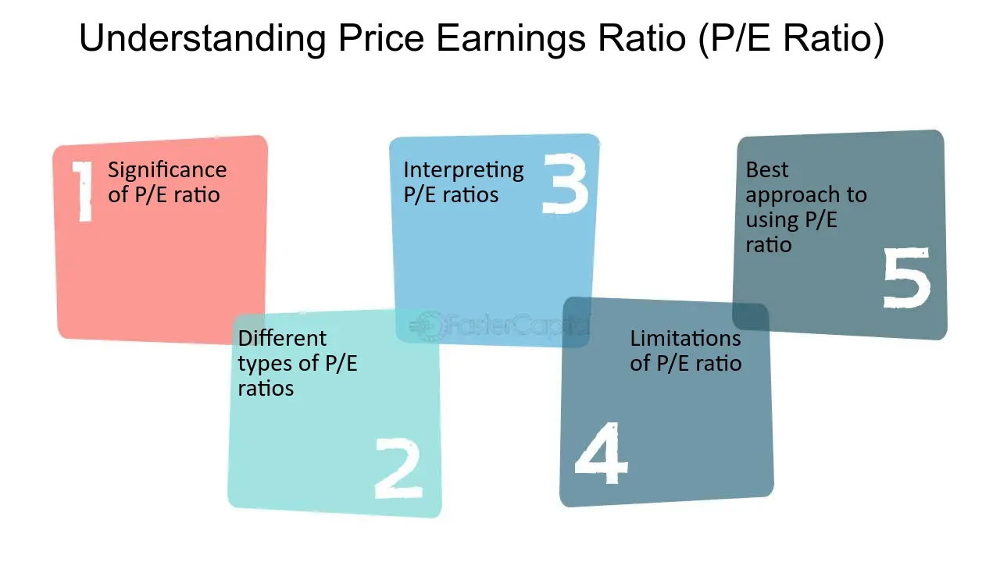

## Table of Contents

## What is the Price-to-Earnings (P/E) ratio?

The Price-to-Earnings (P/E) ratio is a way to figure out how much people are willing to pay for a company's earnings. It's calculated by taking the current stock price and dividing it by the company's earnings per share (EPS). The P/E ratio helps investors see if a stock is a good buy. A high P/E might mean people think the company will grow a lot in the future. A low P/E could mean the company is not expected to grow much or might be undervalued.

Sometimes, the P/E ratio can be tricky to use because it depends on the industry and the economy. For example, tech companies often have higher P/E ratios because they are expected to grow quickly. On the other hand, companies in more stable industries might have lower P/E ratios. It's also important to compare the P/E ratio of a company with others in the same industry to get a better idea of whether it's a good investment.

## How is the P/E ratio calculated?

The P/E ratio is calculated by dividing the current market price of a company's stock by its earnings per share (EPS). The market price is what people are willing to pay for one share of the stock right now. The EPS is the company's total earnings divided by the number of outstanding shares. So, if a stock is trading at $50 and the EPS is $5, the P/E ratio would be 10 ($50 divided by $5).

Sometimes, companies use different time periods to calculate EPS, like the last 12 months (called trailing P/E) or the next 12 months (called forward P/E). Trailing P/E uses past earnings, while forward P/E uses earnings that analysts predict. Both can give you different views on how the company is doing and what might happen in the future.

## Why is the P/E ratio used in investment analysis?

The P/E ratio is used in investment analysis because it helps investors understand how much they are paying for a company's earnings. It's like a quick way to see if a stock might be a good deal or if it's too expensive. When you look at the P/E ratio, you can compare it with other companies in the same industry or with the company's own history. This helps you decide if the stock is priced right for what it earns.

Investors also use the P/E ratio to guess about a company's future. A high P/E ratio might mean that people think the company will grow a lot and make more money in the future. On the other hand, a low P/E ratio could mean that the company is not expected to grow much or that it might be undervalued. By looking at the P/E ratio, investors can make better choices about where to put their money, based on what they think will happen next.

## What are the basic limitations of using the P/E ratio?

One big problem with the P/E ratio is that it can be hard to compare across different companies or industries. For example, tech companies often have higher P/E ratios because people expect them to grow a lot. But a company in a more stable industry might have a lower P/E ratio, even if it's doing well. So, if you just look at the P/E ratio without thinking about the industry, you might make the wrong choice about which stock to buy.

Another issue is that the P/E ratio depends on earnings, and earnings can be tricky. Sometimes, a company's earnings can change a lot from one year to the next because of things like one-time events or changes in accounting rules. Also, if a company has no earnings or negative earnings, the P/E ratio doesn't work at all. So, you need to look at more than just the P/E ratio to really understand if a stock is a good investment.

Lastly, the P/E ratio doesn't tell you everything about a company's future. It's based on past earnings or guesses about future earnings, but it doesn't show you things like how much debt the company has or how well it's run. So, while the P/E ratio can be a helpful tool, it's just one piece of the puzzle when you're trying to decide if a stock is worth buying.

## How can the P/E ratio be misleading for companies with no or negative earnings?

The P/E ratio can be very misleading for companies that have no earnings or negative earnings. When a company has no earnings, the P/E ratio can't be calculated because you would be dividing by zero. This means the P/E ratio is not useful at all for companies that aren't making any money yet, like some new startups or companies in tough times.

For companies with negative earnings, the P/E ratio also doesn't work well. If a company is losing money, the P/E ratio would be negative, which doesn't help investors understand if the stock is a good buy. Instead of using the P/E ratio, investors might look at other things like how much cash the company has or how fast it's growing to decide if it's a good investment.

## In what ways can the P/E ratio fail to account for growth prospects?

The P/E ratio can miss out on showing how much a company might grow in the future. It looks at what the company has earned in the past or what people think it will earn soon, but it doesn't tell you about new products or big plans that could make the company grow a lot. For example, a tech company might be working on something new that could make it much bigger in a few years, but the P/E ratio won't show that.

Also, the P/E ratio can make a fast-growing company look too expensive. If a company is growing quickly, its earnings might be low right now, but they could go up a lot in the future. So, even if the P/E ratio is high, it might still be a good investment if you think the company will keep growing. That's why it's important to look at other things like how fast the company is growing when you use the P/E ratio to decide if a stock is a good buy.

## How does the P/E ratio vary across different industries, and why does this matter?

The P/E ratio can be very different from one industry to another. For example, tech companies often have higher P/E ratios than companies in more stable industries like utilities or consumer goods. This is because people expect tech companies to grow a lot and make more money in the future. On the other hand, utility companies might have lower P/E ratios because they are not expected to grow as quickly, but they usually provide steady earnings.

This difference matters because it can help you understand what's normal for a certain industry. If you just look at the P/E ratio of a tech company and compare it to a utility company, you might think the tech company is too expensive. But if you know that tech companies usually have higher P/E ratios, you can see that it might still be a good investment. So, when you're trying to decide if a stock is a good buy, it's important to look at the P/E ratios of other companies in the same industry to get a better idea of what's a fair price.

## What role do accounting practices play in distorting the P/E ratio?

Accounting practices can make the P/E ratio look different than it really is. Companies can use different ways to count their earnings, and these ways can change how much money they say they made. For example, a company might use a special way to count its earnings that makes them look higher than they really are. This can make the P/E ratio lower, which might make the stock look like a better deal than it is.

Also, companies can have one-time events that affect their earnings. If a company sells a big piece of property and counts that money as earnings, it can make the P/E ratio look better for that year. But that money isn't from the company's normal business, so it can trick investors into thinking the company is doing better than it really is. That's why it's important to look at more than just the P/E ratio and understand how the company is counting its earnings.

## How can macroeconomic factors affect the reliability of the P/E ratio?

Macroeconomic factors can change how reliable the P/E ratio is. Things like interest rates, inflation, and the overall health of the economy can affect how much money companies make and how much investors are willing to pay for stocks. For example, if interest rates go up, borrowing money becomes more expensive for companies. This can make their earnings go down, which can make the P/E ratio look higher than it should be. Also, if the economy is doing badly, people might not want to spend as much money, which can hurt company earnings and make the P/E ratio less useful.

On the other hand, when the economy is doing well, companies might make more money, and investors might be willing to pay more for stocks. This can make the P/E ratio look lower and more attractive. But if the economy suddenly changes, the P/E ratio might not show that right away. So, it's important to think about what's happening in the economy when you look at the P/E ratio. It's just one piece of information, and you need to consider other things to get a full picture of whether a stock is a good investment.

## What are advanced statistical methods to adjust the P/E ratio for better analysis?

One way to make the P/E ratio more useful is by using a method called regression analysis. This method looks at how different things, like the company's growth rate or the overall economy, affect the P/E ratio. By understanding these effects, you can adjust the P/E ratio to get a better idea of whether a stock is a good buy. For example, if you know that a company's P/E ratio is high because it's growing quickly, you might decide it's still a good investment even if the P/E ratio looks expensive at first.

Another method is called the PEG ratio, which stands for Price/Earnings to Growth ratio. This method takes the P/E ratio and divides it by the company's expected growth rate. This helps you see if a stock is a good deal when you think about how fast the company is growing. A lower PEG ratio might mean the stock is undervalued, even if the P/E ratio is high. This can be really helpful for comparing companies that are growing at different speeds.

Lastly, you can use something called sector-adjusted P/E ratios. This means you compare a company's P/E ratio to the average P/E ratio of other companies in the same industry. This helps you see if a stock is priced right compared to its peers. For example, if a tech company has a P/E ratio that's lower than the average for tech companies, it might be a good buy. By using these advanced methods, you can get a clearer picture of whether a stock is a good investment, even when the basic P/E ratio might be misleading.

## How do alternative valuation metrics compare to the P/E ratio in terms of limitations and effectiveness?

Alternative valuation metrics like the Price-to-Book (P/B) ratio, Price-to-Sales (P/S) ratio, and the Discounted Cash Flow (DCF) model each have their own strengths and weaknesses compared to the P/E ratio. The P/B ratio looks at a company's market value compared to its book value, which can be useful for companies with lots of assets but might not work well for service companies that don't have many physical things to count. The P/S ratio is good for companies that aren't making profits yet because it looks at sales instead of earnings, but it doesn't tell you about the company's costs or how much money it's actually making. The DCF model tries to guess what a company is worth by looking at all the money it might make in the future, but it can be hard to use because it depends a lot on guesses about the future.

These alternative metrics can be more effective than the P/E ratio in certain situations. For example, the P/S ratio can be better for new companies that are growing fast but not making profits yet. The DCF model can give you a more complete picture of a company's value by looking at all its future cash flows, but it needs a lot of information and can be tricky to get right. On the other hand, these metrics also have their own limitations. The P/B ratio might not be useful for companies that don't have many physical assets, and the DCF model can be very sensitive to the guesses you make about the future. So, while these alternative metrics can help you understand a company's value in different ways, they each have their own problems and work best when used together with other tools.

## Can you discuss case studies where reliance on the P/E ratio led to significant investment errors?

One famous case where relying too much on the P/E ratio led to big investment mistakes was during the dot-com bubble in the late 1990s and early 2000s. Many tech companies had very high P/E ratios because people thought they would grow a lot in the future. Investors saw these high P/E ratios and thought the companies were worth a lot of money. But when the bubble burst, it turned out that many of these companies weren't making as much money as people thought. Their P/E ratios were too high because their earnings were too low or because they were losing money. This led to huge losses for investors who had bought these stocks based on their P/E ratios.

Another example is the case of Enron in the early 2000s. Enron had a P/E ratio that looked good because the company was reporting high earnings. But these earnings were not real; Enron was using tricky accounting practices to make its earnings look better than they were. Investors who relied on the P/E ratio thought Enron was a good investment, but when the truth came out, Enron's stock price crashed, and the company went bankrupt. This shows how the P/E ratio can be misleading if a company is not being honest about its earnings.

## What are the key financial metrics to understand for investment analysis?

Financial metrics are indispensable tools for investors aiming to evaluate company performance and make informed investment decisions. These metrics provide quantifiable data that can be instrumental in assessing the financial health and performance of a company. Among these, the Price-to-Earnings (P/E) ratio stands out as a critical indicator for evaluating stock valuations.

### The Price-to-Earnings (P/E) Ratio

The P/E ratio is calculated using the formula:

$$
\text{P/E Ratio} = \frac{\text{Market Price per Share}}{\text{Earnings per Share (EPS)}}
$$

This ratio offers insight into how much investors are willing to pay for each dollar of earnings, essentially reflecting market expectations of a company's future profitability. A high P/E ratio might suggest that the market expects significant growth from the company, whereas a low P/E ratio could indicate the opposite or that the stock is undervalued relative to its earnings.

### Other Financial Ratios

While the P/E ratio is a vital metric, relying solely on it can be misleading due to varying accounting practices and broader market conditions. Thus, incorporating other financial ratios can provide a more holistic view of a company's financial status. Here are a few essential metrics:

1. **Debt-to-Equity Ratio**: This measures a company's financial leverage by comparing its total liabilities to shareholders' equity. It is a critical indicator of the company's financial stability and risk.

   \[ \text{Debt-to-Equity Ratio} = \frac{\text{Total Liabilities}}{\text{Shareholders' Equity}}
$$

2. **Return on Equity (ROE)**: This is a measure of financial performance, calculated by dividing net income by shareholders' equity. It indicates how efficiently a company uses investments to generate earnings growth.

   \[ \text{ROE} = \frac{\text{Net Income}}{\text{Shareholders' Equity}}
$$

3. **Current Ratio**: This liquidity ratio assesses a company’s ability to pay short-term obligations with its current assets. It's a fundamental metric for evaluating a company's short-term financial health.

   \[ \text{Current Ratio} = \frac{\text{Current Assets}}{\text{Current Liabilities}}
$$

### Importance of Financial Metrics

These financial metrics play a significant role in identifying investment opportunities and potential risks. By analyzing these ratios, investors can gauge the sustainability of a company’s earnings and assess its management efficiency. For instance, a consistently high ROE might suggest sound managerial practices, while a rising debt-to-equity ratio could be a red flag for increasing financial risk.

Using various financial ratios allows investors to paint a comprehensive picture of a company’s financial health, guiding more prudent investment decisions. Ultimately, these metrics aid in distinguishing fundamentally strong companies from weaker ones, thus optimizing investment outcomes.

## What are the key considerations for the P/E Ratio?

The Price-to-Earnings (P/E) ratio is a widely used financial metric that measures the relationship between a company's current stock price and its earnings per share (EPS). It is calculated as follows:

$$
\text{P/E Ratio} = \frac{\text{Market Price per Share}}{\text{Earnings per Share (EPS)}}
$$

This ratio provides investors with a quick snapshot of how much they are paying for each dollar of the company's earnings, thus serving as a gauge of relative valuation. A high P/E ratio could indicate that a stock is overvalued or that investors expect high growth rates in the future, whereas a low P/E ratio might imply undervaluation or potential issues within the company.

To understand how the P/E ratio is applied in practice, consider companies like Apple Inc. and Tesla Inc., both of which have historically exhibited high P/E ratios during phases of rapid growth. In 2020, for instance, Tesla's P/E ratio soared as investors anticipated significant future earnings based on the company's strong market position and innovation prospects.

However, reliance solely on the P/E ratio can be misleading due to various factors. Accounting practices can heavily influence reported earnings, and consequently, the P/E ratio. Companies using different depreciation methods or recognizing revenues differently may present P/E ratios that are not directly comparable.

Moreover, market conditions significantly impact the interpretation of P/E ratios. During economic expansions, investors might tolerate higher P/E ratios due to anticipated growth, whereas in downturns, even low P/E ratios might not attract buyers due to elevated perceived risk.

Given these potential pitfalls, it is prudent to consider alternative and complementary metrics alongside the P/E ratio for a more comprehensive analysis. One such metric is the Price-to-Book (P/B) ratio, which compares a company's market value to its book value, offering insights into asset value. Another useful measure is the Price-to-Earnings Growth (PEG) ratio, which adjusts the P/E ratio by factoring in the company's earnings growth rate, providing a more nuanced assessment of valuation in the context of growth potential.

In sum, the P/E ratio remains a vital tool in financial analysis but should be interpreted cautiously and in conjunction with other metrics to ensure accurate investment decisions.

## How can we evaluate algorithmic trading strategies?

Algorithmic trading strategies are assessed using a set of core performance metrics that provide insights into their efficiency and potential profitability. These metrics include the Sharpe Ratio, Win Rate, and Maximum Drawdown, each serving as a critical component of strategy evaluation.

The Sharpe Ratio measures the risk-adjusted return of an investment strategy. It is calculated as the difference between the portfolio's returns and the risk-free rate, divided by the standard deviation of the portfolio's excess return. Mathematically, it is expressed as:

$$
\text{Sharpe Ratio} = \frac{R_p - R_f}{\sigma_p}
$$

where $R_p$ is the expected portfolio return, $R_f$ is the risk-free rate, and $\sigma_p$ is the standard deviation of the portfolio's excess return. A higher Sharpe Ratio indicates a more favorable risk-adjusted return, signifying a more efficient strategy.

Win Rate, another crucial metric, measures the percentage of profitable trades over a certain period. A higher Win Rate suggests a greater likelihood of executing successful trades, but it is essential to consider it alongside other metrics, such as the average gain per trade versus the average loss.

Maximum Drawdown quantifies the largest peak-to-trough decline in the value of a portfolio during a specified period, offering insights into potential risk exposure. It reflects how much an investment might lose before returning to peak value and is crucial for risk assessment.

When evaluating [algorithmic trading](/wiki/algorithmic-trading) strategies, it is essential to employ a systematic approach using financial metrics. The initial step involves [backtesting](/wiki/backtesting) the strategy on historical data to assess its past performance. Backtesting involves simulating the trading strategy over historical data to determine how it would have performed using different financial metrics. This is followed by tracking key metrics such as the Sharpe Ratio, Win Rate, and Maximum Drawdown. Statistical analysis helps in understanding the distribution of returns and the strategy's sensitivity to market conditions and varying parameters. Analysts often employ statistical tools to interpret metrics and identify patterns or anomalies in the data.

Statistical analysis plays a pivotal role in strategy optimization. Techniques such as regression analysis, Monte Carlo simulations, and hypothesis testing are employed to ascertain the robustness and reliability of the strategy under diverse market conditions. These techniques facilitate the identification of optimal parameter settings that maximize returns while minimizing risk, ensuring that the strategy remains resilient in volatile markets.

In summary, evaluating algorithmic trading strategies requires a comprehensive approach combining key performance metrics, rigorous backtesting, and advanced statistical analysis. By doing so, investors can optimize their strategies effectively, enhancing overall trading performance and risk management.

## References & Further Reading

[1]: Bergstra, J., Bardenet, R., Bengio, Y., & Kégl, B. (2011). ["Algorithms for Hyper-Parameter Optimization."](https://papers.nips.cc/paper/4443-algorithms-for-hyper-parameter-optimization) Advances in Neural Information Processing Systems 24.

[2]: ["Advances in Financial Machine Learning"](https://www.amazon.com/Advances-Financial-Machine-Learning-Marcos/dp/1119482089) by Marcos Lopez de Prado

[3]: ["Evidence-Based Technical Analysis: Applying the Scientific Method and Statistical Inference to Trading Signals"](https://books.google.com/books/about/Evidence_Based_Technical_Analysis.html?id=MeoJAQAAMAAJ) by David Aronson

[4]: ["Machine Learning for Algorithmic Trading"](https://github.com/stefan-jansen/machine-learning-for-trading) by Stefan Jansen

[5]: ["Quantitative Trading: How to Build Your Own Algorithmic Trading Business"](https://www.amazon.com/Quantitative-Trading-Build-Algorithmic-Business/dp/1119800064) by Ernest P. Chan