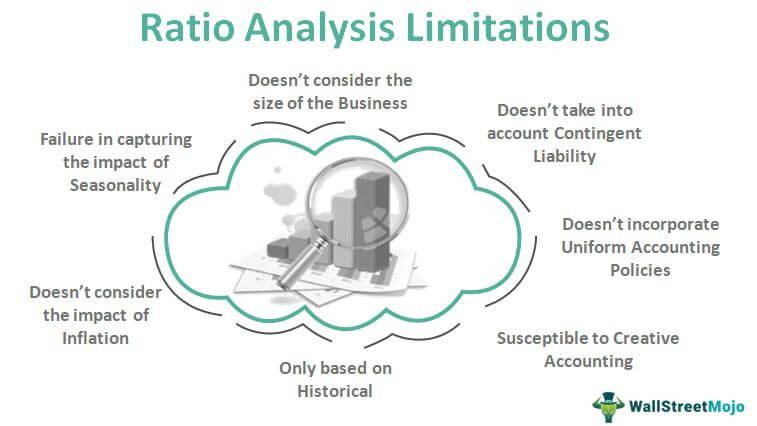

This article explores the critical intersection of financial metrics and algorithmic trading strategies, particularly focusing on the influential role of financial ratios, such as the Price-to-Earnings (P/E) ratio, in investment analysis. Financial metrics serve as foundational tools for investors and traders, providing essential insights into a company's valuation, performance, and operational health. The P/E ratio, calculated by dividing a company's stock price by its earnings per share, becomes an essential indicator in this context, enabling investors to gauge whether a stock is overvalued or undervalued compared to its earnings potential.

Algorithmic trading, which involves using computer algorithms to automate trading decisions, has transformed the landscape of financial markets. These algorithms often rely heavily on quantitative data, including financial metrics, to make swift and informed trading decisions. Metrics like the P/E ratio can significantly influence algorithmic trading decisions, affecting how these algorithms evaluate potential investment opportunities and manage risks.



This article aims to equip readers with a comprehensive understanding of how financial metrics and algorithmic trading strategies can be effectively combined for optimized investment outcomes. By understanding these elements, investors can enhance their analytical frameworks, leading to more informed and strategic decision-making processes. Through exploring these intersections, readers will discover how financial metrics not only anchor traditional investment analysis but also enrich the refinement of modern trading algorithms for better accuracy and efficiency in market operations.

## Table of Contents

## Understanding Financial Metrics for Investment Analysis

Financial metrics are indispensable tools for investors aiming to evaluate company performance and make informed investment decisions. These metrics provide quantifiable data that can be instrumental in assessing the financial health and performance of a company. Among these, the Price-to-Earnings (P/E) ratio stands out as a critical indicator for evaluating stock valuations.

### The Price-to-Earnings (P/E) Ratio

The P/E ratio is calculated using the formula:

$$
\text{P/E Ratio} = \frac{\text{Market Price per Share}}{\text{Earnings per Share (EPS)}}
$$

This ratio offers insight into how much investors are willing to pay for each dollar of earnings, essentially reflecting market expectations of a company's future profitability. A high P/E ratio might suggest that the market expects significant growth from the company, whereas a low P/E ratio could indicate the opposite or that the stock is undervalued relative to its earnings.

### Other Financial Ratios

While the P/E ratio is a vital metric, relying solely on it can be misleading due to varying accounting practices and broader market conditions. Thus, incorporating other financial ratios can provide a more holistic view of a company's financial status. Here are a few essential metrics:

1. **Debt-to-Equity Ratio**: This measures a company's financial leverage by comparing its total liabilities to shareholders' equity. It is a critical indicator of the company's financial stability and risk.

   \[ \text{Debt-to-Equity Ratio} = \frac{\text{Total Liabilities}}{\text{Shareholders' Equity}}
$$

2. **Return on Equity (ROE)**: This is a measure of financial performance, calculated by dividing net income by shareholders' equity. It indicates how efficiently a company uses investments to generate earnings growth.

   \[ \text{ROE} = \frac{\text{Net Income}}{\text{Shareholders' Equity}}
$$

3. **Current Ratio**: This liquidity ratio assesses a company’s ability to pay short-term obligations with its current assets. It's a fundamental metric for evaluating a company's short-term financial health.

   \[ \text{Current Ratio} = \frac{\text{Current Assets}}{\text{Current Liabilities}}
$$

### Importance of Financial Metrics

These financial metrics play a significant role in identifying investment opportunities and potential risks. By analyzing these ratios, investors can gauge the sustainability of a company’s earnings and assess its management efficiency. For instance, a consistently high ROE might suggest sound managerial practices, while a rising debt-to-equity ratio could be a red flag for increasing financial risk.

Using various financial ratios allows investors to paint a comprehensive picture of a company’s financial health, guiding more prudent investment decisions. Ultimately, these metrics aid in distinguishing fundamentally strong companies from weaker ones, thus optimizing investment outcomes.

## The P/E Ratio: Key Considerations

The Price-to-Earnings (P/E) ratio is a widely used financial metric that measures the relationship between a company's current stock price and its earnings per share (EPS). It is calculated as follows:

$$
\text{P/E Ratio} = \frac{\text{Market Price per Share}}{\text{Earnings per Share (EPS)}}
$$

This ratio provides investors with a quick snapshot of how much they are paying for each dollar of the company's earnings, thus serving as a gauge of relative valuation. A high P/E ratio could indicate that a stock is overvalued or that investors expect high growth rates in the future, whereas a low P/E ratio might imply undervaluation or potential issues within the company.

To understand how the P/E ratio is applied in practice, consider companies like Apple Inc. and Tesla Inc., both of which have historically exhibited high P/E ratios during phases of rapid growth. In 2020, for instance, Tesla's P/E ratio soared as investors anticipated significant future earnings based on the company's strong market position and innovation prospects.

However, reliance solely on the P/E ratio can be misleading due to various factors. Accounting practices can heavily influence reported earnings, and consequently, the P/E ratio. Companies using different depreciation methods or recognizing revenues differently may present P/E ratios that are not directly comparable.

Moreover, market conditions significantly impact the interpretation of P/E ratios. During economic expansions, investors might tolerate higher P/E ratios due to anticipated growth, whereas in downturns, even low P/E ratios might not attract buyers due to elevated perceived risk.

Given these potential pitfalls, it is prudent to consider alternative and complementary metrics alongside the P/E ratio for a more comprehensive analysis. One such metric is the Price-to-Book (P/B) ratio, which compares a company's market value to its book value, offering insights into asset value. Another useful measure is the Price-to-Earnings Growth (PEG) ratio, which adjusts the P/E ratio by factoring in the company's earnings growth rate, providing a more nuanced assessment of valuation in the context of growth potential.

In sum, the P/E ratio remains a vital tool in financial analysis but should be interpreted cautiously and in conjunction with other metrics to ensure accurate investment decisions.

## Algorithmic Trading and Financial Metrics

Algorithmic trading strategies have revolutionized the financial markets by leveraging quantitative data to make informed trading decisions at speeds and efficiencies human traders cannot match. At the core of these strategies are financial metrics, numerical indicators that evaluate a company’s performance and determine its stock value. Financial metrics like the Price-to-Earnings (P/E) ratio are crucial elements that can be systematically integrated into trading algorithms to automate and enhance trading decisions.

Algorithmic trading relies extensively on quantitative data, which requires high precision and accuracy. Such data includes stock prices, trading volumes, historical performance indicators, and financial ratios. These metrics serve as critical inputs for algorithms that deploy trading strategies by identifying patterns, trends, and anomalies in real-time market data. Math functions and statistical analysis, implemented through programming languages such as Python, enable these algorithms to process vast amounts of data.

Financial metrics are embedded within these algorithms to trigger buy or sell decisions based on predefined criteria. For instance, a common algorithm might be structured to purchase shares of companies with a P/E ratio below a certain threshold, indicating undervaluation relative to earnings. Here is an example of a basic Python script snippet that assesses stocks based on the P/E ratio:

```python
# Sample Python code to filter stocks based on P/E ratio
import pandas as pd

# Sample stock data
stocks_data = {
    'Ticker': ['A', 'B', 'C'],
    'Price': [150, 200, 100],
    'Earnings': [5, 10, 8],
}

# Convert data to DataFrame
df = pd.DataFrame(stocks_data)

# Calculate P/E Ratio
df['P_E_Ratio'] = df['Price'] / df['Earnings']

# Set threshold for investment
pe_threshold = 20

# Filter stocks with P/E Ratio less than threshold
undervalued_stocks = df[df['P_E_Ratio'] < pe_threshold]

print(undervalued_stocks)
```

In addition to the P/E ratio, other financial metrics such as the Price-to-Book (P/B) ratio, Return on Equity (ROE), and debt-to-equity ratio are frequently incorporated to provide a more holistic analysis. These metrics enhance [algorithmic trading](/wiki/algorithmic-trading) by corroborating data points and mitigating risks associated with reliance on a single indicator. An algorithm may weigh multiple metrics to derive an optimized decision matrix, factoring in both potential rewards and risks.

The integration of financial metrics into trading algorithms significantly refines them, leading to more accurate and reliable decision-making processes. For instance, the algorithms can adjust for market [volatility](/wiki/volatility-trading-strategies) by altering trading parameters dynamically as per the fluctuation in financial metrics. This adaptability is critical in maintaining performance, especially in unpredictable market conditions.

In conclusion, financial metrics form a backbone for algorithmic trading strategies, providing a systematic framework for automating trading decisions. The precision and efficiency achieved through the integration of these metrics empower traders and investors, maximizing potential returns and managing risks effectively.

## Evaluating Algorithmic Trading Strategies

Algorithmic trading strategies are assessed using a set of core performance metrics that provide insights into their efficiency and potential profitability. These metrics include the Sharpe Ratio, Win Rate, and Maximum Drawdown, each serving as a critical component of strategy evaluation.

The Sharpe Ratio measures the risk-adjusted return of an investment strategy. It is calculated as the difference between the portfolio's returns and the risk-free rate, divided by the standard deviation of the portfolio's excess return. Mathematically, it is expressed as:

$$
\text{Sharpe Ratio} = \frac{R_p - R_f}{\sigma_p}
$$

where $R_p$ is the expected portfolio return, $R_f$ is the risk-free rate, and $\sigma_p$ is the standard deviation of the portfolio's excess return. A higher Sharpe Ratio indicates a more favorable risk-adjusted return, signifying a more efficient strategy.

Win Rate, another crucial metric, measures the percentage of profitable trades over a certain period. A higher Win Rate suggests a greater likelihood of executing successful trades, but it is essential to consider it alongside other metrics, such as the average gain per trade versus the average loss.

Maximum Drawdown quantifies the largest peak-to-trough decline in the value of a portfolio during a specified period, offering insights into potential risk exposure. It reflects how much an investment might lose before returning to peak value and is crucial for risk assessment.

When evaluating algorithmic trading strategies, it is essential to employ a systematic approach using financial metrics. The initial step involves [backtesting](/wiki/backtesting) the strategy on historical data to assess its past performance. Backtesting involves simulating the trading strategy over historical data to determine how it would have performed using different financial metrics. This is followed by tracking key metrics such as the Sharpe Ratio, Win Rate, and Maximum Drawdown. Statistical analysis helps in understanding the distribution of returns and the strategy's sensitivity to market conditions and varying parameters. Analysts often employ statistical tools to interpret metrics and identify patterns or anomalies in the data.

Statistical analysis plays a pivotal role in strategy optimization. Techniques such as regression analysis, Monte Carlo simulations, and hypothesis testing are employed to ascertain the robustness and reliability of the strategy under diverse market conditions. These techniques facilitate the identification of optimal parameter settings that maximize returns while minimizing risk, ensuring that the strategy remains resilient in volatile markets.

In summary, evaluating algorithmic trading strategies requires a comprehensive approach combining key performance metrics, rigorous backtesting, and advanced statistical analysis. By doing so, investors can optimize their strategies effectively, enhancing overall trading performance and risk management.

## Challenges and Considerations

Addressing the limitations and challenges of utilizing the Price-to-Earnings (P/E) ratio and other financial metrics in algorithmic trading is crucial to developing sound trading strategies. One of the primary limitations of relying on the P/E ratio is its susceptibility to accounting practices and temporal market conditions. The P/E ratio, calculated as the market price per share divided by earnings per share (EPS), can be influenced by one-off events, non-recurring revenues, or changes in accounting standards. This can lead to misinterpretations of a company's true valuation, and subsequently, suboptimal trading decisions when these metrics are integrated into algorithmic models.

Apart from the inherent limitations of financial metrics, algorithm automation presents its own set of risks. Algorithms are powerful tools capable of executing trades at high speed and volumes without human intervention. However, they can also lead to significant financial losses if not carefully managed. Automated trading systems might amplify errors due to bugs in the algorithm code or misinterpretations of market signals. Furthermore, these systems are vulnerable to changes in market conditions that they were not trained on, leading to potential losses.

To mitigate these risks, several strategies can be implemented. Backtesting using historical data is a fundamental method for ensuring that an algorithm performs well over a range of market conditions before being deployed live. Python, a popular language for developing trading algorithms, offers libraries such as `[backtrader](/wiki/backtrader)` and `pandas` that facilitate this testing process. For example:

```python
import backtrader as bt

class TestStrategy(bt.Strategy):
    def __init__(self):
        self.dataclose = self.datas[0].close

    def next(self):
        if self.dataclose[0] < self.dataclose[-1]:
            if self.dataclose[-1] < self.dataclose[-2]:
                self.buy(size=10)
        elif self.dataclose[0] > self.dataclose[-1]:
            if self.dataclose[-1] > self.dataclose[-2]:
                self.sell(size=10)

cerebro = bt.Cerebro()
cerebro.addstrategy(TestStrategy)
# Add market data...
# Run backtest...
```

Moreover, employing complementary metrics alongside the P/E ratio, such as the Price-to-Book (P/B) ratio or the Debt-to-Equity (D/E) ratio, can provide a more comprehensive view of company valuations and financial health. These additional metrics can be integrated into algorithms to enhance decision-making rigor and accuracy.

Another crucial recommendation is to constantly update and stress-test algorithms to ensure their functionality in current market environments. This is known as walk-forward analysis, where an algorithm is continuously tested on new data as it becomes available.

A robust trading strategy should also incorporate risk management principles such as setting stop-loss limits and position-sizing rules based on maximum allowable losses. It's advisable to incorporate [machine learning](/wiki/machine-learning) methods that adapt algorithms over time with new data patterns, thus avoiding overfitting to historical market conditions.

Ultimately, while financial metrics and algorithmic trading offer significant advantages, understanding their limitations and implementing safeguards is critical for maintaining durable investment strategies in a dynamic market landscape.

## Conclusion

The integration of financial metrics with algorithmic trading strategies marks a significant advancement in investment analysis. By systematically combining these elements, investors can achieve a more nuanced understanding of market dynamics and optimize their trading approaches. Financial metrics, such as the Price-to-Earnings (P/E) ratio, offer essential insights into company valuations and market trends. However, their true potential is realized when they are used not in isolation, but as part of a comprehensive analytical framework. Such integration allows for the refinement of algorithmic models, enhancing decision-making processes and ultimately, the efficiency of trading strategies.

Investors are encouraged to employ these metrics, particularly the P/E ratio, judiciously within broader analytical contexts. This cautious application is crucial to account for potential distortions arising from varying accounting practices or fluctuating market conditions. To further enhance investment outcomes, combining the P/E ratio with other financial ratios and performance indicators provides a more rounded view of potential investment opportunities and risks.

As for the future outlook, algorithmic trading is poised for further evolution, driven by ongoing advancements in data analytics and machine learning technologies. This progression promises more sophisticated models that can better predict market movements, integrating vast amounts of financial data with precision. Investors and algorithm developers must stay abreast of these advancements, ensuring their strategies remain adaptable and robust against the backdrop of dynamic market conditions. The continued evolution of financial metrics will likely expand the toolkit available for algorithmic trading, facilitating even greater synergy between quantitative analysis and real-world financial environments.

## References & Further Reading

[1]: Bergstra, J., Bardenet, R., Bengio, Y., & Kégl, B. (2011). ["Algorithms for Hyper-Parameter Optimization."](https://papers.nips.cc/paper/4443-algorithms-for-hyper-parameter-optimization) Advances in Neural Information Processing Systems 24.

[2]: ["Advances in Financial Machine Learning"](https://www.amazon.com/Advances-Financial-Machine-Learning-Marcos/dp/1119482089) by Marcos Lopez de Prado

[3]: ["Evidence-Based Technical Analysis: Applying the Scientific Method and Statistical Inference to Trading Signals"](https://books.google.com/books/about/Evidence_Based_Technical_Analysis.html?id=MeoJAQAAMAAJ) by David Aronson

[4]: ["Machine Learning for Algorithmic Trading"](https://github.com/stefan-jansen/machine-learning-for-trading) by Stefan Jansen

[5]: ["Quantitative Trading: How to Build Your Own Algorithmic Trading Business"](https://www.amazon.com/Quantitative-Trading-Build-Algorithmic-Business/dp/1119800064) by Ernest P. Chan