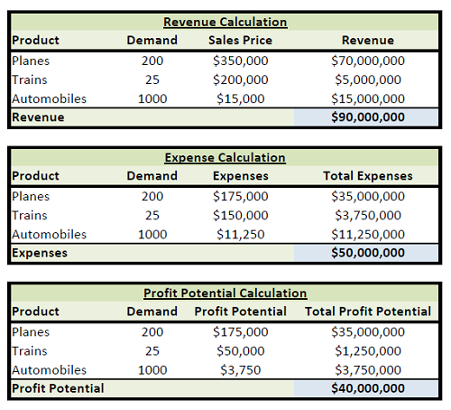

## Table of Contents

## What is revenue projection and why is it important for businesses?

Revenue projection is a guess about how much money a business will make in the future. It's like trying to predict the weather, but instead of rain or sunshine, you're predicting dollars and cents. Businesses look at things like past sales, what's happening in the market, and what they think will happen next to make these guesses.

It's really important for businesses to have good revenue projections because it helps them plan. If a business knows how much money it might make, it can decide how much to spend on things like new equipment or hiring more people. It also helps them see if they need to change their plans to make more money or save money. Without these projections, a business might spend too much or not enough, which can cause big problems.

## How can a beginner start analyzing revenue projections?

To start analyzing revenue projections, a beginner should first look at the company's past sales data. This means checking how much money the company made in the last few years or months. By understanding the past, you can see patterns or trends that might help predict the future. For example, if sales go up every summer, you might guess they will go up again next summer. It's also good to talk to people who know the business well, like managers or salespeople, to get their thoughts on what might happen next.

Next, a beginner should consider what's happening in the market and the economy. This includes looking at things like new competitors, changes in what customers want, or big events like a new law that could affect the business. These factors can change how much money a company might make. It's helpful to read news and reports about the industry to stay informed. Once you have all this information, you can start making your own guesses about future sales. Remember, it's okay if your first projections aren't perfect; the important thing is to keep learning and improving your guesses over time.

## What are the basic methods used to forecast revenue?

One basic method to forecast revenue is by using historical data. This means looking at how much money the business made in the past and using that to guess what might happen in the future. If sales went up by 10% last year, you might think they will go up by a similar amount this year. This method works well when the business and the market stay pretty much the same, but it can be tricky if things change a lot.

Another method is called the bottom-up approach. With this, you start by looking at small parts of the business, like how many products you expect to sell and at what price. You add up all these small parts to get a total revenue forecast. This method is good because it can be very detailed, but it takes more time and you need to know a lot about the business.

A third way to forecast revenue is by using market analysis. This means looking at what's happening in the world around the business, like new competitors or changes in what customers want. You might also look at trends in the economy or industry reports. This method helps you think about how outside things can affect your business, but it can be hard to predict these things accurately.

## What factors should be considered when projecting revenue?

When projecting revenue, it's important to look at the company's past sales. This means checking how much money was made in previous years or months. By understanding these patterns, you can guess what might happen next. For example, if sales always go up in the summer, you might think they will do the same next summer. It's also good to talk to people in the company, like managers or salespeople, who can give you ideas about what might happen. They know the business well and can help you make better guesses.

Another thing to think about is what's happening in the market and the economy. This includes looking at new competitors, changes in what customers want, or big events like new laws that could affect the business. These things can change how much money a company might make. Reading news and reports about the industry can help you stay informed. It's also a good idea to think about the overall economy. If people are spending less money because of a recession, your sales might go down too. By considering all these factors, you can make a more accurate guess about future revenue.

## How do market trends influence revenue projections?

Market trends are like the direction the wind is blowing for a business. They show what's happening in the world around the company, like if people are starting to like a new type of product or if a new competitor is taking away customers. These trends can really change how much money a business might make. For example, if there's a trend where more people are buying things online, a store that only sells things in person might see their sales go down. On the other hand, if a company can follow the trend and start selling online too, their sales might go up.

Understanding these trends is really important for making good guesses about future revenue. If a company sees that people are starting to care more about the environment, they might decide to sell more eco-friendly products. This could help them make more money because they're following what customers want. But if they don't pay attention to these trends, they might keep selling things that people don't want anymore, and their sales could go down. By keeping an eye on what's happening in the market, a business can make better plans and more accurate revenue projections.

## What are common pitfalls in revenue forecasting and how can they be avoided?

One common pitfall in revenue forecasting is relying too much on past data without considering changes in the market or economy. Just because sales went up last year doesn't mean they will go up again this year if there are new competitors or if customers start wanting different things. To avoid this, it's important to always look at what's happening around the business. Reading news, talking to people in the industry, and keeping up with trends can help you make better guesses about the future.

Another pitfall is being too optimistic or too pessimistic about future sales. Sometimes, people might think their business will do much better than it actually will, or they might worry too much and think it will do worse. Both can lead to bad decisions, like spending too much money or not spending enough. To avoid this, it's helpful to use different methods to forecast revenue, like looking at small parts of the business and also looking at the big picture. Getting opinions from different people in the company can also help balance out too much optimism or pessimism.

Lastly, not updating forecasts regularly can cause problems. The world changes fast, and what was true a few months ago might not be true now. If a business doesn't update its forecasts, it might miss out on new opportunities or keep making plans based on old information. To avoid this, it's good to check and update revenue forecasts often, maybe every month or quarter, to make sure they still make sense with what's happening now.

## How can historical data be used to improve revenue projections?

Historical data is like a treasure map that shows the past path of a business's sales. By looking at how much money was made in the past, you can see patterns and trends that help guess what might happen in the future. For example, if sales always go up in the summer, you can use that information to predict that they will go up again next summer. This helps make more accurate revenue projections because it's based on what actually happened before.

But it's not just about copying the past. Historical data can also show where things went wrong or right, so you can learn from those mistakes or successes. If sales dropped one year because of a new competitor, you can plan better for the future by watching out for new competitors. By using historical data smartly, a business can make better guesses about future sales and make plans that help them make more money.

## What advanced statistical models can be applied to revenue forecasting?

One advanced statistical model that can be used for revenue forecasting is time series analysis. This model looks at how sales have changed over time and uses that information to predict future sales. It can spot patterns like seasonal changes, where sales might go up in the summer and down in the winter. Time series analysis also looks at trends, like if sales have been going up or down over the years. By understanding these patterns and trends, a business can make better guesses about how much money it will make in the future.

Another useful model is regression analysis. This model looks at how different things, like the price of products or how much is spent on advertising, affect sales. It can help a business see which things make a big difference in how much money they make. For example, if spending more on ads usually leads to more sales, regression analysis can show that. By using regression analysis, a business can make smarter decisions about where to spend their money to increase future revenue.

## How does profit potential relate to revenue projections?

Profit potential is about how much money a business can make after paying for all its costs. It's closely tied to revenue projections because if a business can guess how much money it will make, it can also guess how much profit it might have. For example, if a company thinks it will make $100,000 in sales next month and it knows its costs will be $70,000, it can guess that its profit will be $30,000. So, good revenue projections help a business see its profit potential more clearly.

Understanding profit potential is really important for making good business decisions. If a business sees that its profit potential is high, it might decide to spend more money on things like new products or advertising to make even more profit. On the other hand, if the profit potential looks low, the business might look for ways to cut costs or change its plans. By using revenue projections to understand profit potential, a business can plan better and make choices that help it grow and make more money.

## What role does cost analysis play in determining profit potential?

Cost analysis is like looking at all the money a business spends to see how it affects the profit. When a business knows how much it costs to make and sell its products, it can figure out how much money it will have left after paying for everything. This is important because if the costs are too high, the business might not make any profit even if it makes a lot of sales. By understanding the costs, a business can find ways to spend less money, like buying materials cheaper or using less energy, which can help increase the profit potential.

Using cost analysis also helps a business make smart decisions about pricing and what to sell. If the cost of making a product is very high, the business might need to charge more for it to make a profit. Or, if a product costs a lot to make but doesn't sell well, the business might decide to stop selling it. By keeping a close eye on costs and comparing them to the revenue projections, a business can see which products or services are most likely to make a profit and focus on those to grow its profit potential.

## How can scenario analysis enhance the accuracy of profit potential estimates?

Scenario analysis is like playing "what if" with a business's future. It helps a business think about different things that might happen and how those things could change how much money they make. For example, a business might look at what would happen if a new competitor came into the market, or if there was a big change in what customers want. By thinking about these different scenarios, a business can see how each one might affect their sales and costs, and then guess how much profit they might make in each case. This helps them plan better and be ready for whatever might happen.

Using scenario analysis makes profit potential estimates more accurate because it looks at more than just one guess about the future. Instead of just hoping everything goes as planned, a business can see how different situations might change their profit. If they see that one scenario could lead to a big drop in profit, they can start thinking of ways to avoid that situation or fix it if it happens. By looking at many different possibilities, a business can make smarter decisions and have a better idea of how much money they might make in the future.

## What are the latest trends in revenue and profit forecasting technologies?

The latest trends in revenue and profit forecasting technologies are all about using computers and data to make better guesses about the future. One big trend is using [artificial intelligence](/wiki/ai-artificial-intelligence) (AI) and [machine learning](/wiki/machine-learning). These are smart computer programs that can look at a lot of data really fast and find patterns that people might miss. For example, an AI program can look at what customers are buying, what's happening in the market, and even what the weather is like to predict how much money a business might make. This helps businesses make more accurate forecasts because the computer can keep learning and getting better at guessing what will happen next.

Another trend is using cloud computing for forecasting. This means that instead of keeping all the data and doing all the calculations on their own computers, businesses can use big computers on the internet. This is helpful because it means they can use more powerful tools without having to buy a lot of expensive equipment. It also makes it easier for different parts of the business to work together on forecasts, no matter where they are. By using the cloud, businesses can update their forecasts more often and make sure everyone has the latest information, which can help them make better decisions about how to make more money.

## What is the Importance of Financial Projections?

Financial projections play a crucial role in evaluating an organization's future economic condition. They are essential tools that offer insights into a company's potential growth, profitability, and cash flow dynamics. These projections are indispensable for strategic business and investment decisions, serving as a foundation for various forms of financial analysis.

Accurate financial projections enable businesses to set realistic objectives and allocate resources effectively. By forecasting future income streams, expenses, and capital requirements, organizations can identify potential shortfalls and opportunities. These projections typically include income statements, balance sheets, and cash flow statements, providing a comprehensive overview of financial expectations.

Moreover, financial projections help in predicting cash flow, which is vital for maintaining operational [liquidity](/wiki/liquidity-risk-premium). Cash flow projections assess whether a company will have sufficient cash to meet its obligations, invest in growth opportunities, and mitigate risks. They involve forecasting cash inflows and outflows over specified periods, helping to ensure that a business remains solvent and can adapt to changing market conditions.

Businesses also use financial projections to determine their break-even point and evaluate the impact of different strategies on profitability. The break-even analysis helps in determining the sales [volume](/wiki/volume-trading-strategy) required to cover fixed and variable costs, illustrating the threshold for profit generation. For instance, the break-even point can be calculated using the formula:

$$
\text{Break-even Point (Units)} = \frac{\text{Fixed Costs}}{\text{Selling Price per Unit} - \text{Variable Cost per Unit}}
$$

This calculation aids in decision-making about pricing strategies, cost management, and sales targets.

Financial projections contribute to informed decision-making, guiding investment decisions, capital structure, and strategic planning. They play a pivotal role in stakeholder communications, as they provide a transparent outlook on an organization’s projected financial performance. Potential investors, creditors, and management teams rely on these projections to assess financial viability and growth prospects.

In conclusion, thorough and precise financial projections are not only instrumental for internal decision-making but also communicate confidence and strategic foresight to external stakeholders, reinforcing an organization's credibility and positioning in the market.

## What is Understanding Growth Analysis?

Growth analysis plays a pivotal role in assessing a company's potential for growth and profitability. It encompasses a comprehensive evaluation of various factors that influence a company's ability to expand and sustain its competitive edge. This involves assessing market trends, which are crucial in understanding the broader industry dynamics and identifying opportunities for growth. Analyzing competitive positioning helps a company strategize to outperform rivals by evaluating its strengths and weaknesses relative to others in the industry. Internal capabilities, such as a firm’s resource base, operational processes, and innovation capacity, are equally important as they determine the company's ability to internalize new opportunities and adapt to market changes.

Key metrics in growth analysis are essential for a comprehensive evaluation. The growth rate, often expressed as a percentage, measures how rapidly a company's revenues or profits are increasing over time. It provides insights into whether the business is expanding and if its strategies are effective. The formula to calculate the growth rate for a period can be expressed as:

$$
\text{Growth Rate} = \left(\frac{\text{Current Period Value} - \text{Previous Period Value}}{\text{Previous Period Value}}\right) \times 100
$$

Market share changes are another vital metric, illustrating the company’s sales performance relative to the total industry sales over a specific period. An increase in market share indicates that a company is gaining a competitive advantage, often by attracting new customers or improving product offerings.

Operational efficiencies are measured through ratios that assess how well a company utilizes its resources to generate profits. Metrics such as the return on assets (ROA), return on equity (ROE), and operational cost ratios offer insights into organizational efficiency and cost management. Improving operational efficiencies often leads to higher margins and competitive pricing, which can fuel further growth.

By leveraging these metrics, companies can create detailed growth analysis reports that aid in strategic planning and investment decision-making. A robust analysis not only highlights areas of strength but also identifies potential risks, providing a balanced view of the company's prospects.

## References & Further Reading

Bergstra, J., Bardenet, R., Bengio, Y., & Kégl, B., 2011. 'Algorithms for Hyper-Parameter Optimization.' This foundational paper explores methods for optimizing hyper-parameters in complex models, relevant for improving the accuracy and efficiency of machine learning algorithms used in financial forecasting and [algorithmic trading](/wiki/algorithmic-trading).

Lopez de Prado, M., 'Advances in Financial Machine Learning.' This book offers comprehensive insights into the application of machine learning in finance, focusing on techniques that enhance trading strategies and financial forecasts. It serves as an essential resource for understanding the intersection of data science and finance.

Aronson, D., 'Evidence-Based Technical Analysis: Applying the Scientific Method and Statistical Inference to Trading Signals.' Aronson advocates for a scientific approach to technical analysis, emphasizing the need for rigorous testing and validation of trading signals. This methodology is critical for creating reliable financial forecasts and reducing biases in algorithmic trading.

Jansen, S., 'Machine Learning for Algorithmic Trading.' This resource provides a practical overview of implementing machine learning techniques in the development of algorithmic trading strategies. It covers a wide range of topics, from data acquisition to model deployment, offering valuable insights for leveraging technology in trading.

Chan, E. P., 'Quantitative Trading: How to Build Your Own Algorithmic Trading Business.' Chan's work serves as a guide for developing a successful algorithmic trading business, outlining key strategies and considerations. It highlights the importance of quantitative methods in crafting effective trading systems and achieving financial growth.

