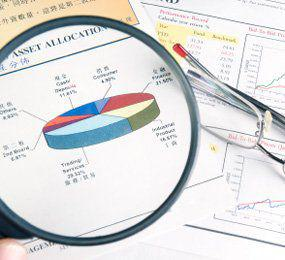

In today's rapidly evolving financial markets, effective forecasting and strategic planning have become indispensable for achieving success. The interconnectedness of financial forecasts, profit potential, and revenue projections plays a critical role in the context of algorithmic trading, where technology integration greatly influences the financial analysis landscape. As investors and financial analysts strive to make informed decisions, understanding the dynamics of financial growth analysis and revenue forecasting becomes paramount.

Algorithmic trading, a significant technological advancement in financial analysis, utilizes complex algorithms to automate trading decisions. This approach has transformed traditional trading methodologies by increasing efficiency and reducing costs. The ability to process vast amounts of data swiftly and accurately helps traders anticipate market trends and price movements, leading to strategic trading decisions based on predictive analytics.



Financial forecasting serves as a bedrock for strategic planning. It provides essential insights into potential growth, profitability, and cash flow. Accurate forecasts allow traders and investors to set realistic business objectives and allocate resources effectively. Key metrics such as growth rates and market share changes are instrumental in developing robust financial analyses, which in turn inform long-term investment strategies.

Growth analysis and revenue forecasting are two fundamental components of this forecasting process. Growth analysis evaluates a company's potential for expansion by examining market trends, competitive positioning, and operational efficiency. Concurrently, revenue forecasting predicts future sales and earnings, considering historical data and current market conditions. Accurate revenue forecasts support effective budgeting and planning efforts, critical for maintaining a competitive edge in financial markets.

The role of technology in enhancing forecasting accuracy cannot be overstated. Machine learning algorithms, for instance, refine trading models by identifying patterns and predicting future market behaviors more accurately. These advancements not only optimize trading strategies but also minimize risks associated with volatile market conditions.

In this article, we will explore how financial forecasts, profit potential, and revenue projections are integrated into algorithmic trading to support economic growth and achieve financial objectives. Understanding these key concepts is essential for developing informed investment strategies in today's technologically advanced trading environment.

## Table of Contents

## The Importance of Financial Projections

Financial projections play a crucial role in evaluating an organization's future economic condition. They are essential tools that offer insights into a company's potential growth, profitability, and cash flow dynamics. These projections are indispensable for strategic business and investment decisions, serving as a foundation for various forms of financial analysis.

Accurate financial projections enable businesses to set realistic objectives and allocate resources effectively. By forecasting future income streams, expenses, and capital requirements, organizations can identify potential shortfalls and opportunities. These projections typically include income statements, balance sheets, and cash flow statements, providing a comprehensive overview of financial expectations.

Moreover, financial projections help in predicting cash flow, which is vital for maintaining operational [liquidity](/wiki/liquidity-risk-premium). Cash flow projections assess whether a company will have sufficient cash to meet its obligations, invest in growth opportunities, and mitigate risks. They involve forecasting cash inflows and outflows over specified periods, helping to ensure that a business remains solvent and can adapt to changing market conditions.

Businesses also use financial projections to determine their break-even point and evaluate the impact of different strategies on profitability. The break-even analysis helps in determining the sales [volume](/wiki/volume-trading-strategy) required to cover fixed and variable costs, illustrating the threshold for profit generation. For instance, the break-even point can be calculated using the formula:

$$
\text{Break-even Point (Units)} = \frac{\text{Fixed Costs}}{\text{Selling Price per Unit} - \text{Variable Cost per Unit}}
$$

This calculation aids in decision-making about pricing strategies, cost management, and sales targets.

Financial projections contribute to informed decision-making, guiding investment decisions, capital structure, and strategic planning. They play a pivotal role in stakeholder communications, as they provide a transparent outlook on an organization’s projected financial performance. Potential investors, creditors, and management teams rely on these projections to assess financial viability and growth prospects.

In conclusion, thorough and precise financial projections are not only instrumental for internal decision-making but also communicate confidence and strategic foresight to external stakeholders, reinforcing an organization's credibility and positioning in the market.

## Understanding Growth Analysis

Growth analysis plays a pivotal role in assessing a company's potential for growth and profitability. It encompasses a comprehensive evaluation of various factors that influence a company's ability to expand and sustain its competitive edge. This involves assessing market trends, which are crucial in understanding the broader industry dynamics and identifying opportunities for growth. Analyzing competitive positioning helps a company strategize to outperform rivals by evaluating its strengths and weaknesses relative to others in the industry. Internal capabilities, such as a firm’s resource base, operational processes, and innovation capacity, are equally important as they determine the company's ability to internalize new opportunities and adapt to market changes.

Key metrics in growth analysis are essential for a comprehensive evaluation. The growth rate, often expressed as a percentage, measures how rapidly a company's revenues or profits are increasing over time. It provides insights into whether the business is expanding and if its strategies are effective. The formula to calculate the growth rate for a period can be expressed as:

$$
\text{Growth Rate} = \left(\frac{\text{Current Period Value} - \text{Previous Period Value}}{\text{Previous Period Value}}\right) \times 100
$$

Market share changes are another vital metric, illustrating the company’s sales performance relative to the total industry sales over a specific period. An increase in market share indicates that a company is gaining a competitive advantage, often by attracting new customers or improving product offerings.

Operational efficiencies are measured through ratios that assess how well a company utilizes its resources to generate profits. Metrics such as the return on assets (ROA), return on equity (ROE), and operational cost ratios offer insights into organizational efficiency and cost management. Improving operational efficiencies often leads to higher margins and competitive pricing, which can fuel further growth.

By leveraging these metrics, companies can create detailed growth analysis reports that aid in strategic planning and investment decision-making. A robust analysis not only highlights areas of strength but also identifies potential risks, providing a balanced view of the company's prospects.

## Revenue Forecasting Techniques

Revenue forecasting is an essential component for effective strategic planning and budgeting. It provides a framework for anticipating future sales and earnings by analyzing historical data and assessing current market conditions. This process not only aids in resource allocation but also guides businesses in setting realistic financial goals and adjusting their strategies as needed.

Several techniques are employed to enhance the accuracy of revenue forecasts. Time-series analysis is a fundamental statistical method utilized in this domain. It involves analyzing a sequence of data points, typically collected at regular intervals, to identify historical patterns that can be projected into the future. A classic example of time-series analysis is the usage of the ARIMA (AutoRegressive Integrated Moving Average) model

## Algorithmic Trading in Stock Forecasting

Algorithmic trading utilizes sophisticated computational algorithms to automate trading decisions, significantly enhancing operational efficiency and reducing associated costs. By analyzing historical market data and leveraging statistical models, these algorithms execute trades at speeds and frequencies that are impossible for human traders, maximizing profit opportunities and minimizing the risk of human error.

The integration of Artificial Intelligence (AI) and Machine Learning (ML) into [algorithmic trading](/wiki/algorithmic-trading) has further refined these processes. AI and ML models can adapt to market changes more accurately by learning from vast datasets. These technologies improve forecasting by recognizing patterns and anomalies in data that might be missed by traditional analysis methods. In particular, [machine learning](/wiki/machine-learning) models such as neural networks and decision trees are capable of processing unstructured data, which can be crucial for exploiting market inefficiencies.

For instance, a common application of machine learning in algorithmic trading is the development of predictive models that estimate future stock prices. One widely used technique is time series analysis, where historical price data is used to forecast future price movements. The ARIMA (AutoRegressive Integrated Moving Average) model is one such method, which is particularly effective for analyzing and forecasting time series data due to its ability to capture different structures within the data.

```python
import pandas as pd
from statsmodels.tsa.arima.model import ARIMA

# Example of ARIMA model for stock price prediction
data = pd.read_csv('stock_prices.csv')
model = ARIMA(data['Price'], order=(5, 1, 0))
model_fit = model.fit()
forecast = model_fit.forecast(steps=5)
print(forecast)
```

The Python example above demonstrates how an ARIMA model might be used to forecast stock prices over the next five days using historical data.

Another technique involves the use of [reinforcement learning](/wiki/reinforcement-learning), where trading strategies are developed by [agents](/wiki/agents) that learn optimal actions through trial and error. This adaptive learning mechanism allows the trading system to respond dynamically to market trends.

Algorithmic trading substantially influences stock forecasting by processing large volumes of data rapidly and with precision. Datasets can include real-time market feeds, economic indicators, and even social media sentiment. Natural Language Processing (NLP) techniques have made it possible for algorithms to interpret qualitative data, such as news articles and analyst reports, further enriching the data pool for decision-making processes.

In conclusion, algorithmic trading within stock forecasting constitutes a critical advancement powered by modern computational capabilities and [artificial intelligence](/wiki/ai-artificial-intelligence) technologies. This approach not only optimizes the accuracy of market predictions but also fosters more strategic and informed trading decisions.

## The Impact of Forecasting on Stock Valuation

Accurate financial forecasts play a pivotal role in determining a stock's value, serving as a foundation for informed investment decisions. Financial projections provide critical insights into a company's potential economic performance, influencing valuation models commonly used within the investment community. One such primary model is the Discounted Cash Flow (DCF) analysis, which relies heavily on the accuracy of future cash flow forecasts. In DCF, the intrinsic value of a stock is calculated by estimating the company's future cash flows and discounting them back to their present value using an appropriate discount rate. A well-substantiated forecast enhances this analysis, creating a more reliable estimate of a stock's inherent worth.

Forecasts also significantly affect investor confidence and market sentiment. Accurate predictions of financial performance and economic indicators instill confidence in investors, who are more likely to trust the company's prospective financial health. Conversely, inaccurate forecasts, marked by inflated expectations or overly pessimistic outlooks, can lead to [volatility](/wiki/volatility-trading-strategies) in market perceptions and potential misvaluation of stocks. As investors adjust their expectations based on new forecasts and market conditions, the stock's demand and price fluctuate, reflecting these updated sentiments.

Future growth projections are integral in setting valuation multiples, such as the price-to-earnings (P/E) ratio. These multiples are essential metrics in comparative analysis across industries or geographies. For example, companies with high projected growth rates typically command higher P/E ratios, as the market anticipates increased earnings potential in comparison to firms with lower growth expectations. Thus, robust financial forecasts assist in defining these multiples accurately, aligning investor expectations with potential earnings and ensuring rational price assessments. 

In summary, accurate financial forecasting underpins the valuation of stocks. By enhancing valuation models like DCF, influencing investor sentiment, and aiding in the calibration of valuation multiples, precise forecasts contribute significantly to the strategic decision-making process within financial markets.

## Challenges and Future Trends

Financial forecasting is integral to strategic decision-making, yet it comes with its own set of challenges. One of the primary obstacles is ensuring data accuracy. Inaccurate data can lead to erroneous forecasts, undermining confidence in investment decisions. Market volatility further complicates forecasting efforts. Rapid and unpredictable market changes can render even the most robust models obsolete if they do not adapt quickly enough to emerging trends.

With the advent of advanced technologies, solutions are emerging to address these challenges. Artificial Intelligence (AI) is at the forefront, offering more precise data analysis capabilities through machine learning algorithms. AI can detect patterns and trends within large datasets that traditional methods might overlook. Machine learning models, such as neural networks and support vector machines, are employed to predict market movements with improved accuracy. For example, a recurrent [neural network](/wiki/neural-network) (RNN) can be used to model time-dependent data for forecasting, leveraging its memory capability to capture temporal dependencies.

Quantum computing also promises to revolutionize financial forecasting. Its ability to perform complex calculations at unprecedented speeds could potentially handle vast amounts of data and intricate algorithms more efficiently than classical computers. This capability is particularly beneficial in analyzing high-frequency trading data where timing is critical.

Looking ahead, future trends in financial forecasting focus on improving data management and integrating predictive analytics. Organizations are investing in data warehouses and lakes to centralize and standardize data access, ensuring consistency and accuracy across forecasting models. Predictive analytics will likely become more sophisticated, with enhanced algorithms that can process and learn from unstructured data, such as text and images, to provide a more holistic view of market conditions.

Furthermore, integrating diverse data sources will enhance the robustness of forecasts. Combining financial data with alternative datasets, such as social media sentiment, environmental factors, and geopolitical events, can give traders a more comprehensive understanding of market influencers. This multidimensional approach is expected to yield more reliable predictions and inform strategic decisions.

To illustrate the application of AI in this context, consider the following Python example using a simple machine learning model for stock prediction:

```python
from sklearn.model_selection import train_test_split
from sklearn.ensemble import RandomForestRegressor
import pandas as pd

# Load dataset
data = pd.read_csv('financial_data.csv')
X = data.drop('target', axis=1)
y = data['target']

# Split the data
X_train, X_test, y_train, y_test = train_test_split(X, y, test_size=0.2, random_state=42)

# Initialize and train the model
model = RandomForestRegressor(n_estimators=100, random_state=42)
model.fit(X_train, y_train)

# Make predictions
predictions = model.predict(X_test)

# Evaluate the model
score = model.score(X_test, y_test)
print(f"Model Accuracy: {score}")
```

In this example, a Random Forest Regressor is used to predict stock prices based on historical data. Such models can be augmented with AI-driven insights to enhance their prediction accuracy. As technology continues to evolve, embracing these advancements will be essential for financial analysts and traders aiming to maintain a competitive edge in the market.

## Conclusion

In the dynamic landscape of financial markets, the integration of financial forecasting with algorithmic trading offers a significant advantage for investors seeking to make informed, data-driven decisions. Algorithmic trading uses complex algorithms to analyze vast datasets, swiftly transforming raw data into actionable insights. This capability enhances the precision of financial forecasting, which, in turn, refines investment strategies. By employing advanced techniques such as machine learning, investors can better manage risks and identify profitable opportunities in fluctuating markets.

Adaptation and continuous learning are paramount in keeping pace with technological advancements. As machine learning, artificial intelligence, and data analytics evolve, they provide increasingly accurate forecasting models, enabling investors to predict market trends with greater confidence. For instance, implementing a machine learning model to predict stock prices might involve training a model using historical stock data to recognize patterns and project future outcomes. The Python snippet below is a simplified example of how one might start building such a model using popular libraries:

```python
import numpy as np
import pandas as pd
from sklearn.model_selection import train_test_split
from sklearn.ensemble import RandomForestRegressor

# Load and prepare data
data = pd.read_csv('historical_stock_prices.csv')
X = data[['feature1', 'feature2', 'feature3']]  # replace with actual feature names
y = data['target_price']

# Split data into training and testing sets
X_train, X_test, y_train, y_test = train_test_split(X, y, test_size=0.2, random_state=42)

# Train model
model = RandomForestRegressor(n_estimators=100, random_state=42)
model.fit(X_train, y_train)

# Predict stock prices
predictions = model.predict(X_test)
```

Innovation is critical for maintaining a competitive edge and optimizing growth strategies. Embracing new technologies allows investors and analysts to refine their approaches, ensuring that their methods remain relevant in an ever-changing market environment. As technology continues to advance, the potential for more precise and efficient forecasting grows, providing a robust framework for strategic planning and decision-making.

In conclusion, the symbiotic relationship between financial forecasting and algorithmic trading not only empowers investors with superior data analytics capabilities but also enhances their ability to navigate the complexities and uncertainties of financial markets. By fostering innovation and adaptability, market participants can sustain competitive advantages, driving long-term success and profitability in a technologically driven financial ecosystem.

## References & Further Reading

Bergstra, J., Bardenet, R., Bengio, Y., & Kégl, B., 2011. 'Algorithms for Hyper-Parameter Optimization.' This foundational paper explores methods for optimizing hyper-parameters in complex models, relevant for improving the accuracy and efficiency of machine learning algorithms used in financial forecasting and algorithmic trading.

Lopez de Prado, M., 'Advances in Financial Machine Learning.' This book offers comprehensive insights into the application of machine learning in finance, focusing on techniques that enhance trading strategies and financial forecasts. It serves as an essential resource for understanding the intersection of data science and finance.

Aronson, D., 'Evidence-Based Technical Analysis: Applying the Scientific Method and Statistical Inference to Trading Signals.' Aronson advocates for a scientific approach to technical analysis, emphasizing the need for rigorous testing and validation of trading signals. This methodology is critical for creating reliable financial forecasts and reducing biases in algorithmic trading.

Jansen, S., 'Machine Learning for Algorithmic Trading.' This resource provides a practical overview of implementing machine learning techniques in the development of algorithmic trading strategies. It covers a wide range of topics, from data acquisition to model deployment, offering valuable insights for leveraging technology in trading.

Chan, E. P., 'Quantitative Trading: How to Build Your Own Algorithmic Trading Business.' Chan's work serves as a guide for developing a successful algorithmic trading business, outlining key strategies and considerations. It highlights the importance of quantitative methods in crafting effective trading systems and achieving financial growth.