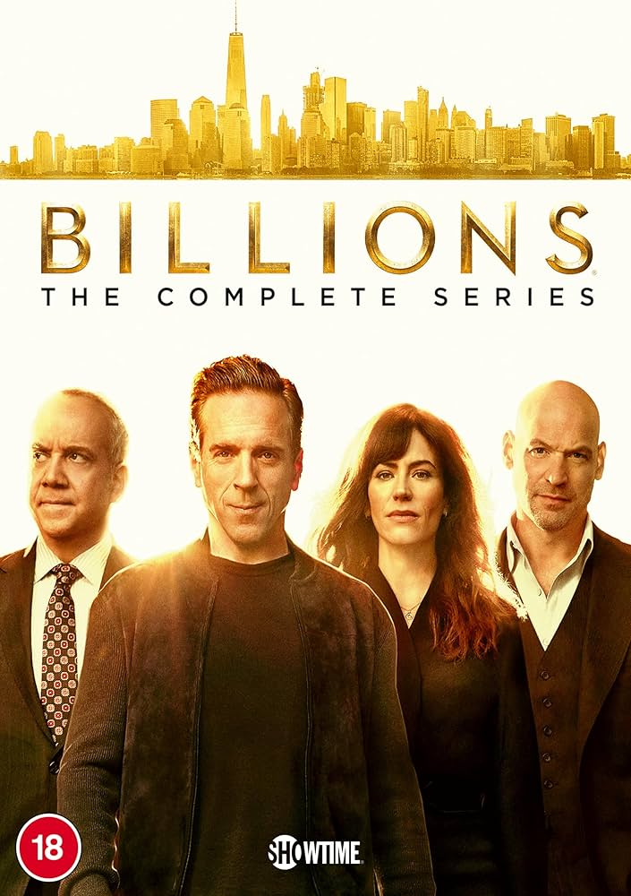

## Table of Contents

## What is the basic premise of Showtime's series Billions?

Billions is a TV show about a smart but sneaky hedge fund manager named Bobby Axelrod and a determined U.S. Attorney named Chuck Rhoades. They live in New York and are always trying to outsmart each other. Bobby makes a lot of money and uses clever tricks to keep it, while Chuck wants to catch Bobby and put him in jail for breaking the law.

The show is not just about their rivalry. It also shows their personal lives, like Bobby's family and Chuck's marriage to a strong woman named Wendy, who works at Bobby's company. There are many other characters, like lawyers and other rich people, who all get mixed up in the main fight between Bobby and Chuck. The series is exciting because you never know who will win in the end.

## Who are the main characters in Billions and their roles?

The main characters in Billions are Bobby Axelrod and Chuck Rhoades. Bobby Axelrod is a clever hedge fund manager who makes a lot of money. He's smart and good at finding ways to keep his money safe, even if it means bending the rules. Chuck Rhoades is a U.S. Attorney who wants to catch Bobby and put him in jail for breaking the law. They are always trying to outsmart each other, which makes the show exciting.

Another important character is Wendy Rhoades, who is Chuck's wife and also works as a performance coach at Bobby's company. Wendy is strong and smart, and she helps the people at the company do their best. Other characters include Mike Wagner, a loyal employee of Bobby's, and Kate Sacker, a smart lawyer who works with Chuck. All these characters are part of the big battle between Bobby and Chuck, and their stories add more excitement to the show.

## How does the setting of New York City influence the narrative of Billions?

New York City is a big part of Billions. The city is where all the action happens. It's full of tall buildings and busy streets, which shows how fast and exciting the characters' lives are. New York is known for its money and power, and that's what the show is all about. Bobby Axelrod and Chuck Rhoades use the city's energy to chase money and power. The city makes the story feel real and important.

The city also helps show the difference between the rich and the poor. In Billions, you see fancy offices and expensive restaurants, but you also see the hard parts of the city. This makes the story more interesting because it shows that even rich people like Bobby and Chuck have to deal with real problems. New York City makes the show feel big and important, and it helps tell the story of the characters' lives.

## What are the key themes explored in Billions?

Billions is a show that talks about money, power, and how people try to get them. The main characters, Bobby Axelrod and Chuck Rhoades, are always trying to be the best and win. They use tricks and smart plans to get more money and power. The show shows how money can make people do bad things and how it can change who they are. It also shows how hard it is to have a lot of money and power, because you always have to watch out for people who want to take it away.

Another big theme in Billions is how people balance their work and their personal lives. Bobby and Chuck both have families, but they are so busy trying to beat each other that they sometimes forget about their loved ones. The show also shows how important it is to have good friends and people you can trust. Characters like Wendy Rhoades help show that even in a world full of money and power, having strong relationships is what really matters.

## How does Billions portray the world of finance and its ethical dilemmas?

Billions shows the world of finance as a place where people are always trying to make more money and get more power. The main character, Bobby Axelrod, runs a [hedge fund](/wiki/hedge-fund-trading-strategies) and uses smart but sometimes sneaky ways to make a lot of money. The show makes it clear that in the world of finance, people often bend the rules to get what they want. They use tricks and insider information, which is not always legal. This makes viewers think about what is right and wrong when it comes to making money.

The show also explores the ethical dilemmas that come with working in finance. Bobby and other characters often face choices where they have to decide if breaking the law is worth the money they could make. Chuck Rhoades, the U.S. Attorney, tries to catch people like Bobby who break the rules, but he sometimes bends the rules himself to win. This shows that even people who are supposed to be the good guys can struggle with doing the right thing. Billions makes viewers think about how far someone should go to make money and whether the end justifies the means.

## Can you describe the character development of Bobby Axelrod throughout the series?

At the start of Billions, Bobby Axelrod is a smart and tough hedge fund manager who loves making money. He's good at finding ways to make more money, even if it means breaking the rules. Bobby is loyal to his friends and employees, and he takes care of them. But he's also sneaky and will do whatever it takes to win. He's always fighting with Chuck Rhoades, who wants to put him in jail for breaking the law. Bobby's main goal is to keep his money and power, and he's willing to take big risks to do that.

As the series goes on, Bobby changes a lot. He starts to see how his actions affect his family and friends. He realizes that money and power are not everything. Bobby becomes more thoughtful and tries to be a better person. But he still faces a lot of challenges and has to make hard choices. Sometimes he goes back to his old ways and uses sneaky tricks to win. By the end, Bobby is still a fighter, but he's learned a lot about what really matters in life. He's not just about making money anymore; he also cares about the people around him.

## How does the rivalry between Chuck Rhoades and Bobby Axelrod evolve over the seasons?

At the beginning of Billions, the rivalry between Chuck Rhoades and Bobby Axelrod is all about catching each other. Chuck, the U.S. Attorney, wants to put Bobby in jail for breaking the law. Bobby, the hedge fund manager, wants to keep making money and stay out of jail. They use all kinds of tricks and plans to try to win. The rivalry is intense and personal, and it affects everything they do. They are always trying to outsmart each other, and it's like a big game where no one knows who will win.

As the seasons go on, the rivalry changes. It's not just about the law anymore; it becomes more about personal pride and power. They start to understand each other better, but that doesn't make them stop fighting. Sometimes they work together against a common enemy, but they always go back to being rivals. The rivalry becomes more complicated because they both change as people. They learn from their battles and grow, but they never stop trying to beat each other. By the end, their rivalry is still strong, but it's not just about money and jail anymore; it's about who they are as people.

## What role does Wendy Rhoades play in the dynamics between the main characters?

Wendy Rhoades is very important in Billions. She is married to Chuck Rhoades but also works as a performance coach at Bobby Axelrod's company. This puts her in the middle of the big fight between Chuck and Bobby. Wendy knows both of them well and tries to help them be their best selves. She often gives them advice and helps them think about what they are doing. Because she is close to both of them, she can see things that they can't and tries to keep them from making big mistakes.

Wendy's role makes the story more interesting because she affects how Chuck and Bobby act. She sometimes helps them work together, but other times she has to choose sides. This makes the rivalry between Chuck and Bobby even more complicated. Wendy also has her own problems and goals, which add more layers to the show. She wants to be successful and help people, but she also has to deal with her own feelings and the pressure of being caught between two powerful men.

## How does Billions use real-world financial events to enhance its storyline?

Billions uses real-world financial events to make its story feel more real and exciting. The show talks about things like insider trading and hedge funds, which are big deals in the real world of money. For example, Bobby Axelrod's company is a lot like real hedge funds that have been in the news. The show also shows how the government tries to catch people who break the law, just like in real life. This makes the story more interesting because viewers can see how the characters deal with the same problems that real people face.

The show also uses big financial events to move the story forward. For example, it might talk about a big stock market crash or a company going bankrupt. These events affect the characters and make them do new things. Bobby might try to make money from the crash, while Chuck tries to stop him. By using real events, Billions shows how the world of finance can change quickly and how people have to be smart to keep up. This makes the show feel more exciting and keeps viewers wanting to see what happens next.

## What are some of the critical reception and audience reactions to Billions?

Billions has been liked by many people who watch TV and write about it. Critics say the show is exciting because it shows the world of money and power in a real way. They like how the characters are smart and always trying to outsmart each other. The acting is also good, and people enjoy watching Bobby and Chuck fight. Some critics say the show can be too complicated at times, but most of them think it's a good mix of drama and fun.

People who watch Billions also have strong feelings about it. Many fans love the show because it's exciting and keeps them guessing. They like how the story changes and how the characters grow over time. Some fans wish the show would focus more on the personal lives of the characters, but most of them enjoy the mix of business and personal drama. Overall, both critics and fans think Billions is a good show that keeps them coming back for more.

## How does the series handle the complexity of legal and financial strategies?

Billions shows the world of money and law in a way that feels real and exciting. The show talks about things like insider trading and hedge funds, which are big deals in the real world. Bobby Axelrod uses smart but tricky ways to make money, and Chuck Rhoades tries to catch him by using the law. They both use complicated plans and tricks to win. The show makes these strategies easy to understand by showing how the characters think and what they do. This helps viewers see how hard it is to make money and stay out of trouble.

The series also shows how the law can be used in different ways. Chuck sometimes bends the rules to catch Bobby, which makes viewers think about what is right and wrong. The show uses real legal terms and ideas, but it explains them in a way that makes sense. This makes the story more interesting because it shows how the characters use the law to their advantage. By mixing real financial and legal ideas with the characters' stories, Billions makes the world of money and law feel exciting and easy to follow.

## What are the future prospects and potential directions for Billions?

Billions has been a popular show for a long time, and it could keep going in many different ways. One direction could be to focus more on the personal lives of the characters. We could see more about how Bobby Axelrod and Chuck Rhoades deal with their families and friends. This would make the show more emotional and help viewers understand the characters better. Another direction could be to introduce new characters and new problems. This would keep the story fresh and exciting, and it could show how the world of money and power keeps changing.

The show might also explore more about the world of finance and law. Billions could show new ways that people try to make money and new ways that the government tries to stop them. This would make the show feel more real and up-to-date. The rivalry between Bobby and Chuck could also change. They might become friends or enemies again, or they might start fighting someone new. No matter what happens, Billions will keep showing the exciting world of money and power, and it will keep viewers interested in what happens next.

## References & Further Reading

Chan, E. P. (2013). 'Algorithmic Trading: Winning Strategies and Their Rationale.' This book provides an accessible overview of various [algorithmic trading](/wiki/algorithmic-trading) strategies, outlining their underlying principles and practical applications. It's essential reading for those looking to understand the mechanics of financial markets and how strategies are developed and implemented.

Lopez de Prado, M. (2018). 'Advances in Financial Machine Learning.' In this work, Lopez de Prado explores the intersection of [machine learning](/wiki/machine-learning) and finance. The book presents novel techniques for developing and testing sophisticated market models, offering readers a comprehensive guide to financial machine learning.

Narang, R. K. (2013). 'Inside the Black Box: The Simple Truth About Quantitative Trading.' Narang demystifies the world of [quantitative trading](/wiki/quantitative-trading), explaining how traders use algorithms and mathematical models to make decisions. This book is suitable for readers who wish to gain insights into how these complex strategies function in the financial markets.

Jansen, S. (2020). 'Machine Learning for Algorithmic Trading: Predictive Models to Extract Signals from Market and Alternative Data for Systematic Trading Strategies with Python.' This resource provides practical approaches to applying machine learning in trading, with in-depth examples and Python code. It is tailored for practitioners interested in developing predictive models using both market and [alternative data](/wiki/best-alternative-data).

Aronson, D. (2007). 'Evidence-Based Technical Analysis: Applying the Scientific Method and Statistical Inference to Trading Signals.' Aronson emphasizes the importance of applying statistical inference and the scientific method to technical analysis. By focusing on evidence-based approaches, this book aims to separate reliable trading signals from noise, thus enhancing the robustness of trading decisions.

