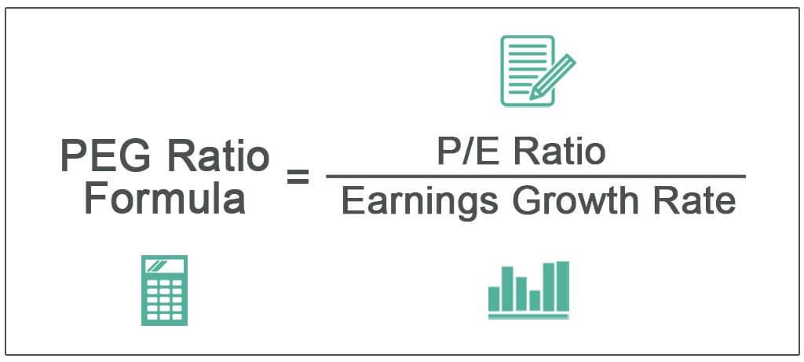

Understanding stock valuation is vital for investors aiming to make informed decisions in the complex world of financial markets. Two essential metrics widely utilized by investors for assessing a stock's value are the Price-to-Earnings (P/E) ratio and the Price/Earnings-to-Growth (PEG) ratio. These ratios are integral in evaluating whether a stock is fairly valued, overvalued, or undervalued based on its earnings performance and growth forecasts.

The Price-to-Earnings ratio is a straightforward yet powerful tool for investors. It is calculated by dividing the market value per share by the earnings per share (EPS). This ratio provides an intuitive gauge of what the market is willing to pay for a company's earnings, offering insights into market expectations regarding growth and profitability. A higher P/E ratio can signal that a stock is potentially overvalued or that investors expect significant growth, justifying a premium. Conversely, a lower P/E ratio might indicate undervaluation or limited growth prospects, prompting further analysis.



To complement the P/E ratio, the Price/Earnings-to-Growth (PEG) ratio incorporates expected earnings growth into the valuation process, thereby addressing some limitations of the P/E metric. By dividing the P/E ratio by the earnings growth rate, the PEG ratio delivers a more holistic view of a stock's valuation relative to its growth potential. A PEG ratio of 1 suggests fair valuation considering future earnings growth, while a ratio below 1 may highlight undervaluation, and a ratio above 1 can suggest overvaluation. Thus, the PEG ratio provides investors with a nuanced approach to stock valuation, blending current earnings performance with prospects for future growth.

In addition to traditional methods of stock evaluation, algorithmic trading has emerged as a pivotal technology in modern markets, integrating these valuation metrics to enhance trading strategies. Algorithmic trading involves the use of predefined rules and sophisticated data analysis to automate the trading process. By rapidly processing extensive datasets and incorporating metrics such as P/E and PEG ratios, algorithms can identify undervalued stocks or potential overvaluations more efficiently than manual analysis alone. This automation facilitates objective decision-making, potentially reducing emotional biases that often affect human traders.

This article will explore these metrics alongside their applications in stock valuation and algorithmic trading, highlighting how they contribute to more informed investment decisions. Understanding these concepts and tools is indispensable for investors navigating today's dynamic financial landscape.

## Table of Contents

## Understanding the P/E Ratio

The Price-to-Earnings (P/E) ratio is a critical metric for evaluating stock value, widely utilized by investors to assess whether a stock is fairly priced, overvalued, or undervalued. It is calculated with the formula:

$$
\text{P/E Ratio} = \frac{\text{Market Value per Share}}{\text{Earnings per Share (EPS)}}
$$

The market value per share represents the current trading price of the stock, whereas the earnings per share (EPS) measures the company's profitability, typically over the last twelve months. Therefore, the P/E ratio encapsulates the relationship between a stock's market price and its earnings performance.

A higher P/E ratio may suggest that a stock is overvalued; it reflects that investors anticipate significant growth and are hence willing to pay more than the present earnings justify. This expectation could stem from factors like strong historical growth, industry leadership, or innovative product lines poised to capture market share. However, it also carries the risk of heightened valuation not translating into actual earnings growth, potentially leading to price corrections.

Conversely, a lower P/E ratio might imply that a stock is undervalued, offering a potentially lucrative buying opportunity. It could indicate that the market has yet to recognize the company's growth potential or considers it to have poor growth prospects. However, investors may view a low P/E with caution if they believe it signifies declining profitability or challenging industry conditions.

The utility of the P/E ratio extends beyond individual stock analysis, enabling investors to compare valuations across different companies within the same industry. This comparison helps discern industry leaders from potentially weaker competitors. However, industry-specific factors should be considered since different industries can have varying benchmark P/E ratios due to differences in growth rates and risk profiles.

In practical application, the P/E ratio is often used alongside other metrics to form a comprehensive view of an investment opportunity. It serves as a starting point for deeper financial analysis and due diligence, mitigating the inherent risks of relying solely on a single valuation measure.

 to the PEG Ratio

The Price/Earnings-to-Growth (PEG) ratio is a valuable tool for investors, enhancing the traditional Price-to-Earnings (P/E) ratio by incorporating the dimension of expected earnings growth. The formula used for calculating the PEG ratio is:

$$
\text{PEG Ratio} = \frac{\text{P/E Ratio}}{\text{Earnings Growth Rate}}
$$

The PEG ratio refines the insights provided by the P/E ratio, offering a more nuanced perspective on stock valuation by accounting for the company’s growth prospects. A PEG ratio of 1 suggests that the stock is fairly valued, reflecting a balance between its current valuation and expected growth. If the ratio falls below 1, it indicates that the stock may be undervalued, with its growth potential not fully reflected in the price. Conversely, a PEG ratio above 1 suggests that the stock might be overvalued, with the current market price exceeding the value justified by future earnings growth expectations.

This ratio is particularly useful in industries or companies with strong growth potential, where high P/E ratios alone might misleadingly suggest overvaluation. By factoring in future growth, the PEG ratio allows investors to discern whether a premium valuation is justified. Thus, it offers a broader, more comprehensive view of stock valuation compared to relying solely on the P/E ratio, which does not consider growth opportunities. This makes the PEG ratio an indispensable part of a rigorous investment analysis process.

## Limitations and Comparisons

Although the Price-to-Earnings (P/E) and Price/Earnings-to-Growth (PEG) ratios are widely used tools for stock valuation, they are not without their limitations. Understanding these constraints is essential for investors to effectively interpret these metrics and make informed decisions.

The P/E ratio, calculated as the market price per share divided by the earnings per share (EPS), provides a snapshot of a company's valuation relative to its earnings. However, one significant limitation is its inability to account for future earnings growth. This can lead to misrepresentation, as a high P/E ratio might suggest that a stock is overvalued without indicating the expected earnings growth that might justify a higher valuation. Thus, relying solely on the P/E ratio can result in overlooking potential growth opportunities.

In contrast, the PEG ratio attempts to incorporate future growth prospects by dividing the P/E ratio by the company's earnings growth rate. This ratio provides a more nuanced view, helping investors gauge whether a stock is fairly valued relative to its expected growth. Nonetheless, the PEG ratio's accuracy heavily depends on the reliability of earnings growth forecasts. These forecasts can be speculative, subject to changes in the market environment, or influenced by internal company developments, potentially leading to inaccurate valuations.

When utilizing these metrics, it is crucial to make comparisons within industries rather than across different sectors. This is because companies in various industries often have differing growth prospects and baseline P/E ratios. Consequently, comparing firms solely based on P/E or PEG ratios without considering industry context can lead to erroneous conclusions.

Additionally, while P/E and PEG ratios offer valuable insights, they should not be the sole determinants of investment decisions. Investors are encouraged to supplement these metrics with a comprehensive analysis of financial statements, including balance sheets and cash flow statements, to gain a fuller picture of a company's financial health and market conditions.

In summary, while P/E and PEG ratios are essential tools for stock evaluation, their limitations necessitate cautious application. Investors should consider the broader financial context, industry-specific factors, and additional analytical methods to make more informed investment decisions.

## Incorporating Algorithmic Trading

Algorithmic trading is increasingly transforming the landscape of modern finance, utilizing advanced computational models to execute trades with precision and speed. These algorithms operate based on predetermined rules and thorough data analysis, frequently incorporating fundamental valuation metrics such as the Price-to-Earnings (P/E) ratio and the Price/Earnings-to-Growth (PEG) ratio. By leveraging these ratios, [algorithmic trading](/wiki/algorithmic-trading) systems can rapidly assess the valuation of stocks, often identifying opportunities more swiftly and efficiently than manual methods.

The core advantage of algorithmic trading lies in its ability to process vast quantities of financial data in real-time. This capability enables traders to identify undervalued stocks more quickly than traditional analysis methods, providing a competitive edge in fast-moving markets. For instance, by setting a predefined threshold for the PEG ratio, algorithms can filter stocks that potentially offer high growth at a reasonable price, automatically triggering trades when these criteria are met. The formula for calculating the PEG ratio is straightforward:

$$
\text{PEG Ratio} = \frac{\text{P/E Ratio}}{\text{Earnings Growth Rate}}
$$

Algorithmic systems can exploit these calculations to execute trades faster than human operators, ensuring transactions occur quickly and efficiently when market conditions align with the algorithm's criteria.

Another significant advantage of algorithmic trading is its capacity to minimize emotional biases that often affect human decision-making. By executing trades automatically based on objective metrics, investors can avoid common pitfalls such as fear or over-optimism that might cloud judgment. This objectivity helps in maintaining a disciplined investment strategy, enhancing long-term performance.

Furthermore, the rise of financial technology, or fintech, has democratized access to algorithmic trading tools, making them available to a broader spectrum of investors. Many platforms now offer customizable algorithmic trading solutions, where even retail investors can define their criteria based on metrics like P/E and PEG ratios. For example, using programming languages such as Python, traders can create scripts to monitor stock market data and execute trades automatically. A simple Python implementation might look like this:

```python
def calculate_peg_ratio(pe_ratio, growth_rate):
    if growth_rate == 0:
        return float('inf')  # Avoid division by zero
    return pe_ratio / growth_rate

def evaluate_stock(pe_ratio, growth_rate, threshold):
    peg_ratio = calculate_peg_ratio(pe_ratio, growth_rate)
    return peg_ratio < threshold

# Example usage:
pe_ratio = 15
growth_rate = 10  # percentage
threshold = 1.5

if evaluate_stock(pe_ratio, growth_rate, threshold):
    print("Trigger Buy Signal")
else:
    print("No Action")
```

As this solution illustrates, algorithmic trading can be tailored to specific investment strategies, enhancing both precision and efficiency.

In conclusion, algorithmic trading represents a significant evolution in investment strategy, capitalizing on the analytical capabilities of modern technology. By harnessing key metrics such as the P/E and PEG ratios, along with automation and customization offered by fintech advancements, investors can navigate the complexities of today's financial markets with greater dexterity and less reliance on subjective judgment.

## Real-World Applications and Case Studies

Several investment firms have adopted algorithmic trading strategies that leverage the Price-to-Earnings (P/E) and Price/Earnings-to-Growth (PEG) ratios to enhance investment decision-making. By integrating these valuation metrics, firms aim to identify stocks that offer favorable growth prospects relative to their market price. The following examples illustrate how these metrics can be practically applied to improve portfolio performance.

One common algorithmic strategy involves targeting stocks with PEG ratios below a certain threshold, such as 1.0. Stocks below this threshold are considered undervalued when growth prospects are accounted for. For example, a growth-focused fund might implement a Python algorithm like this:

```python
def select_stocks(stocks):
    selected_stocks = []
    for stock in stocks:
        pe_ratio = stock['price'] / stock['earnings_per_share']
        peg_ratio = pe_ratio / stock['growth_rate']
        if peg_ratio < 1.0:
            selected_stocks.append(stock)
    return selected_stocks
```

This simplified code filters a list of stocks, adding those with a PEG ratio under 1.0 to the selected stocks. Such algorithms can be further refined by incorporating additional financial metrics and historical performance data to enhance accuracy.

Case studies reveal that integrating growth metrics such as the PEG ratio can significantly boost portfolio returns. For instance, a large investment firm reported that their algorithm-based trading system outperformed traditional methods by focusing on undervalued stocks with strong earnings growth potential. These strategies mitigate human bias and improve response times to market shifts, offering more consistent returns over time.

Furthermore, data-driven trading systems can backtest historical data to optimize algorithm parameters and validate their efficacy. By analyzing how these metrics performed across different economic cycles, firms can adjust strategies to maximize returns while minimizing risk exposure.

The practical application of P/E and PEG ratios in algorithmic trading underscores the importance of integrating objective valuation metrics with technological advancements. By leveraging these tools, investors can gain insights into market opportunities and execute trades with enhanced precision and efficiency.

## Conclusion

Both the Price-to-Earnings (P/E) and Price/Earnings-to-Growth (PEG) ratios are invaluable tools for assessing stock valuation. These metrics enable investors to measure a stock's market price relative to its earnings and growth prospects effectively. By examining the P/E ratio, investors can assess whether a stock is potentially overvalued or undervalued, based on its current earnings. In contrast, the PEG ratio provides a more comprehensive evaluation by considering expected earnings growth, allowing for a nuanced understanding of a stock's potential value over time.

Algorithmic trading, which employs these ratios, has transformed investment strategies by automating decision-making processes and diminishing subjective biases. Algorithms can process vast amounts of financial data rapidly, identifying investment opportunities with greater precision and speed than manual analysis. This automation enhances efficiency and allows traders to enforce consistent criteria, such as trade triggers based on specific PEG values.

However, it is important for investors to be mindful of the limitations inherent in both ratios. The P/E ratio, while useful, neglects future growth potential, and the PEG ratio's reliability depends greatly on the accuracy of growth forecasts. Both metrics should be complemented by a broader analysis that includes other financial statements and a consideration of prevailing market conditions. Such a holistic approach ensures a comprehensive understanding of stock valuation.

In today's dynamic and fast-paced financial landscape, a thorough grasp of these concepts is crucial for making informed investment decisions. Investors equipped with the knowledge and tools to analyze stocks using the P/E and PEG ratios, alongside algorithmic trading strategies, can more effectively navigate market complexities and optimize their investment outcomes.

## References & Further Reading

[1]: ["Security Analysis"](https://www.amazon.com/Security-Analysis-Foreword-Buffett-Editions/dp/0071592539) by Benjamin Graham and David Dodd

[2]: ["The Intelligent Investor"](https://en.wikipedia.org/wiki/The_Intelligent_Investor) by Benjamin Graham

[3]: ["Common Stocks and Uncommon Profits"](https://www.amazon.com/Common-Stocks-Uncommon-Profits-Writings/dp/0471445509) by Philip Fisher

[4]: ["Valuation: Measuring and Managing the Value of Companies"](https://www.amazon.com/Valuation-Measuring-Managing-Companies-Finance/dp/1119610885) by McKinsey & Company Inc.

[5]: ["Algorithmic Trading and DMA: An Introduction to Direct Access Trading Strategies"](https://www.amazon.com/Algorithmic-Trading-DMA-introduction-strategies/dp/0956399207) by Barry Johnson

[6]: ["High-Frequency Trading: A Practical Guide to Algorithmic Strategies and Trading Systems"](https://www.amazon.com/High-Frequency-Trading-Practical-Algorithmic-Strategies/dp/1118343506) by Irene Aldridge