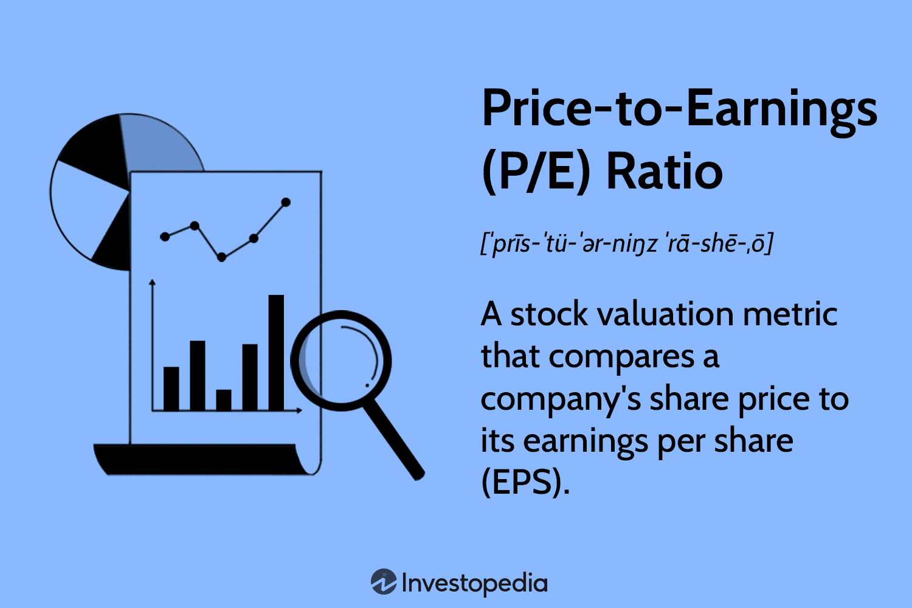

## Table of Contents

## What is the Price-to-Earnings (P/E) ratio and how is it calculated?

The Price-to-Earnings (P/E) ratio is a way to figure out how much people are willing to pay for a company's earnings. It's like a tool that helps investors see if a stock is a good buy or if it's too expensive. The P/E ratio is found by taking the current price of a stock and dividing it by the company's earnings per share (EPS). Earnings per share is the amount of money a company makes divided by the number of shares it has.

For example, if a company's stock is selling for $50 and its earnings per share is $5, then the P/E ratio would be 10. This means investors are willing to pay $10 for every $1 of the company's earnings. A high P/E ratio might mean that people think the company will grow a lot in the future, while a low P/E ratio might mean the company is not expected to grow much or might be seen as a bargain.

## What does the P/E ratio tell us about a stock's valuation?

The P/E ratio tells us how much investors are willing to pay for each dollar of a company's earnings. It's like a quick way to see if a stock might be a good deal or if it's too pricey. If a company has a high P/E ratio, it means people are willing to pay more for its earnings, which could mean they think the company will do really well in the future. On the other hand, a low P/E ratio might mean the stock is cheaper, and it could be a good buy if you think the company is undervalued.

But, the P/E ratio isn't perfect. It's just one piece of the puzzle when looking at a stock's value. You have to think about other things too, like how fast the company is growing, what's happening in the industry, and what the economy is doing. Also, comparing the P/E ratio of one company to another can be tricky because different industries have different average P/E ratios. So, while the P/E ratio can give you a quick idea about a stock's valuation, it's important to look at the bigger picture before making any decisions.

## How can the P/E ratio be used to compare companies within the same industry?

The P/E ratio can be a helpful tool to compare companies within the same industry because it shows how much investors are willing to pay for a dollar of earnings from each company. If you look at two companies in the same industry, like two car makers, and one has a much higher P/E ratio than the other, it might mean that investors think the company with the higher P/E ratio will grow faster or be more profitable in the future. But, if the P/E ratios are very different, it could also mean that one company is overvalued or the other is undervalued.

However, just looking at the P/E ratio isn't enough. You need to think about other things too, like how fast each company is growing, what's happening in the industry, and what the economy is doing. For example, if one car maker is growing really fast and the other isn't, the one growing fast might have a higher P/E ratio, and that could be okay. But if both companies are growing at the same rate and one has a much higher P/E ratio, that might be a sign that it's overpriced. So, while the P/E ratio can give you a quick way to compare companies, it's important to look at the whole picture before deciding which stock to buy.

## What are the limitations of using the P/E ratio for stock valuation?

The P/E ratio is a useful tool, but it has some limitations when it comes to figuring out if a stock is a good buy. One big problem is that the P/E ratio doesn't tell you everything about a company. It only looks at the price of the stock and the earnings per share, but it doesn't consider other important things like how much debt the company has, how fast it's growing, or what's happening in the industry. So, if you only use the P/E ratio, you might miss out on important information that could change your mind about whether a stock is a good investment.

Another limitation is that the P/E ratio can be different for different industries. What might be a high P/E ratio in one industry could be normal in another. For example, tech companies often have higher P/E ratios than utility companies because people expect tech companies to grow faster. If you compare the P/E ratios of companies from different industries without thinking about these differences, you might think a stock is overvalued or undervalued when it's really not. So, it's important to compare companies within the same industry and to look at other factors too, not just the P/E ratio.

## What is the Price/Earnings to Growth (PEG) ratio and how is it calculated?

The Price/Earnings to Growth (PEG) ratio is a way to see if a stock's price is a good deal when you think about how fast the company is growing. It's like the P/E ratio, but it also looks at the company's expected growth rate. The PEG ratio helps investors figure out if they're paying too much or getting a good deal for the company's future earnings.

To calculate the PEG ratio, you start with the P/E ratio, which is the stock's price divided by its earnings per share. Then, you divide that P/E ratio by the company's expected earnings growth rate. For example, if a company has a P/E ratio of 20 and its earnings are expected to grow by 10% each year, the PEG ratio would be 20 divided by 10, which equals 2. A PEG ratio of less than 1 is often seen as a sign that the stock might be undervalued, while a PEG ratio above 1 might mean the stock is overvalued. But, like the P/E ratio, the PEG ratio is just one tool and should be used with other information to make smart investment choices.

## How does the PEG ratio improve upon the P/E ratio in stock valuation?

The PEG ratio improves on the P/E ratio by adding the company's growth rate into the mix. The P/E ratio just looks at the stock price and earnings per share, but it doesn't tell you if the company is growing fast or slow. The PEG ratio fixes this by dividing the P/E ratio by the expected earnings growth rate. This gives investors a better idea of whether they're paying a fair price for the company's future earnings. If a company has a high P/E ratio but is also growing really fast, the PEG ratio might show that the stock is still a good buy.

Even though the PEG ratio is better than the P/E ratio because it includes growth, it's still not perfect. It relies on predictions about how fast a company will grow, and those predictions can be wrong. Also, different people might use different growth rates, which can make the PEG ratio different for the same company. But overall, the PEG ratio gives a more complete picture of a stock's value by considering both its current earnings and its future growth potential.

## What is considered a good PEG ratio for investment decisions?

A good PEG ratio for investment decisions is usually considered to be less than 1. This means that the stock's price is low compared to how fast the company is expected to grow its earnings. If the PEG ratio is less than 1, it might mean the stock is undervalued, and it could be a good buy. But, a PEG ratio of less than 1 isn't a guarantee that the stock will be a good investment. You still need to look at other things like the company's debt, what's happening in the industry, and the overall economy.

On the other hand, a PEG ratio higher than 1 might mean the stock is overvalued. Investors might be paying too much for the company's future growth. But, sometimes a PEG ratio higher than 1 can still be okay if the company is expected to grow really fast and the industry is doing well. So, while a PEG ratio less than 1 is often seen as a good sign, it's important to use the PEG ratio along with other information to make smart investment choices.

## How can the PEG ratio be used to identify undervalued stocks?

The PEG ratio helps investors find undervalued stocks by looking at both the stock's price and how fast the company is growing. If a stock has a PEG ratio less than 1, it means the stock's price is low compared to how fast the company's earnings are expected to grow. This could mean the stock is a good buy because investors are getting more growth for their money. For example, if a company has a P/E ratio of 15 and is expected to grow its earnings by 20% each year, the PEG ratio would be 0.75 (15 divided by 20). A PEG ratio of 0.75 is less than 1, so the stock might be undervalued.

But, just using the PEG ratio isn't enough to decide if a stock is undervalued. You also need to think about other things like how much debt the company has, what's happening in the industry, and what the economy is doing. Sometimes, a PEG ratio less than 1 can be a good sign, but it's important to look at the whole picture. If a company has a lot of debt or if the industry is struggling, the stock might not be a good investment even if the PEG ratio looks good. So, while the PEG ratio can help you find undervalued stocks, it's just one part of making smart investment choices.

## What are the potential pitfalls of relying solely on the PEG ratio for stock analysis?

Relying only on the PEG ratio for stock analysis can lead to mistakes because it doesn't tell you everything about a company. The PEG ratio looks at the stock's price, earnings, and growth, but it doesn't consider other important things like how much debt the company has or what's happening in the industry. If you just use the PEG ratio, you might think a stock is a good buy because its PEG ratio is low, but the company might have a lot of debt or be in a struggling industry, which could make it a bad investment.

Also, the PEG ratio depends on guesses about how fast a company will grow in the future. These guesses can be wrong, and different people might use different growth rates, which can make the PEG ratio different for the same company. If you rely too much on the PEG ratio and don't look at other information, you might end up buying a stock that looks like a good deal but isn't really. So, while the PEG ratio can be helpful, it's important to use it along with other tools and information to make smart investment choices.

## How do different growth rate estimates affect the PEG ratio and stock valuation?

Different growth rate estimates can change the PEG ratio a lot. The PEG ratio is the P/E ratio divided by the growth rate. If you use a higher growth rate, the PEG ratio will be lower, which might make the stock look like a better buy. But, if you use a lower growth rate, the PEG ratio will be higher, and the stock might seem more expensive. So, the PEG ratio can be different for the same stock depending on what growth rate you use.

This means that the PEG ratio isn't always the same for everyone because different people might have different ideas about how fast a company will grow. If someone thinks a company will grow really fast, they might see the stock as a good deal. But if someone else thinks the company will grow slowly, they might think the stock is too pricey. So, when you're looking at a stock's value using the PEG ratio, it's important to think about why you chose that growth rate and to look at other things too, like the company's debt and what's happening in the industry.

## Can you provide a case study where P/E and PEG ratios were used to analyze a specific company's stock?

Let's look at a case study of a company called ABC Tech. ABC Tech is a technology company that makes software for businesses. In early 2022, ABC Tech's stock was trading at $100 per share, and its earnings per share were $5. This gave ABC Tech a P/E ratio of 20 ($100 divided by $5). At the same time, analysts predicted that ABC Tech's earnings would grow by 15% each year. Using this growth rate, the PEG ratio for ABC Tech was 1.33 (20 divided by 15). A PEG ratio higher than 1 might make some investors think the stock is overvalued, but others might still see it as a good buy if they believe in the company's future growth.

Now, let's compare ABC Tech to another company in the same industry, XYZ Software. XYZ Software's stock was trading at $80 per share with earnings per share of $4, giving it a P/E ratio of 20. But, analysts expected XYZ Software to grow its earnings by only 10% each year. This gave XYZ Software a PEG ratio of 2 (20 divided by 10). Even though both companies had the same P/E ratio, XYZ Software's higher PEG ratio suggested it was more expensive relative to its growth. Investors looking at these numbers might decide that ABC Tech was a better buy because its PEG ratio was lower, showing more growth for the price. However, they would also need to consider other factors like the companies' debt levels and industry trends before making a final decision.

## How do macroeconomic factors influence the effectiveness of P/E and PEG ratios in stock valuation?

Macroeconomic factors like interest rates, inflation, and economic growth can change how useful P/E and PEG ratios are for figuring out if a stock is a good buy. When interest rates go up, borrowing money becomes more expensive, which can slow down a company's growth. This might make investors less willing to pay a high price for a company's earnings, so the P/E and PEG ratios might not look as good. On the other hand, if the economy is growing fast, people might be more excited about a company's future and be willing to pay more for its earnings, making the P/E and PEG ratios look better.

Also, inflation can mess with the P/E and PEG ratios. If prices are going up a lot, a company's earnings might look bigger, but the money they make might not be worth as much. This can make the P/E and PEG ratios seem lower than they really are, tricking investors into thinking a stock is a better deal than it is. So, when looking at P/E and PEG ratios, it's important to think about what's happening in the economy and how it might change how much a company's earnings are really worth.

## What is the P/E Ratio and how can it be understood?

The Price-to-Earnings (P/E) ratio is a critical metric for evaluating stock value, widely utilized by investors to assess whether a stock is fairly priced, overvalued, or undervalued. It is calculated with the formula:

$$
\text{P/E Ratio} = \frac{\text{Market Value per Share}}{\text{Earnings per Share (EPS)}}
$$

The market value per share represents the current trading price of the stock, whereas the earnings per share (EPS) measures the company's profitability, typically over the last twelve months. Therefore, the P/E ratio encapsulates the relationship between a stock's market price and its earnings performance.

A higher P/E ratio may suggest that a stock is overvalued; it reflects that investors anticipate significant growth and are hence willing to pay more than the present earnings justify. This expectation could stem from factors like strong historical growth, industry leadership, or innovative product lines poised to capture market share. However, it also carries the risk of heightened valuation not translating into actual earnings growth, potentially leading to price corrections.

Conversely, a lower P/E ratio might imply that a stock is undervalued, offering a potentially lucrative buying opportunity. It could indicate that the market has yet to recognize the company's growth potential or considers it to have poor growth prospects. However, investors may view a low P/E with caution if they believe it signifies declining profitability or challenging industry conditions.

The utility of the P/E ratio extends beyond individual stock analysis, enabling investors to compare valuations across different companies within the same industry. This comparison helps discern industry leaders from potentially weaker competitors. However, industry-specific factors should be considered since different industries can have varying benchmark P/E ratios due to differences in growth rates and risk profiles.

In practical application, the P/E ratio is often used alongside other metrics to form a comprehensive view of an investment opportunity. It serves as a starting point for deeper financial analysis and due diligence, mitigating the inherent risks of relying solely on a single valuation measure.

 to the PEG Ratio

The Price/Earnings-to-Growth (PEG) ratio is a valuable tool for investors, enhancing the traditional Price-to-Earnings (P/E) ratio by incorporating the dimension of expected earnings growth. The formula used for calculating the PEG ratio is:

$$
\text{PEG Ratio} = \frac{\text{P/E Ratio}}{\text{Earnings Growth Rate}}
$$

The PEG ratio refines the insights provided by the P/E ratio, offering a more nuanced perspective on stock valuation by accounting for the company’s growth prospects. A PEG ratio of 1 suggests that the stock is fairly valued, reflecting a balance between its current valuation and expected growth. If the ratio falls below 1, it indicates that the stock may be undervalued, with its growth potential not fully reflected in the price. Conversely, a PEG ratio above 1 suggests that the stock might be overvalued, with the current market price exceeding the value justified by future earnings growth expectations.

This ratio is particularly useful in industries or companies with strong growth potential, where high P/E ratios alone might misleadingly suggest overvaluation. By factoring in future growth, the PEG ratio allows investors to discern whether a premium valuation is justified. Thus, it offers a broader, more comprehensive view of stock valuation compared to relying solely on the P/E ratio, which does not consider growth opportunities. This makes the PEG ratio an indispensable part of a rigorous investment analysis process.

## How can one incorporate algorithmic trading?

Algorithmic trading is increasingly transforming the landscape of modern finance, utilizing advanced computational models to execute trades with precision and speed. These algorithms operate based on predetermined rules and thorough data analysis, frequently incorporating fundamental valuation metrics such as the Price-to-Earnings (P/E) ratio and the Price/Earnings-to-Growth (PEG) ratio. By leveraging these ratios, [algorithmic trading](/wiki/algorithmic-trading) systems can rapidly assess the valuation of stocks, often identifying opportunities more swiftly and efficiently than manual methods.

The core advantage of algorithmic trading lies in its ability to process vast quantities of financial data in real-time. This capability enables traders to identify undervalued stocks more quickly than traditional analysis methods, providing a competitive edge in fast-moving markets. For instance, by setting a predefined threshold for the PEG ratio, algorithms can filter stocks that potentially offer high growth at a reasonable price, automatically triggering trades when these criteria are met. The formula for calculating the PEG ratio is straightforward:

$$
\text{PEG Ratio} = \frac{\text{P/E Ratio}}{\text{Earnings Growth Rate}}
$$

Algorithmic systems can exploit these calculations to execute trades faster than human operators, ensuring transactions occur quickly and efficiently when market conditions align with the algorithm's criteria.

Another significant advantage of algorithmic trading is its capacity to minimize emotional biases that often affect human decision-making. By executing trades automatically based on objective metrics, investors can avoid common pitfalls such as fear or over-optimism that might cloud judgment. This objectivity helps in maintaining a disciplined investment strategy, enhancing long-term performance.

Furthermore, the rise of financial technology, or fintech, has democratized access to algorithmic trading tools, making them available to a broader spectrum of investors. Many platforms now offer customizable algorithmic trading solutions, where even retail investors can define their criteria based on metrics like P/E and PEG ratios. For example, using programming languages such as Python, traders can create scripts to monitor stock market data and execute trades automatically. A simple Python implementation might look like this:

```python
def calculate_peg_ratio(pe_ratio, growth_rate):
    if growth_rate == 0:
        return float('inf')  # Avoid division by zero
    return pe_ratio / growth_rate

def evaluate_stock(pe_ratio, growth_rate, threshold):
    peg_ratio = calculate_peg_ratio(pe_ratio, growth_rate)
    return peg_ratio < threshold

# Example usage:
pe_ratio = 15
growth_rate = 10  # percentage
threshold = 1.5

if evaluate_stock(pe_ratio, growth_rate, threshold):
    print("Trigger Buy Signal")
else:
    print("No Action")
```

As this solution illustrates, algorithmic trading can be tailored to specific investment strategies, enhancing both precision and efficiency.

In conclusion, algorithmic trading represents a significant evolution in investment strategy, capitalizing on the analytical capabilities of modern technology. By harnessing key metrics such as the P/E and PEG ratios, along with automation and customization offered by fintech advancements, investors can navigate the complexities of today's financial markets with greater dexterity and less reliance on subjective judgment.

## References & Further Reading

[1]: ["Security Analysis"](https://www.amazon.com/Security-Analysis-Foreword-Buffett-Editions/dp/0071592539) by Benjamin Graham and David Dodd

[2]: ["The Intelligent Investor"](https://en.wikipedia.org/wiki/The_Intelligent_Investor) by Benjamin Graham

[3]: ["Common Stocks and Uncommon Profits"](https://www.amazon.com/Common-Stocks-Uncommon-Profits-Writings/dp/0471445509) by Philip Fisher

[4]: ["Valuation: Measuring and Managing the Value of Companies"](https://www.amazon.com/Valuation-Measuring-Managing-Companies-Finance/dp/1119610885) by McKinsey & Company Inc.

[5]: ["Algorithmic Trading and DMA: An Introduction to Direct Access Trading Strategies"](https://www.amazon.com/Algorithmic-Trading-DMA-introduction-strategies/dp/0956399207) by Barry Johnson

[6]: ["High-Frequency Trading: A Practical Guide to Algorithmic Strategies and Trading Systems"](https://www.amazon.com/High-Frequency-Trading-Practical-Algorithmic-Strategies/dp/1118343506) by Irene Aldridge